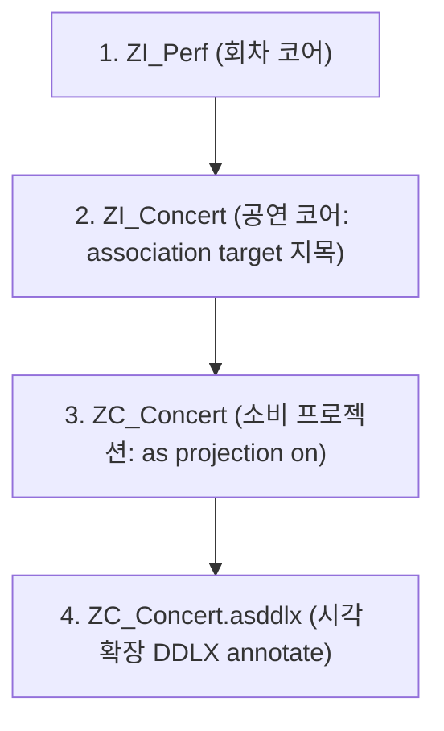

# CH22_REWRITE - CDS View Entity 기초 v1

> 목적: `content/abap/CH22`의 7개 레슨을 "IT 비전공자 입문자가 왜 필요한지부터 실습 확인까지 직관적으로 이해하고 따라갈 수 있는 완성 강의자료" 수준으로 재작성한 기준 원고다. 이 문서는 아직 `content/abap` 원본을 덮어쓴 결과가 아니라, 재작업 판정 이후 실제 반영 전 검수 가능한 v1 기준안이다.

## CH22 전체 설계

CH22의 한 문장 목표는 "Eclipse ADT 환경에서 차세대 선언형 데이터 모델인 CDS View Entity를 설계하고, ZI_(Interface)와 ZC_(Projection) 계층을 격리 관습으로 구분하며, Association 뷰 간 연동 및 Cardinality 명세, Annotation의 시각/의미론적 통화 매핑, DDLX 메타데이터 익스텐션 분리(쉼표 vs 세미콜론 구분자 꼬임 격리), 그리고 DCL 행 단위 보안 필터와 SQL 우회 지시어(`WITH PRIVILEGED ACCESS`)를 접목하여, 현대식 OData 및 RAP 파이프라인으로 승격할 수 있는 무결한 DB 읽기 모델의 뼈대를 완성한다"이다.

IT 비전공자 입문자는 뷰 정의 파일(DDL)의 select list 쉼표(`,`) 구분자와 메타데이터 확장 파일(DDLX)의 요소 세미콜론(`;`) 구분자를 혼동하여 문법 거부를 맞이하고, `association` 을 열심히 선언해 두고 select list `{ }` 내에 별칭 노출(Exposure)을 빼먹어 경로 추적을 유실한다.
또한, `@Semantics.amount` 금액 지목 시 짝 통화 명칭으로 자기 자신 필드명을 적어 넣어 빌드 충돌을 유발하며, `@AccessControl` 권한 가드를 작동시킨 뒤 프로그램에서 보안 필터를 우회하여 강제 전량 select 하는 문법(`WITH PRIVILEGED ACCESS`)을 몰라 배치 연산 구현에 좌절을 겪는다.
따라서 본 챕터는 다음과 같은 단계적 해소 장치로 설계를 배치한다.

1. **선언형 모델 전환**: SE11 GUI 클릭 뷰의 한계를 텍스트 DDL source 소스 개발로 전환하고, `SELECT FROM CDS_ENTITY` 로 읽는 현대식 데이터 소비 구조 장착.
2. **비파괴적 숨김 (Projection)**: 컬럼의 물리 파괴 삭제가 아니라, 소비자 계층(`ZC_`)에서 필요 필드만 선별 투사하고 나머지는 안전하게 격리 은닉하는 투사 모델 수립.
3. **관례 명명 가이드**: `ZI_` (Interface View - 재사용 데이터 베이스)와 `ZC_` (Projection View - 소비 출구)는 ABAP 문법이 아니라 **규격 명명 관습**임을 분명히 고지.
4. **Association 노출 의무**: 관계만 선언해서는 통로가 안 열리므로, 반드시 select list `{ }` 내부 최하단에 **`_Perf` 와 같은 관계 별칭을 명시 노출**해야 함을 입증.
5. **짝 매핑의 규칙 (@Semantics)**: 금액은 통화 필드(`@Semantics.amount.currencyCode: 'currency'`)를, 수량은 단위 필드를 상호 짝 매핑해야 하는 데이터 정합성 규칙 수립.
6. **자기참조 금지 덤프 가드**: 짝 매핑 시 자기 자신 필드명을 꽂아 넣는 기하학적 정합성 모순을 빌드 차단하는 가이드 수록.
7. **구분자의 물리 격리**: DDL 파일은 필드 간 **쉼표(`,`)**, DDLX 확장 파일은 요소 뒤 **세미콜론(`;`)** 임을 시각 격리 비교.
8. **DCL 보안과 우회 락**: PFCG 권한 객체 값을 조건으로 행 단위 필터링을 집행하는 DCL `define role` 설계법과, 이를 강제 우회하는 SQL **`WITH PRIVILEGED ACCESS`** 지시어 장착.
9. **종합 실습 - ZI_Perf 와 ZI_Concert 조립**: 타깃이 먼저 존재해야 하는 활성화 순서 의무를 준수하여 ZI_Perf 선구축 후 ZI_Concert 와 ZC_Concert 및 ddlx 메타데이터를 도킹하는 캡스톤 완성.

---

## CH22-L01 - CDS View Entity 기본 구조

### 왜 필요한가

우리가 이전 데이터베이스 뷰 챕터에서 배웠던 클래식 DB 뷰(`Database View`)는 SAP GUI 전용 트랜잭션인 `SE11` 화면에 들어가서, 마우스 클릭과 팝업창을 어지럽게 오가며 테이블을 조인하고 활성화하는 방식이었다.
처음에는 한두 번 클릭해 만들면 되니 직관적으로 보이지만, 프로젝트 규모가 커지고 복잡해지면 다음과 같은 치명적인 한계와 유지보수 마비가 찾아온다.
- **동일한 SELECT 쿼리 조인의 복사 반복**: 콘서트 목록을 화면에 띄우는 ALV 프로그램, 야간에 돌아가는 통계 백엔드 배치 프로그램, 모바일용 연동 API 가 전부 원본 `zconcert` 와 `zbooking` 테이블에 직접 붙어 JOIN 쿼리를 각자 구현한다. 필드 이름표, 통화 계산 조건이 10개 프로그램마다 구구절절 카피 코딩되어 동기화가 깨진다.
- **데이터 소스 코드의 형상관리(Git) 불가능**: SE11 GUI 로 그린 뷰는 일반 아바 소스 코드처럼 Eclipse ADT 에 텍스트 코드로 이쁘게 정돈되지 않고, Git 버전을 비교하여 어느 필드가 추가/변경되었는지 소스 단위의 라인 비교가 불가능해 현대식 개발 협업 흐름을 가로막는다.

**데이터베이스 테이블 위에 "재사용 가능한 가상의 정규화 데이터 읽기 뼈대" 를 선언형 텍스트 소스로 딱 한 번 정의해 두고, 모든 프로그램이 테이블 대신 이 가상 뼈대명을 일반 테이블처럼 소비하게 만드는 기술**이 필요하다. 그것이 **CDS View Entity** 의 장착이다.

### 무엇인가

#### 1. CDS View Entity 의 정의
- **Core Data Services (핵심 데이터 서비스)**: DB 바로 옆단(HANA DB Engine)에서 복잡한 읽기 모델 연산을 텍스트 소스로 선언 정의하여 고속 처리하는 현대식 선언형 데이터 모델 아키텍처다.
- **define view entity**: 뷰 엔티티를 새롭게 선언하겠다는 핵심 DDL(Data Definition Language) 명령어다.

#### 2. DDL Source 소스 파일명과 Entity 명의 100% 일치 철칙
- *Eclipse ADT 에서 활성화할 때 가장 빈발하는 빌드 거부 규칙이다.*
- **CDS View Entity 명칭(`define view entity ZI_Concert`)은 내부에 적은 텍스트 이름과, 그 소스 파일의 물리적인 Eclipse DDL Source 파일명이 대소문자 하이픈까지 100% 동일하게 일치해야 활성화가 승인된다.**

#### 3. cast( ) as abap.dats 계산 요소
- DB 원본 테이블에는 단순 문자형(CHAR)이나 변칙적인 값으로 저장되어 있더라도, CDS 뷰 내부에서 **`cast( perf_date as abap.dats ) as event_date`** 처럼 날짜형(DATS)이나 특수 업무 속성으로 형변환하여 투사하는 **가상 계산 요소**를 실시간으로 노출할 수 있다. (DB 원본 테이블의 구조가 변하는 것이 아니며, 이 뷰를 읽을 때만 날짜형으로 포맷팅되어 비춰질 뿐이다.)

### 어떻게 확인하는가

View entity를 정의하고 프로그램에서 원본 테이블 대신 뷰 엔티티명을 FROM 절에 대고 호출하는 소스를 검증한다.

```abap
" --------------------------------------------------
" ① [ DDL Source 정의 파일 - ZI_Concert ]
" --------------------------------------------------
@AccessControl.authorizationCheck: #NOT_REQUIRED
define view entity ZI_Concert
  as select from zconcert
{
  key concert_id,
      artist,
      venue,
      capacity,
      " 문자열을 날짜형 DATS 로 가상 캐스팅하여 노출!
      cast( '20260630' as abap.dats ) as base_date
}
```

```abap
" --------------------------------------------------
" ② [ ABAP SQL 소비 프로그램 ]
" --------------------------------------------------
REPORT zch22_l01_consume_cds.

START-OF-SELECTION.
  " [중요] FROM zconcert 테이블이 아니라 FROM ZI_Concert 라는 CDS 뷰 엔티티명을 지목!
  SELECT concert_id, artist, venue, base_date
    FROM zi_concert
    INTO TABLE @DATA(gt_data).
    
  cl_demo_output=>display( gt_data ).
```

#### 체험/시뮬레이터 설계 (CDS View Entity 활성화 관찰기)
- **프로세스 플로우**:
  1. 학습자가 [zconcert 테이블 데이터 판]을 본다.
  2. [define view entity ZI_Concert DDL 소스] 카드를 가운데 슬롯에 꽂는다.
  3. [활성화] 단추를 누르자, 소스 코드의 문법 검사기가 통과되면서 ABAP Dictionary 에 `ZI_Concert` 라는 가상 홀로그램 뼈대가 촥 솟아오른다.
  4. [Data Preview]를 기동하자, 뼈대 렌더링에 맞게 가상 날짜 컬럼 `base_date` 가 가미되어 테이블 형식으로 정갈하게 데이터를 반사 출력하는 애니메이션을 감상한다.
- **상태 및 데이터**:
  - `DDL 파일명은 ZI_CONCERT 인데 소스 본문에는 define view entity ZI_Concert_Diff 라고 다르게 적은 상태` -> 활성화 경보: `DDL source name ZI_CONCERT does not match entity name ZI_Concert_Diff` 적색 에러.
- **피드백**: CDS 뷰는 실행하는 코드가 아닌 구조를 선언하는 파일이며, 파일명과 엔티티명은 일심동체로 일치해야 함을 알게 한다.

### 실수/주의

- **CDS View DDL 파일 안에 LOOP, IF, WRITE 같은 일반 아바 실행 절차 코드를 기입하려는 시도**:
  - CDS DDL 소스는 순수한 선언형 데이터 모델을 선언하는 구조서이므로 일반 프로그래밍 실행 문법을 기입하면 컴파일 자체가 거부된다.
  - **CDS 안에는 오직 데이터 소스 필드, 키(key) 정의, JOIN/Association 연동 관계, 계산 수식(@Semantics, cast)만 깔끔히 정의해 올려야 한다.**

### 정리

- **`define view entity`** 는 데이터의 재사용 가상 읽기 뼈대를 텍스트 소스로 선언하는 명령어다.
- DDL 소스의 물리 파일명과 소스 내부의 뷰 엔티티명은 **반드시 100% 완벽히 일치**해야 한다.
- 프로그램은 테이블 대신 **`FROM CDS_뷰_이름`** 을 대고 모던 ABAP SQL 로 데이터를 소비한다.

---

## CH22-L02 - Interface View와 Projection View 구분

### 왜 필요한가

CDS View Entity 로 뼈대를 세웠다. 
그런데 시스템이 커지면서 동일한 콘서트 데이터(`ZI_Concert`)를 조회하려는 각기 다른 화면 부서의 요구사항이 엇갈리기 시작한다.
- 모바일용 예약 모듈: "화면에 부하가 없도록, 아티스트명과 공연명 딱 2개 기둥만 콤팩트하게 내려달라."
- 본사 정산 리포트: "내부 정산용 세금 코드, 극비 관리자 해시 필드까지 포함한 20개 컬럼 전체 데이터가 통째로 다 필요하다."
만약 이 두 부서의 입맛을 다 맞추겠다고 하나의 `ZI_Concert` 뷰 파일 본문에 모든 필드를 추가하고, 화면용 주석까지 한데 버무려 지저분하게 짬뽕 소스로 짜두면, 뷰 파일 하나가 1000라인이 넘어가며 유지보수 붕괴가 일어난다. 
한 부서의 요청으로 필드 하나를 고쳤을 뿐인데 엉뚱한 다른 모바일 화면까지 엮여서 에러가 나 폭사한다.

**테이블의 원래 모든 유산 데이터 필드와 외래키 관계를 무결하게 담고 있는 깊은 안방용 '기반 뷰' 와, 각각의 화면 소비처 입맛에 맞게 필드를 선별 컷팅하고 이쁘게 주석 포장지만 입혀서 내보내는 '소비용 출구 뷰' 로 뷰의 계층을 격리 분할하는 기술**이 필요하다. 그것이 **Interface(ZI_) 와 Projection(ZC_) 계층** 의 격리이다.

### 무엇인가

#### 1. Interface View (재사용 기반 뷰 - ZI_ 관습)
- 데이터베이스 테이블과 1:1로 밀착 결합하여, 테이블의 모든 원천 필드를 누락 없이 가져오고, 계산 공식과 관계를 정밀 조율해 두는 **가장 밑바닥의 재사용용 데이터 코어 모델**이다. 이름 머리에 **`ZI_`** 접두사를 붙이는 것이 업계 관례다.

#### 2. Projection View (소비 출구 뷰 - ZC_ 관습)
- 특정 화면이나 특정 소비처 입구에 조밀하게 서식하는 **노출 전담용 모델**이다. 이름 머리에 **`ZC_`** 접두사를 붙이며, 문법으로는 **`as projection on ZI_뷰이름`** 구문을 가동해 빚어낸다.

#### ⚠️ [Projection 의 데이터 숨김 제약은 비파괴적 안전 차단 규격임 명세]
- *프로덕션 계층 설계의 가장 스마트한 가독성 보호막이다. 자식 뷰에서 일부 필드를 빼고 노출했다고 해서, 부모 뷰나 DB 원본 테이블의 데이터가 파괴 삭제되는 것이 아니다.*
- **원리**: `ZC_ConcertList` 에서 `capacity` 필드를 지워버리고 활성화하면, 이 뷰를 보는 모바일 소비자는 capacity 기둥을 아예 인지할 수 없으므로(숨김 격리), 불필요한 메타데이터 전송과 전송 과부하를 비파괴적으로 완전 예방해 준다.

### 어떻게 확인하는가

기반 ZI_ 뷰를 정의하고 이를 수용하여 ZC_ 프로젝션 뷰를 개설해 필드를 선별 노출하는 코드를 검증한다.

```abap
" --------------------------------------------------
" ① [ 1단계: ZI_Concert - 테이블을 쌩으로 읽는 코어 기반 뷰 ]
" --------------------------------------------------
@AccessControl.authorizationCheck: #NOT_REQUIRED
define view entity ZI_Concert
  as select from zconcert
{
  key concert_id,
      artist,
      venue,
      capacity " 부모 계층에는 정원 필드가 온전히 살아있음!
}
```

```abap
" --------------------------------------------------
" ② [ 2단계: ZC_ConcertList - 필요한 필드만 projection 노출하는 소비용 뷰 ]
" --------------------------------------------------
@AccessControl.authorizationCheck: #NOT_REQUIRED
define view entity ZC_ConcertList
  as projection on ZI_Concert " ZI_ 부모 뷰를 투사 대상으로 지목!
{
  key concert_id,
      artist,
      venue
      " capacity 필드는 과감히 생략(누락 숨김)! 모바일 사용자에게 안 보임
}
```

#### 체험/시뮬레이터 설계 (Interface vs Projection 계층 분리 실험실)
- **프로세스 플로우**:
  1. 학습자가 좌측의 [ZI_Concert 부모 기둥들(4개)]을 본다.
  2. 우측 [ZC_ConcertList 슬롯]에 [as projection on ZI_Concert] 코드를 박는다.
  3. [capacity 필드 카드]를 마우스로 잡고 밖으로 던져 비워버린다.
  4. [활성화 및 미리보기]를 누르자, ZI_ 부모 쪽에는 4개 기둥이 멀쩡히 살아있지만, ZC_ 자식 쪽 화면에는 capacity 필드 기둥만 장막 뒤로 감쪽같이 숨겨진 채 3개만 정갈하게 출력되는 계층 분리 애니메이션을 감상한다.
- **상태 및 데이터**:
  - `부모 ZI_ 에 존재하지도 않는 가상의 필드 'ticket_tax' 를 자식 ZC_ 에서 강제 투사 선언한 상태` -> 활성화 에러: `Field ticket_tax is not path of projection source ZI_Concert` 하이라이트.
- **피드백**: 프로젝션 뷰는 부모가 빚어둔 유산 안에서만 필드를 선별 투사할 수 있는 소비용 거울 창문임을 확인한다.

### 실수/주의

- **ZI_ 와 ZC_ 접두사 명칭을 적으면 아바 컴파일러가 알아서 Interface/Projection 종류를 구별해 준다고 맹신**:
  - **`ZI_` 와 `ZC_` 는 SAP 컴파일러의 예약 명령어가 아니라, 인간 개발자들끼리 뷰의 성격을 한눈에 파악하기 위해 합의한 '명명 관례(Naming Convention)' 일 뿐이다.**
  - `define view entity ZI_Test` 라고 이름 지어놓고 내부 구문에 `as projection on` 을 적으면 문법적으로는 projection 뷰가 되므로, 접두사의 관례와 내부 문법 명령어가 매칭되도록 규칙을 단단히 고수해야 한다.

### 정리

- **`Interface View (ZI_)`** 는 테이블과 1:1 결합하는 가상 재사용 기반 뼈대다.
- **`Projection View (ZC_)`** 는 **`as projection on`** 을 타서 필드를 고르는 소비용 출구다.
- 프로젝션에서의 필드 누락은 부모를 훼손하지 않는 안전한 **비파괴적 숨김 격리**다.

---

## CH22-L03 - Association 기초

### 왜 필요한가

계층 분리까지 마스터했다. 
그런데 이번에는 조인을 묶는 반복 노가다가 개발의 흐름을 끊는다.
"공연 목록 화면에서 회차(`zperf`)를 조인해 날짜를 뿌리고, 예매 취소 화면에서도 공연(`zconcert`)을 조인해 공연장 명을 뿌리고, 정산 화면에서도 또 공연을 똑같이 조인한다."
조인을 짤 때마다 `ON a.concert_id = b.concert_id` 라는 똑같은 조인 관계 조건식을 수십 개 프로그램 소스 코드에 구구절절 반복해서 하드코딩해 두어야 한다. 
만약 조인 룰이 바뀌거나 외래키 매핑에 조건 필드(회차 번호 등)가 추가되면, 이 똑같은 조인을 쳐둔 수십 개 프로그램을 일일이 찾아서 쿼리를 싹 뜯어고쳐야 하므로 코드 누수 버그가 창궐한다.

**프로그램 소스 코드에서 JOIN 을 매번 직접 설계하지 않고, 데이터 읽기 모델 설계도(CDS) 자체에 "공연과 회차는 이러한 필드 관계로 이어져 있는 형제 관계다" 라고 끈을 미리 묶어 정의해 두고, 호출자는 끈의 이름만 당겨서 즉각 정보를 끄집어내는 관계 기술**이 필요하다. 그것이 **[[Association]] (연관 관계)** 이다.

### 무엇인가

#### 1. Association (연관 관계 선언) 의 개념
- 테이블 간의 물리적 조인을 매번 쌩 쿼리로 치는 대신, 데이터 모델 뼈대 단에 **"A 뷰에서 B 뷰로 건너가는 관계 통로 이름은 _Perf 다"** 라고 관계를 박제해 두는 연결 기술이다.

#### 2. Cardinality (관계의 기대 개수)
- **`[0..*]`** 처럼 대괄호 안에 적는 관계의 수량 명세다.
- **의미**: `[0..*]` 은 한 공연에 회차가 0개일 수도, 여러 개(*)일 수도 있다는 데이터의 현실 형태를 의미한다. `[1..1]` 은 예매에서 공연으로 건너갈 때 딱 1개 공연에만 매칭됨을 뜻한다. 이는 단순 주석이 아니라 DB 옵티마이저가 쿼리를 해석하는 정밀 지표다.

#### ⚠️ [select list { } 내부 최하단에 association 별칭 노출(Exposure) 의무 명세]
- *초보 개발자들이 association 을 개설하고 가장 많이 저지르는 미노출 통로 두절 함정이다.*
- DDL 본문 머리맡에 아무리 `association to ZI_Perf as _Perf` 라고 관계를 정의해 두었어도,
- **오류**: **중괄호 `{ }` select list 내부 마지막 칸에 `_Perf` 라는 관계 별칭 이름을 적어 밖으로 노출(Exposure)해주지 않으면, 외부 소비자는 이 연관 관계 연결 끈의 존재 자체를 인지하지 못해 경로 추적이 불가능해진다.**

#### 3. $projection (현재 뷰 투사 필드 기준 ON 매핑)
- ON 조건을 적을 때, 현재 내 뷰가 밖으로 투사하고 노출한 key 필드를 기준으로 매칭하겠다는 시스템 약속 기호다. (예: `on $projection.concert_id = _Perf.concert_id`).

### 어떻게 확인하는가

Association을 선언하고 중괄호 select list 내벽에 별칭을 노출하여 통로를 여는 소스를 검증한다.

```abap
@AccessControl.authorizationCheck: #NOT_REQUIRED
define view entity ZI_Concert
  as select from zconcert
  " 1. [_Perf 라는 이름으로 ZI_Perf 로 가는 0대 다수 연관 관계 선언!]
  association [0..*] to ZI_Perf as _Perf
    on $projection.concert_id = _Perf.concert_id
{
  key concert_id,
      artist,
      venue,
      capacity,
      
      " 2. [★ 노출 의무 철칙] 중괄호 내부에 _Perf 별칭을 적어 밖으로 흘려보내야 소비 가능!
      _Perf
}
```

#### 체험/시뮬레이터 설계 (Association 경로 시뮬레이터)
- **프로세스 플로우**:
  1. 학습자가 [공연 ZI_Concert 상자]와 [회차 ZI_Perf 상자]를 본다. 둘 사이는 붕 떠 있다.
  2. [association to ZI_Perf as _Perf] 연결 코드를 조립하자, 두 상자 사이에 은은한 광선 경로 끈이 엮인다.
  3. [_Perf 노출 스위치 OFF] 상태로 빌드한다. 광선 끈이 회색으로 흐릿해지며 외부 소비자가 추적할 수 없다.
  4. [중괄호 안에 _Perf 기입 ON] 을 누르자, 광선 끈이 에메랄드색으로 밝게 켜지며, 소비자가 `_Perf` 끈을 잡아당겨 회차 날짜를 쏙 뽑아내 오는 리액션을 감상한다.
- **상태 및 데이터**:
  - `$projection.concert_id 에서 concert_id 를 { } select list 에서 빼버린 상태` -> 활성화 컴파일 에러: `Field concert_id must be in the select list to be used in association ON condition` 하이라이트.
- **피드백**: 연관 관계는 관계 선언과 ON 조건 소스 필드의 노출, 그리고 별칭 노출의 3박자가 맞물려야 통로가 열림을 확인시킨다.

### 실수/주의

- **Association 을 쓰면 데이터베이스 JOIN 에 비해 성능 비용이 무조건 0이 될 것이라는 환상**:
  - Association 은 조인 쿼리를 편하게 재사용하도록 돕는 '관계 선언 도구' 일 뿐, 프로그램에서 실제로 이 경로를 타고 필드를 뽑아 쓰면 백엔드 HANA DB 단에서는 결국 SQL **`LEFT OUTER JOIN`** 이나 **`INNER JOIN`** 으로 자동 치환되어 실행된다.
  - **성능은 무료가 아니므로, 연관 관계를 타고 무분별하게 Deep 한 자식의 자식 필드까지 남발해 읽는 행위는 쿼리 비용 증가를 유발하므로 튜닝이 수반되어야 한다.**

### 정리

- **`association`** 은 뷰 사이의 관계를 박제해 재사용하는 마법 끈이다.
- 반드시 중괄호 **`{ }` select list 내부에 별칭(예: _Perf)을 노출**해야 소비할 수 있다.
- ON 조건 구성 시 source 필드는 반드시 **`$projection`** 으로 지목하며 select list에 존재해야 한다.

---

## CH22-L04 - Annotation과 의미 부여

### 왜 필요한가

연관 관계 통로까지 마스터했다. 
그런데 이번에는 데이터의 시각적/비즈니스적 '의미 메타데이터' 를 주입하는 규칙이 모호하다.
- `'ticket_price'` 라는 숫자 필드가 있는데, 이 숫자가 도대체 '한국 원화(KRW)' 인지, '미국 달러(USD)' 인지, 어떤 통화 단위를 기준하는 금액인지 알 길이 없다.
- `'artist'` 라는 컬럼 헤더가 Fiori 화면 목록에 뜰 때, 영어 물리명인 artist 대신 사용자 친화적인 한글 이름표인 `'아티스트'` 로 한글화하고 싶다.
- 이 필드가 UI 리포트 화면에 출력될 때 몇 번째 열(`position`) 순서에 디폴트로 위치해야 하는지 힌트를 주어 통제하고 싶다.
이 모든 라벨과 통화 관계를 프로그램이나 UI 단에서 매번 하드코딩해 대면, 프로그램마다 라벨이 '가수', '아티스트', '가창자' 처럼 통일성 없이 찢어져 난장판이 된다.

**데이터 읽기 모델(CDS) 자체에 "이 필드는 아티스트라고 읽고, 이 금액 숫자는 바로 옆의 통화 컬럼과 짝꿍이며, 화면 2번 위치에 뿌려라" 고 메타데이터 의미를 딱 붙여 엮는 기술**이 필요하다. 그것이 **Annotation (어노테이션)** 이다.

### 무엇인가

#### 1. Annotation (골뱅이 @ 메타데이터) 의 정의
- CDS 뷰 전체 및 개별 필드 머리맡에 골뱅이 **`@`** 기호로 적어서, UI 렌더링 도구나 게이트웨이가 해독해 가동하도록 표준 힌트를 심는 메타데이터 기술이다.

#### 2. 핵심 3대 어노테이션 카테고리
- **`@EndUserText.label`**: 화면 사용자에게 직관적으로 보일 한글 이름표 설명 라벨이다.
- **`@UI.lineItem`**: Fiori Elements 나 자동 ALV 화면의 열 리스트 목록 상에서 몇 번째 순서 번호(`position`)에 이 필드가 위치해야 하는지 UI 레이아웃 힌트를 기재한다.
- **`@Semantics.amount.currencyCode`**: 이 숫자가 화폐 단위임을 정의하고, 짝꿍인 통화 코드 필드명을 지목한다.

#### ⚠️ [통화 짝 매핑 시 자기참조 덤프 가드 명세]
- *어노테이션 작성 시 빌드 단계에서 100% 실수하는 치명적 짝꿍 매핑 오류다.*
- 금액 필드인 `ticket_price` 에 통화 짝을 매핑할 때, 실수로 자기 자신을 짝으로 적는 참사를 낸다:
  `@Semantics.amount.currencyCode: 'ticket_price'`
- **오동작**: 이따위 기하학적 자기참조 모순을 기입하고 활성화를 누르면, 메타데이터 파서(Parser)는 "금액 정보가 스스로의 숫자 값을 통화 코드로 해독하라는 무한 도돌이표 모순" 에 빠지므로 **활성화 컴파일 거부 에러**를 내며 빌드를 영구 중단시킨다.
- **방어선**: 반드시 통화 코드가 문자열로 잠들어 있는 **'다른' 독립된 통화 필드명(`'currency_code'`)을 문자열 대문자 짝꿍으로 지목**해 주어야 안전하다.

### 어떻게 확인하는가

설명 라벨과 UI 포지션을 심고 통화 코드 짝꿍을 다른 독립 필드로 지정해 활성화하는 소스를 검증한다.

```abap
@AccessControl.authorizationCheck: #NOT_REQUIRED
@EndUserText.label: '콘서트 예매 프로젝션' " 1. 뷰 전체 의미 라벨 부여!
define view entity ZC_Concert
  as projection on ZI_Concert
{
  @EndUserText.label: '공연 ID'
  key concert_id,

  @UI.lineItem: [{ position: 10 }] " 2. 화면 리스트 10번 포지션 배치 힌트!
  @EndUserText.label: '아티스트 명'
  artist,

  " 3. [★ 짝꿍 매핑 철칙] 금액의 통화 코드로 다른 필드인 'currency' 지목!
  @Semantics.amount.currencyCode: 'currency'
  ticket_price,

  " 4. [통화 표준 정의]
  @Semantics.currencyCode: true
  currency
}
```

#### 체험/시뮬레이터 설계 (Annotation 효과 미리보기)
- **프로세스 플로우**:
  1. 학습자가 [Fiori Elements 빈 화면]을 본다. 테이블이 텅 비어있다.
  2. [@UI.lineItem: [{ position: 10 }]] 카드를 artist 필드 머리맡에 드롭한다.
  3. Fiori 화면의 1번 열 자리에 [아티스트 명] 기둥이 촥 생겨나 렌더링되는 비주얼 피드백을 본다.
  4. 이번에는 금액의 짝꿍으로 자기 자신인 `'ticket_price'` 를 적어본다. 시스템이 "자기참조 모순 에러!" 적색 경보를 내며 빌드를 거부하는 모션을 감상한다.
- **상태 및 데이터**:
  - `금액 필드에 짝꿍으로 지정한 'currency' 라는 필드가 select list 안에 존재하지 않는 상태` -> 활성화 컴파일 에러: `Field currency is missing in select list` 하이라이트.
- **피드백**: 어노테이션은 단순한 영혼 없는 텍스트 주석이 아니라, 화면의 형상과 데이터 정합성을 결정하는 물리적 메타데이터 소스임을 인지시킨다.

### 실수/주의

- **Annotation 은 그냥 주석(Comment)일 뿐이니 아무렇게나 오타가 나도 시스템 구동에는 문제없을 것이라 착각**:
  - CDS 어노테이션은 주석의 형태를 띠고 있지만, SAP 런타임 프레임워크가 컴파일하여 DB 카탈로그에 metadata 테이블로 영구 등록하는 **'활성 메타데이터'** 다.
  - **허용되지 않는 오타 철자(`@UI.lineITem` 등)나 잘못된 짝꿍 조건이 들어가면 빌드 자체가 실패해 전체 뷰 가동이 가로막힌다.**

### 정리

- **`@`** 골뱅이 기호로 적는 어노테이션은 화면과 비즈니스 의미를 결정하는 메타데이터다.
- 금액과 통화, 수량과 단위는 반드시 **상호 짝꿍 필드**를 맞춰 선언해야 한다.
- 짝꿍 지정 시 **자기 자신을 지목하는 자기참조 행위는 문법적으로 절대 엄금**된다.

---

## CH22-L05 - Metadata Extension 기초

### 왜 필요한가

어노테이션으로 의미 부여까지 마스터했다. 
그런데 Fiori Elements 화면이 고도화되면서 또 다른 소스 오염 장벽을 만난다.
"화면에 정렬 필터 단추를 넣고, 검색 기능도 켜고, 입력창 세부 배치를 잡으려다 보니 `@UI.identification`, `@UI.selectionField`, `@UI.lineItem` 등의 시각용 어노테이션이 컬럼 필드 하나당 20라인씩 붙어버렸다."
필드는 겨우 5개뿐인데, 화면 꾸미기용 골뱅이 코드가 100라인을 덮어버리는 바람에, 정작 이 CDS 뷰가 어떤 DB 테이블을 읽어 무슨 필드를 내보내는지 데이터의 본질적 뼈대(Data Structure)를 한눈에 알아보기 불가능한 소스 파괴가 일어난다.

**데이터 구조를 정의하는 본문 DDL 소스 코드 파일 안에서 복잡한 화면용 데코레이션 골뱅이 코드들을 싹 도려내어, 오직 '화면 꾸미기 주석 전용 확장 파일(DDLX)' 로 안전하게 격리 배출시키는 기술**이 필요하다. 그것이 **Metadata Extension** (메타데이터 확장 DDLX) 이다.

### 무엇인가

#### 1. Metadata Extension (메타데이터 DDLX) 의 물리 구조
- 데이터 뼈대 DDL 파일(`ZC_Concert.asddls`)과 1:1로 짝을 지어, **오직 화면 시각용 `@UI` 어노테이션만을 따로 모아서 적어 보관하는 DDLX 파일(`ZC_Concert.asddlx`)** 이다.

#### 2. allowExtensions: true (확장 허용 승인)
- *확장 파일 조립 시 1순위 빌드 누락 구멍이다.*
- DDLX 파일에 아무리 꾸미기 주석을 가득 적었어도, 부모 뼈대 DDL 파일 머리맡에 **`@Metadata.allowExtensions: true`** 라는 개방 어노테이션 승인을 켜두지 않으면, 자식 DDLX 소스는 부모에 결합되지 못하고 공중에 유실되어 씹힌다.

#### ⚠️ [ DDL(쉼표) 과 DDLX(세미콜론) 의 물리적 구분자(Delimiter) 불일치 트랩 명세]
- *초보 개발자들이 소스를 떼어내다 빌드 실패 지옥에 빠지는 가장 빈발하는 물리 구분자 함정이다.*
- **정의용 DDL 파일(`asddls`)의 select list 는 요소를 열거할 때 쉼표(`,`) 로 줄을 나눈다.**
- **반면, 꾸미기용 DDLX 파일(`asddlx`)의 annotate entity 블록에서는 요소의 주석 기입이 완료될 때마다 반드시 끝마침 기호로 세미콜론(`;`) 을 기입해야 한다.**
- **오류**: DDLX 파일 안에서 쉼표(`,`) 로 필드를 나열하면 컴파일러는 "Unexpected token" 에러를 터트리며 빌드를 거부한다. 왜냐하면 DDLX 는 필드를 '선언' 하는 곳이 아니라, 이미 존재하는 부모 필드에 '주석을 덧대는' 파일이므로 문장 마침표인 세미콜론이 명세서 상 의무화되기 때문이다.

### 어떻게 확인하는가

부모 DDL 에서 확장 허용을 켜고 자식 DDLX 에서 세미콜론 구분자로 annotate를 엮는 소스를 검증한다.

```abap
" --------------------------------------------------
" ① [ 부모 DDL 소스 파일 - ZC_Concert.asddls ]
" --------------------------------------------------
@AccessControl.authorizationCheck: #NOT_REQUIRED
@Metadata.allowExtensions: true " ★ 자식 DDLX 의 도킹 결합을 공식 승인함!
define view entity ZC_Concert
  as projection on ZI_Concert
{
  key concert_id,
      artist,
      venue
      " 본문에는 UI 골뱅이 코드가 단 한 줄도 없이 순수한 뼈대만 남아 가독성 완벽!
}
```

```abap
" --------------------------------------------------
" ② [ 자식 DDLX 소스 파일 - ZC_Concert.asddlx ]
" --------------------------------------------------
@Metadata.layer: #CORE " 이 확장의 코어 레이어 명세
annotate entity ZC_Concert with
{
  @UI.lineItem: [{ position: 10 }]
  concert_id; " ★ 주의! 쉼표가 아니라 세미콜론 마침표!

  @UI.lineItem: [{ position: 20 }]
  artist;     " ★ 세미콜론!
}
```

#### 체험/시뮬레이터 설계 (본문 DDL ↔ DDLX 분리 실험실)
- **프로세스 플로우**:
  1. 학습자가 좌측의 [골뱅이 UI 코드로 가득 찬 더러운 ZC_Concert DDL]을 본다.
  2. [allowExtensions: true] 개방 카드를 부모 머리에 도킹한다.
  3. [DDLX 분리 가위] 단추를 누르자, 복잡한 골뱅이 코드들이 촥 오려져서 우측 [ZC_Concert DDLX] 소스 방으로 튕겨 나간다.
  4. 이때 DDLX 방의 쉼표 구분자들이 세미콜론(`;`) 마침표로 정밀 변신하며 부모와 자식 방이 둘 다 녹색 완성으로 정돈되는 시각 효과를 감상한다.
- **상태 및 데이터**:
  - `DDLX 안에서 요소 끝에 쉼표(,)를 달아 빌드를 누른 상태` -> 빌드 에러: `Syntax error at ',' - expected ';'` 하이라이트.
- **피드백**: DDL 과 DDLX 는 데이터 뼈대와 시각 옷을 격리 보관하는 구조며, 마침 구분자가 다름을 각인시킨다.

### 실수/주의

- **Metadata Extension DDLX 파일 안에서 새로운 계산 컬럼(cast)을 추가 정의 시도**:
  - DDLX 파일은 오직 기존 필드에 '어노테이션 주석만 추가하는 보조 파일' 일 뿐이므로, 필드를 새로 만들거나 DB 조인을 엮는 데이터 변조 행위는 문법적으로 원천 금지된다.
  - **데이터 구조 변조는 무조건 부모 DDL 파일 안에서 실행해야 한다.**

### 정리

- **`@Metadata.allowExtensions: true`** 로 부모 뷰가 확장을 문 열어 주어야 한다.
- DDLX 파일의 어노테이션 지입 명령어는 **`annotate entity`** 이다.
- DDL 필드 구분은 **쉼표(`,`)**, DDLX 요소 마침표는 **세미콜론(`;`)** 으로 물리 격리한다.

---

## CH22-L06 - DCL · Authorization 개요

### 왜 필요한가

메타데이터 분리까지 정복했다. 
이제 보안 권한 필터링 장벽에 도달한다. "서울 지점 로그인 사용자는 서울 공연장(`venue = 'SEOUL'`) 데이터만 조회되게 통제하고, 부산 지점 사용자는 부산 공연장 데이터만 조회가 되게 격리하고 싶다."
기존 클래식 아바에서는 모든 조회 프로그램 `SELECT` 문 아래에 구구절절 `WHERE venue = ...` 이나 `AUTHORITY-CHECK` 로직을 10개 프로그램마다 중복 코딩해 때려 박았다.
그러다 보니 새로 만든 11번째 프로그램 쿼리에 깜빡하고 권한 체크를 누락하면, 서울 지점 직원이 부산 지점의 극비 매출과 정원 데이터를 무단으로 우회 조회해 나가는 **심각한 보안 파손 사고**를 맞이한다.

**프로그램 소스 코드의 위치와 관계없이, 읽기 모델(CDS) 본연의 뼈대 입구에 "이 뷰를 SELECT 하는 사람은 본인 권한 정보에 맞는 행(Row)만 투과해 볼 수 있다" 고 행 단위 보안 필터(Row-level Security)를 꽁꽁 묶어두는 기술**이 필요하다. 그것이 **DCL (Data Control Language)** 의 장착이다.

### 무엇인가

#### 1. DCL (보안 접근 제어 - define role) 의 매커니즘
- CDS 뷰에 대한 접근 규칙을 별도의 DCL 파일로 정의해 배포한다.
- **define role**: 뷰에 대한 권한 제어 규칙을 선언하는 DCL 명령어다.
- **`aspect pfcg_auth`**: SAP 표준 보안 장치인 PFCG 권한 객체(예: `Z_VENUE_AUTH`)에서 로그인한 사용자의 권한 값(서울, 부산)을 자동으로 꺼내와 뷰의 쿼리에 실시간 결합(Aspect)해 주는 핵심 구문이다.

#### ⚠️ [ @AccessControl.authorizationCheck: #CHECK 와 #NOT_REQUIRED 명세]
- *보안 검사를 개시할 때 입문자들이 가장 헷갈리는 설정 토글이다.*
- **`#CHECK`**: 이 CDS 뷰는 반드시 DCL 보안 역할이 지켜져야 함을 천명한다. 만약 DCL 파일이 부재하더라도 최소한 권한 에러 가드가 활성 작동한다.
- **`#NOT_REQUIRED`**: 초기 단순 테스트나 공용 마스터 코드처럼 행 권한 체크가 아예 필요 없는 공공 개방 뷰임을 설정한다.

#### 2. ABAP SQL 의 WITH PRIVILEGED ACCESS 우회 지시어
- *DCL 이 걸린 뷰를 다룰 때 백엔드 배치 등에서 필수적으로 만나는 중요 바이패스 지명 문법이다.*
- **우회 지약**: DCL 권한 가드(`#CHECK`)가 걸려 있어 평소에는 사용자별로 데이터가 필터링되지만, **백엔드 정산 마감 배치 프로그램처럼 로그인 사용자 권한과 상관없이 DB 원본 전체 데이터를 강제로 긁어모아 연산해야 하는 특수 구역**이 존재한다.
- **해결책**: ABAP SQL SELECT 문 작성 시, FROM 절 바로 뒤에 **`WITH PRIVILEGED ACCESS`** 지시어를 명시적으로 덧붙여 호출해 주면, DCL 검문 레이저가 일시적으로 스킵 해제되어 원본 데이터를 강제로 전량 조회할 수 있는 우회 계약이 수행된다.

### 어떻게 확인하는가

DCL 보안 역할을 정의해 check를 가동하고 프로그램에서 privileged access 로 우회해 읽는 소스를 검증한다.

```abap
" --------------------------------------------------
" ① [ DCL 권한 정의 파일 - ZI_Concert_Role.asdcl ]
" --------------------------------------------------
@MappingRole: true
define role ZI_Concert_Role {
  grant select on ZI_Concert
    " 로그인 사용자에게 부여된 Z_VENUE_AUTH 권한의 VENUE 필드값과 뷰의 venue 를 실시간 매칭 필터링!
    where ( venue ) = aspect pfcg_auth( Z_VENUE_AUTH, VENUE, ACTVT = '03' );
}
```

```abap
" --------------------------------------------------
" ② [ ABAP SQL 우회 조회 프로그램 ]
" --------------------------------------------------
REPORT zch22_l06_bypass_dcl.

START-OF-SELECTION.
  " FROM 뒤에 WITH PRIVILEGED ACCESS 를 붙여 DCL 필터를 일시 우회하고 전체 데이터 전량 획득!
  SELECT *
    FROM zi_concert WITH PRIVILEGED ACCESS
    INTO TABLE @DATA(gt_full_list).
    
  cl_demo_output=>display( gt_full_list ).
```

#### 체험/시뮬레이터 설계 (DCL 권한 필터 결과 비교기)
- **프로세스 플로우**:
  1. 학습자가 [서울 지점 사용자 A]와 [부산 지점 사용자 B] 캐릭터를 본다.
  2. [@AccessControl.authorizationCheck: #CHECK] 스위치를 켠다.
  3. 사용자 A가 조회하자, DCL 검문 레이저가 웅 돌며 서울(SEOUL) 데이터 행 2줄만 걸러서 보여준다. B가 조회하자 부산(BUSAN) 1줄만 보여준다.
  4. 이번에는 [WITH PRIVILEGED ACCESS 우회 락] 단추를 누르자, 레이저가 회색으로 비활성화되며 전체 3줄이 촥 노출되는 우회 흐름 피드백을 감상한다.
- **상태 및 데이터**:
  - `DCL 에 권한 객체명이 시스템에 존재하지 않는 임의의 명칭 'Z_FAKE_OBJ' 로 적혀 활성화한 상태` -> 활성화 상태: `Authorization object Z_FAKE_OBJ does not exist` 적색 빌드 오류.
- **피드백**: DCL 은 쿼리 자체에 보안 필터를 밀착 탑재하는 행 단위 최후 보안선이며, 이를 제어하는 문법이 존재함을 배운다.

### 실수/주의

- **DCL role(define role) 파일을 만드는 행위 자체를 SU01/PFCG 에서 사용자에게 권한 역할을 배정하는 작업과 혼동**:
  - **`define role` 은 오직 CDS 뷰 단에 "이 권한 객체의 값을 참조해서 읽어라" 고 공식 조건 규칙(Rule)만 적어두는 텍스트 설계 파일일 뿐이며, 실제 사용자에게 서울/부산 권한 키값을 부여해 쥐여주는 행위는 보안 담당자가 SU01 이나 PFCG 트랜잭션에서 직접 처리해야 한다.**

### 정리

- **`DCL`** 은 CDS 뷰에 행 단위 보안 필터 조건을 영구 칩셋처럼 박아두는 선언서다.
- aspect pfcg_auth 를 가동해 **사용자 권한 값**을 실시간 쿼리 필터로 투입한다.
- 프로그램을 짤 때 보안 가드를 임시 우회하려면 **`WITH PRIVILEGED ACCESS`** 를 FROM 절 뒤에 명시한다.

---

## CH22-L07 - 실습 — 콘서트 CDS 뷰 (ZI_/ZC_)

### 왜 필요한가

데이터 정의(define view entity), 계층 분리 관례(ZI_ / ZC_), 연관 관계(association), 어노테이션 의미 부여, 메타데이터 ddlx 파일 분리, 그리고 DCL 행 보안 필터까지 CDS 가 자랑하는 6대 무기를 완전히 마스터했다.

이제 이 파편들을 **🎫 하나의 유기적인 콘서트 도메인 읽기 계층 구조** 로 종합 조립 완성할 순간이다.
활성화 순서의 우선순위를 파악해 꼬임 없이 뼈대를 올리고, projection 에 association 통로를 흘려보내며, 시각 어노테이션은 DDLX 로 부드럽게 격리 배출하여 **차세대 OData 및 RAP(RESTful Application Programming) 서비스를 얹어 구동할 수 있는 무결한 읽기 계층의 뼈대**를 구축 증명해 내야 한다.

### 무엇인가

#### 🎫 콘서트 도메인 CDS 계층 구축 순서 명세
우리는 아래와 같이 연관 관계 참조 의존성을 분석하여 **순서 무결성**에 맞춰 빌드를 단행한다.



1. **`ZI_Perf` 선제 빌드 (1순위)**:
   - `ZI_Concert` 가 회차 정보로 가기 위한 연관 통로의 과녁 타깃(`association to ZI_Perf`)으로 지목해야 하므로, **대상이 되는 ZI_Perf 가 메모리에 먼저 활성화되어 존재하고 있어야만 한다.**
2. **`ZI_Concert` 도킹 빌드 (2순위)**:
   - 회차 연관 관계를 수용하고, `on $projection.concert_id = _Perf.concert_id` 로 엮은 뒤 select list 에 `_Perf` 를 노출 의무 기입하여 베이스 뼈대를 완료한다.
3. **`ZC_Concert` 프로젝션 빌드 (3순위)**:
   - `as projection on ZI_Concert` 로 부모를 상속 투사받고, 메타데이터 자식을 받아내기 위해 머리맡에 **`@Metadata.allowExtensions: true`** 승인을 기입 활성화한다.
4. **`ZC_Concert DDLX` 메타데이터 옷 입히기 (4순위)**:
   - annotate entity ZC_Concert 에 도킹하여, **세미콜론(`;`) 마침 구분자**를 철저히 지키며 포지션을 매핑 완료한다.

### 어떻게 확인하는가

4단계 빌드를 무결하게 마치고 테스트 SQL 쿼리를 날려 데이터가 통과하는지 검수한다.

1. ADT 에서 `ZI_Perf` -> `ZI_Concert` -> `ZC_Concert` -> DDLX 순서대로 빌드 활성화(Activate)를 순차 완수한다. (순서 꼬임 빌드 거부 검수).
2. `ZC_Concert` 프로젝션 소스를 열고, 중괄호 내부에 **`_Perf`** 별칭 노출 선언이 누락 없이 들어가 있는지 눈으로 대조한다.
3. `/nSE38` 에 들어가 테스트 프로그램을 돌려, 테이블 `zconcert` 가 아닌 **`FROM zc_concert` 프로젝션 명칭을 지목해** select 쿼리를 가동한다. -> 데이터 내용이 깨지거나 에러 덤프 없이 F8 조회에 성공하는지 검수한다.

```abap
" [ 완성된 ZC_Concert 프로젝션 모델 SQL 검증 리포트 ]
REPORT zch22_l07_verify_cds.

START-OF-SELECTION.
  " 1. [프로젝션 CDS 소비]
  SELECT concert_id, artist, venue
    FROM zc_concert " 가상 읽기 뼈대 지명!
    INTO TABLE @DATA(gt_view_data).
    
  " 2. [출력 확인]
  cl_demo_output=>display( gt_view_data ).
```

#### 체험/시뮬레이터 설계 (콘서트 CDS 빌더)
- **프로세스 플로우**:
  1. 학습자가 [ZI_Concert 카드]를 1번 슬롯에, [ZI_Perf 카드]를 2번 슬롯에 두고 [일괄 활성화]를 누른다.
  2. 시스템이 "활성화 오류! ZI_Concert 가 참조하는 target인 ZI_Perf 가 아직 활성화되지 않았습니다!" 적색 충돌선을 그린다.
  3. 학습자가 카드의 순서를 뒤집어 `ZI_Perf` 를 1순위로 올리고 활성화하자, 도미노가 척척척 넘어가듯 녹색 불이 켜지며 최종 DDLX 까지 결합하는 빌드 완료 피드백을 감상한다.
- **상태 및 데이터**:
  - `순서를 어겨 부모가 없는 상태로 자식을 활성화하려 한 상태` -> ADT 컴파일 상태: `Entity ZI_Perf is not defined` 하이라이트.
- **피드백**: CDS 도메인 모델링은 참조 계보의 의존성을 고려해 아래에서 위로(Bottom-Up) 차곡차곡 활성화해야 꼬이지 않음을 학습한다.

### 실수/주의

- **이 챕터의 최종 산출물로 RAP의 define behavior 와 service binding 까지 성급하게 완성하려는 과적 코딩 시도**:
  - **본 챕터의 아키텍처 경계는 '선언형 읽기 모델' 이며, 이를 웹 브라우저 API 에 묶고(Service Binding) C/U/D 저장 동작(Behavior)을 탑재하는 것은 다음 RAP 챕터의 전담 구역입니다.**
  - 이 장에서는 읽기 뷰 계층(ZI_/ZC_)과 시각용 메타데이터 DDLX 규격을 무결하게 빌딩하는 것까지만 선을 지켜 완료해야 함을 유념해야 한다.

### 정리

- CDS 도메인 활성화는 target 뷰가 먼저 준비되어야 하는 **Bottom-Up 순서**를 엄수한다.
- 소비 계층에서도 관계를 추적하려면 프로젝션 뷰(`ZC_`)에도 **`_Perf`** 노출을 명시한다.
- UI 어노테이션은 DDLX 파일에 몰아넣어 본문 데이터 뼈대 소스의 청결을 보존한다.
