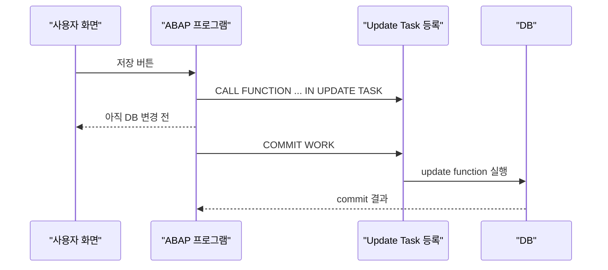
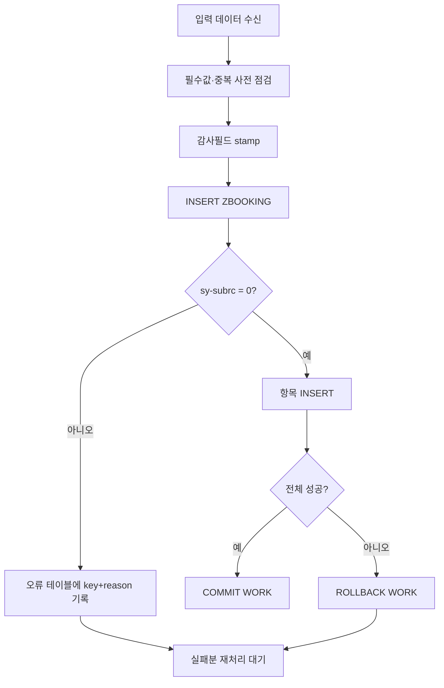

# CH24_REWRITE - 실무 데이터 변경과 트랜잭션 제어

> 기준 파일: `content/abap/CH24/_chapter.md`, `content/abap/CH24/CH24-L01.md` ~ `CH24-L05.md`
> 재작업 기준: `reference/codex_0625/00_QUALITY_REVIEW.md`
> 작업 단위: CH24 단일 챕터
> 작성 방향: 템플릿 보강안이 아니라, 실제 강의 본문으로 바로 전환할 수 있는 완성형 강의자료 초안

## CH24의 자리

CH08에서 학습자는 `SELECT`로 DB를 읽었다. CH24는 그 반대편, 즉 업무 데이터를 실제로 바꾸는 순간을 다룬다. 여기서부터 프로그램은 "값을 보여 주는 도구"가 아니라 "회사 데이터의 상태를 바꾸는 도구"가 된다. 그래서 문법보다 먼저 책임을 가르쳐야 한다.

DB 변경 수업에서 입문자가 가장 위험하게 오해하는 지점은 네 가지다.

| 오해 | 바로잡을 관점 |
|---|---|
| `INSERT` 한 줄이면 저장이 끝난다 | DML은 변경을 만들지만, 업무 단위 확정은 `COMMIT WORK`까지 봐야 한다. |
| `UPDATE`와 `MODIFY`는 비슷하다 | `UPDATE`는 기존 행 수정, `MODIFY`는 있으면 수정·없으면 삽입이라는 의도 차이가 있다. |
| 실패하면 화면에 바로 보일 것이다 | 대부분은 `sy-subrc`, `sy-dbcnt`, 로그, 재처리 테이블로 직접 확인해야 한다. |
| 많이 바꿀수록 한 번에 처리하는 게 좋다 | 대량 변경은 패키지 단위로 끊어 자원과 재시작점을 관리해야 한다. |

이 챕터의 강의 목표는 학습자가 다음 말을 자기 언어로 설명하게 만드는 것이다.

> "쓰기 프로그램은 `무엇을 바꿀지`, `정말 바뀌었는지`, `언제 확정할지`, `실패분을 어떻게 다시 잡을지`까지 설계해야 한다."

## R15 / classic-first 경계

- CH24는 CH18과 CH19 이후이므로 인라인 선언, `@` host variable, modern Open SQL 표기는 사용할 수 있다.
- 단, 이 챕터의 중심은 classic/on-premise ABAP의 DB DML과 SAP LUW이다. RAP 저장 모델은 이미 CH23에서 입문했지만, 여기서는 RAP 내부 구현을 다시 설명하지 않는다.
- Lock Object, `ENQUEUE_`/`DEQUEUE_`, 동시성 충돌 해결은 CH25 주제다. CH24에서는 "다음에 잠금으로 보강한다" 정도만 예고한다.
- BAL/SLG1의 세부 API, Background Job, BAPI 트랜잭션 패턴은 각각 뒤 챕터에서 다룬다. CH24에서는 로그·재처리 책임과 BAPI 경유 원칙까지만 확정한다.
- ABAP Cloud에서는 임의의 표준 객체 접근보다 released API와 RAP transactional model을 우선한다. 이 챕터의 직접 DML 예제는 학습용 `Z*` 테이블과 classic ABAP 실무 기준으로 한정한다.

## 공식 문서 수동 확인 근거

`reference/codex_0625` v1의 CH24에는 DML과 무관한 Selection Screen 계열 문서가 잘못 붙은 흔적이 있었다. v2에서는 아래 파일만 수동 확인 근거로 사용한다.

| 주제 | 확인한 로컬 문서 | 강의 반영 |
|---|---|---|
| `INSERT` | `C:\ABAP_DOCU_HTML\abapinsert_dbtab.htm` | 단건 `INSERT`의 중복 키는 `sy-subrc = 4`로 확인한다. 대량 `INSERT FROM TABLE`은 중복 처리 방식과 예외 가능성을 구분해서 설명한다. |
| `UPDATE` | `C:\ABAP_DOCU_HTML\abapupdate.htm` | `SET ... WHERE ...`로 바뀐 행이 없으면 `sy-subrc = 4`, 바뀐 행 수는 `sy-dbcnt`로 확인한다. |
| `MODIFY` | `C:\ABAP_DOCU_HTML\abapmodify_dbtab.htm` | 있으면 변경, 없으면 삽입하는 upsert 성격과 `sy-subrc`/`sy-dbcnt` 확인을 반영한다. |
| `DELETE` | `C:\ABAP_DOCU_HTML\abapdelete_dbtab.htm` | `WHERE` 없는 `DELETE FROM dbtab`가 전체 삭제가 될 수 있음을 공식 문법 기준으로 경고한다. |
| `COMMIT WORK` | `C:\ABAP_DOCU_HTML\abapcommit.htm` | 현재 SAP LUW를 닫고 새 SAP LUW를 열며, update task와 `PERFORM ON COMMIT` 실행을 유발한다는 설명에 반영한다. |
| `ROLLBACK WORK` | `C:\ABAP_DOCU_HTML\abaprollback.htm` | 현재 SAP LUW의 변경 요청과 update task 등록을 취소하고 DB rollback을 유발한다는 설명에 반영한다. |
| SAP LUW | `C:\ABAP_DOCU_HTML\abensap_luw.htm` | DB LUW와 SAP LUW의 범위 차이, `COMMIT WORK`/`ROLLBACK WORK`가 SAP LUW 경계라는 설명에 반영한다. |
| Update Task | `C:\ABAP_DOCU_HTML\abapcall_function_update.htm`, `C:\ABAP_DOCU_HTML\abensap_luw_update_task_abexa.htm` | `CALL FUNCTION ... IN UPDATE TASK`는 즉시 실행이 아니라 등록이며, 실행은 `COMMIT WORK` 시점이라는 설명에 반영한다. |
| `PERFORM ... ON COMMIT` | `C:\ABAP_DOCU_HTML\abapperform_on_commit.htm`, `C:\ABAP_DOCU_HTML\abensap_luw_on_commit_abexa.htm` | 등록된 서브루틴이 COMMIT/ROLLBACK 시점에 실행된다는 사실과 신규 설계에서는 method wrapper 수준으로만 언급해야 한다는 주의에 반영한다. |
| BAPI | `C:\ABAP_DOCU_HTML\abenbapi_glosry.htm` | BAPI가 Business Application Programming Interface라는 표준 API 경계 설명에 반영한다. |
| ABAP Cloud | `C:\ABAP_DOCU_HTML\abenabap_cloud_glosry.htm`, `C:\ABAP_DOCU_HTML\abenabap_for_cloud_dev_glosry.htm`, `C:\ABAP_DOCU_HTML\abenreleased_api_glosry.htm`, `C:\ABAP_DOCU_HTML\abenreleased_apis.htm` | ABAP Cloud는 restricted language version, released API, RAP transactional model 중심이라는 경계 설명에 반영한다. |

---

## CH24-L01 - INSERT / UPDATE / MODIFY / DELETE 실무 기준

### 왜 필요한가

CH08의 `SELECT`는 "조회"였다. 조회 프로그램이 잘못되어도 보통은 화면에 값이 이상하게 보이는 정도에서 멈춘다. 그러나 CH24의 DML(Data Manipulation Language, DB 행을 추가·수정·삭제하는 문장)은 회사 데이터의 실제 상태를 바꾼다. 예매 상태를 `N`에서 `C`로 바꾸거나, 새 예매를 `ZBOOKING`에 넣거나, 잘못 등록된 행을 삭제하는 순간부터 프로그램은 업무 결과를 만든다.

입문자는 여기서 "문장을 외우면 된다"고 생각하기 쉽다. 하지만 실무에서는 문장보다 의도가 더 중요하다.

- 새 행을 만들려는가?
- 이미 있는 행만 고치려는가?
- 있으면 고치고 없으면 만들려는가?
- 정말 삭제해도 되는 행을 정확히 골랐는가?
- 변경 후 몇 행이 바뀌었는지 확인했는가?

이 질문 없이 `UPDATE`나 `DELETE`를 실행하면 사고가 난다. 특히 `WHERE` 조건을 빠뜨린 `UPDATE`/`DELETE`는 한 건이 아니라 테이블 전체를 바꿀 수 있다. 이 레슨은 네 문장의 철자를 외우는 시간이 아니라, "내가 어떤 업무 의도로 DB에 손을 대는지"를 구분하는 시간이다.

### 무엇인가

DML 네 문장은 다음처럼 구분한다.

| 문장 | 업무 의도 | 키가 이미 있으면 | 키가 없으면 | 확인 포인트 |
|---|---|---|---|---|
| `INSERT` | 새 행을 추가한다 | 단건 삽입은 보통 실패하며 `sy-subrc = 4`로 확인한다 | 새 행이 추가된다 | 중복 키, `sy-subrc`, `sy-dbcnt` |
| `UPDATE` | 기존 행을 수정한다 | 조건에 맞는 행이 수정된다 | 바뀐 행이 없고 `sy-subrc = 4` | `WHERE`, 바뀐 행 수 |
| `MODIFY` | 있으면 수정, 없으면 추가한다 | 기존 행이 덮어써진다 | 새 행이 추가된다 | upsert가 진짜 의도인지 |
| `DELETE` | 행을 삭제한다 | 조건에 맞는 행이 삭제된다 | 삭제된 행이 없고 `sy-subrc = 4` | `WHERE`, 삭제 대상 수 |

예매 테이블 `ZBOOKING`을 기준으로 보면 네 문장의 의도 차이가 분명해진다.

```abap
INSERT zbooking FROM @ls_booking.
```

`ls_booking`의 key에 해당하는 예매가 아직 없을 때만 새 행을 넣겠다는 뜻이다. 이미 같은 key가 있으면 "새 예매"가 아니라 "중복 예매 시도"이므로 실패를 정상적으로 감지해야 한다.

```abap
UPDATE zbooking
   SET status = 'C'
 WHERE booking_id = @lv_booking_id.
```

이미 있는 예매의 상태만 바꾸겠다는 뜻이다. `WHERE booking_id = ...`가 빠지면 모든 예매의 상태가 바뀔 수 있으므로, `UPDATE`는 항상 조건을 먼저 읽는 습관을 들인다.

```abap
MODIFY zbooking FROM @ls_booking.
```

같은 key가 있으면 수정하고, 없으면 삽입한다. 그래서 재처리나 동기화성 데이터 적재에서 편하다. 반대로 "반드시 새 행이어야 한다"는 업무 규칙에는 맞지 않는다. 새 예매가 중복이면 막아야 하는데 `MODIFY`를 쓰면 조용히 덮어쓸 수 있기 때문이다.

```abap
DELETE FROM zbooking WHERE booking_id = @lv_booking_id.
```

조건에 맞는 예매를 삭제한다. 삭제는 되돌리기 어렵고 업무 흔적을 없애므로 실제 시스템에서는 상태값을 `C`로 바꾸는 논리 삭제를 더 자주 쓴다. 이 레슨에서는 문법 이해를 위해 `DELETE`를 다루지만, 실무 설계에서는 감사·이력 요구를 함께 봐야 한다.

여러 건을 한 번에 처리할 때는 내부 테이블을 DB로 넘긴다.

```abap
INSERT zgugudan FROM TABLE @lt_gugu.
MODIFY zbooking FROM TABLE @lt_booking.
```

`FROM TABLE`은 ABAP 메모리의 internal table(프로그램 안의 표)을 DB 테이블에 한 번에 반영한다. 한 건씩 DB에 왕복하는 것보다 효율적이지만, 실패 시 어떤 행이 실패했는지 더 신중하게 수집해야 한다. 대량 처리의 실패 회수는 L04와 L05에서 다시 잡는다.

업무 테이블에는 누가 언제 만들고 바꿨는지 남기는 audit field(감사필드, 변경 추적용 컬럼)를 둔다.

```abap
ls_booking-created_by = sy-uname.
ls_booking-created_on = sy-datum.
ls_booking-created_at = sy-uzeit.

INSERT zbooking FROM @ls_booking.
```

`sy-uname`은 현재 로그온 사용자, `sy-datum`은 오늘 날짜, `sy-uzeit`는 현재 시각이다. 감사필드는 "있으면 좋은 컬럼"이 아니라 운영 중 문제를 추적하는 최소한의 증거다. 고객이 "누가 이 예매를 취소했습니까?"라고 물을 때, 화면 설명보다 DB 흔적이 답을 준다.

표준 테이블에는 직접 DML을 하지 않는다. `SCARR`, `SFLIGHT` 같은 SAP 표준 테이블을 `UPDATE`로 직접 바꾸면 표준 프로그램이 기대하는 검증, 번호 채번, 후속 문서, 이력, 잠금, 권한 처리를 건너뛸 수 있다. 표준 데이터는 BAPI(Business Application Programming Interface, SAP가 제공하는 업무 API)나 released API 같은 공식 경로를 사용한다. 이 챕터의 직접 DML은 학습용 `Z*` 테이블에 한정한다.

### 어떻게 확인하는가

학습자는 DML을 실행하기 전에 먼저 결과를 예측해야 한다.

| 실행 전 질문 | 실행 후 확인 |
|---|---|
| 이 key가 DB에 이미 있는가? | `sy-subrc`가 0인지 4인지 확인한다. |
| 몇 행이 바뀌어야 정상인가? | `sy-dbcnt`가 예상 행 수와 맞는지 확인한다. |
| `WHERE`가 정확히 한 업무 대상을 가리키는가? | 변경 전후 `SELECT` 결과를 비교한다. |
| 실패했을 때 계속 진행해도 되는가? | L02의 COMMIT/ROLLBACK 판단으로 연결한다. |

예를 들어 "예매 1001의 상태만 취소로 바꾼다"면 실행 전 예상은 `sy-dbcnt = 1`이어야 한다. 실행 후 `sy-dbcnt = 0`이면 해당 예매가 없다는 뜻이고, `sy-dbcnt > 1`이면 조건이 너무 넓다는 뜻이다. 둘 다 정상 저장으로 넘어가면 안 된다.

확인 루틴은 다음처럼 말로 따라가게 한다.

1. `booking_id = 1001` 행이 있는지 조회한다.
2. `UPDATE ... WHERE booking_id = @lv_booking_id`를 실행한다.
3. `sy-subrc`와 `sy-dbcnt`를 확인한다.
4. 다시 조회해서 `status`만 바뀌었는지 본다.
5. 성공이 아니면 L02의 `ROLLBACK WORK` 흐름으로 넘긴다.

이 습관은 초반에는 번거롭지만, 나중에 대량 변경·배치·인터페이스 프로그램에서 사고를 막는 기본 체력이 된다.

### 실수와 주의

`INSERT` 중복 키를 무조건 short dump로만 외우면 안 된다. 공식 문서 기준으로 단건 work area 삽입은 같은 primary key 또는 unique secondary index가 이미 있으면 삽입되지 않고 `sy-subrc = 4`가 된다. 다만 대량 삽입 방식, DB 제약, 예외 처리 범위에 따라 catchable exception이나 runtime error 상황도 생길 수 있으므로, 강의에서는 "중복은 성공이 아니며 반드시 실패로 분기한다"가 핵심이다.

`MODIFY`를 만능 저장 버튼처럼 쓰면 업무 규칙이 흐려진다. 신규 등록 화면에서 같은 예매 번호가 이미 있다면 "덮어쓰기"가 아니라 "중복 등록 오류"가 되어야 할 수 있다. 그 경우 `INSERT`로 중복을 감지하거나, 먼저 `SELECT SINGLE`로 존재 여부를 확인한 뒤 메시지를 내야 한다.

`WHERE` 없는 `UPDATE`/`DELETE`는 초보자 사고의 대표 패턴이다.

```abap
UPDATE zbooking SET status = 'C'.
DELETE FROM zbooking.
```

두 문장은 특정 예매가 아니라 테이블 전체를 대상으로 한다. 교육용 시뮬레이터에서는 일부러 이 위험을 보여 주되, 실제 실습 코드는 반드시 test table과 rollback 가능한 환경에서만 다룬다.

표준 테이블 직접 변경 금지도 반복해서 각인시킨다. "권한이 있어서 실행된다"와 "업무적으로 안전하다"는 다르다. 표준 데이터는 SAP가 제공한 API의 검증과 후속 처리를 통과해야 한다.

### 체험형 학습 설계

기존 embed를 중심 체험으로 사용한다.

`::embed CH24-L01-S01 | DML 플레이그라운드 - ZBOOKING 직접 바꾸기 | 560::`

설계 의도는 단순 실행기가 아니라 "문장 선택에 따른 DB 상태 변화 관찰판"이다.

| UI 요소 | 동작 | 학습 피드백 |
|---|---|---|
| `booking_id`, `passenger`, `seats`, `status` 입력 | work area의 key와 값을 구성한다 | 같은 key 재사용 시 `INSERT`와 `MODIFY` 차이가 보인다. |
| `INSERT` 버튼 | 새 행 추가를 시도한다 | 성공이면 새 row와 감사필드가 표시되고, 중복이면 실패 메시지와 `sy-subrc` 의미를 보여 준다. |
| `UPDATE` 버튼 | 선택 key의 상태나 좌석 수를 바꾼다 | 대상이 없으면 "바뀐 행 0건"을 표시한다. |
| `MODIFY` 버튼 | upsert를 실행한다 | 기존 key는 수정, 새 key는 삽입임을 row 색상으로 구분한다. |
| `DELETE` 버튼 | 조건에 맞는 행을 삭제한다 | 삭제 전 확인 메시지와 삭제 후 row count를 보여 준다. |
| `WHERE 생략` 토글 | 위험 실행을 시뮬레이션한다 | 전체 변경/삭제 위험을 붉은 경고와 함께 표시한다. 실제 DB가 아니라 시뮬레이션 상태에서만 허용한다. |
| 결과 패널 | `sy-subrc`, `sy-dbcnt`, 변경 전후 row를 표시한다 | "문장이 실행됐다"가 아니라 "몇 행이 어떤 이유로 바뀌었다"를 읽게 한다. |

체험 진행은 세 라운드로 잡는다.

1. 정상 라운드: 새 key로 `INSERT`, 같은 key로 `UPDATE`, 다른 key로 `MODIFY`.
2. 실패 라운드: 같은 key를 다시 `INSERT`, 없는 key를 `UPDATE`/`DELETE`.
3. 사고 라운드: `WHERE 생략`을 켜고 `UPDATE` 또는 `DELETE`를 눌러 전체 대상 위험을 확인한다.

각 라운드가 끝날 때 학습자에게 "이 상황에서 `COMMIT WORK`를 해도 되는가?"를 묻는다. L01의 확인 습관을 L02의 트랜잭션 판단으로 자연스럽게 넘기는 장치다.

### 정리

- `INSERT`는 새 행, `UPDATE`는 기존 행 수정, `MODIFY`는 upsert, `DELETE`는 삭제다.
- DML 실행 후에는 `sy-subrc`와 `sy-dbcnt`로 성공 여부와 영향 행 수를 확인한다.
- 감사필드는 누가·언제 바꿨는지 추적하는 운영 증거다.
- 표준 테이블 직접 DML은 금지하고 BAPI/API를 경유한다.
- 다음 레슨에서는 "바뀐 내용을 언제 확정하고 언제 되돌리는가"를 `COMMIT WORK`와 `ROLLBACK WORK`로 배운다.

---

## CH24-L02 - COMMIT WORK / ROLLBACK WORK

### 왜 필요한가

L01에서 DML 네 문장을 배웠다. 하지만 업무 저장은 `INSERT` 한 줄로 끝나지 않는다. 예매 하나만 봐도 헤더, 좌석 항목, 결제 요청, 로그처럼 여러 행과 후속 처리가 함께 움직인다. 헤더만 저장되고 좌석 항목이 실패하면 "예매는 있는데 좌석은 없는" 이상한 데이터가 남는다.

그래서 실무 저장의 기본 질문은 "각 문장이 성공했는가?"보다 더 크다.

> "이 업무 단위 전체가 함께 성공했는가, 아니면 함께 취소되어야 하는가?"

이 질문에 답하는 문장이 `COMMIT WORK`와 `ROLLBACK WORK`다. `COMMIT WORK`는 현재 SAP LUW(Logical Unit of Work, 논리적 작업 단위)를 닫고 변경 요청을 확정한다. `ROLLBACK WORK`는 현재 SAP LUW의 변경 요청을 취소하고 DB rollback을 일으킨다. 초보자에게는 "저장 버튼"과 "취소 버튼"처럼 보이지만, 실제로는 업무 데이터의 원자성(전부 성공하거나 전부 실패하는 성질)을 지키는 경계선이다.

### 무엇인가

예매 저장을 두 단계로 단순화해 보자.

```abap
INSERT zbooking      FROM @ls_booking.
INSERT zbooking_item FROM TABLE @lt_items.

IF sy-subrc = 0.
  COMMIT WORK.
ELSE.
  ROLLBACK WORK.
ENDIF.
```

이 코드는 보기에는 짧지만, 강의에서는 그대로 넘기면 안 된다. 두 번째 `INSERT`만 보고 `sy-subrc`를 판단하면 첫 번째 `INSERT` 실패를 놓칠 수 있다. 입문자에게는 다음처럼 더 안전한 사고 흐름으로 풀어야 한다.

```abap
DATA lv_failed TYPE abap_bool.

INSERT zbooking FROM @ls_booking.
IF sy-subrc <> 0.
  lv_failed = abap_true.
ENDIF.

INSERT zbooking_item FROM TABLE @lt_items.
IF sy-subrc <> 0.
  lv_failed = abap_true.
ENDIF.

IF lv_failed = abap_false.
  COMMIT WORK.
ELSE.
  ROLLBACK WORK.
ENDIF.
```

핵심은 `COMMIT WORK`가 "마지막 문장이 성공했다"는 이유로 호출되는 것이 아니라, 업무 단위 전체가 성공했을 때만 호출된다는 점이다.

`COMMIT WORK`는 현재 SAP LUW를 닫고 새 SAP LUW를 연다. 이때 현재 LUW에 등록된 변경 요청, update function module, `PERFORM ... ON COMMIT` 등이 처리된다. `ROLLBACK WORK`는 현재 SAP LUW를 닫고 새 SAP LUW를 열면서 변경 요청을 취소하고, `CALL FUNCTION ... IN UPDATE TASK` 등록도 삭제한다.

`COMMIT WORK AND WAIT`는 update task 완료를 기다려야 할 때 쓴다. 기본 `COMMIT WORK`는 비동기 update를 시작하고 프로그램이 바로 다음으로 진행할 수 있다. 저장 결과를 즉시 확인해야 하거나 후속 처리가 저장 완료에 의존하면 `AND WAIT`를 고려한다. 단, 이 선택은 성능과 응답 시간을 함께 보아야 한다.

### 어떻게 확인하는가

확인은 "DB가 바뀌었는가?"보다 "어느 경계에서 바뀌었는가?"를 보게 해야 한다.

1. `INSERT zbooking` 실행 후 아직 `COMMIT WORK` 전 상태를 표시한다.
2. 두 번째 `INSERT zbooking_item`을 성공/실패로 나누어 실행한다.
3. 실패했는데도 `COMMIT WORK`를 누른 경우 헤더만 남는 반쪽 저장을 보여 준다.
4. 실패 후 `ROLLBACK WORK`를 누른 경우 헤더와 항목이 모두 사라지는 것을 보여 준다.
5. 성공 후 `COMMIT WORK`를 누른 경우 헤더와 항목이 함께 확정되는 것을 보여 준다.

실제 ABAP 디버깅에서는 다음 값을 본다.

| 확인 대상 | 의미 |
|---|---|
| 각 DML 직후 `sy-subrc` | 그 문장 자체가 성공했는지 확인한다. |
| 각 DML 직후 `sy-dbcnt` | 예상 행 수만큼 바뀌었는지 확인한다. |
| 실패 플래그 또는 오류 테이블 | 여러 문장 중 하나라도 실패했는지 누적한다. |
| COMMIT 이후 재조회 | 확정된 DB 상태가 업무 기대와 맞는지 확인한다. |
| ROLLBACK 이후 재조회 | 실패한 업무 단위의 흔적이 남지 않았는지 확인한다. |

초보자에게 꼭 시켜야 하는 질문은 "지금 COMMIT을 해도 되는 근거가 무엇인가?"이다. 대답이 "`sy-subrc = 0`이니까요"에서 멈추면 부족하다. "모든 필수 DML이 성공했고, 바뀐 행 수가 예상과 맞고, 실패 테이블이 비어 있으므로 COMMIT합니다"까지 가야 한다.

### 실수와 주의

첫째, `COMMIT WORK`를 너무 일찍 호출하면 업무 단위가 쪼개진다. 헤더 저장 직후 COMMIT하고 항목 저장이 실패하면, 이후 `ROLLBACK WORK`로는 이미 확정된 헤더를 되돌릴 수 없다.

둘째, 실패를 확인하지 않고 COMMIT하면 오류를 확정하는 셈이다. `sy-subrc`가 4인 `UPDATE`는 dump가 아니기 때문에 조용히 지나갈 수 있다. "조용히 지나감"은 성공이 아니다.

셋째, `ROLLBACK WORK` 후에는 커서나 후속 처리 상태에도 영향이 있다. 공식 문서는 rollback이 open database cursor를 닫을 수 있음을 경고한다. CH24에서는 깊게 들어가지 않지만, `SELECT ... ENDSELECT` 같은 긴 DB cursor 흐름 중간에 commit/rollback을 넣는 습관은 피한다.

넷째, `COMMIT WORK AND WAIT`가 모든 문제의 해결책은 아니다. 기다리면 결과 확인은 쉬워지지만 응답 시간이 길어질 수 있다. 저장 완료를 즉시 알아야 하는 업무인지, 단순히 다음 화면으로 넘어가도 되는 업무인지 판단한다.

### 체험형 학습 설계

기존 embed를 사용한다.

`::embed CH24-L02-S01 | 원자성 시뮬레이터 - COMMIT vs ROLLBACK | 520::`

시뮬레이터는 세 영역으로 구성한다.

| 영역 | 상태 | 학습 목적 |
|---|---|---|
| 입력 업무 | 예매 헤더, 좌석 항목, "항목 실패" 토글 | 업무 단위가 한 행이 아니라 여러 변경의 묶음임을 보여 준다. |
| 미확정 변경 버퍼 | 아직 COMMIT 전인 헤더/항목 | DML 직후와 확정 이후를 구분한다. |
| 확정 DB | COMMIT된 결과만 표시 | 반쪽 저장과 원자적 저장의 차이를 눈으로 확인한다. |

버튼은 다음 순서로 설계한다.

1. `예매 처리 시작`: 헤더와 항목 DML을 실행해 미확정 상태에 둔다.
2. `항목 실패 켜기`: 일부러 항목 insert를 실패시킨다.
3. `COMMIT WORK`: 성공/실패와 무관하게 현재 미확정 변경을 확정해 반쪽 저장 위험을 보여 준다.
4. `ROLLBACK WORK`: 실패한 업무 단위를 전부 취소한다.
5. `다시 시작`: 모든 상태를 초기화한다.

피드백 문구는 결과를 판정형으로 준다.

- "정상: 헤더 1건과 항목 2건이 함께 확정되었습니다."
- "위험: 항목이 실패했는데 COMMIT하여 헤더만 남았습니다."
- "정상 회수: 실패를 감지하고 ROLLBACK하여 DB에 흔적을 남기지 않았습니다."

마지막에는 `COMMIT WORK AND WAIT` 토글을 둔다. 토글을 켜면 update 완료 후 다음 단계로 넘어가는 흐름을, 끄면 "update 요청 후 즉시 다음 코드 진행" 흐름을 타임라인으로 보여 준다. 단, L03에서 update task를 정식 설명하므로 여기서는 "완료 대기 여부"까지만 다룬다.

### 정리

- `COMMIT WORK`는 현재 SAP LUW를 확정하고 새 LUW를 연다.
- `ROLLBACK WORK`는 현재 SAP LUW의 변경 요청을 취소하고 새 LUW를 연다.
- COMMIT 판단은 마지막 `sy-subrc`가 아니라 업무 단위 전체 성공 여부로 한다.
- `AND WAIT`는 update 완료를 기다려야 할 때 쓰며, 성능과 응답 시간을 함께 고려한다.
- 다음 레슨에서는 `COMMIT WORK`가 update task와 SAP LUW 안에서 어떻게 동작하는지 본다.

---

## CH24-L03 - DB LUW와 SAP LUW 차이

### 왜 필요한가

L02에서 `COMMIT WORK`와 `ROLLBACK WORK`를 배웠다. 그런데 SAP 실무에서는 "트랜잭션"이라는 말이 한 가지 뜻으로만 쓰이지 않는다. DB가 보는 짧은 변경 단위가 있고, 사용자가 여러 화면을 거쳐 완료하는 업무 단위가 있다. 이 둘을 구분하지 못하면 다음 상황에서 혼란이 생긴다.

- "함수를 호출했는데 왜 DB에 아직 없지?"
- "`COMMIT WORK` 전에 조회했는데 왜 안 보이지?"
- "여러 화면을 지나 마지막 저장을 눌렀는데, 중간 변경은 어디에 있었지?"
- "기본 `COMMIT WORK`와 `AND WAIT`는 왜 결과 확인 타이밍이 다르지?"

DB LUW와 SAP LUW를 나누어 이해하면, SAP가 왜 update task를 사용해 변경을 모았다가 commit 시점에 처리하는지 설명할 수 있다.

### 무엇인가

LUW는 Logical Unit of Work, 즉 함께 처리되는 논리적 작업 단위다. 다만 층이 다르다.

| 구분 | 관점 | 길이 | 경계 | 예 |
|---|---|---|---|---|
| DB LUW | 데이터베이스가 보장하는 실제 commit/rollback 단위 | 짧다 | DB commit 또는 DB rollback | 한 DB 연결에서 변경을 쓰고 commit하는 구간 |
| SAP LUW | SAP 애플리케이션이 묶는 업무 단위 | 더 길 수 있다 | `COMMIT WORK` 또는 `ROLLBACK WORK` | 여러 화면에서 예매 정보를 모아 마지막 저장으로 확정 |

SAP LUW는 업무 단위다. 사용자는 예매 생성 화면에서 고객을 고르고, 좌석을 고르고, 가격을 확인한 뒤 저장을 누른다. 이 과정 전체가 하나의 업무 단위가 될 수 있다. 하지만 DB는 사용자가 화면을 보는 동안 긴 transaction을 계속 붙들고 있으면 안 된다. 그래서 SAP는 변경 요청을 등록해 두고, 마지막 `COMMIT WORK`에서 update work process를 통해 실제 DB 변경을 처리한다.

대표 문장이 `CALL FUNCTION ... IN UPDATE TASK`다.

```abap
CALL FUNCTION 'Z_SAVE_BOOKING' IN UPDATE TASK
  EXPORTING
    is_booking = ls_booking.

" 여기서 다른 검증이나 후속 처리를 더 한다.

COMMIT WORK.
```

이 코드는 `Z_SAVE_BOOKING`을 지금 실행한다는 뜻이 아니다. "현재 SAP LUW에 이 update function module을 등록하고, `COMMIT WORK` 때 실행하라"는 뜻이다. 공식 문서도 이 문장을 update function module 등록으로 설명한다.

`PERFORM subr ON COMMIT`도 비슷하게 commit 시점 실행을 등록한다. 다만 신규 설계에서 subroutine 자체는 obsolete 성격이 있으므로, CH24에서는 "기존 classic 코드 이해용"으로만 다룬다. 새 설계에서는 method 호출 wrapper 정도로 제한하는 것이 좋다.

### 어떻게 확인하는가

타이밍을 눈으로 확인해야 한다.

1. 화면에서 예매 정보를 입력한다.
2. `CALL FUNCTION 'Z_SAVE_BOOKING' IN UPDATE TASK`를 실행한다.
3. update task queue에는 등록이 생기지만 DB 테이블에는 아직 행이 없다.
4. `ROLLBACK WORK`를 실행하면 등록이 삭제되고 DB에는 아무것도 남지 않는다.
5. 다시 등록한 뒤 `COMMIT WORK`를 실행하면 update function module이 실행되어 DB에 반영된다.
6. `COMMIT WORK AND WAIT`를 사용하면 high-priority update가 끝날 때까지 프로그램이 기다린 뒤 다음 단계로 진행한다.

강의에서 "함수 호출 직후 `sy-subrc`를 확인하면 되나요?"라는 질문을 일부러 던진다. 공식 문서 기준으로 `CALL FUNCTION ... IN UPDATE TASK` 후 `sy-subrc`는 undefined이다. 이 문장은 실행 성공 여부를 `sy-subrc`로 판정하는 문장이 아니라, 등록 후 `COMMIT WORK` 결과와 update log를 함께 봐야 하는 문장이다.

학습자는 다음 표를 채울 수 있어야 한다.

| 시점 | update task queue | DB 테이블 | 설명 |
|---|---|---|---|
| 등록 전 | 비어 있음 | 변경 없음 | 아직 아무 요청도 없다. |
| `IN UPDATE TASK` 후 | 등록 있음 | 변경 없음 | 실행이 아니라 예약이다. |
| `ROLLBACK WORK` 후 | 등록 삭제 | 변경 없음 | 현재 SAP LUW의 등록이 취소된다. |
| `COMMIT WORK` 후 | 처리됨 | 변경 반영 | update function module이 실행된다. |
| `COMMIT WORK AND WAIT` 후 | 처리 완료 확인 가능 | 변경 반영 | 프로그램이 update 완료를 기다렸다. |

### 실수와 주의

`IN UPDATE TASK`를 즉시 실행으로 오해하면 commit 전 조회 결과를 보고 "저장이 안 됐다"고 착각한다. 이 문장은 함수 실행 호출이 아니라 update 등록이다.

`COMMIT WORK`를 빠뜨리면 등록만 남기고 실행이 되지 않는다. 프로그램 종료나 internal session 종료가 끼면 등록된 update function module이 더 이상 실행될 수 없는 상태가 될 수 있다. 저장 책임이 어디에 있는지 명확히 해야 한다.

`COMMIT WORK`나 `ROLLBACK WORK`를 update function module 내부에서 실행하려고 하면 안 된다. 공식 문서는 update 처리 중 commit/rollback 제어가 금지된 상황을 경고한다. CH24에서는 "update task 안에서는 트랜잭션 경계를 다시 흔들지 않는다"로 기억시킨다.

`PERFORM ... ON COMMIT`는 기존 classic 코드 이해에는 필요하지만 새 코드를 권장하는 방식으로 포장하지 않는다. 등록된 subroutine은 parameter interface가 없고, 공식 문서도 새 subroutine 생성에는 주의를 둔다. 교육에서는 "보이면 읽을 수 있어야 하는 유산 코드 패턴"으로 다룬다.

ABAP Cloud 경계도 분명히 둔다. ABAP Cloud의 transactional programming model은 RAP이다. 따라서 cloud-ready 설계에서는 임의의 update task와 표준 테이블 직접 DML을 먼저 떠올리기보다 released API와 RAP behavior를 우선 검토한다.

### 체험형 학습 설계

기존 embed를 사용한다.

`::embed CH24-L03-S01 | SAP LUW 타임라인 - IN UPDATE TASK 타이밍 | 560::`

시뮬레이터는 좌우 구조보다 시간축 구조가 좋다.



버튼 흐름은 다음처럼 설계한다.

| 버튼 | 화면 변화 | 피드백 |
|---|---|---|
| `1. 화면 입력` | 예매 데이터 카드가 생성된다 | "아직 ABAP 메모리의 값입니다." |
| `2. UPDATE TASK 등록` | queue 영역에 `Z_SAVE_BOOKING` 카드가 쌓인다 | "함수 실행이 아니라 등록입니다." |
| `3. COMMIT 전 조회` | DB 영역은 비어 있다 | "등록만 했으므로 DB에는 아직 없습니다." |
| `4A. ROLLBACK WORK` | queue가 비워지고 DB는 비어 있다 | "현재 SAP LUW의 등록을 취소했습니다." |
| `4B. COMMIT WORK` | queue 카드가 DB 영역으로 이동한다 | "등록된 update function module이 실행되었습니다." |
| `AND WAIT 토글` | 타임라인에 대기 구간이 표시된다 | "완료 후 다음 코드로 진행합니다." |

학습자는 마지막에 다음 두 문장을 완성한다.

- "`CALL FUNCTION ... IN UPDATE TASK`는 지금 함수를 실행하는 것이 아니라 ________한다."
- "`COMMIT WORK`는 현재 ________를 닫고 새 ________를 연다."

정답은 "등록"과 "SAP LUW"다.

### 정리

- DB LUW는 DB가 보장하는 짧은 commit/rollback 단위다.
- SAP LUW는 SAP 애플리케이션이 묶는 업무 단위이며 `COMMIT WORK`/`ROLLBACK WORK`로 경계가 생긴다.
- `CALL FUNCTION ... IN UPDATE TASK`는 즉시 실행이 아니라 update function module 등록이다.
- `ROLLBACK WORK`는 현재 SAP LUW의 등록을 취소하고, `COMMIT WORK`는 등록된 update를 실행한다.
- 다음 레슨에서는 일부 실패를 기록하고 재처리하는 운영 구조를 다룬다.

---

## CH24-L04 - 오류 로그와 재처리 구조

### 왜 필요한가

실무 데이터 변경은 항상 한 번에 깨끗하게 끝나지 않는다. 500건의 예매를 외부 파일에서 받아 넣는다고 해 보자. 그중 470건은 정상이고, 20건은 이미 존재하는 예매 번호이고, 10건은 필수 값이 비어 있을 수 있다. 이때 프로그램이 할 수 있는 최악의 행동은 "일단 되는 것만 넣고 실패분은 잊어버리는 것"이다.

오류를 잊으면 세 가지 문제가 생긴다.

- 빠진 데이터가 무엇인지 나중에 찾을 수 없다.
- 다시 처리할 때 전체 파일을 처음부터 돌려 중복과 재실패가 반복된다.
- 운영자가 원인, 건수, 재처리 결과를 설명할 수 없다.

그래서 변경 프로그램은 성공 코드보다 실패 회수 구조가 더 중요하다. L04는 "실패한 행을 버리지 않고, 원인과 함께 남기고, 고친 뒤 실패분만 다시 처리한다"는 운영 패턴을 배운다.

### 무엇인가

가장 작은 구조는 오류 테이블이다.

```abap
DATA lt_error TYPE TABLE OF zbooking.

LOOP AT lt_booking INTO DATA(ls_booking).
  INSERT zbooking FROM @ls_booking.

  IF sy-subrc <> 0.
    APPEND ls_booking TO lt_error.
  ENDIF.
ENDLOOP.
```

이 코드는 "실패한 원본 행"만 모은다. 그러나 실무에서는 이것만으로 부족하다. 실패 사유와 key도 함께 남겨야 한다.

```abap
TYPES: BEGIN OF ty_error,
         booking_id TYPE zbooking-booking_id,
         passenger  TYPE zbooking-passenger,
         reason     TYPE string,
       END OF ty_error.

DATA lt_error TYPE TABLE OF ty_error.

LOOP AT lt_booking INTO DATA(ls_booking).
  INSERT zbooking FROM @ls_booking.

  IF sy-subrc <> 0.
    APPEND VALUE #(
      booking_id = ls_booking-booking_id
      passenger  = ls_booking-passenger
      reason     = |INSERT failed: sy-subrc={ sy-subrc }|
    ) TO lt_error.
  ENDIF.
ENDLOOP.
```

이 예제에서 `VALUE #(...)`와 string template은 이미 CH18 이후 학습한 modern syntax이므로 CH24에서는 사용할 수 있다. 강의에서는 문법을 새로 가르치지 말고 "오류 행에 key와 reason을 남긴다"는 구조에 집중한다.

재처리 구조는 다음 세 단계다.

| 단계 | 내용 | 결과 |
|---|---|---|
| 1차 처리 | 전체 입력을 처리하고 실패분을 오류 테이블에 모은다 | 정상분과 실패분이 분리된다. |
| 원인 해결 | 중복 key, 필수값 누락, master data 누락 등을 고친다 | 재처리 가능한 상태가 된다. |
| 재처리 | 오류 테이블의 실패분만 다시 처리한다 | 전체를 반복하지 않아 중복 위험이 줄어든다. |

여기서 멱등성(idempotency, 같은 처리를 두 번 실행해도 결과가 망가지지 않는 성질)이 중요하다. 예를 들어 재처리 프로그램이 `INSERT`만 쓰면 이미 성공한 행을 다시 만났을 때 중복 오류가 난다. 실패분만 정확히 모으거나, `MODIFY`/사전 중복 체크로 두 번째 실행에도 안전하게 만들어야 한다.

현업에서는 Application Log(BAL, 보통 SLG1에서 조회)를 사용해 성공·경고·오류 메시지를 남긴다. CH24에서는 "BAL/SLG1은 운영 로그 표준 도구이며 CH35에서 상세 학습한다" 정도로만 둔다. 지금 목표는 로그 API 암기가 아니라, 실패를 구조적으로 남기는 습관이다.

### 어떻게 확인하는가

확인은 성공 건수보다 실패 건수와 재처리 가능성을 본다.

| 확인 질문 | 기대 답 |
|---|---|
| 입력이 몇 건이었는가? | `전체 = 성공 + 실패`가 맞아야 한다. |
| 실패 key가 남아 있는가? | 재처리 대상 식별이 가능해야 한다. |
| 실패 사유가 남아 있는가? | 운영자가 원인을 고칠 수 있어야 한다. |
| 재처리 후 실패 건수가 줄었는가? | 동일 오류 반복 여부를 확인해야 한다. |
| 같은 파일을 두 번 돌려도 안전한가? | 멱등성 설계를 확인해야 한다. |

학습용 데이터는 5건 정도로 작게 만든다.

| booking_id | passenger | 예상 |
|---|---|---|
| B001 | 정훈영 | 성공 |
| B002 | 김유진 | 성공 |
| B001 | 중복고객 | 중복 key 실패 |
| B003 | 빈좌석 | 필수값 누락 실패 |
| B004 | 박민수 | 성공 |

1차 처리 후에는 성공 3건, 실패 2건이 보여야 한다. 오류 테이블에는 `B001`, `B003`과 사유가 있어야 한다. 원인을 고친 뒤 재처리를 누르면 실패분만 다시 시도하고, 성공하면 오류 테이블에서 제거되거나 "처리 완료" 상태로 바뀐다.

디버깅 관점에서는 `lt_error`가 단순히 비었는지만 보지 않는다. 실패가 있을 때 key와 reason이 충분한지, 다시 처리할 데이터가 원본 구조와 맞는지 확인한다.

### 실수와 주의

첫째, `sy-subrc`만 확인하고 실패 사유를 남기지 않으면 운영자가 고칠 수 없다. `sy-subrc = 4`는 "무언가 실패했다"는 신호일 뿐, 중복인지 대상 없음인지 업무 검증 실패인지는 문맥으로 기록해야 한다.

둘째, 성공분과 실패분을 같은 방식으로 다시 처리하면 중복 오류가 반복된다. 재처리 대상은 실패분이어야 한다. 이미 성공한 행은 다시 `INSERT`하지 않도록 key 기준으로 분리한다.

셋째, COMMIT 경계를 고려하지 않은 오류 수집은 위험하다. 루프 중간에 계속 COMMIT하면 앞 패키지는 이미 확정된다. 실패분을 나중에 rollback할 수 있다고 착각하면 안 된다. L05에서 패키지 commit을 다룰 때 이 점을 다시 확인한다.

넷째, 로그에 개인정보나 민감 값을 그대로 남기면 보안 문제가 된다. 학습 예제에서는 passenger 이름을 보여 주지만, 실무 로그에는 최소 key, 오류 코드, 처리 시각, 담당자 확인에 필요한 범위만 남긴다.

다섯째, 표준 테이블 변경 실패를 직접 DML 재처리로 풀려고 하면 안 된다. 표준 업무 객체는 BAPI/API의 return 메시지와 transaction commit 규칙을 따라야 한다.

### 체험형 학습 설계

기존 embed를 사용한다.

`::embed CH24-L04-S01 | 재처리 시뮬레이터 - 실패 수집과 재처리 | 540::`

체험은 "성공률 표시"가 아니라 "실패가 운영 가능한 정보로 바뀌는 과정"을 보여 줘야 한다.

| UI 영역 | 상태 데이터 | 피드백 |
|---|---|---|
| 입력 batch | 5건 예매 목록, 일부 중복/누락 포함 | 처리 전 예상 성공/실패를 학습자가 먼저 표시한다. |
| 처리 결과 | 성공 DB, 오류 테이블 | 성공분과 실패분이 분리되어 보인다. |
| 오류 상세 | key, reason, first_attempt_time, retry_count | 재처리 가능한 최소 정보가 무엇인지 보여 준다. |
| 원인 해결 버튼 | 중복 key 변경, 필수값 채움 | 오류가 "운영자가 고칠 수 있는 항목"으로 바뀐다. |
| 재처리 버튼 | 오류 테이블만 다시 실행 | 전체 재실행과 실패분 재실행의 차이를 비교한다. |

버튼 흐름은 다음처럼 둔다.

1. `1차 처리`: 전체 batch를 처리한다. 성공 row는 DB 영역으로, 실패 row는 오류 테이블로 이동한다.
2. `오류 원인 보기`: 각 실패 row에 중복 key, 필수값 누락, 참조 오류 같은 사유를 표시한다.
3. `원인 해결`: 시뮬레이터가 실패 row 값을 수정하거나 중복 원인을 제거한다.
4. `실패분만 재처리`: 오류 테이블 row만 다시 처리한다.
5. `멱등성 테스트`: 같은 재처리를 한 번 더 눌러도 DB가 중복되지 않는지 확인한다.

추가 학습 장치로 "전체 파일 다시 실행" 버튼을 둔다. 이 버튼을 누르면 이미 성공한 row가 다시 `INSERT`되어 중복 실패가 늘어난다. 그런 다음 "실패분만 재처리"와 비교하게 하면 멱등성의 필요성을 강하게 이해한다.

### 정리

- 변경 실패는 버리지 말고 key와 reason을 남긴다.
- `전체 입력 = 성공 + 실패` 건수 검증이 되어야 한다.
- 재처리는 전체 반복이 아니라 실패분 중심으로 설계한다.
- 멱등성을 고려해 같은 처리가 반복되어도 DB가 망가지지 않게 한다.
- BAL/SLG1 같은 운영 로그는 뒤 챕터에서 깊게 다루고, 여기서는 로그를 남기는 책임을 확정한다.

---

## CH24-L05 - 대량 변경 시 Package 처리

### 왜 필요한가

작은 실습에서는 5건, 10건만 처리해도 충분하다. 하지만 실무에서는 엑셀 업로드 2만 건, 인터페이스 수신 30만 건, 월말 정산 변경 100만 건처럼 큰 단위가 흔하다. 이때 모든 변경을 하나의 LUW로 묶고 마지막에 한 번만 `COMMIT WORK`하면 다음 문제가 생긴다.

- COMMIT 전 변경이 너무 많이 쌓여 DB 로그와 rollback 영역 부담이 커진다.
- 바뀐 행의 잠금이 오래 유지되어 다른 사용자의 업무를 막는다.
- 중간에 실패하면 너무 많은 작업을 다시 해야 한다.
- 어디까지 성공했는지 재시작점을 잡기 어렵다.

그래서 대량 변경은 일정 건수 단위로 끊어서 처리한다. 이 단위를 package라고 부른다. 패키지 처리는 "성능을 빠르게 하려고 commit을 자주 한다"가 아니라, 자원 사용량과 재시작 가능성을 관리하려는 운영 설계다.

### 무엇인가

기본 구조는 카운터를 두고 일정 건수마다 commit하는 방식이다.

```abap
DATA lv_cnt TYPE i.

LOOP AT lt_big INTO DATA(ls_target).
  MODIFY ztarget FROM @ls_target.

  IF sy-subrc <> 0.
    " 실패 로깅은 L04 패턴으로 처리한다.
  ENDIF.

  lv_cnt += 1.

  IF lv_cnt >= 5000.
    COMMIT WORK.
    CLEAR lv_cnt.
  ENDIF.
ENDLOOP.

COMMIT WORK.
```

이 코드는 입문자에게 바로 보여 주면 두 가지 질문이 생긴다.

첫째, 왜 마지막에 `COMMIT WORK`가 한 번 더 있는가? 입력 건수가 12,300건이고 패키지 크기가 5,000이면 5,000건, 10,000건에서 commit하고 마지막 2,300건이 남는다. 루프 뒤 commit은 이 나머지를 확정한다. 이것을 빠뜨리면 마지막 패키지가 확정되지 않는다.

둘째, 실패가 있어도 commit해도 되는가? 패키지 처리는 실패 정책과 함께 설계해야 한다. "한 건 실패해도 나머지는 저장하고 실패분만 오류 테이블에 남긴다"는 업무라면 패키지 commit이 맞다. 반대로 "전체 12,300건이 모두 성공해야만 저장"이라는 업무라면 패키지 commit을 하면 안 된다. 이미 앞 패키지가 확정되기 때문이다.

따라서 패키지 처리의 핵심 질문은 다음과 같다.

| 질문 | 설계 선택 |
|---|---|
| 일부 성공을 허용하는가? | 허용하면 패키지 commit + 오류 테이블, 불허하면 전체 LUW 또는 사전 검증 강화 |
| 패키지 크기는 얼마인가? | 보통 1,000~10,000에서 시스템 성능과 잠금 시간을 보며 조정 |
| 실패분은 어디에 남기는가? | L04의 오류 테이블/BAL 로그 |
| 재시작점은 무엇인가? | 마지막 성공 package 번호, 마지막 성공 key, 처리 상태 컬럼 |
| commit 사이에 잠금은 어떻게 되는가? | CH25에서 잠금 경계와 함께 점검 |

### 어떻게 확인하는가

대량 처리는 화면 결과보다 숫자로 확인한다.

| 확인 지표 | 의미 |
|---|---|
| 총 입력 건수 | 처리해야 하는 전체 대상 |
| 처리 성공 건수 | DB에 반영된 건수 |
| 실패 건수 | 오류 테이블 또는 로그에 남은 건수 |
| commit 횟수 | 패키지가 몇 번 확정되었는지 |
| 최대 미커밋 건수 | 한 번에 쌓이는 변경 부담 |
| 마지막 commit 이후 잔여 건수 | 루프 뒤 commit 필요 여부 |

예를 들어 총 12,300건, 패키지 크기 5,000이면 commit 시점은 다음과 같다.

| 시점 | 누적 처리 | commit 여부 | 미커밋 버퍼 |
|---|---:|---|---:|
| 시작 | 0 | 없음 | 0 |
| 4,999건 | 4,999 | 아직 | 4,999 |
| 5,000건 | 5,000 | 1회 | 0 |
| 10,000건 | 10,000 | 2회 | 0 |
| 루프 종료 | 12,300 | 마지막 commit 필요 | 2,300 |
| 마지막 commit 후 | 12,300 | 3회 | 0 |

패키지 크기가 너무 작으면 commit overhead가 늘고, 너무 크면 미커밋 버퍼와 잠금 시간이 커진다. 정답 숫자는 시스템, 테이블, 인덱스, 네트워크, 업무 허용 시간에 따라 달라진다. 그래서 강의에서는 "1,000~10,000에서 시작해 측정으로 조정한다"고 설명한다.

### 실수와 주의

전체 성공이 필요한 업무에 패키지 commit을 넣으면 rollback 기대가 깨진다. 앞 패키지는 이미 확정되었기 때문에 뒤에서 실패해도 전체를 한 번에 되돌릴 수 없다. 패키지 처리는 "부분 성공과 재처리"를 허용하는 업무에 어울린다.

마지막 commit 누락은 매우 흔하다. 패키지 크기의 배수가 아닌 나머지 건은 루프 안의 `IF lv_cnt >= 5000` 조건을 만나지 않는다. 루프 뒤 commit은 습관적으로 넣되, 실제로 변경이 있었을 때만 commit하도록 플래그를 두면 더 명확하다.

```abap
DATA lv_pending TYPE abap_bool.

LOOP AT lt_big INTO DATA(ls_target).
  MODIFY ztarget FROM @ls_target.
  lv_pending = abap_true.

  lv_cnt += 1.
  IF lv_cnt >= 5000.
    COMMIT WORK.
    CLEAR lv_cnt.
    lv_pending = abap_false.
  ENDIF.
ENDLOOP.

IF lv_pending = abap_true.
  COMMIT WORK.
ENDIF.
```

패키지 처리에서 `COMMIT WORK`만 있고 오류 로그가 없으면 운영성이 없다. 10만 건 중 97,000건 성공, 3,000건 실패라면 실패 3,000건이 어디에, 왜 실패했는지 남아야 한다.

대량 변경 중 표준 테이블을 직접 바꾸는 것은 더 위험하다. 건수가 많을수록 직접 DML의 피해도 커진다. 표준 업무 객체는 BAPI/API, 배치 입력, IDoc, RAP action 등 공식 경로를 검토해야 한다.

### 체험형 학습 설계

기존 embed를 사용한다.

`::embed CH24-L05-S01 | 패키지 커밋 시각화 - 크기별 COMMIT·버퍼 | 540::`

시뮬레이터는 패키지 크기를 바꿀 때 자원 그래프가 어떻게 달라지는지 보여 준다.

| 컨트롤 | 선택값 | 피드백 |
|---|---|---|
| 총 건수 slider | 1,000 / 12,300 / 100,000 | 처리 규모에 따라 단일 commit 위험이 커지는 것을 보여 준다. |
| 패키지 크기 segmented control | 1,000 / 5,000 / 10,000 / 단일 commit | commit 횟수와 최대 미커밋 버퍼를 비교한다. |
| 실패 정책 toggle | 실패분 로그 후 계속 / 실패 즉시 중단 | 업무 정책에 따라 패키지 commit 가능 여부가 달라짐을 보여 준다. |
| 실행 버튼 | 시뮬레이션 시작 | progress bar가 패키지 단위로 차고 비워진다. |
| 재시작 버튼 | 마지막 성공 package 이후부터 재개 | 재시작점 관리의 가치를 보여 준다. |

시각화는 sawtooth chart(톱니형 그래프)가 적합하다. y축은 미커밋 버퍼 건수, x축은 처리 진행률이다. 패키지 크기 5,000이면 그래프가 0에서 5,000까지 올라갔다가 commit 시점에 0으로 떨어진다. 단일 commit은 끝까지 계속 올라가므로 위험이 직관적으로 보인다.

피드백 문구는 다음처럼 설계한다.

- "패키지 1,000: commit 13회, 최대 미커밋 1,000건. 자원은 안전하지만 commit overhead가 큽니다."
- "패키지 10,000: commit 2회, 최대 미커밋 10,000건. overhead는 낮지만 잠금과 rollback 부담이 커집니다."
- "단일 commit: commit 1회, 최대 미커밋 12,300건. 전체 rollback은 쉽지만 대량에서는 자원 위험이 큽니다."
- "마지막 commit이 없으면 2,300건이 미확정 상태로 남습니다."

마지막 미션은 콘서트 예매 앱에 적용한다.

1. `ZBOOKING_UPLOAD` 입력 100건을 준비한다.
2. 20건 단위 package로 `MODIFY zbooking FROM @ls_booking`을 실행한다.
3. 각 package마다 성공·실패 건수를 로그에 표시한다.
4. 루프 뒤 남은 건을 commit한다.
5. 실패분만 재처리하는 버튼을 둔다.

### 정리

- 대량 변경은 자원, 잠금, 로그, 재시작점을 관리해야 한다.
- 패키지 commit은 부분 성공과 재처리를 허용하는 업무에 적합하다.
- 패키지 크기는 보통 1,000~10,000 범위에서 측정으로 조정한다.
- 루프 뒤 마지막 commit과 실패 로그를 빠뜨리지 않는다.
- 다음 CH25에서는 여러 사용자가 같은 데이터를 바꿀 때 필요한 Lock Object와 동시성 제어를 다룬다.

---

## 챕터 마무리 실습

### 실습 목표

콘서트 예매 앱의 저장 로직을 "쓰기 책임" 관점으로 설계한다.

### 요구사항

1. `ZBOOKING`에 새 예매를 저장한다.
2. 저장 시 `created_by`, `created_on`, `created_at`을 자동으로 채운다.
3. 같은 `booking_id`가 이미 있으면 덮어쓰지 않고 오류로 남긴다.
4. 헤더와 항목 중 하나라도 실패하면 `ROLLBACK WORK`한다.
5. 여러 건 업로드는 package 단위로 처리하고 실패분을 재처리 가능하게 남긴다.
6. 표준 테이블은 직접 변경하지 않는다.

### 모범 사고 흐름



### 학습자가 설명해야 할 문장

- "`INSERT`와 `MODIFY` 중 무엇을 쓰느냐는 문법 취향이 아니라 중복을 허용할지에 대한 업무 결정이다."
- "`COMMIT WORK`는 마지막 줄에 습관적으로 넣는 문장이 아니라 업무 단위 전체 성공을 확정하는 경계다."
- "`IN UPDATE TASK`는 즉시 실행이 아니라 commit 시점 실행을 위한 등록이다."
- "재처리 가능한 프로그램은 실패 key와 reason을 남긴다."
- "패키지 commit은 자원을 줄이지만 전체 rollback 가능성을 포기할 수 있으므로 업무 정책과 함께 결정한다."
