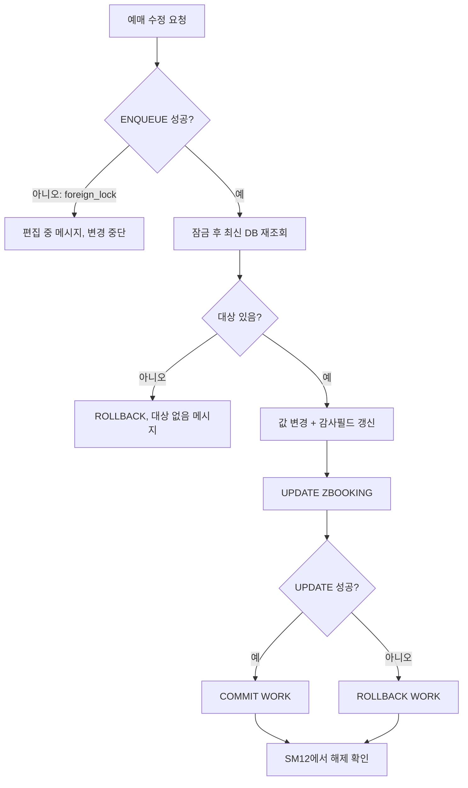

# CH25_REWRITE - Lock Object와 동시성 제어

> 기준 파일: `content/abap/CH25/_chapter.md`, `content/abap/CH25/CH25-L01.md` ~ `CH25-L05.md`
> 재작업 기준: `reference/codex_0625/00_QUALITY_REVIEW.md`
> 작업 단위: CH25 단일 챕터
> 작성 방향: 템플릿 보강안이 아니라, 실제 강의 본문으로 바로 전환할 수 있는 완성형 강의자료 초안

## CH25의 자리

CH24는 "내 프로그램이 데이터를 어떻게 바꾸고 확정하는가"를 다뤘다. CH25는 질문을 한 단계 넓힌다. SAP 시스템은 혼자 쓰는 프로그램이 아니다. 두 사용자가 같은 예매를 동시에 열고, 둘 다 저장을 누르면 한쪽 변경이 조용히 사라질 수 있다. 이 문제는 `COMMIT WORK`만으로 해결되지 않는다. `COMMIT WORK`는 내 SAP LUW의 확정/취소 경계이지, 남의 세션이 같은 데이터를 건드리는 것을 자동으로 막는 장치가 아니기 때문이다.

CH25의 핵심 문장은 다음이다.

> "데이터를 바꾸기 전에는 먼저 잠금으로 편집권을 확보하고, 실패하면 정중히 거절하고, 변경이 끝나면 정확한 시점에 잠금을 풀어야 한다."

입문자가 반드시 가져가야 할 구분은 세 가지다.

| 구분 | 잘못된 이해 | 정확한 이해 |
|---|---|---|
| DB Lock | `UPDATE`하면 알아서 모든 충돌이 막힌다 | DB 내부 lock은 짧은 DB 처리 보호이고, SAP 업무 편집권 관리는 SAP Lock/Lock Object로 설계한다. |
| SAP Lock | DB row가 물리적으로 읽기 금지된다 | 중앙 lock table에 논리 잠금 entry가 생긴다. 프로그램이 `ENQUEUE`로 확인해야 한다. |
| COMMIT/ROLLBACK | 무조건 모든 잠금을 푼다 | lock function module의 `_SCOPE` 값에 따라 해제 주체와 시점이 달라진다. |

## R15 / classic-first 경계

- CH25는 CH24 이후이므로 DML, `COMMIT WORK`, `ROLLBACK WORK`, `sy-subrc`, `sy-dbcnt`, modern Open SQL `@` 표기를 사용할 수 있다.
- `ENQUEUE_*`/`DEQUEUE_*`는 Lock Object 활성화로 생성된 Function Module 호출이다. CH10에서 함수 호출을 이미 배웠으므로 R15상 안전하다.
- RAP의 `lock master`, `lock dependent`, `SET LOCKS`, `FOR LOCK`는 ABAP Cloud/RAP 경계 설명으로만 다룬다. CH25의 본문 중심은 classic Lock Object(SE11)와 SAP Lock이다.
- BAPI/RFC transaction commit 상세, Background Job, Application Log는 뒤 챕터 범위다.
- DB isolation level, database deadlock, `SELECT ... FOR UPDATE` 심화는 이 챕터의 직접 학습 범위가 아니다. 여기서는 SAP 애플리케이션 레벨의 논리 잠금에 집중한다.

## 공식 문서 수동 확인 근거

`reference/codex_0625` v1의 CH25에는 넓은 함수 호출 문서처럼 Lock Object 자체와 거리가 있는 공식 힌트가 붙어 있었다. v2에서는 Lock Object와 SAP Lock 자체에 맞는 문서를 수동으로 확인해 반영한다.

| 주제 | 확인한 로컬 문서 | 강의 반영 |
|---|---|---|
| SAP Locks | `C:\ABAP_DOCU_HTML\abensap_lock.htm` | SAP Lock은 SAP LUW 동안 유지되어야 하며, lock object 기반이고, 중앙 lock table(SM12)에 entry를 만든다는 설명에 반영한다. |
| Lock Object | `C:\ABAP_DOCU_HTML\abenlock_object_glosry.htm` | ABAP Dictionary의 lock object가 SAP Lock의 기반이며, lock function module이 자동 생성된다는 설명에 반영한다. |
| Lock Function Module | `C:\ABAP_DOCU_HTML\abenlock_function_module_glosry.htm` | `ENQUEUE_`는 잠금 설정, `DEQUEUE_`는 잠금 해제 함수라는 설명에 반영한다. |
| ENQUEUE/DEQUEUE 예제 | `C:\ABAP_DOCU_HTML\abenenqueue_abexa.htm` | `foreign_lock`, `system_failure`, SM12 확인, ABAP SQL이 SAP Lock을 자동 검사하지 않는다는 주의에 반영한다. |
| Lock Mode / Key / Scope | `C:\ABAP_DOCU_HTML\abensap_lock.htm` | `MODE_dbtab`의 `S/E/X/O`, key field 미지정 시 넓은 잠금, `_SCOPE` 1/2/3 해제 기준을 반영한다. |
| COMMIT Lock 처리 | `C:\ABAP_DOCU_HTML\abapcommit.htm` | `COMMIT WORK`가 lock function module의 `_SCOPE` 값에 따라 SAP Lock을 처리한다는 설명에 반영한다. |
| ROLLBACK Lock 처리 | `C:\ABAP_DOCU_HTML\abaprollback.htm` | `ROLLBACK WORK`가 `_SCOPE = 2`인 현재 프로그램의 SAP Lock을 제거한다는 설명에 반영한다. |
| Shared / Exclusive Lock | `C:\ABAP_DOCU_HTML\abenshared_lock_glosry.htm`, `C:\ABAP_DOCU_HTML\abenexclusive_lock_glosry.htm` | Shared lock은 다른 shared lock은 허용하되 exclusive는 막고, exclusive lock은 동시 lock을 막는다는 설명에 반영한다. |
| Optimistic / Pessimistic | `C:\ABAP_DOCU_HTML\abenoptimistic_conc_control_glosry.htm`, `C:\ABAP_DOCU_HTML\abenpessimist_conc_control_glosry.htm` | 낙관/비관 동시성 제어의 개념과 RAP의 ETag/locking 경계 설명에 반영한다. |
| RAP / ABAP Cloud Locking | `C:\ABAP_DOCU_HTML\abenbdl_locking.htm`, `C:\ABAP_DOCU_HTML\abapset_locks.htm`, `C:\ABAP_DOCU_HTML\abaphandler_meth_lock.htm`, `C:\ABAP_DOCU_HTML\abenrap_locking_glosry.htm` | ABAP Cloud/RAP에서는 BDEF `lock master/dependent`, RAP locking, EML `SET LOCKS`, handler `FOR LOCK`가 경계라는 설명에 반영한다. |
| ABAP Cloud / Released API | `C:\ABAP_DOCU_HTML\abenabap_cloud_glosry.htm`, `C:\ABAP_DOCU_HTML\abenabap_for_cloud_dev_glosry.htm`, `C:\ABAP_DOCU_HTML\abenreleased_api_glosry.htm`, `C:\ABAP_DOCU_HTML\abenreleased_apis.htm` | ABAP Cloud는 restricted language version, released API, RAP transactional model 중심이라는 경계 설명에 반영한다. |

---

## CH25-L01 - Lock Object 설계 기준

### 왜 필요한가

CH24까지 배운 저장 흐름은 "내 프로그램 안에서" 안전해지는 방법이었다. `UPDATE`가 성공했는지 확인하고, 실패하면 `ROLLBACK WORK`하고, 성공하면 `COMMIT WORK`했다. 그런데 실무 시스템에서는 같은 테이블을 여러 사람이 동시에 본다. A 직원과 B 직원이 같은 예매 `1001`을 동시에 열었다고 해 보자.

1. A가 예매 `1001`을 조회한다. 좌석 수는 2석이다.
2. B도 예매 `1001`을 조회한다. B 화면에도 2석이 보인다.
3. A가 3석으로 고치고 저장한다.
4. B가 오래된 화면을 보고 1석으로 고쳐 저장한다.

결과는 1석이다. A가 저장한 3석은 오류 메시지 없이 사라졌다. 이 현상을 Lost Update(잃어버린 갱신, 먼저 저장한 변경이 나중 저장에 덮여 사라지는 문제)라고 한다. `COMMIT WORK`는 A와 B 각각의 트랜잭션을 확정할 뿐, "두 사람이 같은 예매를 동시에 편집했다"는 사실을 자동으로 막지 못한다.

그래서 변경 전에 "이 예매는 지금 내가 편집 중이니 다른 사람은 기다리라"는 약속이 필요하다. SAP에서는 이 논리 잠금을 Lock Object와 SAP Lock으로 설계한다.

### 무엇인가

Lock Object는 ABAP Dictionary(SE11)에서 만드는 잠금 설계 객체다. 직접 DB row를 물리적으로 잠그는 SQL 문장이 아니라, SAP 애플리케이션 서버의 중앙 lock table에 "누가 어떤 업무 key를 잠갔는지" entry를 남기기 위한 설계다.

Lock Object는 보통 다음 순서로 만든다.

| 설계 항목 | 의미 | 예매 예시 |
|---|---|---|
| Object name | 잠금 객체 이름 | `EZ_BOOKING` |
| Primary table | 잠글 기준 테이블 | `ZBOOKING` |
| Lock argument | 잠금 범위를 정하는 key field | `MANDT`, `BOOKING_ID` |
| Lock mode | 어떤 동시 접근을 막을지 | 변경용은 보통 `E` |
| Activation | lock function module 생성 | `ENQUEUE_EZ_BOOKING`, `DEQUEUE_EZ_BOOKING` |

이름 관례는 보통 `E` + 업무/테이블 이름이다. `ZBOOKING`에 대한 잠금 객체를 `EZ_BOOKING`으로 만들면, 활성화 시 `ENQUEUE_EZ_BOOKING`과 `DEQUEUE_EZ_BOOKING` 함수가 생성된다. 개발자는 잠금의 내부 테이블을 직접 다루지 않고 이 생성된 함수를 호출한다.

Lock Argument가 특히 중요하다. `booking_id = 1001`을 넘기면 1001번 예매만 잠근다. key 값을 비워 두면 더 넓은 범위가 잠길 수 있다. 공식 문서 기준으로 key field에 값을 지정하지 않으면 영향을 받는 모든 row가 잠금 대상이 될 수 있다. 입문자에게 이 말은 단순하다.

> 잠금은 좁게 잡아야 한다. "테이블 전체 편집 금지"가 아니라 "1001번 예매 편집권 확보"가 목표다.

잠금 모드는 다음처럼 이해한다.

| 모드 | 쉬운 이름 | 의미 | 언제 주로 쓰나 |
|---|---|---|---|
| `E` | Exclusive lock | 같은 데이터에 다른 동시 lock을 막는다 | 일반적인 변경 화면 |
| `S` | Shared lock | 다른 shared lock은 허용하지만 exclusive lock은 막는다 | 여러 사용자가 동시에 읽기 보호를 잡는 특수 상황 |
| `X` | Expanded exclusive lock | 같은 프로그램 안에서도 중복 요청을 더 강하게 제한한다 | 중복 lock을 엄격히 막아야 하는 특수 상황 |
| `O` | Optimistic lock | 처음에는 shared처럼 동작하다가 exclusive로 전환될 수 있다 | 고급/특수 설계, 이 레슨은 개념 경계만 |

대부분의 업무 변경 화면에서는 `E`가 기본이다. "내가 고치는 동안 다른 사용자가 같은 예매를 고치지 못하게 한다"가 목적이기 때문이다.

### 어떻게 확인하는가

Lock Object 설계가 맞는지는 SE11 화면에서 끝나지 않는다. 생성된 함수와 SM12 잠금 목록으로 확인한다.

1. `SE11`에서 `EZ_BOOKING`을 만들고 primary table을 `ZBOOKING`으로 둔다.
2. lock argument가 `MANDT`, `BOOKING_ID`처럼 key 기준으로 좁혀져 있는지 확인한다.
3. 활성화 후 `ENQUEUE_EZ_BOOKING`, `DEQUEUE_EZ_BOOKING`이 생성되었는지 확인한다.
4. 테스트 프로그램에서 `booking_id = 1001`로 enqueue를 호출한다.
5. `SM12`에서 해당 key에 대한 lock entry가 생겼는지 본다.
6. 다른 세션에서 같은 key를 enqueue해 `foreign_lock`이 나는지 확인한다.

학습자는 "lock object를 만들었다"가 아니라 다음 문장까지 말해야 한다.

> "`EZ_BOOKING`은 `ZBOOKING`의 `BOOKING_ID` 단위로 잠그고, 활성화하면 `ENQUEUE_EZ_BOOKING`/`DEQUEUE_EZ_BOOKING`이 만들어지며, 실행 중 lock entry는 SM12에서 확인한다."

### 실수와 주의

가장 큰 실수는 잠금 범위를 너무 넓게 잡는 것이다. `booking_id`를 넘기지 않고 lock을 걸면 한 건이 아니라 더 넓은 범위를 막을 수 있다. 한 사용자가 한 예매를 고치는데 다른 모든 예매 변경이 막히면 시스템은 안전해지는 것이 아니라 멈춘다.

두 번째 실수는 SAP Lock이 ABAP SQL을 자동으로 막는다고 착각하는 것이다. 공식 예제 설명은 이미 lock된 data record도 프로그램이 lock check를 하지 않으면 ABAP SQL로 접근할 수 있음을 보여 준다. 즉, 잠금은 "DB가 알아서 모든 UPDATE를 거절하는 마법"이 아니다. 변경 프로그램이 먼저 `ENQUEUE_*`를 호출하고, 실패하면 변경을 진행하지 않아야 한다.

세 번째 실수는 mode를 외운 표로만 처리하는 것이다. `S`는 읽기 공유 보호용이고, 변경 업무는 보통 `E`다. `X`와 `O`는 특수 상황에서 쓰므로 초반 실습에서는 E/S/X 호환 감각을 먼저 잡는다.

네 번째 실수는 표준 테이블에 대한 직접 변경 잠금 객체를 마음대로 설계하는 것이다. 표준 업무 객체는 BAPI/API/RAP 같은 공식 경로와 표준 잠금 객체를 우선 확인해야 한다. 직접 lock object를 만든다고 표준 후속 처리가 보장되는 것은 아니다.

### 체험형 학습 설계

기존 embed를 사용한다.

`::embed CH25-L01-S01 | 잠금 모드 호환 매트릭스 | 470::`

체험 목표는 `E/S/X`를 표로 암기하는 것이 아니라 "A가 이미 잠근 상태에서 B 요청이 허용되는가"를 눈으로 판단하게 하는 것이다.

| UI 요소 | 상태 | 피드백 |
|---|---|---|
| A 보유 모드 버튼 | `E`, `S`, `X` 중 하나 | 현재 lock table에 들어간 A의 lock entry를 의미한다. |
| B 요청 모드 버튼 | `E`, `S` 중 하나 | B가 같은 `booking_id=1001`에 새 lock을 요청하는 상황이다. |
| 호환 매트릭스 | 보유 x 요청 결과 | 허용이면 초록, 거절이면 빨강으로 표시한다. |
| verdict 영역 | "허용" 또는 "`foreign_lock`" | 실제 프로그램에서는 거절 시 `foreign_lock` 예외로 처리해야 함을 연결한다. |
| key 표시 | `booking_id=1001` | 같은 key 기준의 충돌이라는 점을 고정한다. |

진행 라운드는 세 개로 둔다.

1. A=`E`, B=`E`: 변경 중인 예매를 또 변경하려 하므로 거절된다.
2. A=`S`, B=`S`: shared lock끼리는 허용된다.
3. A=`S`, B=`E`: 읽기 공유가 걸린 동안 쓰기 lock은 거절된다.

마지막 질문은 "만약 B가 `booking_id=2002`를 요청했다면 어떻게 되는가?"이다. 정답은 "다른 key이므로 별도 lock entry로 가능하다"다. 이 질문으로 lock argument가 왜 중요한지 회수한다.

### 정리

- Lock Object는 SAP Lock을 위한 ABAP Dictionary 설계 객체다.
- 활성화하면 `ENQUEUE_*`와 `DEQUEUE_*` lock function module이 생성된다.
- Lock Argument는 잠금 범위를 정한다. 보통 업무 key 단위로 좁게 잡는다.
- 변경 화면은 대개 `E` 모드를 사용한다.
- SAP Lock은 프로그램이 `ENQUEUE`로 확인해야 의미가 있다. ABAP SQL이 자동으로 SAP Lock을 검사한다고 가정하지 않는다.

---

## CH25-L02 - ENQUEUE / DEQUEUE Function Module

### 왜 필요한가

L01에서 Lock Object를 설계했다. 하지만 설계 객체만 있다고 사용자가 막히지는 않는다. 실제 변경 프로그램에서 "지금 이 예매를 잠그겠습니다"라고 요청해야 한다. 그 요청이 `ENQUEUE_*` 호출이다. 변경이 끝난 뒤 "이제 풀겠습니다"라고 알리는 호출이 `DEQUEUE_*`다.

입문자가 이 레슨에서 배워야 할 핵심은 함수 호출 문법보다 업무 흐름이다.

> "잠금 성공 전에는 읽고 바꾸지 않는다. 잠금 실패는 오류가 아니라 다른 사용자가 편집 중이라는 정상적인 충돌 상황이다."

이 관점이 없으면 `foreign_lock`을 예외 목록에 적어 놓고도 `sy-subrc`를 무시하거나, 실패했는데도 UPDATE를 진행하는 위험한 코드가 된다.

### 무엇인가

`EZ_BOOKING`을 활성화하면 다음 두 함수가 만들어진다고 가정한다.

- `ENQUEUE_EZ_BOOKING`: lock table에 잠금 entry를 추가한다.
- `DEQUEUE_EZ_BOOKING`: lock table에서 잠금 entry를 제거한다.

예매 `1001`을 변경하기 전에는 다음처럼 잠근다.

```abap
CALL FUNCTION 'ENQUEUE_EZ_BOOKING'
  EXPORTING
    mode_zbooking = 'E'
    mandt         = sy-mandt
    booking_id    = lv_booking_id
    _scope        = '2'
  EXCEPTIONS
    foreign_lock   = 1
    system_failure = 2
    OTHERS         = 3.

IF sy-subrc = 1.
  MESSAGE '다른 사용자가 이 예매를 편집 중입니다.' TYPE 'E'.
ELSEIF sy-subrc <> 0.
  MESSAGE '잠금 처리 중 시스템 오류가 발생했습니다.' TYPE 'E'.
ENDIF.
```

여기서 `foreign_lock`은 "예외"라는 단어 때문에 비정상으로 느껴질 수 있지만, 업무적으로는 자주 발생하는 정상 충돌이다. 다른 사용자가 먼저 같은 key를 잠근 것이다. 이때 프로그램은 친절한 메시지를 보여 주고 더 이상 변경을 진행하지 않아야 한다.

해제는 다음처럼 한다.

```abap
CALL FUNCTION 'DEQUEUE_EZ_BOOKING'
  EXPORTING
    mode_zbooking = 'E'
    mandt         = sy-mandt
    booking_id    = lv_booking_id
    _scope        = '2'.
```

`_SCOPE`는 잠금 수명과 해제 주체를 정한다. 입문 단계에서는 보통 "프로그램에서 직접 해제할지, SAP LUW/update 흐름과 연결할지"를 결정하는 값으로 이해하면 된다.

| `_SCOPE` | 쉬운 뜻 | 해제 감각 |
|---|---|---|
| `1` | 현재 프로그램이 관리 | `DEQUEUE` 또는 프로그램 종료로 해제 |
| `2` | SAP LUW/update에 연결 | `COMMIT WORK`/`ROLLBACK WORK` 완료 흐름에서 해제 가능 |
| `3` | 프로그램과 update 양쪽이 관리 | 양쪽 해제가 모두 맞아야 완전히 해제 |

실무 코드에서는 프로젝트 표준에 맞는 `_SCOPE`를 일관되게 사용해야 한다. 같은 lock을 `ENQUEUE`할 때와 `DEQUEUE`할 때 `_SCOPE`를 아무렇게나 섞으면 "왜 안 풀리지?"라는 문제가 생긴다.

### 어떻게 확인하는가

두 세션으로 확인한다.

1. User A가 `booking_id=1001`에 `ENQUEUE_EZ_BOOKING`을 호출한다.
2. User A의 `sy-subrc`가 0인지 확인한다.
3. `SM12`에서 `EZ_BOOKING` 또는 관련 lock entry를 확인한다.
4. User B가 같은 `booking_id=1001`로 `ENQUEUE_EZ_BOOKING`을 호출한다.
5. User B는 `foreign_lock`, 즉 `sy-subrc = 1` 흐름으로 떨어져야 한다.
6. User A가 `DEQUEUE_EZ_BOOKING` 또는 commit/rollback 흐름으로 잠금을 해제한다.
7. User B가 다시 enqueue하면 성공해야 한다.

확인할 때는 "DB row가 보이는가"보다 "lock table entry가 있는가"를 봐야 한다. SAP Lock은 중앙 lock table의 논리 entry다. 그래서 SM12는 이 레슨의 디버거처럼 사용된다.

또 하나 중요한 확인은 "잠금 실패 후 UPDATE를 실행하지 않았는가"이다. 안전한 프로그램은 `foreign_lock`이 발생하면 그 자리에서 메시지를 내고 변경 루틴으로 내려가지 않는다.

### 실수와 주의

첫째, `foreign_lock`을 잡고도 계속 진행하는 실수다. 메시지만 보여 주고 아래에서 `UPDATE zbooking`을 실행하면 잠금은 아무 의미가 없다. 잠금 실패는 변경 중단이다.

둘째, 잠금을 건 뒤 사용자 입력을 오래 기다리는 설계다. 예를 들어 화면을 열자마자 잠그고, 사용자가 30분 동안 고민하는 동안 lock을 유지하면 다른 사람은 계속 막힌다. 가능하면 저장 직전 또는 실제 변경 직전에 잠그고, 짧게 처리하고, 빨리 푼다.

셋째, `DEQUEUE`를 아무 key 없이 호출하는 실수다. key field를 비워 호출하면 의도보다 넓게 해제하거나, 반대로 정확한 entry를 풀지 못할 수 있다. 잠금과 해제는 같은 업무 key로 대응되어야 한다.

넷째, SM12를 운영자가 보는 도구로만 생각하는 것이다. 개발자에게 SM12는 "내 프로그램이 정말 어떤 key를 잠갔는지" 확인하는 중요한 검증 도구다.

### 체험형 학습 설계

기존 embed를 사용한다.

`::embed CH25-L02-S01 | 2세션 잠금 데모 - ENQUEUE / DEQUEUE / foreign_lock | 520::`

이 시뮬레이터는 CH25의 중심 체험이다.

| UI 영역 | 상태 | 학습 피드백 |
|---|---|---|
| User A 패널 | `ENQUEUE 1001`, `DEQUEUE`, `COMMIT WORK` 버튼 | A가 먼저 편집권을 얻는 흐름을 보여 준다. |
| User B 패널 | 같은 버튼 | 같은 key 요청이 `foreign_lock`으로 거절되는 것을 보여 준다. |
| SM12풍 잠금 목록 | owner, object, key, mode | SAP Lock이 중앙 lock table entry라는 사실을 시각화한다. |
| 로그 영역 | `sy-subrc`, 예외명, 사용자 메시지 | `foreign_lock`이 코드에서 어떻게 분기되는지 연결한다. |
| 초기화 버튼 | 모든 lock 제거 | 세션 종료/테스트 reset 감각을 제공한다. |

진행 라운드:

1. A가 `ENQUEUE 1001`을 누른다. SM12에 A lock entry가 생긴다.
2. B가 `ENQUEUE 1001`을 누른다. B 로그에는 `foreign_lock`, 메시지는 "편집 중"이 나온다.
3. A가 `DEQUEUE`를 누른다. SM12가 비워진다.
4. B가 다시 `ENQUEUE 1001`을 누른다. 이번에는 성공한다.
5. A가 다시 같은 key를 요청하면 이번에는 A가 거절된다.

추가 토론 질문:

- A가 `booking_id=2002`를 잠그면 B의 1001 lock과 충돌하는가?
- B가 `foreign_lock`인데도 저장 버튼을 누를 수 있으면 UI 설계가 맞는가?
- SM12에는 어떤 정보가 보여야 운영자가 상황을 판단할 수 있는가?

### 정리

- Lock Object 활성화로 생성된 `ENQUEUE_*`/`DEQUEUE_*`를 호출해 SAP Lock을 설정/해제한다.
- 같은 key가 이미 잠겨 있으면 `foreign_lock`으로 거절하고 변경을 중단한다.
- `SM12`에서 중앙 lock table entry를 확인한다.
- `_SCOPE`는 lock 수명과 해제 주체를 결정하므로 프로젝트 표준에 맞게 일관되게 사용한다.
- 잠금은 짧게 잡고, 실패는 정중히 안내한다.

---

## CH25-L03 - Lock 해제와 예외 처리

### 왜 필요한가

잠금을 거는 것보다 더 어려운 것은 언제 풀리는지 정확히 아는 것이다. 잠금을 너무 일찍 풀면 보호가 사라진다. 반대로 너무 늦게 풀면 다른 사용자가 업무를 못 한다. 특히 CH24에서 `COMMIT WORK`와 `ROLLBACK WORK`를 배운 직후라서, 입문자는 "COMMIT이나 ROLLBACK을 하면 무조건 잠금이 다 풀린다"고 단순화하기 쉽다.

하지만 공식 문서 기준으로 SAP Lock의 해제는 lock function module의 `_SCOPE` 값과 관련된다. 그래서 이 레슨의 핵심은 다음이다.

> "잠금 해제는 `DEQUEUE`, `COMMIT/ROLLBACK`, 프로그램 종료 같은 사건과 연결되지만, 정확한 수명은 `_SCOPE`로 판단한다."

이 정확성이 있어야 운영 중 "왜 잠금이 아직 남아 있지?", "왜 rollback했는데 이 lock은 남았지?", "왜 update가 끝날 때까지 lock이 유지되지?" 같은 질문에 답할 수 있다.

### 무엇인가

잠금 해제 경로는 크게 네 가지로 설명할 수 있다.

| 해제 경로 | 의미 | 주의 |
|---|---|---|
| `DEQUEUE_*` | 특정 lock object/key의 잠금을 명시적으로 해제 | enqueue와 같은 key, 맞는 `_SCOPE`로 풀어야 한다. |
| `COMMIT WORK` | lock function module의 `_SCOPE`에 따라 current program의 SAP Lock을 처리 | `_SCOPE=2` update 연계 lock은 update 완료까지 남을 수 있다. |
| `ROLLBACK WORK` | `_SCOPE=2`인 현재 프로그램 lock을 제거하는 흐름 | 모든 lock이 무조건 제거된다고 단정하지 않는다. |
| 프로그램/세션 종료 | 프로그램이 끝나면서 프로그램 소유 lock이 정리될 수 있음 | 사용자가 화면을 오래 켜 두면 그동안 lock이 유지될 수 있다. |

`_SCOPE`별로 다시 보면 다음과 같다.

| `_SCOPE` | 수명 설명 | 입문자용 기억 |
|---|---|---|
| `1` | 현재 SAP LUW와 연결되지 않는다. `DEQUEUE` 또는 프로그램 종료로 해제된다. | "프로그램이 직접 관리" |
| `2` | 현재 SAP LUW/update 흐름에 연결된다. update function module이 등록된 경우 `COMMIT WORK`/`ROLLBACK WORK` 완료 흐름에서 해제된다. | "트랜잭션/update와 연결" |
| `3` | 프로그램과 update 양쪽이 모두 관련된다. 마지막으로 해제하는 쪽이 전체 해제를 결정한다. | "둘 다 책임" |

예외 처리는 `foreign_lock`과 `system_failure`를 나눠야 한다.

```abap
CALL FUNCTION 'ENQUEUE_EZ_BOOKING'
  EXPORTING
    mode_zbooking = 'E'
    booking_id    = lv_booking_id
    _scope        = '2'
  EXCEPTIONS
    foreign_lock   = 1
    system_failure = 2
    OTHERS         = 3.

CASE sy-subrc.
  WHEN 0.
    " 잠금 성공: 이제 읽기/변경을 진행한다.
  WHEN 1.
    MESSAGE '다른 사용자가 편집 중입니다. 잠시 후 다시 시도하세요.' TYPE 'E'.
  WHEN 2 OR 3.
    MESSAGE '잠금 시스템 오류입니다. 관리자에게 문의하세요.' TYPE 'E'.
ENDCASE.
```

`DEQUEUE_ALL`은 현재 프로그램이 가진 잠금을 한 번에 풀고 싶을 때 알아둘 수 있는 함수다. 다만 입문 실무 패턴에서는 특정 key를 정확히 `DEQUEUE_*`로 푸는 습관이 먼저다. 전체 해제 함수는 cleanup 성격이 강하므로 "편해서 항상 호출"하는 방식으로 가르치지 않는다.

### 어떻게 확인하는가

확인은 퀴즈와 SM12를 같이 사용한다.

1. A 세션이 `booking_id=1001`, `_SCOPE='1'`로 lock을 잡는다.
2. SM12에서 entry를 확인한다.
3. `COMMIT WORK`를 실행했을 때 entry가 남는지 확인한다.
4. `DEQUEUE_EZ_BOOKING`을 호출했을 때 entry가 사라지는지 확인한다.
5. `_SCOPE='2'`로 다시 lock을 잡고 update task/commit 흐름에서 어떻게 처리되는지 확인한다.
6. `ROLLBACK WORK` 후에는 해당 `_SCOPE` 조건에 맞는 lock이 사라졌는지 확인한다.

학습용 판별 질문은 다음처럼 구성한다.

| 상황 | 기대 판정 |
|---|---|
| 같은 key로 `DEQUEUE_EZ_BOOKING` 호출 | 풀림 |
| `_SCOPE=2` lock 후 SAP LUW 완료 | 풀림 가능, update 완료 시점까지 고려 |
| 단순 `SELECT` 실행 | 유지 |
| 다른 key 변경 | 유지 |
| `foreign_lock` 발생 | 잠금을 얻지 못했으므로 변경 중단 |
| 세션 종료 | 해당 세션/program 소유 lock 정리 |

중요한 확인 문장은 "COMMIT했으니 무조건 풀렸겠지"가 아니다. "이 lock은 어떤 `_SCOPE`로 잡았고, 어떤 해제 주체가 있었는가?"이다.

### 실수와 주의

첫째, `COMMIT WORK`/`ROLLBACK WORK`의 자동 해제를 너무 단순화하는 것이다. 프로젝트 원본은 "보통 자동 해제"라고 적절히 완충했지만, v2 강의에서는 `_SCOPE` 기준까지 보여 준다. 특히 `_SCOPE=2`는 update 처리와 연결될 수 있고, commit 후 update procedure 완료까지 lock이 남을 수 있다.

둘째, 잠금 소유자를 `sy-msgv1` 같은 시스템 변수에 항상 들어 있다고 가정하는 것이다. 예제나 시스템 상황에 따라 메시지 변수에 정보가 있을 수 있지만, 항상 보장된다고 가르치면 위험하다. 운영 확인은 SM12나 별도 조회 경로를 사용한다.

셋째, `DEQUEUE_ALL`을 남용하는 것이다. 여러 lock을 일부러 잡은 프로그램에서 무조건 전체 해제를 호출하면 아직 보호해야 할 lock까지 풀 수 있다. cleanup에는 유용하지만, 일반 저장 흐름은 key별 `DEQUEUE_*`와 commit/rollback 경계를 명확히 한다.

넷째, 잠금을 오래 잡고 사용자 입력을 기다리는 것이다. 긴 편집 화면에서는 낙관적 잠금이나 저장 직전 잠금 같은 대안을 검토해야 한다. 잠금은 보호이지만 동시에 다른 사용자를 막는 비용이다.

### 체험형 학습 설계

기존 embed를 사용한다.

`::embed CH25-L03-S01 | 잠금 해제 판별 퀴즈 | 560::`

퀴즈는 "풀림/유지"를 즉시 판별하게 만든다.

| 카드 | 정답 | 해설 피드백 |
|---|---|---|
| `DEQUEUE_EZ_BOOKING` 호출 | 풀림 | 같은 key의 명시 해제다. |
| `COMMIT WORK` 실행 | 조건부 풀림 | `_SCOPE`에 따라 처리된다. 학습용 기본 흐름에서는 풀림으로 보되 세부는 `_SCOPE`를 확인한다. |
| `ROLLBACK WORK` 실행 | 조건부 풀림 | `_SCOPE=2` lock 제거 흐름을 확인한다. |
| SAP 세션 종료 | 풀림 | 세션/program 소유 lock은 정리된다. |
| `SELECT`만 실행 | 유지 | 읽기 SQL은 SAP Lock을 풀지 않는다. |
| 다른 예매 `2002` 변경 | 유지 | `1001` lock과 key가 다르다. |
| `DEQUEUE_ALL` 호출 | 풀림 | 현재 프로그램 lock 전체 해제 성격이다. |

피드백은 단순 O/X가 아니라 "왜"를 보여 줘야 한다. 특히 COMMIT/ROLLBACK 카드는 "입문 실습에서는 자동 해제로 보이지만, 실제 판단은 `_SCOPE`를 확인한다"는 보정 문구를 넣는다. 이것이 CH25의 공식문서 기반 정밀도다.

### 정리

- SAP Lock은 `DEQUEUE`, `COMMIT/ROLLBACK`, 프로그램/세션 종료와 연결되어 해제된다.
- 정확한 해제 수명은 lock function module의 `_SCOPE` 값으로 판단한다.
- `foreign_lock`은 다른 사용자가 편집 중이라는 업무 충돌로 보고 정중히 거절한다.
- 잠금 소유자 정보는 시스템 변수에 항상 있다고 가정하지 말고 SM12나 조회 경로로 확인한다.
- 잠금은 짧게 유지하고, 전체 해제 함수는 cleanup 의도를 분명히 할 때만 사용한다.

---

## CH25-L04 - 다중 사용자 변경 충돌 시나리오

### 왜 필요한가

앞 레슨들은 잠금 도구를 배웠다. 이제 도구가 왜 필요한지 충돌 시나리오로 확인해야 한다. 잠금을 배우지 않은 개발자는 다음 말을 자주 한다.

> "어차피 마지막에 저장한 값이 DB에 남는 것 아닌가요?"

그 말이 바로 문제다. 마지막 저장이 항상 정답은 아니다. A가 최신 상태를 보고 저장했고, B가 오래된 화면을 보고 나중에 저장했다면, "마지막 저장"은 오히려 과거 정보로 최신 변경을 지워 버리는 행동이다.

이 레슨은 Lost Update를 직접 체험하고, 두 가지 동시성 제어 전략을 비교한다.

- Pessimistic concurrency control(비관적 동시성 제어): 충돌이 날 것이라고 보고 미리 잠근다.
- Optimistic concurrency control(낙관적 동시성 제어): 충돌은 드물다고 보고 저장 직전에 변경 여부를 확인한다.

### 무엇인가

Lost Update 흐름을 예매 좌석 수로 보자.

| 시간 | User A | User B | DB |
|---|---|---|---|
| T1 | 2석 조회 |  | 2석 |
| T2 |  | 2석 조회 | 2석 |
| T3 | 3석으로 저장 |  | 3석 |
| T4 |  | 1석으로 저장 | 1석 |

DB에는 오류가 없어 보인다. 하지만 업무적으로는 A의 3석 변경이 사라졌다. 이게 Lost Update다.

비관적 전략은 변경 전에 lock을 잡는다.

```abap
CALL FUNCTION 'ENQUEUE_EZ_BOOKING'
  EXPORTING
    mode_zbooking = 'E'
    booking_id    = lv_booking_id
  EXCEPTIONS
    foreign_lock = 1
    OTHERS       = 2.

IF sy-subrc <> 0.
  MESSAGE '다른 사용자가 편집 중입니다.' TYPE 'E'.
ENDIF.

" lock을 얻은 사용자만 읽기/변경/저장으로 진행한다.
```

A가 먼저 lock을 잡으면 B는 저장 시도 전부터 막힌다. 사용자는 기다리거나 다시 조회한다. 충돌이 잦고 변경 시간이 짧다면 이 방식이 명확하다.

낙관적 전략은 처음부터 lock을 길게 잡지 않는다. 대신 읽은 시점의 변경표식과 저장 직전 DB의 변경표식을 비교한다.

```abap
SELECT SINGLE changed_at
  FROM zbooking
  WHERE booking_id = @lv_booking_id
  INTO @DATA(lv_current_changed_at).

IF lv_current_changed_at <> lv_read_changed_at.
  MESSAGE '다른 사용자가 먼저 변경했습니다. 다시 조회하세요.' TYPE 'E'.
ENDIF.

UPDATE zbooking
   SET seats      = @lv_new_seats,
       changed_at = @sy-uzeit
 WHERE booking_id = @lv_booking_id.
```

이 예제의 `changed_at`은 단순 시각 예시다. 실제 시스템에서는 날짜+시각, UTC timestamp, version number, ETag 같은 더 안정적인 변경표식을 사용한다. 공식 ABAP Cloud/RAP 문서에서는 optimistic concurrency control을 ETag field와 연결해 설명한다.

### 어떻게 확인하는가

학습자는 같은 시나리오를 세 전략으로 실행해 봐야 한다.

| 전략 | A 저장 | B 저장 | 결과 |
|---|---|---|---|
| 전략 없음 | 성공 | 성공 | A 변경이 B 저장에 덮여 사라진다. |
| Pessimistic | A가 lock 확보 후 저장 | B는 `foreign_lock`으로 편집 중 안내 | A 변경이 보호된다. |
| Optimistic | A 저장 시 `changed_at` 갱신 | B 저장 직전 `changed_at` 불일치 감지 | B 저장이 거절되고 재조회가 필요하다. |

확인할 값은 다음이다.

- 최종 DB의 `seats`
- A가 저장한 값이 보존되었는가
- B가 어떤 메시지를 받았는가
- lock table entry가 있었는가
- `changed_at` 또는 version 값이 언제 바뀌었는가

낙관적 전략의 확인은 특히 중요하다. "저장 직전 비교"를 빼면 낙관적 잠금이 아니다. 단순히 `changed_at` 컬럼이 있다는 사실만으로는 충돌을 막지 못한다.

### 실수와 주의

무조건 비관적 잠금을 쓰면 시스템이 답답해질 수 있다. 사용자가 화면을 오래 열어 두는 업무라면 lock이 장시간 유지되어 다른 사용자를 막는다. 이런 화면은 낙관적 전략이 더 맞을 수 있다.

반대로 충돌이 잦고 재고/좌석/금액처럼 실시간 정합성이 중요한 업무에서 낙관적 전략만 쓰면 사용자가 저장 마지막에 자주 거절당한다. 이때는 저장 직전 lock, 짧은 편집 단위, 비관적 잠금을 조합해야 한다.

`changed_at = sy-uzeit`만 쓰는 예제는 학습용으로는 간단하지만 운영용으로는 부족할 수 있다. 날짜가 빠져 있고, 같은 초에 두 변경이 들어오면 구분이 약할 수 있다. 실제로는 timestamp나 version counter를 검토한다.

ABAP Cloud/RAP에서는 ETag, RAP locking, BDEF의 `lock master`/`lock dependent`가 이 문제를 체계적으로 다룬다. CH25는 classic Lock Object 중심이므로 RAP 코드를 깊게 쓰지 않고 경계만 설명한다.

### 체험형 학습 설계

기존 embed를 사용한다.

`::embed CH25-L04-S01 | Lost Update 시뮬 - 전략별 결과 비교 | 470::`

시뮬레이터는 타임라인 비교형으로 설계한다.

| 컨트롤 | 상태 | 피드백 |
|---|---|---|
| 전략 선택 | 없음 / Pessimistic / Optimistic | 같은 A/B 행동이 전략에 따라 달라짐을 보여 준다. |
| A 읽기 | A 화면에 seats=2, changed_at=T1 저장 | A의 기준 snapshot을 만든다. |
| B 읽기 | B 화면에 seats=2, changed_at=T1 저장 | B도 같은 옛 값을 가진다. |
| A 저장 | seats=3, changed_at=T2 | DB가 최신화된다. |
| B 저장 | 전략별 처리 | 없음은 덮어쓰기, 비관은 사전 차단, 낙관은 저장 직전 거절. |
| 결과 패널 | 최종 DB, 보존/소실 판정 | Lost Update 여부를 명확히 보여 준다. |

피드백 문구는 다음처럼 명확해야 한다.

- 전략 없음: "B가 오래된 화면 기준으로 저장하여 A의 변경이 사라졌습니다."
- Pessimistic: "B는 편집 시작 또는 저장 전 lock 확보에 실패하여 변경을 진행하지 못했습니다."
- Optimistic: "B가 읽은 `changed_at`과 현재 DB의 `changed_at`이 달라 저장을 거절했습니다."

마지막에는 학습자에게 전략 선택 질문을 던진다.

| 업무 상황 | 추천 전략 |
|---|---|
| 좌석 1개를 여러 상담원이 동시에 바꾸는 화면 | Pessimistic 우선 |
| 긴 설명을 편집하는 문서형 화면 | Optimistic 우선 |
| 조회가 많고 변경은 드문 기준정보 | Optimistic 검토 |
| 금액/재고처럼 충돌 비용이 큰 업무 | Pessimistic 또는 짧은 lock 구간 |

### 정리

- Lost Update는 오래된 화면의 저장이 먼저 저장된 변경을 덮어쓰는 문제다.
- Pessimistic 전략은 미리 lock을 잡아 동시 변경을 막는다.
- Optimistic 전략은 저장 직전 변경표식(`changed_at`, version, ETag 등)을 비교해 충돌을 감지한다.
- 전략 선택은 충돌 빈도, 편집 시간, 업무 위험도로 결정한다.
- RAP/ABAP Cloud에서는 ETag와 RAP locking이 같은 문제를 더 체계적으로 다룬다.

---

## CH25-L05 - Lock Object와 COMMIT/ROLLBACK 연결

### 왜 필요한가

CH24의 DML/트랜잭션과 CH25의 Lock Object는 따로 쓰는 기술이 아니다. 안전한 변경 프로그램은 두 가지를 한 흐름으로 묶는다.

1. 먼저 잠금으로 편집권을 얻는다.
2. 잠금이 성공한 뒤 현재 값을 읽는다.
3. 값을 바꾼다.
4. 성공하면 `COMMIT WORK`, 실패하면 `ROLLBACK WORK`한다.
5. `_SCOPE`와 프로젝트 표준에 맞게 잠금을 해제한다.

이 흐름이 없으면 반쪽짜리 안전만 생긴다. DML과 COMMIT만 있으면 동시 변경을 막지 못한다. ENQUEUE만 있고 COMMIT/ROLLBACK 판단이 없으면 데이터 원자성이 깨진다. DEQUEUE가 없거나 `_SCOPE` 이해가 없으면 잠금이 남거나 너무 일찍 풀린다.

### 무엇인가

안전 변경 패턴은 다음 순서다.

```abap
" 1) 잠금
CALL FUNCTION 'ENQUEUE_EZ_BOOKING'
  EXPORTING
    mode_zbooking = 'E'
    booking_id    = lv_booking_id
    _scope        = '2'
  EXCEPTIONS
    foreign_lock   = 1
    system_failure = 2
    OTHERS         = 3.

IF sy-subrc = 1.
  MESSAGE '다른 사용자가 편집 중입니다.' TYPE 'E'.
ELSEIF sy-subrc <> 0.
  MESSAGE '잠금 처리 중 오류가 발생했습니다.' TYPE 'E'.
ENDIF.

" 2) 잠금 성공 후 읽기
SELECT SINGLE *
  FROM zbooking
  WHERE booking_id = @lv_booking_id
  INTO @DATA(ls_booking).

IF sy-subrc <> 0.
  ROLLBACK WORK.
  MESSAGE '예매를 찾을 수 없습니다.' TYPE 'E'.
ENDIF.

" 3) 변경
ls_booking-seats      = lv_new_seats.
ls_booking-changed_by = sy-uname.
ls_booking-changed_at = sy-uzeit.

UPDATE zbooking FROM @ls_booking.

" 4) 확정 또는 취소
IF sy-subrc = 0.
  COMMIT WORK.
ELSE.
  ROLLBACK WORK.
ENDIF.

" 5) 프로젝트 표준에 따라 명시 해제 여부 결정
CALL FUNCTION 'DEQUEUE_EZ_BOOKING'
  EXPORTING
    mode_zbooking = 'E'
    booking_id    = lv_booking_id
    _scope        = '2'.
```

이 코드는 교육용으로 전체 흐름을 한 파일에 보이기 위해 작성했다. 실제 프로젝트에서는 `MESSAGE ... TYPE 'E'`가 처리 흐름을 중단시키는 방식, `ROLLBACK WORK` 이후 메시지 위치, `DEQUEUE` 명시 호출 여부를 표준에 맞춘다. 중요한 것은 순서다.

| 순서 | 이유 |
|---|---|
| ENQUEUE 먼저 | 편집권 없는 사용자가 읽고 바꾸는 것을 막는다. |
| 잠금 성공 후 READ | 잠금 전 읽은 값은 이미 낡았을 수 있다. |
| DML 후 `sy-subrc`/`sy-dbcnt` 확인 | 변경이 실제로 되었는지 확인한다. |
| COMMIT/ROLLBACK | CH24의 업무 단위 확정/취소를 수행한다. |
| 해제 | `_SCOPE`와 표준에 따라 lock table entry를 정리한다. |

### 어떻게 확인하는가

통합 패턴은 단일 성공 케이스만으로 검증하면 안 된다. 다음 다섯 경로를 확인해야 한다.

| 경로 | 기대 결과 |
|---|---|
| 정상 변경 | ENQUEUE 성공 -> READ 성공 -> UPDATE 성공 -> COMMIT -> lock 해제 |
| 다른 사용자 편집 중 | ENQUEUE 실패(`foreign_lock`) -> 메시지 -> READ/UPDATE 미실행 |
| 대상 없음 | ENQUEUE 성공 -> READ 실패 -> ROLLBACK -> lock 해제 확인 |
| UPDATE 실패 | ENQUEUE 성공 -> READ 성공 -> UPDATE 실패 -> ROLLBACK -> 오류 로그 |
| 장시간 편집 | lock 유지 시간이 길어져 다른 세션이 막히는지 확인 |

검증 도구는 세 가지다.

- `sy-subrc`: `ENQUEUE`, `SELECT`, `UPDATE` 각각의 결과를 확인한다.
- `SM12`: lock entry 생성과 해제를 확인한다.
- DB 재조회: COMMIT 후 값이 의도대로 바뀌었는지 확인한다.

특히 잠금 실패 경로에서 READ/UPDATE가 실행되지 않았는지 확인해야 한다. 많은 오류가 "메시지는 냈지만 아래 코드가 계속 실행됨"에서 나온다.

### 실수와 주의

잠금 전에 읽는 것은 위험하다. A가 읽은 뒤 B가 바꾸고, A가 나중에 잠금을 잡으면 A의 화면 값은 이미 낡았다. 안전 패턴은 보통 잠금 성공 후 다시 읽는다.

`COMMIT WORK` 전에 `DEQUEUE`하는 것도 위험하다. 잠금을 먼저 풀면 다른 사용자가 중간 상태를 읽거나 변경할 수 있다. 해제는 확정/취소 경계 뒤에 둔다.

`ROLLBACK WORK`만 믿고 lock 해제를 검증하지 않는 것도 위험하다. 공식 문서 기준으로 rollback의 lock 제거는 `_SCOPE`와 관련된다. 실무에서는 프로젝트 표준 `_SCOPE`와 SM12 확인으로 해제 동작을 검증한다.

`DEQUEUE`를 항상 마지막에 기계적으로 호출하는 것도 조심해야 한다. `_SCOPE=2`처럼 update 흐름에 넘긴 lock을 프로그램이 어떻게 명시 해제할지는 설계 표준에 맞춰야 한다. 교육에서는 "명시 해제 호출을 보여 주되, 실제 해제 책임은 `_SCOPE`와 프로젝트 표준으로 결정한다"고 설명한다.

ABAP Cloud/RAP에서는 이 흐름이 BDEF locking, RAP framework, EML response(`FAILED`/`REPORTED`)로 표현된다. classic Lock Object 코드를 그대로 Cloud-ready 코드라고 말하지 않는다.

### 체험형 학습 설계

기존 embed를 사용한다.

`::embed CH25-L05-S01 | 안전 변경 패턴 흐름도 | 460::`

이 흐름도는 순서를 외우는 그림이 아니라 실패 분기까지 따라가는 조작판이어야 한다.

| 노드 | 상태 | 피드백 |
|---|---|---|
| 예매 변경 요청 | `booking_id`, `new_seats` 입력 | 업무 요청이 시작된다. |
| ENQUEUE 성공? | 성공 / `foreign_lock` | 실패 시 정중히 거절하고 종료한다. |
| READ | 현재 DB 값 표시 | 잠금 후 최신 값을 읽는다. |
| UPDATE | 성공 / 실패 | `sy-subrc`, `sy-dbcnt`를 보여 준다. |
| COMMIT WORK | 성공 확정 | DB 값과 lock table 변화를 보여 준다. |
| ROLLBACK WORK | 취소 | DB 값 복구와 lock 처리 결과를 보여 준다. |
| DEQUEUE 선택 | 명시 해제 여부 | `_SCOPE`와 프로젝트 표준에 따른 차이를 설명한다. |

버튼 설계:

1. `정상 저장 실행`: 전체 성공 경로를 자동 진행한다.
2. `B가 먼저 잠금`: `foreign_lock` 분기로 이동한다.
3. `READ 실패`: 대상 없음 경로를 보여 준다.
4. `UPDATE 실패`: rollback 경로와 오류 로그를 보여 준다.
5. `_SCOPE 변경`: `1`, `2`, `3`에 따라 해제 설명 패널을 바꾼다.

결과 패널에는 세 줄을 항상 표시한다.

- DB 상태: `seats`, `changed_by`, `changed_at`
- Lock table: owner, object, key, mode, scope
- 사용자 메시지: 성공/편집 중/대상 없음/저장 실패

이렇게 설계하면 학습자는 CH24의 원자성(COMMIT/ROLLBACK)과 CH25의 동시성(ENQUEUE/DEQUEUE)을 한 흐름으로 연결한다.

### 정리

- 안전 변경 패턴은 `ENQUEUE -> READ -> UPDATE -> COMMIT/ROLLBACK -> 해제`다.
- 잠금 전 읽은 값은 낡을 수 있으므로 잠금 성공 후 다시 읽는다.
- `foreign_lock`이면 변경을 진행하지 않는다.
- COMMIT/ROLLBACK과 lock 해제는 `_SCOPE` 기준으로 이해한다.
- classic Lock Object 패턴과 RAP/ABAP Cloud locking은 경계를 구분해서 설명해야 한다.

---

## 챕터 마무리 실습

### 실습 목표

콘서트 예매 수정 기능에 동시성 제어를 붙인다.

### 요구사항

1. `EZ_BOOKING` Lock Object를 `ZBOOKING`의 `BOOKING_ID` 기준으로 설계한다.
2. 예매 수정 전 `ENQUEUE_EZ_BOOKING`으로 `booking_id` 단위 잠금을 건다.
3. `foreign_lock`이면 "다른 사용자가 편집 중" 메시지를 보여 주고 수정 로직을 중단한다.
4. 잠금 성공 후 DB를 다시 읽고, 화면 값이 아니라 최신 DB 값 기준으로 변경한다.
5. DML 성공 시 `COMMIT WORK`, 실패 시 `ROLLBACK WORK`한다.
6. `_SCOPE`와 프로젝트 표준에 맞게 해제 동작을 확인한다.
7. SM12에서 lock entry 생성/해제를 확인한다.

### 모범 사고 흐름



### 학습자가 설명해야 할 문장

- "SAP Lock은 중앙 lock table의 논리 잠금이며, ABAP SQL이 자동으로 검사해 주는 것이 아니다."
- "`foreign_lock`은 다른 사용자가 먼저 편집권을 얻었다는 신호이므로 변경을 중단해야 한다."
- "Lock Argument를 비워 두면 의도보다 넓은 범위가 잠길 수 있다."
- "COMMIT/ROLLBACK에 따른 해제는 `_SCOPE` 기준으로 판단한다."
- "낙관적 전략은 저장 직전 변경표식을 비교해야 의미가 있다."
- "ABAP Cloud/RAP에서는 BDEF locking과 EML/RAP response로 같은 문제를 다룬다."
