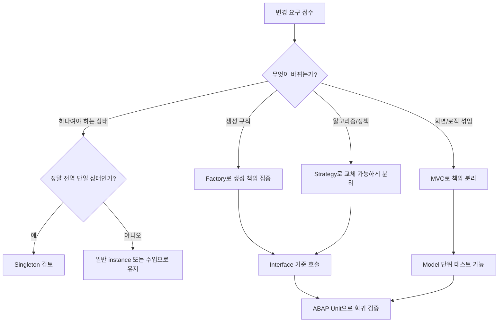

# CH26_REWRITE - OO ABAP 고급 설계와 패턴

> 기준 파일: `content/abap/CH26/_chapter.md`, `content/abap/CH26/CH26-L01.md` ~ `CH26-L05.md`
> 재작업 기준: `reference/codex_0625/00_QUALITY_REVIEW.md`
> 작업 단위: CH26 단일 챕터
> 작성 방향: 패턴 이름 암기가 아니라, 변경 요구가 들어왔을 때 수정 범위를 줄이는 OO 설계 판단력으로 재집필

## CH26의 자리

CH20에서 객체, 클래스, 메서드, 인터페이스, 다형성을 배웠다면 CH26은 그 재료를 "설계 습관"으로 바꾸는 챕터다. 초급 단계에서는 클래스 하나가 잘 실행되면 충분해 보인다. 하지만 프로그램이 커지면 다음 문제가 생긴다.

- 객체 생성 코드가 여기저기 흩어져 종류가 늘 때마다 여러 파일을 고친다.
- 설정, 캐시, 상태 객체가 여러 개 만들어져 어느 값이 진짜인지 모른다.
- 요금 계산, 할인 계산, 배송 계산 같은 분기가 `IF`/`CASE` 사다리로 길어진다.
- 리포트 하나에 조회, 계산, 화면 출력, 이벤트 처리가 섞여 한 줄 고치기가 무섭다.
- DB와 화면에 붙은 코드를 테스트하려면 실제 DB 상태와 화면 조작까지 필요하다.

CH26의 핵심 문장은 다음이다.

> "객체지향 설계 패턴은 멋진 이름을 외우는 것이 아니라, 변경이 들어왔을 때 고쳐야 할 곳을 의도적으로 줄이는 방법이다."

입문자가 반드시 가져가야 할 판단 기준은 세 가지다.

| 질문 | 나쁜 신호 | 설계로 바꾸는 방향 |
|---|---|---|
| 어디서 만들어지는가 | 여러 곳에서 `NEW`가 흩어짐 | Factory로 생성 규칙을 한 곳에 모은다. |
| 상태는 몇 개인가 | 설정/캐시 객체가 여러 개 생김 | Singleton을 검토하되 전역 상태 남용을 경계한다. |
| 무엇이 자주 바뀌는가 | 큰 `CASE` 하나가 계속 커짐 | Strategy와 인터페이스로 바뀌는 알고리즘을 분리한다. |

## R15 / classic-first 경계

- CH26은 CH20 이후이므로 class, method, interface, object reference, polymorphism을 전제로 사용할 수 있다.
- CH26은 CH18/CH19 이후이므로 `DATA(...)`, `NEW #( )`, modern Open SQL `@` 표기는 사용할 수 있다.
- `.project-docs/11_KEYWORD_AUDIT.md` 기준으로 CH26-L01의 `COND #()`는 게이팅 위반으로 `CASE`로 교정된 이력이 있다. v2 예제도 `CASE`/`IF`만 사용한다.
- `VALUE #( ... FOR ... )`, `COND`, `SWITCH`, `REDUCE`, `FILTER` 같은 constructor 식 심화는 CH26의 필수 설명 범위가 아니다.
- RAP의 factory action이나 behavior handler는 ABAP Cloud/RAP 경계 설명으로만 둔다. CH26 본문은 classic OO ABAP 설계 패턴과 ABAP Unit 중심이다.
- GOF 디자인 패턴 전체 목록, SOLID 전체 이론, dependency injection framework, CI/CD 상세는 후속 품질/운영 챕터 범위다.

## 공식 문서 수동 확인 근거

`reference/codex_0625` v1의 CH26에는 클래스/메서드 관련 문서가 반복적으로 붙었지만, 패턴별로 어떤 ABAP 문법 근거가 필요한지 구분되어 있지 않았다. v2에서는 패턴명 자체보다 패턴을 지탱하는 ABAP Objects와 ABAP Unit 문서를 수동으로 확인해 반영한다.

| 주제 | 확인한 로컬 문서 | 강의 반영 |
|---|---|---|
| Class 정의와 visibility | `C:\ABAP_DOCU_HTML\abapclass_definition.htm` | class는 `CLASS ... DEFINITION`으로 선언하고 component는 `PUBLIC/PROTECTED/PRIVATE SECTION`에 둔다는 설명에 반영한다. |
| Instantiability / `CREATE PRIVATE` | `C:\ABAP_DOCU_HTML\abapclass_options.htm` | `CREATE PUBLIC/PROTECTED/PRIVATE`가 어디서 instance를 만들 수 있는지 정한다는 설명, Singleton/Factory 통제에 반영한다. |
| Static attribute | `C:\ABAP_DOCU_HTML\abapclass-data.htm` | `CLASS-DATA`는 instance가 아니라 class 자체에 묶인 static attribute라는 설명에 반영한다. |
| Static method | `C:\ABAP_DOCU_HTML\abapclass-methods_general.htm` | `CLASS-METHODS`는 static method를 선언하며 parameter interface를 가진다는 설명에 반영한다. |
| Instance/functional method | `C:\ABAP_DOCU_HTML\abapmethods_general.htm`, `C:\ABAP_DOCU_HTML\abapmethods_functional.htm` | `METHODS`, `IMPORTING`, `RETURNING VALUE(...)`와 functional method 호출을 예제에 반영한다. |
| Interface 정의 | `C:\ABAP_DOCU_HTML\abapinterface.htm` | interface는 선언부만 있고 implementation part가 없다는 설명에 반영한다. |
| Interface 구현 | `C:\ABAP_DOCU_HTML\abapinterfaces_class.htm` | class가 `INTERFACES`로 interface를 구현하고 `intf~method` 형태로 구현해야 한다는 설명에 반영한다. |
| Object 생성 / `NEW` | `C:\ABAP_DOCU_HTML\abapcreate_object_implicit.htm`, `C:\ABAP_DOCU_HTML\abenconstructor_expression_new.htm` | `CREATE OBJECT`와 `NEW`가 instance를 만든다는 설명, factory/singleton 예제에 반영한다. |
| Method call | `C:\ABAP_DOCU_HTML\abapcall_method_static.htm` | static method call에서 `CALL METHOD`가 더 이상 권장되지 않는다는 주의, `zcl=>method( )` 표기에 반영한다. |
| ABAP Unit | `C:\ABAP_DOCU_HTML\abenabap_unit.htm` | ABAP Unit은 unit test framework이고 local test class/test method/`CL_ABAP_UNIT_ASSERT`를 사용한다는 설명에 반영한다. |
| Test class | `C:\ABAP_DOCU_HTML\abapclass_for_testing.htm` | `CLASS ... DEFINITION FOR TESTING`, `RISK LEVEL`, `DURATION`, test double/helper class 경계에 반영한다. |
| Test method / assert | `C:\ABAP_DOCU_HTML\abapmethods_testing.htm` | `METHODS ... FOR TESTING`, `assert_equals`, production code의 regular exit 주의에 반영한다. |
| ABAP Cloud / released API | `C:\ABAP_DOCU_HTML\abenabap_cloud_glosry.htm`, `abenabap_for_cloud_dev_glosry.htm`, `abenreleased_api_glosry.htm` | ABAP Cloud는 restricted language version, released API, ADT, RAP 중심이라는 경계 설명에 반영한다. |

---

## CH26-L01 - Factory Pattern

### 왜 필요한가

처음 OO를 배울 때는 필요한 곳에서 바로 `NEW zcl_booking_manager( )`를 쓰면 편하다. 예매 관리자 객체가 필요하면 만들고, VIP 예매 객체가 필요하면 또 만든다. 문제는 종류가 늘어나는 순간부터 시작된다.

예를 들어 콘서트 예매에 일반 예매, VIP 예매, 단체 예매가 생겼다고 하자. 프로그램 곳곳에서 다음처럼 직접 생성하고 있으면 요구사항 하나가 여러 파일 수정으로 번진다.

```abap
DATA(lo_booking) = NEW zcl_booking_manager( ).
```

이제 VIP 고객은 `zcl_vip_booking`, 단체 고객은 `zcl_group_booking`을 써야 한다면 어디를 고쳐야 할까? 검색으로 `NEW zcl_booking_manager`를 찾고, 어떤 호출은 일반으로 남기고, 어떤 호출은 VIP로 바꾸고, 어떤 호출은 단체로 바꿔야 한다. 이때 하나라도 빠지면 테스트에서는 우연히 지나가고 운영에서 잘못된 클래스가 만들어진다.

Factory Pattern(팩토리 패턴, 객체 생성 결정을 한 곳에 모으는 설계)은 이 문제를 줄인다. 호출부는 "예매 객체가 필요하다"만 말하고, 구체적으로 어떤 클래스를 만들지는 factory가 결정한다.

### 무엇인가

Factory는 객체 생성 책임을 맡은 클래스 또는 메서드다. 이름이 거창하지만 핵심은 간단하다.

> "직접 `NEW`하지 말고, 생성 규칙을 아는 한 곳에 요청하라."

Factory를 제대로 쓰려면 반환 타입이 중요하다. 구체 클래스 `zcl_vip_booking`을 그대로 반환하면 호출부가 다시 구체 클래스를 알게 된다. 그래서 보통 interface reference를 반환한다.

```abap
INTERFACE zif_booking.
  METHODS describe RETURNING VALUE(rv_text) TYPE string.
ENDINTERFACE.

CLASS zcl_booking_manager DEFINITION.
  PUBLIC SECTION.
    INTERFACES zif_booking.
ENDCLASS.

CLASS zcl_vip_booking DEFINITION.
  PUBLIC SECTION.
    INTERFACES zif_booking.
ENDCLASS.

CLASS zcl_booking_manager IMPLEMENTATION.
  METHOD zif_booking~describe.
    rv_text = '일반 예매'.
  ENDMETHOD.
ENDCLASS.

CLASS zcl_vip_booking IMPLEMENTATION.
  METHOD zif_booking~describe.
    rv_text = 'VIP 예매'.
  ENDMETHOD.
ENDCLASS.

CLASS zcl_booking_factory DEFINITION.
  PUBLIC SECTION.
    CLASS-METHODS create
      IMPORTING iv_type           TYPE string
      RETURNING VALUE(ro_booking) TYPE REF TO zif_booking.
ENDCLASS.

CLASS zcl_booking_factory IMPLEMENTATION.
  METHOD create.
    CASE iv_type.
      WHEN 'V'.
        ro_booking = NEW zcl_vip_booking( ).
      WHEN 'G'.
        ro_booking = NEW zcl_booking_manager( ).
      WHEN OTHERS.
        ro_booking = NEW zcl_booking_manager( ).
    ENDCASE.
  ENDMETHOD.
ENDCLASS.
```

호출부는 이렇게 쓴다.

```abap
DATA(lo_booking) = zcl_booking_factory=>create( iv_type = 'V' ).
DATA(lv_text)    = lo_booking->describe( ).
```

호출부는 `zcl_vip_booking`을 몰라도 된다. 아는 것은 `zif_booking`이라는 약속뿐이다. 이것이 CH20에서 배운 다형성의 실무형 사용이다.

Factory를 쓰면 바뀌는 곳과 안 바뀌는 곳이 나뉜다.

| 변경 요구 | 고치는 곳 | 그대로 두는 곳 |
|---|---|---|
| VIP 예매 클래스 추가 | factory의 `CASE`와 새 class | checkout/report 호출부 |
| 일반 예매 생성자 parameter 변경 | factory 내부 생성 코드 | interface 기준 호출부 |
| 예매 종류 판단 규칙 변경 | factory 내부 판단 로직 | `lo_booking->describe( )` 같은 사용 코드 |

### 어떻게 확인하는가

Factory가 제대로 적용됐는지는 코드가 실행되는지만 보면 부족하다. 다음을 확인해야 한다.

1. 호출부에 `NEW zcl_vip_booking( )`, `NEW zcl_booking_manager( )`가 흩어져 있지 않은가?
2. 호출부 변수 타입이 구체 클래스가 아니라 `TYPE REF TO zif_booking`인가?
3. 타입 값 `'V'`, `'G'`, 기타 값에 대해 factory가 어떤 class를 만드는지 명확한가?
4. 새 예매 종류를 추가했을 때 호출부 수정 없이 factory와 새 class만 추가하면 되는가?
5. 알 수 없는 타입이 들어왔을 때 기본 class로 보낼지, 예외를 던질지 정책이 정해져 있는가?

디버거에서는 `lo_booking`의 dynamic type을 확인한다. static type은 `zif_booking`이지만 runtime object는 `zcl_vip_booking` 또는 `zcl_booking_manager`가 된다. 이 차이를 보는 것이 다형성 체험의 핵심이다.

### 실수와 주의

첫 번째 실수는 factory를 만들고도 우회하는 것이다. 어떤 코드는 `zcl_booking_factory=>create( )`를 쓰고, 어떤 코드는 직접 `NEW zcl_vip_booking( )`를 쓰면 생성 규칙이 둘로 갈라진다. Factory를 도입했다면 "예매 객체 생성은 factory를 통한다"는 팀 규칙까지 같이 있어야 한다.

두 번째 실수는 거대 factory다. 예매, 결제, 할인, 로그, 메일 객체 생성이 모두 한 factory에 들어가면 factory가 새로운 잡동사니 창고가 된다. 업무 영역별 factory를 나누거나, Strategy 선택과 Factory 생성을 분리해야 한다.

세 번째 실수는 factory 안에 업무 로직까지 넣는 것이다. Factory는 생성 규칙을 맡는다. 예매 가능 좌석 계산, 결제 승인, 환불 정책 같은 업무 동작은 생성된 객체의 책임이다.

네 번째 실수는 알 수 없는 타입을 조용히 기본값으로 보내는 것이다. 교육 예제에서는 `OTHERS`를 일반 예매로 보낼 수 있지만, 실무에서는 잘못된 코드 값이 들어온 사실을 숨길 수 있다. 타입 코드가 customizing이나 DDIC check table에서 온다면 유효성 검사를 먼저 해야 한다.

### 체험형 학습 설계

기존 embed를 사용한다.

`::embed CH26-L01-S01 | Factory 시뮬 - 타입 -> 구체 클래스 | 380::`

체험 목표는 "타입을 바꾸면 생성되는 class는 바뀌지만 호출부 코드는 그대로"라는 사실을 눈으로 확인하는 것이다.

| UI 요소 | 상태 | 피드백 |
|---|---|---|
| type 버튼 | `'V'`, `'G'`, `'Z'` | 사용자가 factory에 넘기는 입력값이다. |
| 호출부 코드 영역 | `zcl_booking_factory=>create( type )` | 어떤 버튼을 눌러도 호출부 한 줄은 변하지 않는다. |
| 생성 결과 카드 | `zcl_vip_booking`, `zcl_booking_manager`, 기본 처리 | factory 내부 `CASE`가 어떤 class를 골랐는지 보여 준다. |
| interface 표시 | `TYPE REF TO zif_booking` | 호출부가 구체 class가 아니라 약속을 보고 있음을 강조한다. |
| 경고 메시지 | 알 수 없는 타입 `'Z'` | 기본 class로 보낼지 오류로 볼지 설계 정책을 묻는다. |

진행 라운드:

1. `'V'`를 선택한다. 생성 결과가 `zcl_vip_booking`으로 바뀐다.
2. `'G'`를 선택한다. 호출부 코드는 그대로인데 결과만 일반 class로 바뀐다.
3. `'Z'`를 선택한다. "알 수 없는 타입을 기본 처리할 것인가, 오류 처리할 것인가"를 토론한다.
4. 새 타입 `'B'`를 추가한다고 가정한다. 고칠 파일이 factory와 새 class뿐인지 표시한다.

### 정리

- Factory는 객체 생성 규칙을 한 곳에 모으는 패턴이다.
- 호출부는 구체 class가 아니라 interface를 보고 일한다.
- 새 종류가 추가될 때 호출부 변경을 줄이는 것이 목적이다.
- Factory를 도입했다면 직접 `NEW`로 우회하지 않게 팀 규칙을 세운다.
- Factory가 업무 로직까지 삼키면 과설계가 되므로 생성 책임과 업무 책임을 분리한다.

---

## CH26-L02 - Singleton Pattern

### 왜 필요한가

어떤 객체는 여러 개 있어도 된다. 예매 한 건을 다루는 객체는 예매마다 여러 개 생길 수 있다. 하지만 어떤 객체는 여러 개 생기면 오히려 위험하다. 예를 들어 프로그램 설정, 간단한 runtime cache, feature toggle 상태처럼 "한 프로그램 흐름에서 하나의 기준"으로 보아야 하는 값이 있다.

다음 상황을 생각해 보자.

1. A 루틴이 설정 객체를 `NEW zcl_config( )`로 만든다.
2. B 루틴도 설정 객체를 `NEW zcl_config( )`로 만든다.
3. A가 `currency = 'KRW'`로 바꾼다.
4. B는 자신이 만든 다른 instance를 보고 아직 `currency = 'USD'`라고 판단한다.

두 객체가 모두 "설정"이라는 이름을 갖고 있지만 상태는 다르다. 개발자는 어느 값이 진짜인지 추적해야 한다. Singleton Pattern(싱글턴 패턴, instance를 하나로 통제하는 설계)은 이런 상태 분산을 막기 위해 사용한다.

### 무엇인가

Singleton의 기본 구조는 세 가지다.

| 요소 | 역할 |
|---|---|
| `CREATE PRIVATE` | 외부에서 직접 `NEW`하지 못하게 막는다. |
| `CLASS-DATA go_instance` | class 자체에 하나의 reference를 보관한다. |
| `CLASS-METHODS get_instance` | 외부가 instance를 얻는 유일한 입구가 된다. |

예제는 다음과 같다.

```abap
CLASS zcl_config DEFINITION CREATE PRIVATE.
  PUBLIC SECTION.
    CLASS-METHODS get_instance
      RETURNING VALUE(ro_config) TYPE REF TO zcl_config.

    METHODS get_currency
      RETURNING VALUE(rv_currency) TYPE waers.

  PRIVATE SECTION.
    CLASS-DATA go_instance TYPE REF TO zcl_config.
    DATA gv_currency TYPE waers VALUE 'KRW'.
ENDCLASS.

CLASS zcl_config IMPLEMENTATION.
  METHOD get_instance.
    IF go_instance IS INITIAL.
      go_instance = NEW #( ).
    ENDIF.

    ro_config = go_instance.
  ENDMETHOD.

  METHOD get_currency.
    rv_currency = gv_currency.
  ENDMETHOD.
ENDCLASS.
```

사용자는 직접 생성하지 않는다.

```abap
DATA(lo_config_1) = zcl_config=>get_instance( ).
DATA(lo_config_2) = zcl_config=>get_instance( ).

IF lo_config_1 = lo_config_2.
  " 두 reference는 같은 instance를 가리킨다.
ENDIF.
```

공식 문서 관점으로 보면 `CREATE PRIVATE`는 class 자체 또는 friend만 instance를 만들 수 있게 한다. `CLASS-DATA`는 instance가 아니라 class에 묶인 static attribute다. 그래서 `go_instance`는 "모든 호출이 공유하는 보관함" 역할을 한다.

### 어떻게 확인하는가

Singleton 확인은 값 확인보다 reference 확인이 먼저다.

1. `zcl_config=>get_instance( )`를 처음 호출한다.
2. `go_instance IS INITIAL`이므로 `NEW #( )`가 실행된다.
3. 두 번째 호출에서는 `go_instance`가 이미 bound 상태라 새로 만들지 않는다.
4. `lo_config_1 = lo_config_2` 비교가 true인지 확인한다.
5. 외부에서 `NEW zcl_config( )`를 시도하면 `CREATE PRIVATE` 때문에 허용되지 않아야 한다.

디버거에서는 `go_instance`가 언제 처음 채워지는지, 이후 호출에서 같은 reference가 반환되는지 본다. 단순히 `get_currency( )` 값이 같다고 Singleton이 검증된 것은 아니다. 서로 다른 instance가 같은 초기값을 가질 수도 있기 때문이다.

### 실수와 주의

첫 번째 실수는 `CREATE PRIVATE`를 빼먹는 것이다. `get_instance( )`를 만들어도 외부에서 `NEW zcl_config( )`가 가능하면 "하나만"이라는 보장이 깨진다.

두 번째 실수는 Singleton을 전역 변수처럼 남용하는 것이다. 어디서나 접근할 수 있는 상태는 편하지만, 테스트와 병렬 실행을 어렵게 한다. 특히 사용자별 상태, 요청별 상태, 트랜잭션별 상태를 Singleton에 넣으면 다른 사용자나 다른 실행 흐름과 섞일 수 있다.

세 번째 실수는 Singleton을 모든 service class의 기본값으로 쓰는 것이다. "하나만 있으면 편하다"와 "하나만 있어야 한다"는 다르다. Singleton은 반드시 하나여야 하는 상태나 비용 큰 공유 자원을 다룰 때만 검토한다.

네 번째 실수는 테스트를 생각하지 않는 것이다. Singleton은 한 번 만들어진 상태가 테스트 사이에 남을 수 있다. 테스트가 필요한 class라면 reset hook, interface 분리, 생성자 주입 같은 대안을 고민해야 한다. CH26-L05에서 이 문제를 다시 회수한다.

### 체험형 학습 설계

기존 embed를 사용한다.

`::embed CH26-L02-S01 | Singleton 시뮬 - 같은 인스턴스 vs 매번 새로 | 400::`

체험 목표는 `get_instance( )`와 `NEW`의 차이를 reference 개수와 주소 감각으로 보여 주는 것이다.

| UI 요소 | 상태 | 피드백 |
|---|---|---|
| `get_instance( )` 버튼 | 누를 때마다 호출 횟수 증가 | instance count는 1에서 더 늘지 않는다. |
| `NEW zcl_config( )` 버튼 | 누를 때마다 새 reference 생성 | instance count가 계속 증가한다. |
| reference 목록 | `#CFG-001` 같은 표시 | Singleton 쪽은 같은 값이 반복되고, NEW 쪽은 매번 달라진다. |
| `CREATE PRIVATE` 토글 | 켜짐/꺼짐 | 꺼지면 외부 NEW가 가능해져 Singleton 보장이 깨진다. |
| reset 버튼 | 시뮬레이터 초기화 | 테스트 간 상태 누수를 설명하는 연결점으로 사용한다. |

진행 라운드:

1. `get_instance( )`를 세 번 누른다. 모두 같은 reference임을 확인한다.
2. `NEW`를 세 번 누른다. 매번 다른 reference임을 확인한다.
3. `CREATE PRIVATE`가 없으면 어떤 일이 생기는지 비교한다.
4. "사용자별 장바구니 상태를 Singleton에 넣어도 되는가?"를 질문한다. 정답은 보통 아니다. 사용자별 상태는 사용자/session/request 범위가 필요하다.

### 정리

- Singleton은 instance를 하나로 통제하는 패턴이다.
- `CREATE PRIVATE`, `CLASS-DATA`, `get_instance( )`가 기본 구조다.
- 반드시 하나여야 하는 설정/캐시 성격에만 조심해서 사용한다.
- 전역 상태 남용은 테스트, 동시성, 사용자별 상태 분리를 어렵게 한다.
- Singleton이 테스트를 어렵게 만들면 interface 분리와 의존성 주입을 검토한다.

---

## CH26-L03 - Strategy Pattern

### 왜 필요한가

요금 계산은 처음에는 단순하다. 좌석 수에 단가를 곱하면 된다. 그러다 요구사항이 늘어난다.

- VIP는 50% 할증한다.
- 조기예매는 20% 할인한다.
- 학생은 30% 할인한다.
- 특정 공연은 주말 요금제를 쓴다.

이 모든 조건을 checkout 메서드 안에 넣으면 다음처럼 커진다.

```abap
CASE iv_price_type.
  WHEN 'STD'.
    rv_price = iv_seats * 100.
  WHEN 'VIP'.
    rv_price = iv_seats * 150.
  WHEN 'EARLY'.
    rv_price = iv_seats * 80.
  WHEN OTHERS.
    rv_price = iv_seats * 100.
ENDCASE.
```

처음에는 괜찮다. 하지만 정책이 계속 늘면 checkout은 결제 흐름인지 요금 정책 모음인지 알 수 없는 코드가 된다. 새 정책 하나를 추가할 때마다 이미 안정된 checkout 코드를 열어야 하고, 잘못 고치면 기존 정책까지 깨진다.

Strategy Pattern(전략 패턴, 바뀌는 알고리즘을 같은 interface의 여러 구현으로 분리하는 설계)은 이 문제를 줄인다.

### 무엇인가

Strategy의 핵심은 "호출부는 같은 메서드를 호출하고, 실제 계산 방식은 주입된 객체가 결정한다"이다.

먼저 모든 요금 전략이 지킬 interface를 만든다.

```abap
INTERFACE zif_price_strategy.
  METHODS calc
    IMPORTING iv_seats        TYPE i
    RETURNING VALUE(rv_price) TYPE i.
ENDINTERFACE.
```

각 정책은 별도 class가 된다.

```abap
CLASS zcl_price_standard DEFINITION.
  PUBLIC SECTION.
    INTERFACES zif_price_strategy.
ENDCLASS.

CLASS zcl_price_standard IMPLEMENTATION.
  METHOD zif_price_strategy~calc.
    rv_price = iv_seats * 100.
  ENDMETHOD.
ENDCLASS.

CLASS zcl_price_vip DEFINITION.
  PUBLIC SECTION.
    INTERFACES zif_price_strategy.
ENDCLASS.

CLASS zcl_price_vip IMPLEMENTATION.
  METHOD zif_price_strategy~calc.
    rv_price = iv_seats * 150.
  ENDMETHOD.
ENDCLASS.
```

Checkout class는 구체 정책을 모른다. interface만 안다.

```abap
CLASS zcl_checkout DEFINITION.
  PUBLIC SECTION.
    METHODS constructor
      IMPORTING io_strategy TYPE REF TO zif_price_strategy.

    METHODS checkout
      IMPORTING iv_seats        TYPE i
      RETURNING VALUE(rv_price) TYPE p.

  PRIVATE SECTION.
    DATA mo_strategy TYPE REF TO zif_price_strategy.
ENDCLASS.

CLASS zcl_checkout IMPLEMENTATION.
  METHOD constructor.
    mo_strategy = io_strategy.
  ENDMETHOD.

  METHOD checkout.
    rv_price = mo_strategy->calc( iv_seats = iv_seats ).
  ENDMETHOD.
ENDCLASS.
```

이 구조에서는 새 정책이 생겼을 때 checkout을 고치지 않는다. 새 전략 class를 추가하고, 어디선가 어떤 전략을 넣을지만 결정한다. 전략 선택은 L01의 Factory와 연결할 수 있다.

### 어떻게 확인하는가

Strategy가 제대로 적용됐는지는 다음 질문으로 확인한다.

1. checkout 메서드 안에 요금 정책별 큰 `CASE`가 남아 있는가?
2. checkout은 `zif_price_strategy`만 알고 구체 class 이름을 모르는가?
3. 새 정책 추가 시 기존 checkout class를 수정하지 않아도 되는가?
4. 각 strategy class는 한 가지 계산 방식만 갖고 있는가?
5. 같은 `iv_seats = 2`에 대해 standard/vip/early 전략을 바꿨을 때 결과만 달라지는가?

디버거에서는 `mo_strategy`의 static type과 dynamic type을 본다. static type은 `zif_price_strategy`다. 하지만 runtime에는 `zcl_price_standard`, `zcl_price_vip`, `zcl_price_early` 중 하나가 들어간다. 호출 코드는 항상 `mo_strategy->calc( )` 한 줄이다.

### 실수와 주의

첫 번째 실수는 strategy 내부에 다시 큰 분기를 넣는 것이다. `zcl_price_vip` 안에서 또 일반/VIP/학생을 `CASE`로 나누면 전략 분리가 깨진다. 한 strategy는 한 계산 방식만 맡는다.

두 번째 실수는 전략이 너무 이른 것이다. 정책이 하나뿐이고 늘 가능성이 낮다면 interface와 class를 여러 개 만들 필요가 없다. 패턴은 미래를 예언하는 도구가 아니라, 실제 변화 압력을 관리하는 도구다.

세 번째 실수는 strategy 선택 책임과 실행 책임을 섞는 것이다. Checkout이 "VIP면 이 class, 조기예매면 저 class"까지 직접 판단하면 checkout이 다시 정책 목록을 알게 된다. 선택은 Factory나 설정, 실행은 Strategy로 나누는 편이 깔끔하다.

네 번째 실수는 DB 조회, 메시지 출력, 화면 변경을 strategy에 넣는 것이다. 요금 strategy는 계산을 맡는다. 화면 메시지는 controller/view 쪽, DB 조회는 repository/model 쪽으로 분리해야 테스트하기 쉽다.

### 체험형 학습 설계

기존 embed를 사용한다.

`::embed CH26-L03-S01 | Strategy 시뮬 - 전략 교체와 가격 | 380::`

체험 목표는 "호출부는 그대로인데 주입된 전략 class만 바뀌어 결과가 달라진다"를 확인하는 것이다.

| UI 요소 | 상태 | 피드백 |
|---|---|---|
| 전략 버튼 | 일반, VIP, 조기예매 | `mo_strategy`에 들어가는 dynamic type을 바꾼다. |
| 좌석 수 입력 | 1~99 | 같은 strategy에서 입력값만 바꾼다. |
| 호출부 코드 영역 | `mo_strategy->calc( iv_seats = ... )` | 전략을 바꿔도 이 코드는 변하지 않는다. |
| 결과 영역 | class 이름, 계산식, 가격 | 어떤 strategy가 어떤 계산을 수행했는지 보여 준다. |
| 새 정책 추가 카드 | 학생 할인 | 새 class 추가만으로 확장되는지 묻는다. |

진행 라운드:

1. 좌석 수 2, 일반 전략을 선택해 가격을 확인한다.
2. 좌석 수는 그대로 두고 VIP 전략으로 바꾼다. 호출부는 그대로인데 가격만 바뀐다.
3. 조기예매 전략으로 바꾼다. 같은 `calc` 호출이 다른 알고리즘을 실행한다.
4. 학생 할인 정책을 추가한다면 checkout을 고칠지, 새 strategy class를 만들지 판단하게 한다.

### 정리

- Strategy는 바뀌는 알고리즘을 interface 구현 class로 분리하는 패턴이다.
- 호출부는 interface만 알고, 실제 계산은 주입된 strategy가 맡는다.
- 새 정책 추가 시 기존 checkout 코드를 덜 건드리는 것이 목적이다.
- 전략 내부에 다시 큰 분기를 넣으면 패턴의 효과가 사라진다.
- 정책이 거의 바뀌지 않는 작은 코드에는 Strategy가 과할 수 있다.

---

## CH26-L04 - MVC 기반 Report 구조화

### 왜 필요한가

전통적인 ABAP Report는 빠르게 만들 수 있다. `PARAMETERS`, `SELECT`, 계산, `WRITE` 또는 ALV 표시를 한 파일에 순서대로 적으면 된다. 작은 보고서는 이 방식이 가장 실용적이다. 문제는 보고서가 커질 때다.

예매 현황 리포트에 다음 기능이 붙는다고 하자.

- 공연별 조회 조건
- 예매 잔여석 계산
- 취소/확정 상태별 색상
- 더블클릭 이벤트
- 엑셀 다운로드
- 권한별 버튼 제어

조회 SQL, 계산, 화면 표시, 이벤트 처리, 메시지 처리가 한 report에 섞이면 수정 영향 범위를 알기 어렵다. 화면만 바꾸려는데 계산이 깨지고, 계산만 바꾸려는데 ALV 이벤트가 깨진다.

MVC(Model-View-Controller, 데이터/로직·표시·흐름을 나누는 구조)는 이 섞임을 줄이는 방법이다.

### 무엇인가

MVC를 ABAP Report에 그대로 번역하면 다음처럼 볼 수 있다.

| 계층 | 책임 | ABAP 예시 |
|---|---|---|
| Model | 데이터 조회와 업무 계산 | `zcl_booking_model->get_bookings( )`, `remaining( )` |
| View | 화면 표시 | ALV display, list output, screen field update |
| Controller | 사용자 요청 흐름 조율 | selection parameter 수집, Model 호출, View 갱신 |

간단한 구조는 다음처럼 잡을 수 있다.

```abap
CLASS zcl_booking_model DEFINITION.
  PUBLIC SECTION.
    METHODS constructor
      IMPORTING iv_concert TYPE zconcert_id.

    METHODS get_bookings
      RETURNING VALUE(rt_bookings) TYPE ztt_booking.

  PRIVATE SECTION.
    DATA mv_concert TYPE zconcert_id.
ENDCLASS.

CLASS zcl_booking_view DEFINITION.
  PUBLIC SECTION.
    METHODS display
      IMPORTING it_bookings TYPE ztt_booking.
ENDCLASS.

CLASS zcl_booking_controller DEFINITION.
  PUBLIC SECTION.
    METHODS run.
ENDCLASS.
```

Controller는 조율한다.

```abap
CLASS zcl_booking_controller IMPLEMENTATION.
  METHOD run.
    DATA(lo_model) = NEW zcl_booking_model( iv_concert = p_concert ).
    DATA(lt_bookings) = lo_model->get_bookings( ).

    DATA(lo_view) = NEW zcl_booking_view( ).
    lo_view->display( it_bookings = lt_bookings ).
  ENDMETHOD.
ENDCLASS.
```

이 코드에서 중요한 것은 class 이름이 아니다. "조회/계산은 Model, 표시 방법은 View, 실행 순서는 Controller"라는 책임 분리다.

### 어떻게 확인하는가

MVC 구조가 맞는지는 변경 시나리오로 확인한다.

| 변경 요구 | 바뀌어야 하는 곳 | 바뀌면 의심할 곳 |
|---|---|---|
| ALV를 list 출력으로 바꿈 | View | Model SQL |
| 잔여석 계산식 변경 | Model | View 표시 코드 |
| 버튼 클릭 시 재조회 추가 | Controller | Model 계산식 |
| 조회 조건 parameter 추가 | Controller와 Model interface | View 내부 계산 |

코드 리뷰에서는 다음을 본다.

1. Model class 안에 `WRITE`, ALV display, screen update가 있는가?
2. View class 안에서 직접 DB `SELECT`를 하고 있는가?
3. Controller가 계산 세부 로직까지 많이 알고 있는가?
4. Model만 따로 ABAP Unit으로 테스트할 수 있는가?
5. 작은 리포트인데 class가 지나치게 많아 오히려 읽기 어려운가?

MVC는 무조건 class 세 개를 만드는 규칙이 아니다. 변경 압력이 커져 역할을 분리해야 할 때 쓰는 구조화 방법이다.

### 실수와 주의

첫 번째 실수는 Model에 화면 코드를 넣는 것이다. Model이 ALV field catalog, color, screen message를 알기 시작하면 View와 다시 붙어 버린다. Model은 가능하면 순수한 데이터와 업무 규칙을 반환한다.

두 번째 실수는 View에서 DB를 읽는 것이다. View는 표시를 맡는다. 표시 중에 DB를 다시 읽으면 "화면을 바꿨을 뿐인데 조회 결과가 달라지는" 이상한 구조가 된다.

세 번째 실수는 Controller가 모든 것을 다 아는 것이다. Controller는 흐름을 조율하지만, 계산식의 세부까지 가지면 Model의 의미가 줄어든다.

네 번째 실수는 작은 리포트까지 기계적으로 MVC를 적용하는 것이다. 30줄짜리 일회성 조회 리포트에 class 세 개를 만들면 학습자에게 구조화가 아니라 의식 행위처럼 보인다. 기준은 "변경이 예상되는가, 테스트가 필요한가, 화면/로직이 섞여 고통이 생겼는가"이다.

### 체험형 학습 설계

기존 embed를 사용한다.

`::embed CH26-L04-S01 | MVC 영향 범위 시각화 | 540::`

체험 목표는 "한 계층을 바꾸면 어디까지 영향이 가야 정상인가"를 판단하게 하는 것이다.

| UI 요소 | 상태 | 피드백 |
|---|---|---|
| 변경 시나리오 버튼 | 화면 교체, 로직 변경, 흐름 추가 | 사용자가 변경 요구를 선택한다. |
| MVC 다이어그램 | Model/View/Controller node | 바뀌어야 할 계층만 강조한다. |
| 영향 badge | 변경, 유지 | 어떤 class가 수정 대상인지 표시한다. |
| 메시지 영역 | 이유 설명 | "화면 교체는 View 변경, Model 유지"처럼 판단 근거를 보여 준다. |
| 과분리 경고 | 작은 리포트 시나리오 | MVC가 항상 정답은 아님을 보여 준다. |

진행 라운드:

1. `화면 교체`를 누른다. View만 강조되어야 한다.
2. `로직 변경`을 누른다. Model이 강조되고 View는 유지되어야 한다.
3. `흐름 추가`를 누른다. Controller가 강조된다.
4. "이 변경에서 다른 계층까지 고쳐야 한다면 어떤 냄새인가?"를 묻는다.

### 정리

- MVC는 Model, View, Controller의 책임을 나누는 구조화 방법이다.
- Model은 데이터와 업무 로직, View는 표시, Controller는 흐름 조율을 맡는다.
- 변경 요구별로 수정 범위가 예측 가능해지는 것이 핵심이다.
- Model에 화면 코드, View에 DB 조회가 들어가면 분리가 깨진다.
- 작은 리포트에는 과분리일 수 있으므로 변경 압력과 테스트 필요성으로 판단한다.

---

## CH26-L05 - Testable Class 설계와 ABAP Unit

### 왜 필요한가

패턴을 적용해도 검증할 수 없으면 유지보수는 여전히 불안하다. 특히 DB와 화면에 직접 붙어 있는 코드는 자동 테스트가 어렵다.

다음 메서드를 생각해 보자.

```abap
METHOD remaining.
  SELECT SINGLE seats_total, seats_used
    FROM zbooking
    WHERE booking_id = @iv_booking_id
    INTO @DATA(ls_booking).

  rv_remaining = ls_booking-seats_total - ls_booking-seats_used.
ENDMETHOD.
```

이 코드를 테스트하려면 실제 `ZBOOKING`에 데이터가 있어야 한다. 테스트가 다른 개발자 데이터나 QA 데이터에 영향을 받을 수 있고, DB가 비어 있으면 실패한다. 게다가 계산 로직만 확인하고 싶은데 DB 준비가 더 큰 일이 된다.

Testable Class(테스트 가능한 클래스)는 계산 로직과 외부 의존성(DB, 화면, 파일, 네트워크)을 분리한다. ABAP Unit은 그 로직을 자동으로 실행하고 기대값과 실제값을 비교해 주는 단위 테스트 도구다.

### 무엇인가

핵심은 의존성 주입이다. 의존성 주입(Dependency Injection, 필요한 외부 객체를 class 내부에서 직접 만들지 않고 밖에서 넣어 주는 설계)은 테스트에서 실제 DB 접근 객체 대신 가짜 객체를 넣을 수 있게 한다.

먼저 DB 접근을 interface로 분리한다.

```abap
INTERFACE zif_booking_repo.
  METHODS get_booking
    IMPORTING iv_booking_id      TYPE zbooking_id
    RETURNING VALUE(rs_booking) TYPE zbooking.
ENDINTERFACE.
```

업무 class는 구체 DB class를 직접 만들지 않고 interface를 받는다.

```abap
CLASS zcl_booking_manager DEFINITION.
  PUBLIC SECTION.
    METHODS constructor
      IMPORTING io_repo TYPE REF TO zif_booking_repo.

    METHODS remaining
      IMPORTING iv_booking_id         TYPE zbooking_id
      RETURNING VALUE(rv_remaining)  TYPE i.

  PRIVATE SECTION.
    DATA mo_repo TYPE REF TO zif_booking_repo.
ENDCLASS.

CLASS zcl_booking_manager IMPLEMENTATION.
  METHOD constructor.
    mo_repo = io_repo.
  ENDMETHOD.

  METHOD remaining.
    DATA(ls_booking) = mo_repo->get_booking( iv_booking_id = iv_booking_id ).
    rv_remaining = ls_booking-seats_total - ls_booking-seats_used.
  ENDMETHOD.
ENDCLASS.
```

테스트에서는 DB 대신 Mock(목, 테스트용 가짜 구현)을 넣는다.

```abap
CLASS ltd_booking_repo DEFINITION FOR TESTING.
  PUBLIC SECTION.
    INTERFACES zif_booking_repo.
ENDCLASS.

CLASS ltd_booking_repo IMPLEMENTATION.
  METHOD zif_booking_repo~get_booking.
    rs_booking-booking_id  = iv_booking_id.
    rs_booking-seats_total = 100.
    rs_booking-seats_used  = 50.
  ENDMETHOD.
ENDCLASS.
```

ABAP Unit 테스트 class는 이렇게 쓴다.

```abap
CLASS ltcl_booking_manager DEFINITION
  FOR TESTING
  RISK LEVEL HARMLESS
  DURATION SHORT.

  PRIVATE SECTION.
    METHODS remaining_calc FOR TESTING.
ENDCLASS.

CLASS ltcl_booking_manager IMPLEMENTATION.
  METHOD remaining_calc.
    DATA(lo_manager) = NEW zcl_booking_manager(
      io_repo = NEW ltd_booking_repo( ) ).

    DATA(lv_remaining) = lo_manager->remaining( iv_booking_id = '1001' ).

    cl_abap_unit_assert=>assert_equals(
      act = lv_remaining
      exp = 50 ).
  ENDMETHOD.
ENDCLASS.
```

공식 문서 기준으로 ABAP Unit은 unit test framework이고, test class는 `CLASS ... DEFINITION FOR TESTING`, test method는 `METHODS ... FOR TESTING`으로 정의한다. `CL_ABAP_UNIT_ASSERT`의 assert 메서드로 실제값과 기대값을 비교한다.

### 어떻게 확인하는가

테스트 가능한 설계인지 확인하는 질문은 명확하다.

1. 업무 class가 내부에서 직접 `SELECT`를 실행하는가, 아니면 repository interface를 호출하는가?
2. 테스트에서 실제 DB 없이 `remaining( )` 결과를 검증할 수 있는가?
3. test class가 `FOR TESTING`, test method가 `FOR TESTING`으로 선언되어 있는가?
4. `RISK LEVEL HARMLESS`, `DURATION SHORT`가 실제 테스트 성격과 맞는가?
5. 버그를 일부러 넣었을 때 테스트가 빨간색으로 실패하는가?

ABAP Unit 실행 결과는 초록색 통과만 보면 안 된다. 좋은 테스트는 실패해야 할 때 실패한다. 그래서 교육에서는 `rv_remaining = seats_total - seats_used`를 잠시 `seats_total + seats_used`로 바꾸는 버그 주입을 해 본다. 테스트가 실패하면 테스트가 계산 로직을 실제로 감시하고 있다는 뜻이다.

### 실수와 주의

첫 번째 실수는 DB를 직접 읽는 class를 그대로 두고 테스트만 억지로 붙이는 것이다. 이렇게 하면 테스트가 데이터 준비에 의존하고 느려진다. 먼저 의존성을 interface로 분리해야 한다.

두 번째 실수는 Mock이 실제 구현보다 더 복잡해지는 것이다. Mock은 테스트 목적에 필요한 값만 반환해야 한다. 운영 DB 접근의 모든 기능을 흉내 내기 시작하면 또 하나의 유지보수 대상이 된다.

세 번째 실수는 테스트가 구현 세부를 너무 많이 아는 것이다. `remaining( )`의 결과가 50인지 검증하면 충분한데, 내부에서 어떤 local variable을 썼는지까지 검증하려 하면 리팩터링이 어려워진다.

네 번째 실수는 Singleton과 static 상태를 테스트에서 방치하는 것이다. 이전 테스트가 바꾼 static 상태가 다음 테스트에 남으면 테스트 순서에 따라 결과가 달라진다. 테스트 대상 class는 가능하면 생성자 주입으로 필요한 의존성을 명시한다.

다섯 번째 실수는 ABAP Unit을 "테스트 담당자 일"로 보는 것이다. 단위 테스트는 설계 피드백이다. 테스트하기 어렵다면 class가 외부 의존성과 너무 붙어 있다는 신호일 수 있다.

### 체험형 학습 설계

기존 embed를 사용한다.

`::embed CH26-L05-S01 | ABAP Unit 러너 - 통과/실패와 버그 감지 | 420::`

체험 목표는 "테스트가 초록색으로 통과하는 것"뿐 아니라 "버그를 넣으면 빨간색으로 실패하는 것"까지 보여 주는 것이다.

| UI 요소 | 상태 | 피드백 |
|---|---|---|
| 테스트 실행 버튼 | `테스트 실행 (F8)` | `remaining_calc` 테스트를 실행한다. |
| 버그 주입 토글 | 꺼짐/켜짐 | 꺼짐은 정상 계산, 켜짐은 잘못된 계산을 반환한다. |
| 테스트 목록 | `ltcl_booking_manager->remaining_calc` | test class와 test method 구조를 시각화한다. |
| assert 결과 | `act`, `exp`, 성공/실패 | 실제값과 기대값을 나란히 보여 준다. |
| Mock 표시 | DB는 Mock | 실제 DB 없이 테스트했다는 점을 강조한다. |

진행 라운드:

1. 버그 주입을 끄고 테스트를 실행한다. `act = 50`, `exp = 50`으로 통과한다.
2. 버그 주입을 켜고 다시 실행한다. `act`가 달라져 실패한다.
3. "이 실패가 운영 전에 발견되었다면 어떤 비용을 줄였는가?"를 묻는다.
4. 실제 DB를 쓰는 테스트와 Mock을 쓰는 테스트의 차이를 비교한다.

### 정리

- 테스트 가능한 설계는 외부 의존성을 분리하는 데서 시작한다.
- 업무 class가 DB class를 직접 만들지 않고 interface를 주입받으면 Mock으로 교체할 수 있다.
- ABAP Unit은 `FOR TESTING` class와 test method, `CL_ABAP_UNIT_ASSERT`로 결과를 검증한다.
- 좋은 테스트는 정상일 때 통과하고, 버그를 넣으면 실패한다.
- Factory, Strategy, MVC는 결국 테스트 가능한 구조로 이어져야 가치가 크다.

---

## 챕터 마무리 실습

### 실습 목표

예매 로직을 CH26의 네 가지 설계 판단으로 정리한다.

### 요구사항

1. 일반/VIP 예매 객체 생성을 `zcl_booking_factory=>create( )`로 모은다.
2. 설정 객체가 정말 하나만 필요하다면 `CREATE PRIVATE`와 `get_instance( )`로 Singleton을 만든다. 사용자별 상태는 Singleton에 넣지 않는다.
3. 요금 계산을 `zif_price_strategy`와 strategy class로 분리한다.
4. 리포트는 Model/View/Controller 책임으로 나누되, 작은 리포트라면 과분리를 피한다.
5. `remaining( )` 계산은 repository interface를 주입받게 만들고, ABAP Unit에서 Mock repository로 테스트한다.

### 모범 사고 흐름



### 학습자가 설명해야 할 문장

- "Factory는 `NEW`를 숨기는 장식이 아니라 생성 규칙 변경을 한 곳으로 모으는 설계다."
- "Singleton은 하나만 있으면 편한 객체가 아니라 하나만 있어야 하는 객체에 제한적으로 쓴다."
- "Strategy는 자주 바뀌는 알고리즘을 interface 구현으로 분리해 호출부 변경을 줄인다."
- "MVC는 class 세 개를 무조건 만드는 규칙이 아니라 변경 영향 범위를 예측 가능하게 만드는 책임 분리다."
- "ABAP Unit을 잘 쓰려면 먼저 DB/화면 같은 의존성을 분리해야 한다."
- "ABAP Cloud에서는 restricted language version과 released API 경계를 확인하고, classic report 설계를 그대로 Cloud-ready라고 말하지 않는다."
