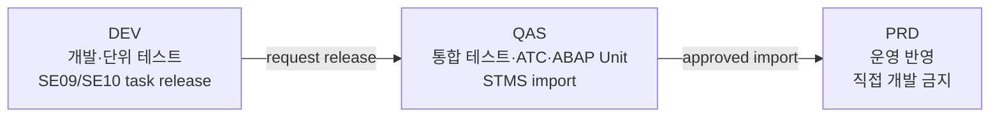

# CH35_REWRITE - 운영 품질과 배포 관리

> 기준 자료: `content/abap/CH35`, `reference/codex_0625/CH35_운영-품질과-배포-관리-이송-심화.md`, `reference/codex_0625/00_QUALITY_REVIEW.md`
> 재집필 목표: ATC, ABAP Unit, Transport, Background Job, Application Log를 따로 외우는 장이 아니라, 개발 완료 코드가 운영에 들어가도 되는지 판단하고 운영 장애를 추적하는 전체 품질 게이트로 이해하게 만든다.
> Classic-first 경계: CH35는 Track 2 후반이다. CH18 modern ABAP, CH19 modern ABAP SQL, CH20 OO, CH23 예외/품질 기초, CH24 배치·로그 기초, CH26 테스트 기초 이후의 운영 품질 장이다. ABAP Cloud에서는 released API, language version, ATC cloud readiness, ADT 중심 제약을 별도로 확인해야 하며, 이 장의 기본 설명은 Classic ABAP 운영 현장을 먼저 기준으로 둔다.

## CH35 전체 강의 지도

개발자가 "개발이 끝났다"고 말하는 순간과 운영팀이 "운영에 올려도 된다"고 판단하는 순간은 다르다. 프로그램이 문법 오류 없이 활성화되었다고 해서 운영 안전성이 확보되는 것은 아니다. 성능 경고가 남아 있을 수 있고, 수정 중 기존 기능이 깨졌을 수 있으며, 이송 순서가 틀려 품질 시스템에서 덤프가 날 수 있다. 야간 배치가 실패했는데 로그가 없으면 다음 날 업무 담당자는 무엇이 실패했는지 알 수 없다.

CH35는 이 간극을 메운다. 관통 예제는 공연 예매 정산 기능이다. 개발자는 정산 로직을 수정하고, ABAP Unit으로 회귀를 막고, ATC로 정적 품질을 확인하고, 이송 요청을 DEV에서 QAS와 PRD로 넘긴다. 야간 정산은 background job으로 실행되고, 실패 원인은 Application Log에서 찾는다. 이 흐름이 잡히면 "코드 작성자"에서 "운영 가능한 ABAP 개발자"로 관점이 바뀐다.

| 레슨 | 주제 | 학습자가 얻어야 할 판단 | 대표 확인 지점 |
| --- | --- | --- | --- |
| CH35-L01 | ATC와 Code Inspector | 배포 전에 자동 품질 게이트를 통과했는가 | ATC variant, finding priority, Code Inspector, transport release gate |
| CH35-L02 | ABAP Unit과 회귀 방지 | 수정한 코드가 기존 약속을 깨지 않았는가 | local test class, `FOR TESTING`, `CL_ABAP_UNIT_ASSERT`, test double, CI/gCTS gate |
| CH35-L03 | Transport 관리 | 바뀐 객체가 올바른 순서와 경로로 이동하는가 | SE09/SE10, task/request release, STMS import queue, DEV/QAS/PRD |
| CH35-L04 | Background Job 운영 | 사람이 보지 않는 시간에 안전하게 실행되고 추적되는가 | SM36, SM37, job status, job log, spool, `SUBMIT ... VIA JOB ... AND RETURN` |
| CH35-L05 | Application Log와 오류 추적 | 실패 원인을 운영자가 재현 없이 찾을 수 있는가 | BAL object/subobject, `BAL_LOG_CREATE`, `BAL_LOG_MSG_ADD`, `BAL_DB_SAVE`, SLG1 |

수동 확인한 공식 근거는 다섯 묶음이다. Classic ABAP keyword 문서에서는 `C:\ABAP_DOCU_HTML\abenabap_unit.htm`, `abapclass_for_testing.htm`, `abapmethods_testing.htm`, `abapsubmit_via_job.htm`, `abapsubmit.htm`을 확인했다. ABAP Cloud와 Clean Core 경계는 `C:\ABAP_DOCU_DOWNLOAD\ABAP_DOCU\abap-docs-main\docs\standard\md\ABENABAP-TESTCOCKPIT_GUIDL.md`, `docs\cloud\md\ABENATC_GLOSRY.md`, `docs\cloud\md\ABENABAP_CLOUD_GLOSRY.md`, `docs\cloud\md\ABENRELEASED_API_GLOSRY.md`, `abap-cheat-sheets-main\19_ABAP_for_Cloud_Development.md`를 확인했다. Application Log, CTS/STMS, SM36/SM37 운영 화면은 SAP Help 공식 자료로 보충 확인했다.

R15 기준으로 CH35에서 새로 정식 도입되는 개념은 ATC 운용 게이트, ABAP Unit 회귀 게이트, transport release/import 흐름, background job 운영 확인, BAL 기반 Application Log다. 단, ATC 중앙 시스템 구성, CTS route customizing, ChaRM, gCTS repository 전략, 배치 서버 용량 튜닝, BAL object customizing 전체, 운영 모니터링 솔루션 구축은 이 장의 범위를 넘는다. CH35는 "어떤 게이트가 있고, 어디서 확인하며, 어떤 실수를 막는가"에 집중한다.

## CH35-L01 - ATC와 Code Inspector

### 왜 필요한가

초보자는 코드를 다 작성하고 실행 결과가 맞으면 작업이 끝났다고 느끼기 쉽다. 하지만 운영 시스템에서는 실행 결과만 맞는 코드도 문제가 될 수 있다. `SELECT *`가 작은 테스트 데이터에서는 빠르지만 운영의 수백만 건 테이블에서는 느려질 수 있다. 권한 검사 없이 데이터를 보여 주면 보안 문제가 된다. 사용하지 않는 변수, 잡히지 않은 예외, 위험한 동적 호출, 오래된 구문도 당장은 눈에 띄지 않지만 운영 위험이 된다.

사람이 모든 변경을 눈으로 검토하면 놓치는 부분이 생긴다. 그래서 배포 전에는 자동 품질 검사 도구가 필요하다. ATC는 "이 코드를 운영으로 보낼 수 있는가"를 기계적으로 먼저 걸러 주는 품질 관문이다. 개발자의 감이 아니라 정해진 검사 variant, finding 우선순위, release policy에 따라 판단한다.

### 무엇인가

ATC는 ABAP Test Cockpit이다. ABAP Workbench와 ADT에서 repository object에 대해 여러 검사를 실행하고 결과를 보여 주는 프레임워크다. Code Inspector는 오래전부터 있던 정적 검사 도구이고, ATC는 Code Inspector 계열 검사를 포함해 extended program check, 성능 검사, 보안 검사, package check, ABAP Unit 같은 검사를 더 넓은 품질 게이트로 묶는다.

ATC에서 중요한 단어는 check variant, finding, priority, exemption이다.

| 용어 | 쉬운 풀이 | 운영 품질에서의 의미 |
| --- | --- | --- |
| Check variant | 어떤 규칙 묶음으로 검사할지 정한 설정 | 성능 중심, 보안 중심, cloud readiness 등 목적별 검사 기준 |
| Finding | 검사 결과 발견된 문제 | 수정 대상 또는 예외 승인 대상 |
| Priority | 문제의 심각도 | P1은 release 차단 후보, P2/P3는 정책에 따라 수정 또는 사유 관리 |
| Exemption | 정당한 예외 처리 | "경고가 귀찮아서 무시"가 아니라 근거와 승인 기록이 필요 |
| Transport release gate | 이송 release 시점 검사 | 개발자의 로컬 실행이 아니라 배포 관문에서 품질을 확인 |

Classic ABAP에서는 ATC와 Code Inspector를 함께 이해하는 것이 현실적이다. 기존 시스템에는 SCI(Code Inspector) variant가 남아 있을 수 있고, ATC가 그 검사들을 통합적으로 실행하는 구조도 많다. 신규 ABAP Cloud 또는 clean core 관점에서는 ATC cloud readiness 검사와 released API 사용 여부가 더 중요해진다. 그러나 CH35의 기본 순서는 Classic-first다. 먼저 기존 ABAP 객체를 ATC로 검사하고 finding을 읽는 능력을 만든 뒤, Cloud readiness는 운영 정책의 추가 관문으로 붙인다.

### 어떻게 확인하는가

첫 번째 확인은 어떤 객체를 검사했는지다. 프로그램 하나만 검사했는데 실제 변경은 class, function module, DDIC object, message class, authorization object까지 이어져 있다면 게이트가 비어 있다. transport 요청에 들어간 모든 관련 객체가 검사 대상인지 먼저 확인한다.

두 번째 확인은 어떤 variant로 검사했는지다. 개발자가 임의로 느슨한 variant를 돌려 "통과"라고 말하면 품질 게이트가 아니다. 팀이 정한 ATC variant, 예를 들어 성능·보안·구문·package check를 포함한 variant인지 확인해야 한다. ABAP Cloud 전환 또는 clean core 점검이면 cloud readiness variant를 별도로 확인한다.

세 번째 확인은 finding 목록의 우선순위다. P1은 보통 release 차단으로 다뤄야 한다. P2/P3도 무조건 안전하다는 뜻이 아니라 정책과 맥락에 따라 수정하거나 exemption을 남겨야 한다. 예외 처리는 "나중에 고침"이 아니라 왜 지금 허용되는지, 누가 승인했는지, 어떤 영향이 있는지 남기는 운영 기록이다.

네 번째 확인은 transport release와 연결되었는지다. ATC를 개발자가 자발적으로 한 번 실행하는 것과 transport release gate로 강제하는 것은 다르다. SAP 공식 ATC 설정 자료도 transport release 시점의 자동 검사와 Q-Gate 관점을 강조한다. 교육용으로는 "ATC finding이 남아 있으면 release 버튼이 어떤 상태가 되는가"를 상태 변화로 보여 주어야 한다.

### 실수와 주의

가장 위험한 실수는 ATC를 "마지막에 한 번 돌리는 의식"으로 취급하는 것이다. 마지막 날 P1 finding이 쌓이면 개발자는 설계 변경 대신 억지 수정이나 무리한 예외 요청을 하게 된다. 실무에서는 개발 중간, merge 전, transport release 전처럼 여러 시점에 반복해서 돌리는 편이 안전하다.

두 번째 실수는 warning을 모두 끄는 것이다. 성능 경고나 보안 경고가 너무 많다는 이유로 variant를 약하게 만들면 도구를 쓰는 의미가 사라진다. 규칙이 과도하면 variant를 정비해야지, 특정 개발자가 임의로 무시하면 안 된다.

세 번째 실수는 ATC를 사람 리뷰의 대체물로 보는 것이다. ATC는 기계가 잘 잡는 문제를 찾는다. 요구사항 해석 오류, 업무 규칙 누락, 사용자 경험, 장애 대응 절차는 여전히 사람이 리뷰해야 한다. ATC 통과는 "운영 투입 가능성의 필요조건"이지 "업무적으로 완벽함"의 증명이 아니다.

Cloud 경계도 주의해야 한다. Classic ABAP에서 통과한 코드가 ABAP Cloud에서 그대로 허용된다는 뜻은 아니다. unreleased API, SAP GUI 의존, language version 제한에 걸릴 수 있다. Cloud readiness 검사는 CH35에서 소개하되, 실제 전환 설계는 이후 clean core와 Cloud 장에서 더 깊게 다룬다.

### 체험형 학습 설계

기존 `embeds/abap/CH35-L01-S01.html`은 ATC finding dashboard로 사용한다. 화면은 transport `DEVK900123 - ZBOOK_SETTLE`을 검사한 상태로 시작한다. finding 목록에는 `P1: SELECT without WHERE`, `P2: Missing authorization check`, `P3: Unused variable`처럼 우선순위가 다른 항목을 배치한다.

버튼은 두 개가 필요하다. `수정 후 재검사`를 누르면 P1 finding이 사라지고 gate 상태가 `BLOCKED`에서 `READY`로 바뀐다. `초기화`를 누르면 다시 P1이 나타나 release가 막힌다. 상태 영역은 단순 점수가 아니라 `Transport release: blocked by P1 finding`처럼 배포 관문 언어로 보여 준다.

추가 학습 요소는 exemption drawer다. P2 finding 옆에 `예외 사유 보기` 버튼을 두고, 누르면 "운영 데이터가 작아서 허용" 같은 나쁜 사유와 "이번 release에서는 legacy API wrapper 교체가 별도 transport로 분리되어 승인됨" 같은 비교적 타당한 사유를 나란히 보여 준다. 학습자는 예외가 finding 삭제가 아니라 근거 관리라는 점을 체험한다.

### 정리

ATC는 운영 전 자동 품질 게이트다. Code Inspector 계열 검사를 포함해 성능, 보안, 구문, package, ABAP Unit 같은 검사를 실행하고 finding을 우선순위로 보여 준다. CH35-L01의 핵심은 "ATC를 돌렸다"가 아니라 "어떤 객체를 어떤 variant로 검사했고, 어떤 finding이 release를 막으며, 어떤 예외가 승인되었는가"를 설명할 수 있는 것이다.

## CH35-L02 - ABAP Unit과 회귀 방지

### 왜 필요한가

운영 장애의 상당수는 새로운 기능 때문이 아니라 "기존에 되던 기능이 수정 후 깨지는 문제"에서 나온다. 예를 들어 정산 로직에 쿠폰 할인 예외를 추가했는데, 기존 단체 예매 정산이 틀어질 수 있다. 개발자는 방금 수정한 케이스만 실행해 보고 괜찮다고 생각하지만, 운영에는 이전 규칙을 믿고 돌아가는 화면, 배치, 인터페이스가 남아 있다.

회귀 테스트는 이 문제를 줄이는 장치다. 특히 ABAP Unit은 사람이 매번 화면을 눌러 보지 않아도 핵심 로직의 약속을 반복 확인한다. "총 좌석 100개, 사용 50개면 남은 좌석은 50개" 같은 작은 약속이 테스트로 남아 있으면, 나중에 누군가 코드를 바꿨을 때 즉시 깨진다.

### 무엇인가

ABAP Unit은 ABAP의 unit test 프레임워크다. 테스트는 보통 production class와 같은 개발 객체 안의 local test class에 둔다. test class는 `CLASS ... DEFINITION FOR TESTING`으로 선언하고, test method는 `METHODS ... FOR TESTING`으로 선언한다. 검증은 `CL_ABAP_UNIT_ASSERT`의 `ASSERT_EQUALS`, `ASSERT_BOUND`, `ASSERT_INITIAL`, `ASSERT_SUBRC`, `FAIL` 같은 method로 수행한다.

가장 작은 예는 다음과 같다.

```abap
CLASS ltcl_settlement DEFINITION FOR TESTING
  RISK LEVEL HARMLESS
  DURATION SHORT.
  PRIVATE SECTION.
    METHODS remaining_amount_is_calculated FOR TESTING.
ENDCLASS.

CLASS ltcl_settlement IMPLEMENTATION.
  METHOD remaining_amount_is_calculated.
    DATA(lo_cut) = NEW zcl_ticket_settlement(
      iv_total_amount = 100000
      iv_paid_amount  = 40000 ).

    cl_abap_unit_assert=>assert_equals(
      act = lo_cut->get_remaining_amount( )
      exp = 60000 ).
  ENDMETHOD.
ENDCLASS.
```

여기서 `lo_cut`은 class under test, 즉 테스트 대상 객체다. test method는 화면을 띄우지 않고 로직 method를 호출한 뒤 실제값과 기대값을 비교한다. 실패하면 ABAP Unit 결과가 red가 되고, 성공하면 green이 된다.

운영 품질 관점에서 중요한 것은 테스트가 "개발자 PC에서 한 번 성공"이 아니라 gate에 들어간다는 점이다. transport release, gCTS, CI 흐름에서 ABAP Unit이 자동 실행되면 실패한 테스트가 운영 반영을 막을 수 있다.

### 어떻게 확인하는가

첫 번째 확인은 테스트가 production code와 분리되어 있는지다. ABAP Unit 공식 문서는 test class와 test double이 production code에 포함되어 실행되는 것이 아니라 테스트 목적으로 별도 취급된다는 점을 설명한다. 입문자는 이것을 "운영 로직 안에 테스트용 if문을 심는 것"과 구분해야 한다.

두 번째 확인은 테스트 method 이름이 업무 약속을 말하는지다. `test1`, `check_data`보다 `remaining_amount_is_calculated`, `cancelled_booking_is_not_settled`가 낫다. 테스트가 실패했을 때 이름만 보고 어떤 약속이 깨졌는지 알 수 있어야 한다.

세 번째 확인은 외부 의존성을 분리했는지다. unit test는 데이터베이스, 현재 날짜, 사용자 권한, RFC, 파일 시스템에 직접 기대면 불안정해진다. CH26에서 배운 테스트 가능한 설계처럼 DB 조회는 repository interface로 감싸고, 테스트에서는 mock 또는 test double을 넘기는 구조가 좋다.

네 번째 확인은 실패를 실제로 본 적이 있는지다. 테스트가 항상 green인 화면만 보면 학습자는 gate의 의미를 체감하지 못한다. 일부러 버그를 주입해 red가 되는 순간, 어느 assert가 실패했고 expected/actual이 어떻게 다른지 확인해야 한다.

### 실수와 주의

가장 흔한 실수는 너무 큰 테스트를 unit test라고 부르는 것이다. 화면에서 버튼을 누르고 DB를 여러 개 갱신하고 배치까지 돌리는 것은 통합 테스트에 가깝다. ABAP Unit은 먼저 작은 로직 단위를 빠르게 검증하는 데 강하다. 통합 테스트가 필요 없다는 뜻이 아니라, 작은 회귀 방어선을 먼저 만들어야 한다는 뜻이다.

두 번째 실수는 테스트를 나중에 한꺼번에 쓰는 것이다. 이미 설계가 외부 의존성으로 굳어진 뒤에는 테스트를 붙이기 어렵다. 새로운 class를 만들 때부터 "이 method를 화면 없이 호출할 수 있는가", "DB 없이 계산 규칙만 검증할 수 있는가"를 생각해야 한다.

세 번째 실수는 test double을 production code에서 호출 가능하게 만드는 것이다. 공식 문서 기준으로 테스트 보조 요소는 test class 쪽에 두고 production code가 테스트 전용 class를 의존하지 않게 해야 한다. 운영 코드가 mock class를 알고 있으면 테스트와 운영 책임이 섞인다.

네 번째 실수는 `SUBMIT`, `LEAVE PROGRAM`, `LEAVE TO TRANSACTION` 같은 흐름 제어를 테스트 대상 안에 그대로 두는 것이다. ABAP Unit 공식 문서는 unit test 실행 중 허용되지 않거나 문제가 되는 프로그램 종료 흐름을 명시한다. 이런 구조는 core logic을 class method로 분리하고, executable report는 얇은 shell로 두는 방식으로 다루는 편이 낫다.

### 체험형 학습 설계

기존 `embeds/abap/CH35-L02-S01.html`은 ABAP Unit runner로 사용한다. 화면은 왼쪽에 `ltcl_settlement` test class, 오른쪽에 실행 결과 panel을 둔다. `테스트 실행` 버튼을 누르면 `3 tests, 3 passed`가 표시되고 release gate가 green이 된다.

체크박스 `버그 주입(회귀 발생)`을 켜면 `get_remaining_amount( )`가 잘못된 값을 반환하는 상황으로 바뀐다. 다시 `테스트 실행`을 누르면 `remaining_amount_is_calculated`만 red가 되고, feedback에는 `Expected 60000, actual 50000`처럼 expected/actual 차이를 보여 준다. 학습자는 "실패한 테스트가 나쁜 것"이 아니라 "운영 전 깨진 약속을 발견한 것"임을 이해한다.

추가 상태는 세 개가 좋다. `Local run`, `Transport gate`, `CI/gCTS gate`를 나란히 두고 local run은 개발자가 누르는 실행, transport gate는 release 전 자동 실행, CI/gCTS gate는 repository 반영 전 자동 실행으로 설명한다. 각 상태가 실패했을 때 버튼 색과 release 가능 여부가 달라지게 설계한다.

### 정리

ABAP Unit은 기존 기능을 지키는 회귀 방어선이다. test class와 test method, assert, mock/test double, gate 실행이 핵심이다. CH35-L02의 목표는 테스트 문법을 암기하는 것이 아니라 "어떤 업무 약속을 테스트로 남기고, 실패했을 때 release를 멈출 수 있는가"를 판단하는 것이다.

## CH35-L03 - Transport 관리

### 왜 필요한가

SAP 개발은 보통 DEV에서 만들고, QAS에서 검증하고, PRD에서 운영한다. 개발 시스템에서 활성화된 객체가 자동으로 운영에 반영되는 것이 아니다. 이 사이를 연결하는 것이 transport다. transport를 제대로 관리하지 못하면 코드가 맞아도 운영 장애가 난다.

예를 들어 class는 이송했지만 새 DDIC structure를 빠뜨리면 품질 시스템에서 syntax error가 난다. customizing transport가 program transport보다 늦게 들어가면 프로그램이 설정값을 찾지 못한다. 후속 transport가 선행 transport보다 먼저 운영에 올라가면 기존 운영 기능이 깨질 수 있다. 개발자는 그래서 "내 프로그램이 잘 돈다"뿐 아니라 "어떤 객체가 어떤 순서로 어느 시스템에 들어가는가"를 알아야 한다.

### 무엇인가

CTS(Change and Transport System)는 AS ABAP 시스템 사이에서 repository object와 여러 변경 객체를 관리하고 이동시키는 도구 묶음이다. 개발 객체는 package를 통해 CTS와 연결된다. 실무 화면에서는 SE09/SE10의 Transport Organizer로 request와 task를 보고 release하며, STMS의 Transport Management System에서 import queue와 import log를 확인한다.

기본 흐름은 다음과 같다.



request와 task의 차이도 중요하다. task는 보통 개발자별 작업 단위이고, request는 외부 시스템으로 나가는 큰 포장 단위다. task를 release한 뒤 request를 release해야 transport file이 생성되고 다음 시스템 import queue에 올라간다. 조직과 설정에 따라 workflow는 다를 수 있지만, 입문자는 먼저 "task -> request -> import queue -> import log" 흐름을 정확히 읽어야 한다.

### 어떻게 확인하는가

첫 번째 확인은 request 안의 object 목록이다. 프로그램만 들어 있는지, class include와 test include가 같이 있는지, DDIC table/type/message class/authorization/check variant 관련 객체가 빠지지 않았는지 확인한다. 특히 ABAP Unit test include가 필요한 경우 production object와 함께 이동하는지 본다.

두 번째 확인은 선행 관계다. Dictionary object, domain, data element, table, class, program, customizing, role, form, service binding처럼 서로 의존하는 객체는 순서가 중요하다. 선행 transport가 아직 QAS에 없는데 후속 transport를 먼저 import하면 activation error가 날 수 있다.

세 번째 확인은 release 전 gate다. CH35-L01의 ATC와 CH35-L02의 ABAP Unit이 transport release 전 또는 QAS import 후 정책에 맞게 수행되었는지 확인한다. 단순히 SE09에서 release 버튼이 눌렸다는 사실만으로 운영 품질이 보장되지 않는다.

네 번째 확인은 import log와 return code다. STMS에서 import queue에 request가 보이는지, import 후 return code가 허용 범위인지, activation error나 generation error가 없는지 확인한다. 실패한 import는 다음 transport를 막거나 운영 상태를 불완전하게 만들 수 있다.

다섯 번째 확인은 PRD 직접 변경 금지다. 운영 시스템에서 급하게 직접 수정하면 transport 이력과 개발 원천이 어긋난다. 긴급 변경이 필요한 경우에도 정해진 emergency process, approval, 후속 retrofit 절차가 있어야 한다.

### 실수와 주의

가장 흔한 실수는 request를 "파일 압축 묶음"처럼 가볍게 보는 것이다. transport는 변경 이력, 의존성, 승인, 시스템 간 이동 경로를 포함하는 운영 통제 단위다. 관련 없는 여러 업무 변경을 하나의 request에 섞으면 일부만 되돌리기 어렵다.

두 번째 실수는 "내가 만든 객체"만 넣고 "내 코드가 의존하는 객체"를 빼는 것이다. 새 message class, DDIC type, customizing entry, number range, authorization object, variant가 빠지면 개발 시스템에서는 되던 기능이 품질 시스템에서 깨질 수 있다.

세 번째 실수는 QAS 검증을 생략하는 것이다. DEV에서 성공한 것은 개발자 데이터와 권한에서 성공한 것이다. QAS는 운영에 가까운 데이터, 권한, batch user, interface endpoint, transport sequence를 확인하는 중간 안전망이다.

네 번째 실수는 import 실패를 log 없이 넘어가는 것이다. STMS에서 return code만 보고 끝내지 말고, 어떤 객체 activation이 실패했는지, 이전 request 누락인지, lock인지, 권한인지, syntax인지 원인을 찾아야 한다.

### 체험형 학습 설계

기존 `embeds/abap/CH35-L03-S01.html`의 Mermaid DEV-QAS-PRD 흐름을 transport simulator로 확장한다. 화면에는 세 개의 system lane이 있고, request cards를 끌어 놓거나 버튼으로 이동시키는 설계를 글로 명시한다.

request card는 `REQ1: DDIC ZTBOOK_SETTLE`, `REQ2: Class ZCL_BOOK_SETTLEMENT`, `REQ3: Batch job variant`, `REQ4: Emergency fix`처럼 구성한다. 학습자가 `REQ2`를 `REQ1`보다 먼저 QAS로 이동시키면 feedback은 `Activation failed: structure ZTBOOK_SETTLE missing`을 보여 준다. 순서를 바로잡으면 import log가 green으로 바뀐다.

버튼은 `Task release`, `Request release`, `Import to QAS`, `Approve PRD import`, `Show import log`가 필요하다. 각 버튼은 상태를 바꾼다. task가 release되지 않았으면 request release가 비활성이고, ATC P1이 남아 있으면 request release가 blocked이며, QAS 테스트가 failed이면 PRD import 버튼이 비활성이다.

### 정리

Transport 관리는 객체 이동이 아니라 운영 통제다. SE09/SE10에서 request와 task를 보고, STMS에서 import queue와 log를 확인하며, DEV-QAS-PRD 경계를 지킨다. CH35-L03의 핵심은 "어떤 객체가, 어떤 순서로, 어떤 검증을 통과해, 어느 시스템에 들어갔는가"를 추적하는 능력이다.

## CH35-L04 - Background Job 운영

### 왜 필요한가

SAP 업무에는 사용자가 화면에서 기다리며 실행하면 안 되는 작업이 많다. 월말 정산, 대량 청구, 외부 인터페이스 수신, 오래 걸리는 집계, 야간 데이터 보정은 dialog 화면에서 처리하면 timeout, lock, 사용자 불편, 성능 문제가 생긴다. 이런 작업은 정해진 시간에 background job으로 실행해야 한다.

그러나 background job은 사람이 화면을 보고 있지 않기 때문에 더 엄격한 운영 설계가 필요하다. 언제 시작했는지, 어떤 parameter로 실행됐는지, 실패했는지, 다시 실행해도 안전한지, 결과 spool이나 application log가 어디 있는지 남아야 한다. "내 화면에서는 잘 됐다"는 background 운영의 증거가 될 수 없다.

### 무엇인가

Background processing은 ABAP 프로그램을 화면 대화 없이 정해진 조건으로 실행하는 처리 방식이다. SAP GUI에서는 SM36에서 job을 정의하고, SM37에서 job overview와 log를 본다. ABAP 코드에서는 `JOB_OPEN`으로 background request 번호를 받고, `SUBMIT ... VIA JOB ... NUMBER ... AND RETURN`으로 실행할 report를 job step에 넣고, `JOB_CLOSE`로 job 생성을 완료하고 release한다.

핵심 구조는 다음과 같다.

```abap
DATA: lv_jobname  TYPE tbtcjob-jobname VALUE 'ZBOOK_SETTLE_NIGHTLY',
      lv_jobcount TYPE tbtcjob-jobcount.

CALL FUNCTION 'JOB_OPEN'
  EXPORTING
    jobname  = lv_jobname
  IMPORTING
    jobcount = lv_jobcount.

SUBMIT zbook_settle_report
  VIA JOB lv_jobname NUMBER lv_jobcount
  AND RETURN.

CALL FUNCTION 'JOB_CLOSE'
  EXPORTING
    jobname   = lv_jobname
    jobcount  = lv_jobcount
    strtimmed = abap_true.
```

공식 ABAP 문서에서 `VIA JOB`은 `AND RETURN`과 함께만 사용할 수 있고, job number는 `JOB_OPEN`에서 받아야 한다. 실제 운영 코드에서는 `sy-subrc`, exception, spool parameter, authorization, variant, start condition, job log, 재실행 방지 lock을 반드시 함께 고려한다. 위 코드는 흐름을 보기 위한 최소 예시다.

### 어떻게 확인하는가

첫 번째 확인은 SM36의 정의다. job name이 업무를 설명하는지, step program과 variant가 맞는지, 실행 user가 적절한 권한을 갖는지, start condition이 즉시·시간·이벤트·주기 중 무엇인지 확인한다. 야간 정산이면 매일 02:00인지, 공휴일에도 도는지, 선행 interface 후 이벤트로 도는지 조건이 명확해야 한다.

두 번째 확인은 SM37의 상태다. 대표 상태는 scheduled, released, active, finished, canceled다. scheduled는 예약만 된 상태, released는 시작 조건을 기다리는 상태, active는 실행 중, finished는 정상 종료, canceled는 오류 종료로 이해한다. "finished"라도 업무적으로 실패했을 수 있으므로 application log와 결과 건수를 함께 봐야 한다.

세 번째 확인은 job log와 spool이다. job log에는 job 시작, step 시작, message, 종료 상태가 남는다. report가 list를 출력하면 spool request가 생길 수 있다. 공식 `SUBMIT VIA JOB` 문서는 list가 만들어질 때 spool parameter를 명시적으로 넘기지 않으면 사용자 기본값에 따라 일관되지 않은 spool이 생길 수 있음을 경고한다.

네 번째 확인은 재시작 가능성이다. 중간에 10,000건 중 4,000건 처리 후 실패했다면 다시 실행할 때 처음부터 중복 처리되는지, 실패 지점부터 재개되는지, 이미 처리된 건을 건너뛰는지 설계되어야 한다. background job은 실행보다 재실행 설계가 더 어렵다.

### 실수와 주의

가장 흔한 실수는 dialog report를 그대로 background에 태우는 것이다. selection screen popup, frontend file access, GUI download, 사용자 입력 대기, 화면 message 의존 로직은 background에서 실패하거나 의미가 없다. background용 report는 variant와 server-side 처리, log 중심으로 설계해야 한다.

두 번째 실수는 `AND RETURN`을 빼거나 job number를 임의로 만드는 것이다. `SUBMIT ... VIA JOB`은 `JOB_OPEN`에서 받은 job count와 함께 사용해야 하며, `AND RETURN`이 필수다. scheduling error가 나면 `sy-subrc`와 error message를 확인해야 한다.

세 번째 실수는 중복 실행 방지 없이 주기 job을 만드는 것이다. 이전 job이 아직 active인데 다음 주기 job이 시작되면 같은 데이터를 두 번 처리할 수 있다. lock, run id, status table, job overlap check 같은 방어 장치가 필요하다.

네 번째 실수는 실패 알림과 로그를 설계하지 않는 것이다. canceled 상태를 운영자가 매일 수동으로 찾아야 한다면 이미 운영 설계가 약하다. 최소한 job log, application log, error count, 담당자 알림 또는 모니터링 연계를 생각해야 한다.

### 체험형 학습 설계

기존 `embeds/abap/CH35-L04-S01.html`의 background job lifecycle Mermaid를 interactive state machine으로 설명한다. 시작 상태는 `예약(SM36)`이고, 버튼 `Release`, `Start`, `Finish`, `Fail`, `Restart`가 있다. 학습자가 순서대로 누르면 상태가 `예약 -> 릴리스 -> 활성 -> 완료`로 움직인다.

`Fail`을 누르면 상태가 `취소/중단`으로 바뀌고 feedback panel은 `SM37: Canceled`, `Job log: 4,000/10,000 processed`, `Application Log: 17 errors`를 보여 준다. `Restart`를 누르면 "처리 완료 건 skip" 옵션이 켜져 있을 때만 `재시작 -> 릴리스`로 돌아가고, 옵션이 꺼져 있으면 `중복 처리 위험` 경고가 표시된다.

추가 버튼은 `Show spool`, `Show job log`, `Open SLG1`이다. `Show spool`은 출력물 확인, `Show job log`는 technical execution 확인, `Open SLG1`은 업무 오류 확인으로 연결한다. 학습자는 SM37만 보는 것과 Application Log까지 보는 것의 차이를 체험한다.

### 정리

Background job은 "밤에 자동 실행되는 report"가 아니라 운영 프로세스다. SM36은 정의와 start condition, SM37은 상태와 log, ABAP의 `JOB_OPEN -> SUBMIT VIA JOB AND RETURN -> JOB_CLOSE`는 programmatic scheduling 흐름이다. CH35-L04의 핵심은 실행 자체보다 상태 확인, spool/log 확인, 중복 방지, 재시작 설계를 운영 기준으로 보는 것이다.

## CH35-L05 - Application Log와 오류 추적

### 왜 필요한가

운영 장애에서 가장 답답한 상황은 "실패했다"는 사실만 있고 "왜 실패했는지"가 없는 경우다. 개발자가 임시로 `WRITE`를 찍었거나 local variable에만 메시지를 담았다면 batch job이 끝난 뒤에는 확인할 수 없다. 사용자가 화면에서 본 메시지도 시간이 지나면 사라진다. 운영자는 실패한 예매번호, 처리 단계, 오류 메시지, 재처리 가능 여부를 로그로 찾아야 한다.

Application Log는 이런 운영 추적을 위한 표준 로그 방식이다. 특히 background job, interface, 대량 처리, DML 처리처럼 화면이 없거나 처리 건수가 많은 프로그램에서는 "업무적으로 무슨 일이 일어났는가"를 Application Log에 남겨야 한다.

### 무엇인가

Application Log는 SAP의 BAL(Business Application Log) 기반 로그다. 로그는 보통 object, subobject, external number, message, context로 구성된다. 운영자는 SLG1에서 object/subobject, 기간, 사용자, external number 같은 조건으로 로그를 검색하고, message type별로 성공·정보·경고·오류를 확인한다.

Classic ABAP에서 기본 흐름은 다음과 같이 설명할 수 있다.

```abap
DATA: lv_log_handle TYPE balloghndl,
      ls_log        TYPE bal_s_log,
      ls_msg        TYPE bal_s_msg.

ls_log-object    = 'ZBOOK'.
ls_log-subobject = 'SETTLE'.
ls_log-extnumber = 'RUN-20260629-020000'.

CALL FUNCTION 'BAL_LOG_CREATE'
  EXPORTING
    i_s_log      = ls_log
  IMPORTING
    e_log_handle = lv_log_handle.

ls_msg-msgty = 'E'.
ls_msg-msgid = 'ZBOOK'.
ls_msg-msgno = '001'.
ls_msg-msgv1 = 'Booking 4711'.

CALL FUNCTION 'BAL_LOG_MSG_ADD'
  EXPORTING
    i_log_handle = lv_log_handle
    i_s_msg      = ls_msg.

CALL FUNCTION 'BAL_DB_SAVE'.
```

이 코드는 "로그를 만들고, 메시지를 추가하고, DB에 저장한다"는 최소 흐름을 보여 준다. SAP Help의 BAL function module overview도 `BAL_LOG_CREATE`, `BAL_LOG_MSG_ADD`, `BAL_DB_SAVE`, `BAL_DB_SEARCH`, display profile과 SLG1 표준 profile을 함께 설명한다. 실제 프로젝트에서는 object/subobject customizing, message class, long text, context structure, retention, authorization, 개인정보 마스킹까지 고려한다.

### 어떻게 확인하는가

첫 번째 확인은 로그 object와 subobject다. `ZBOOK` object 아래 `SETTLE`, `INTERFACE`, `CANCEL`처럼 업무 영역별 subobject를 나누면 SLG1 검색이 쉬워진다. 모든 로그를 하나의 object에 몰아넣으면 운영자가 필요한 로그를 찾기 어렵다.

두 번째 확인은 external number 또는 correlation id다. 야간 정산이면 run id, interface면 message id, 예매 처리면 booking id 같은 값을 남겨야 한다. 운영자는 "2026-06-29 02:00 정산 run" 또는 "예매번호 4711"로 로그를 찾아야 한다.

세 번째 확인은 message type이다. `S`는 성공, `I`는 정보, `W`는 경고, `E`는 오류로 구분해 보여 주는 것이 기본이다. 실패 건이 17건인데 모두 information으로 남기면 운영 화면에서 위험도가 드러나지 않는다. 반대로 성공 건 100만 건을 모두 상세 message로 남기면 로그가 소음이 된다.

네 번째 확인은 SLG1에서 재처리 판단이 가능한지다. 오류 메시지에 "처리 실패"만 있으면 부족하다. 어떤 단계에서, 어떤 key로, 어떤 원인 때문에 실패했는지, 재처리하면 되는지, master data 수정이 필요한지 판단할 단서가 있어야 한다.

다섯 번째 확인은 background job과 연결되는지다. SM37 job log는 기술적 실행 로그이고, Application Log는 업무 처리 로그다. job이 finished라도 Application Log에 error가 있으면 업무적으로는 일부 실패다. CH35-L04와 CH35-L05는 반드시 연결해서 가르친다.

### 실수와 주의

가장 흔한 실수는 `WRITE`, `MESSAGE`, 임시 internal table을 운영 로그로 착각하는 것이다. 화면에 잠깐 보이거나 디버깅 중에만 보이는 정보는 운영 추적이 아니다. 운영자가 SLG1이나 모니터링 도구로 검색할 수 있어야 로그다.

두 번째 실수는 로그를 너무 적게 남기는 것이다. "정산 실패" 한 줄로는 원인을 알 수 없다. 최소한 업무 key, 처리 단계, 오류 원인, 외부 시스템 응답 또는 관련 message, 재처리 가능 여부를 남겨야 한다.

세 번째 실수는 로그를 너무 많이 남기는 것이다. 모든 성공 건을 동일한 상세 message로 저장하면 중요한 warning/error를 찾기 어렵고 저장 공간도 낭비된다. summary와 detail의 수준을 나누고, 실패와 경고를 찾기 쉽게 해야 한다.

네 번째 실수는 민감 정보를 그대로 남기는 것이다. 고객 전화번호, 주민등록번호, 결제 정보, 토큰, 비밀번호, 외부 인증 header를 로그에 남기면 보안 사고가 된다. 운영 추적에 필요한 key는 마스킹하거나 내부 id로 대체해야 한다.

다섯 번째 실수는 `BAL_DB_SAVE`를 잊는 것이다. 메모리에 메시지를 모아도 DB에 저장하지 않으면 나중에 SLG1에서 찾을 수 없다. 저장 시점과 commit 경계도 프로젝트 정책에 맞게 확인해야 한다.

### 체험형 학습 설계

기존 `embeds/abap/CH35-L05-S01.html`은 SLG1 viewer simulator로 사용한다. 화면 상단에는 filter button `전체`, `오류`, `경고`, `성공`을 둔다. 기본 데이터는 `Object: ZBOOK`, `Subobject: SETTLE`, `External number: RUN-20260629-020000`인 로그 하나로 구성한다.

로그 목록에는 `S: 9,983 bookings settled`, `W: 12 bookings skipped - already settled`, `E: 5 bookings failed - missing payment document`처럼 summary와 detail을 함께 둔다. 학습자가 `오류` 버튼을 누르면 오류 5건만 남고, 각 row를 누르면 booking id, step, message id, suggested action이 panel에 표시된다.

추가 버튼은 `SM37에서 열기`, `재처리 후보 추출`, `민감정보 검사`다. `SM37에서 열기`는 job status와 연결하고, `재처리 후보 추출`은 error row만 추려 재처리 대상 table처럼 보여 주며, `민감정보 검사`는 로그 message에 카드번호 같은 금지 패턴이 있으면 warning을 띄운다.

### 정리

Application Log는 운영자가 실패 원인을 찾고 재처리 판단을 할 수 있게 만드는 업무 로그다. BAL의 기본 흐름은 log create, message add, DB save이며, SLG1은 object/subobject와 기간, external number로 로그를 조회하는 대표 화면이다. CH35-L05의 핵심은 "로그를 남겼다"가 아니라 "운영자가 재현 없이도 무엇이 실패했고 다음 행동이 무엇인지 알 수 있게 남겼는가"다.

## CH35 마무리

CH35의 다섯 도구는 별도 암기 대상이 아니라 하나의 운영 품질 체인이다. ATC는 정적 품질을 막고, ABAP Unit은 회귀를 막고, Transport는 변경 이동을 통제하고, Background Job은 무인 실행을 운영 절차로 만들고, Application Log는 실패 추적을 가능하게 한다.

입문자는 이 장을 끝낸 뒤 다음 질문에 답할 수 있어야 한다.

| 질문 | 기대 답변 |
| --- | --- |
| 운영 반영 전 자동으로 무엇을 검사하는가 | ATC finding과 ABAP Unit 결과를 release gate로 확인한다 |
| 수정이 기존 기능을 깨지 않았는지 어떻게 아는가 | ABAP Unit test method와 assert 결과로 회귀를 확인한다 |
| 개발 시스템 변경이 운영으로 어떻게 이동하는가 | SE09/SE10 request release와 STMS import queue/log로 추적한다 |
| 야간 작업은 어디서 만들고 어디서 보는가 | SM36에서 정의하고 SM37에서 상태, job log, spool을 확인한다 |
| 실패 원인은 어디에 남겨야 하는가 | BAL 기반 Application Log를 저장하고 SLG1에서 검색 가능하게 한다 |

이 체인을 이해하면 "개발 완료"의 기준이 달라진다. 코드를 작성했다는 사실보다, 운영에 들어가기 전 어떤 게이트를 통과했고 실패했을 때 어떤 로그로 추적할 수 있는지가 더 중요해진다.
