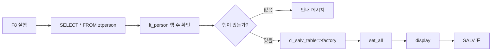

# CH11_REWRITE - SALV First Pass

> 기준 소스: `content/abap/CH11/_chapter.md`, `content/abap/CH11/CH11-L01.md` ~ `CH11-L06.md`
> 보조 참고: `.project-docs/09_CURRICULUM_LEDGER.md`, `.project-docs/11_KEYWORD_AUDIT.md`, 기존 `reference/codex_0625`, `reference/codex_0625_v2`
> 공식 문서 확인: `C:\ABAP_DOCU_HTML`의 ABAP List, ALV 권장 가이드, `CL_SALV_TABLE` 예제, method call, reference variable, exception handling, data element label 관련 항목을 수동 확인

## 챕터 설계

CH10에서 학습자는 코드를 이름 붙은 처리 단위로 나누는 감각을 얻었다. 이제 그 코드가 만든 결과를 사람에게 보여 주어야 한다. CH05부터 CH08까지는 `WRITE`로 데이터를 찍어 보았고, CH09에서는 콘서트 앱의 테이블 관계를 만들었고, CH10에서는 잔여석 계산 같은 로직을 묶었다.

그런데 실제 사용자는 이런 출력에서 바로 한계를 느낀다.

```text
예매 목록을 이름순으로 정렬하고 싶다.
취소된 건만 필터링하고 싶다.
좌석 수 합계를 보고 싶다.
엑셀로 내려받고 싶다.
```

`WRITE` 리스트로도 흉내는 낼 수 있지만, 정렬과 필터와 합계와 열 제목을 모두 직접 처리해야 한다. CH11의 목표는 "내부 테이블을 사용자가 읽기 좋은 표로 보여 주는 가장 짧은 길"을 배우는 것이다. 그 길이 SALV이고, 중심 클래스가 `CL_SALV_TABLE`이다.

CH11은 classic-first 경계를 지킨다. 코드 예제는 classic `DATA ... TYPE REF TO`, classic Open SQL, `TRY ... CATCH` 형태로 쓴다. `TYPE REF TO`, `TRY ... CATCH`, method chain은 CH20 전의 선행 사용이다. 지금은 OO와 예외 처리의 내부 이론을 깊게 설명하지 않고, SALV를 띄우기 위해 필요한 최소 사용법으로 제한한다.

또한 CH11은 "간단 ALV" 장이다. 컬럼 세밀 제어, 색, hotspot, 이벤트, 편집, container 기반 Grid ALV는 여기서 구현하지 않는다. 그런 요구는 각각 CH17, CH21, CH27, CH28에서 다룬다. CH11에서 학습자가 얻어야 할 결과는 명확하다.

```text
내부 테이블이 있다.
factory로 SALV 객체를 만든다.
표준 기능을 켠다.
display로 화면에 표를 띄운다.
```

## CH11-L01 - SALV의 목적과 CL_SALV_TABLE 개요

### 왜 필요한가

처음 ABAP을 배울 때 `WRITE`는 좋은 도구다. 한 줄을 찍고, 변수 값을 확인하고, 반복문이 제대로 도는지 보는 데 빠르다. 하지만 업무 리포트가 되면 이야기가 달라진다.

예매 담당자가 보고 싶은 것은 단순한 글자 줄이 아니다. 예매 번호, 고객명, 공연일, 좌석 수, 상태가 열로 정렬된 표다. 헤더를 클릭해 정렬하고, 상태가 `CANCEL`인 행만 필터링하고, 좌석 수 합계를 보고, 필요하면 스프레드시트로 내려받고 싶다.

`WRITE`로 이런 표를 직접 만들면 출력 위치, 열 너비, 정렬 기준, 합계 계산, 필터 조건을 모두 프로그램이 떠안는다. 입문자 입장에서는 화면을 꾸미느라 정작 데이터 흐름을 놓치기 쉽고, 실무 입장에서는 유지보수 비용이 커진다.

공식 문서의 list 관련 가이드도 같은 방향을 말한다. 단순 테스트나 보조 프로그램에서는 `WRITE`가 여전히 유용하지만, 애플리케이션의 표 형태 출력은 SAP List Viewer, 즉 ALV 계열 클래스를 사용하는 쪽이 권장된다. 그중 초급자가 가장 먼저 잡기 쉬운 도구가 `CL_SALV_TABLE` 기반 SALV다.

### 무엇인가

SALV는 Simple ALV 또는 SAP List Viewer 계열의 간단한 표 출력 도구로 이해하면 된다. 핵심은 내부 테이블을 받아서 읽기 전용 표 화면으로 보여 주는 것이다.

```text
Internal Table
      |
      | cl_salv_table=>factory( )
      v
SALV 객체
      |
      | display( )
      v
ALV 표 화면
```

여기서 `CL_SALV_TABLE`은 표 형태 SALV를 다루는 클래스다. CH10에서 정적 메서드를 `=>`로 호출한다는 감각을 배웠기 때문에, CH11에서는 그 지식이 실제 화면 출력으로 이어진다.

SALV의 장점은 세 가지다.

| 장점 | 의미 |
|---|---|
| 코드가 짧다 | 내부 테이블만 준비되면 몇 줄로 표를 띄운다 |
| 표준 기능이 따라온다 | 정렬, 필터, 합계, 레이아웃, 내보내기 같은 기능을 기본으로 쓸 수 있다 |
| Data Element 라벨을 활용한다 | DDIC에 만든 필드 라벨이 컬럼 제목으로 자연스럽게 드러난다 |

다만 SALV를 만능으로 이해하면 안 된다. CH11에서 다루는 SALV는 기본적으로 읽기 전용 표 출력이다. 셀을 직접 편집하거나, 화면 컨테이너 안에 복잡하게 배치하거나, 더블클릭 이벤트로 다음 화면을 여는 설계는 뒤 장에서 다룬다.

### 어떻게 확인하는가

가장 쉬운 확인 방법은 같은 내부 테이블을 `WRITE`와 SALV로 각각 보여 보는 것이다.

```abap
LOOP AT lt_book INTO ls_book.
  WRITE: / ls_book-bookid, ls_book-custname, ls_book-seats, ls_book-status.
ENDLOOP.
```

이 출력은 빠르지만 사용자가 직접 열 너비를 조정하거나 상태별로 필터링하기 어렵다. 같은 `lt_book`을 SALV로 띄우면 표 화면이 생기고, 사용자는 헤더 클릭, 필터, 합계, 내보내기 같은 기본 조작을 바로 시도할 수 있다.

입문자가 확인해야 할 포인트는 "데이터가 달라졌는가"가 아니다. 같은 내부 테이블을 더 사용하기 좋은 화면으로 보여 주는지가 핵심이다.

### 프로세스 플로우 설계

L01에는 "WRITE와 SALV 비교 보드"를 둔다.

| 요소 | 설계 |
|---|---|
| 버튼 | `WRITE로 보기`, `SALV로 보기`, `정렬 시도`, `필터 시도`, `엑셀 내보내기 시도` |
| 상태 | 현재 출력 방식, 가능한 사용자 조작, 필요한 코드량 |
| 데이터 | `lt_book` 예매 목록 5건, 상태 `BOOKED`/`CANCEL` 혼합 |
| 피드백 | WRITE에서는 조작이 막히고, SALV에서는 표준 기능 버튼이 활성화되는 차이를 표시 |

학습자는 같은 데이터라도 출력 도구가 바뀌면 사용자의 경험이 완전히 달라진다는 점을 먼저 체감한다.

### 실수와 주의

SALV를 "데이터를 저장하는 도구"로 오해하면 안 된다. SALV는 내부 테이블을 화면에 보여 주는 도구다. DB 저장, 변경, transaction 처리는 CH11 범위가 아니다.

SALV를 "편집 가능한 표"로 기대하는 것도 흔한 오해다. CH11의 SALV는 읽기 전용으로 잡는다. 편집 가능한 ALV는 Grid ALV와 별도의 이벤트, field catalog, 데이터 검증을 함께 배워야 하므로 뒤로 미룬다.

`CL_SALV_TABLE`이 클래스라는 사실 때문에 갑자기 OO 전체를 배우려 하지 않아도 된다. CH11에서는 `factory`, `get_functions`, `display` 세 동작만 안전하게 따라가면 충분하다.

### 정리

CH11의 출발점은 "보기 좋은 업무 표"다. `WRITE`는 학습과 간단한 확인에는 좋지만, 사용자가 정렬하고 필터링하고 합계를 보아야 하는 표에는 SALV가 더 적합하다. `CL_SALV_TABLE`은 내부 테이블을 읽기 전용 ALV 표로 보여 주는 가장 간단한 길이며, CH11에서는 기본 표시와 표준 기능까지만 배운다.

## CH11-L02 - FACTORY 메서드로 Internal Table 출력

### 왜 필요한가

SALV를 쓰려면 먼저 "표 화면을 담당할 객체"가 필요하다. 내부 테이블은 데이터 덩어리일 뿐이고, 그 자체가 화면을 그리지는 않는다. `WRITE`는 한 줄씩 바로 출력했지만, SALV는 내부 테이블을 SALV 객체에 연결한 뒤 그 객체가 화면을 표시한다.

입문자가 여기서 꼭 구분해야 하는 것이 있다.

```text
factory: 내부 테이블을 받아 SALV 객체를 준비한다.
display: 준비된 SALV 객체를 실제 화면에 보여 준다.
```

`factory`만 호출하면 표가 뜨지 않는다. 반대로 SALV 객체 없이 `display`를 할 수도 없다. 이 둘을 분리해서 이해해야 이후 표준 기능, 컬럼 제어, 이벤트 학습이 흔들리지 않는다.

### 무엇인가

`CL_SALV_TABLE`의 정적 메서드 `factory`는 내부 테이블을 받아 SALV 객체 참조를 돌려준다. 아래 코드는 CH11에서 가장 중요한 기본 골격이다.

```abap
DATA lo_alv TYPE REF TO cl_salv_table.

TRY.
    cl_salv_table=>factory(
      IMPORTING
        r_salv_table = lo_alv
      CHANGING
        t_table      = lt_person ).

    lo_alv->display( ).
  CATCH cx_salv_msg.
    MESSAGE 'ALV 생성 실패' TYPE 'I'.
ENDTRY.
```

이 코드에는 아직 배우지 않은 요소가 몇 가지 있다.

| 코드 | 지금 이해할 수준 |
|---|---|
| `TYPE REF TO cl_salv_table` | SALV 객체를 가리킬 변수 `lo_alv`를 만든다 |
| `cl_salv_table=>factory` | 클래스의 정적 메서드를 호출한다 |
| `IMPORTING r_salv_table = lo_alv` | 만들어진 SALV 객체를 `lo_alv`에 받는다 |
| `CHANGING t_table = lt_person` | 화면에 보여 줄 내부 테이블을 넘긴다 |
| `TRY ... CATCH cx_salv_msg` | SALV 생성 실패 가능성을 잡는다 |
| `lo_alv->display( )` | 준비된 SALV 화면을 실제로 표시한다 |

`TYPE REF TO`와 `TRY ... CATCH`는 CH20에서 본격적으로 다룬다. CH11에서는 "SALV를 안전하게 띄우기 위해 필요한 준비 코드"로 받아들이면 된다.

### 어떻게 확인하는가

디버거에서 다음 순서로 멈춰 본다.

1. `DATA lo_alv TYPE REF TO cl_salv_table.` 이후 `lo_alv`는 아직 비어 있다.
2. `factory` 호출을 통과하면 `lo_alv`가 SALV 객체를 가리키게 된다.
3. 이 시점에도 화면에는 표가 뜨지 않는다.
4. `lo_alv->display( ).`를 실행해야 ALV 화면이 열린다.

이 확인은 매우 중요하다. 많은 입문자가 `factory`라는 이름 때문에 "만들었으니 보이겠지"라고 생각한다. 하지만 객체 생성과 화면 표시는 서로 다른 단계다.

### 체험 설계

기존 `CH11-L02-S01` 임베드를 기준으로 "factory와 display 분리 실험"을 설계한다.

| 요소 | 설계 |
|---|---|
| 버튼 | `1. factory 실행`, `2. display 실행`, `빈 테이블로 실행`, `예외 상황 보기`, `초기화` |
| 상태 | `lo_alv` 상태: initial, bound, displayed |
| 데이터 | `lt_person` 정상 데이터 3건, 빈 데이터 0건 |
| 화면 피드백 | factory 후에는 객체 카드만 켜지고 표 영역은 비어 있음. display 후에 표가 렌더링됨 |
| 오류 피드백 | factory 실패 예시는 `CATCH cx_salv_msg` 영역으로 흐름이 이동하는 애니메이션으로 표시 |

컬럼 제목 영역에는 Data Element 라벨을 보여 준다. 예를 들어 필드명이 `PERSID`, `NAME`이어도 라벨이 "사번", "이름"으로 보이면 CH03의 DDIC 설계가 화면 품질로 이어진다는 점을 연결한다.

### 실수와 주의

`factory`만 호출하고 `display`를 빠뜨리면 아무 화면도 보이지 않는다. 이때 프로그램이 실패한 것이 아니라 표시 명령이 없는 것이다.

`TRY ... CATCH`를 제거하면 SALV 생성 중 문제가 생겼을 때 사용자가 이해할 수 있는 메시지 대신 런타임 오류로 이어질 수 있다. 지금은 예외 처리 이론을 깊게 배우지 않더라도, SALV 생성 코드는 보호 블록 안에 둔다.

내부 테이블이 비어 있으면 SALV도 빈 표를 보여 준다. 빈 표는 오류가 아니다. 그래서 "ALV가 안 된다"라고 판단하기 전에 `SELECT` 결과가 실제로 있는지 확인해야 한다.

### 정리

`factory`는 내부 테이블을 SALV 객체에 연결하는 단계이고, `display`는 그 객체를 화면에 보여 주는 단계다. CH11-L02의 핵심은 이 둘을 분리해서 이해하는 것이다. `lo_alv`는 SALV 객체 참조이고, `lt_person`은 화면에 표시할 데이터다.

## CH11-L03 - 기본 Function 표시와 Display 실행

### 왜 필요한가

표가 화면에 뜨는 것만으로는 아직 업무 리포트라고 하기 어렵다. 사용자는 정렬, 필터, 합계, 내보내기 같은 조작을 기대한다. `WRITE` 리스트에서는 이런 기능을 직접 만들어야 했지만, SALV는 표준 기능 객체를 통해 기본 툴바를 켤 수 있다.

CH11-L03의 목표는 두 줄을 정확히 이해하는 것이다.

```abap
lo_alv->get_functions( )->set_all( abap_true ).
lo_alv->display( ).
```

첫 줄은 사용자가 누를 수 있는 표준 기능을 켜고, 둘째 줄은 화면을 표시한다.

### 무엇인가

`get_functions( )`는 SALV 객체에서 표준 기능을 관리하는 객체를 가져온다. 이어서 `set_all( abap_true )`를 호출하면 기본 기능을 한꺼번에 활성화한다.

```abap
lo_alv->get_functions( )->set_all( abap_true ).
```

이 문장은 한 줄이지만 두 단계로 읽어야 한다.

```text
lo_alv
  -> get_functions( )
       -> set_all( abap_true )
```

공식 문서의 method call chain 설명처럼, 앞 메서드 호출의 결과가 다음 메서드 호출의 대상이 된다. 입문자는 이를 "SALV에서 기능 상자를 꺼내고, 그 상자의 모든 기본 스위치를 켠다"라고 이해하면 된다.

그다음 `display`가 실제 화면을 연다.

```abap
lo_alv->display( ).
```

`display`는 마지막에 호출해야 한다. 표준 기능을 켜기 전에 먼저 화면을 열어 버리면 학습 흐름상 "왜 툴바가 예상과 다르지"라는 혼란이 생긴다. 기본 순서는 `factory`, `set_all`, `display`로 고정해 익힌다.

### 어떻게 확인하는가

같은 SALV 객체로 두 번 실험한다.

첫 번째는 `set_all` 없이 `display`만 실행한다.

```abap
lo_alv->display( ).
```

표는 보이지만 툴바의 기능이 제한적으로 보일 수 있다. 두 번째는 `display` 전에 `set_all`을 실행한다.

```abap
lo_alv->get_functions( )->set_all( abap_true ).
lo_alv->display( ).
```

이제 사용자는 정렬, 필터, 합계, 내보내기 같은 표준 기능을 더 쉽게 찾을 수 있다. 실제 시스템이나 시뮬레이터에서는 기능 아이콘이 켜지는지, 좌석 수 열에서 합계가 가능한지, 상태 필터가 가능한지 확인한다.

### 체험 설계

L03에는 "표준 기능 스위치 패널"을 둔다.

| 요소 | 설계 |
|---|---|
| 버튼 | `set_all 생략`, `set_all 실행`, `display 실행`, `정렬`, `필터`, `합계`, `내보내기` |
| 상태 | 표준 기능 활성 여부, 표시 여부, 현재 정렬/필터 상태 |
| 데이터 | 예매 목록 6건, 좌석 수 합계가 눈에 보이도록 `SEATS` 값 포함 |
| 피드백 | `set_all` 전에는 기능 아이콘이 흐리게 표시되고, 실행 후에는 버튼이 활성화됨 |

합계 버튼은 숫자 열에서만 의미가 있다는 메시지를 준다. 문자 열에서 합계를 누르면 "합계는 숫자 필드에서 확인합니다"라는 피드백을 표시한다.

### 실수와 주의

`display`를 빠뜨리면 표가 보이지 않는다. CH11에서 가장 많이 반복해서 잡아야 하는 실수다.

`set_all`을 빠뜨려도 SALV 객체 생성 자체가 실패하는 것은 아니다. 그래서 더 헷갈린다. 표는 떴는데 사용자가 기대한 기능이 보이지 않으면 `get_functions( )->set_all( abap_true )`가 있는지 확인한다.

method chain을 OO 전체 문법으로 과하게 해석하지 않는다. CH11에서는 "한 객체에서 다음 객체를 꺼내 이어서 호출한다"는 사용 감각만 잡는다.

### 정리

CH11의 기본 출력 순서는 `factory`, `get_functions( )->set_all( abap_true )`, `display`다. `set_all`은 사용자의 표준 조작을 켜고, `display`는 화면을 실제로 표시한다. 표가 보이지 않으면 `display`, 기능이 부족해 보이면 `set_all`을 먼저 확인한다.

## CH11-L04 - Internal Table -> SALV 미니 리포트

### 왜 필요한가

지금까지는 SALV 조각을 따로 보았다. 실무 프로그램에서는 조각이 이어져야 한다.

```text
DB에서 조회한다.
내부 테이블에 담는다.
SALV 객체를 만든다.
표준 기능을 켠다.
화면에 표시한다.
```

CH11-L04는 이 흐름을 한 프로그램으로 완성한다. 입문자에게는 이것이 첫 번째 "그럴듯한 업무 리포트"가 된다.

### 무엇인가

아래 프로그램은 `ZTPERSON` 테이블을 조회해 SALV로 보여 주는 미니 리포트다.

```abap
REPORT zsalv_person.

DATA: lt_person TYPE TABLE OF ztperson,
      lo_alv    TYPE REF TO cl_salv_table,
      lv_count  TYPE i.

START-OF-SELECTION.
  SELECT * FROM ztperson INTO TABLE lt_person.

  DESCRIBE TABLE lt_person LINES lv_count.

  IF lv_count = 0.
    MESSAGE '표시할 데이터가 없습니다' TYPE 'I'.
  ELSE.
    TRY.
        cl_salv_table=>factory(
          IMPORTING
            r_salv_table = lo_alv
          CHANGING
            t_table      = lt_person ).

        lo_alv->get_functions( )->set_all( abap_true ).
        lo_alv->display( ).
      CATCH cx_salv_msg.
        MESSAGE 'ALV 생성 실패' TYPE 'I'.
    ENDTRY.
  ENDIF.
```

`START-OF-SELECTION`은 executable program의 기본 처리 블록이다. 본격적인 이벤트 블록 학습은 CH15에서 다룬다. 지금은 "실행하면 이 블록 안의 조회와 출력이 수행된다" 정도로만 읽는다.

`DESCRIBE TABLE`은 내부 테이블 행 수를 확인하는 classic 방식이다. CH11에서는 modern 함수식보다 classic-first 기준에 맞는 형태로 빈 결과를 확인한다.

### 어떻게 확인하는가

SE38에서 프로그램을 실행한 뒤 세 가지를 확인한다.

1. 데이터가 있는 경우: SALV 표가 뜨고 행 수가 조회 결과와 일치한다.
2. 데이터가 없는 경우: 빈 표를 바로 띄우지 않고 안내 메시지가 나온다.
3. 컬럼 제목: DDIC Data Element의 필드 라벨이 표 제목에 반영되는지 확인한다.

디버거에서는 `SELECT` 직후 `lt_person`의 행 수를 확인한다. 그다음 `factory` 이후 `lo_alv`가 비어 있지 않은지 보고, `display`에서 화면으로 넘어가는 흐름을 확인한다.

### 프로세스 플로우 설계

L04에는 "미니 리포트 실행 파이프라인"을 둔다.



시뮬레이터의 버튼은 `조회 실행`, `행 수 확인`, `factory`, `set_all`, `display`로 나눈다. 각 버튼을 누를 때 현재 데이터가 어느 상자에 있는지 강조한다.

### 실수와 주의

`SELECT` 결과가 비어 있는데 SALV 문제라고 판단하지 않는다. 먼저 내부 테이블 행 수를 확인한다.

CH11에서는 New Open SQL escape나 inline declaration을 쓰지 않는다. 아직 CH19 전이므로 classic Open SQL 형태를 유지한다.

`CATCH cx_salv_msg`를 비워 두면 실패 원인을 학습자가 놓친다. 실습 코드에서는 최소한 메시지를 출력한다. 실제 운영 코드에서는 로깅이나 사용자 안내 정책을 프로젝트 기준에 맞춰야 한다.

`SELECT *`는 학습용이다. 필요한 열만 조회하는 설계, 성능, 인덱스, 조인, 집계는 CH13 이후에 다룬다. CH11의 초점은 SQL 최적화가 아니라 "조회 결과를 표로 보여 주는 흐름"이다.

### 정리

미니 리포트는 `SELECT -> Internal Table -> SALV` 흐름이다. CH11-L04에서 학습자는 처음으로 DB 조회 결과를 사용자가 다룰 수 있는 표 화면으로 바꾼다. 빈 결과는 먼저 데이터 문제로 확인하고, SALV 생성 실패는 `CATCH cx_salv_msg`에서 안내한다.

## CH11-L05 - SALV 기초 정리 및 이후 심화과정 소개

### 왜 필요한가

SALV를 한 번 띄우고 나면 바로 욕심이 생긴다.

```text
컬럼 제목을 바꾸고 싶다.
금액에 통화 표시를 붙이고 싶다.
상태가 취소인 행을 빨간색으로 보이고 싶다.
더블클릭하면 상세 화면으로 가고 싶다.
표에서 바로 값을 수정하고 싶다.
```

이 요구들은 자연스럽다. 하지만 모두 CH11에서 풀면 학습 흐름이 무너진다. 초급자는 먼저 "내부 테이블을 표로 띄운다"는 성공 경험이 필요하다. 심화 요구는 뒤에서 더 정확한 도구와 함께 배워야 한다.

### 무엇인가

CH11의 범위는 아래 세 가지다.

| 범위 | 포함 여부 | 이유 |
|---|---|---|
| 내부 테이블을 SALV 객체로 연결 | 포함 | `factory` 핵심 |
| 표준 기능 켜기 | 포함 | `get_functions( )->set_all( abap_true )` |
| 화면 표시 | 포함 | `display` 핵심 |
| 컬럼 제목/폭 세밀 제어 | 제외 | CH21에서 컬럼 객체와 함께 학습 |
| 색, hotspot, cell 설정 | 제외 | CH21에서 표시 심화로 학습 |
| 더블클릭, 툴바 이벤트 | 제외 | CH27 이벤트 장에서 학습 |
| 편집 가능한 ALV | 제외 | CH28에서 검증과 저장 흐름까지 함께 학습 |
| container 기반 Grid ALV | 제외 | CH17에서 화면 컨테이너와 함께 학습 |

이렇게 나누는 이유는 기능을 숨기기 위해서가 아니다. 각 기능이 요구하는 선행 개념이 다르기 때문이다. 예를 들어 편집 가능한 ALV는 "화면에서 값을 바꾼다"로 끝나지 않는다. 변경된 값을 읽고, 검증하고, DB 저장 정책을 정하고, 오류를 되돌리는 흐름까지 필요하다. CH11에서 다루면 초급자에게 너무 많은 책임이 한 번에 들어온다.

### 어떻게 확인하는가

현재 코드를 보고 다음 질문에 답할 수 있으면 CH11 범위는 충분하다.

```text
내부 테이블 변수는 무엇인가?
SALV 객체 변수는 무엇인가?
factory는 어느 내부 테이블을 받는가?
표준 기능은 어디서 켜는가?
display는 어디서 호출하는가?
이 표가 읽기 전용이라는 사실을 알고 있는가?
```

반대로 다음 질문이 나오면 "좋은 질문이지만 뒤 장의 범위"로 분리한다.

```text
특정 컬럼 제목만 바꿀 수 있나요?
행 색을 조건에 따라 바꿀 수 있나요?
더블클릭 이벤트를 받을 수 있나요?
셀에서 값을 고치고 저장할 수 있나요?
화면 일부 영역에 ALV를 붙일 수 있나요?
```

### 체험 설계

L05에는 "SALV 기능 분기 지도"를 둔다.

| 요소 | 설계 |
|---|---|
| 카드 | `기본 표시`, `컬럼 제어`, `색/Hotspot`, `이벤트`, `편집`, `컨테이너` |
| 사용자 행동 | 각 카드를 현재 장에서 수행할지, 후속 장으로 보낼지 드래그 |
| 상태 | CH11 가능, CH17 이동, CH21 이동, CH27 이동, CH28 이동 |
| 피드백 | 왜 뒤로 미루는지 선행 개념을 한 줄로 설명 |

예를 들어 `편집` 카드를 CH11 가능 영역에 놓으면 "편집은 값 변경, 검증, 저장, 오류 처리까지 연결되므로 CH28에서 다룹니다"라고 안내한다.

### 실수와 주의

CH11에서 `get_columns`나 field catalog로 들어가면 학습 난도가 급격히 올라간다. 컬럼 세밀 제어는 CH21에서 다룬다. CH11 실습에서 컬럼 제목이 아쉽다면 Data Element 라벨을 먼저 확인한다.

Grid ALV와 SALV를 섞어 설명하지 않는다. Grid ALV는 더 강력하지만 더 많은 개념이 필요하다. CH11에서는 `CL_SALV_TABLE`만 잡는다.

읽기 전용이라는 한계를 부끄럽게 설명하지 않는다. 읽기 전용 표는 조회 리포트에서 매우 흔하고 유용하다. "수정하지 않는 화면"을 빠르게 안정적으로 만드는 것이 CH11의 목적이다.

### 정리

CH11은 SALV 1차다. 목표는 내부 테이블을 읽기 전용 표로 띄우고, 표준 기능을 켜는 것이다. 컬럼 세밀 제어, 색, 이벤트, 편집, container Grid ALV는 뒤 장에서 각각 필요한 선행 개념과 함께 배운다.

## CH11-L06 - 실습: 예매 목록 SALV

### 왜 필요한가

이제 SALV를 콘서트 앱에 붙일 차례다. CH09에서 만든 예매 테이블 `ZBOOKING`은 업무적으로 바로 보고 싶은 데이터다. 누가 어떤 공연을 몇 석 예매했는지, 상태가 무엇인지, 총 좌석 수가 어느 정도인지 확인해야 한다.

`WRITE`로 예매 목록을 찍으면 단순 확인은 가능하다. 하지만 실무 담당자는 예매 상태별 필터, 좌석 수 합계, 고객명 정렬을 원한다. CH11-L06은 지금까지 배운 SALV 기본형을 `ZBOOKING`에 적용해 첫 예매 목록 리포트를 만든다.

### 무엇인가

기본 실습 코드는 아래와 같다.

```abap
REPORT zsalv_booking.

DATA: lt_book  TYPE TABLE OF zbooking,
      lo_alv   TYPE REF TO cl_salv_table,
      lv_count TYPE i.

START-OF-SELECTION.
  SELECT * FROM zbooking INTO TABLE lt_book.

  DESCRIBE TABLE lt_book LINES lv_count.

  IF lv_count = 0.
    MESSAGE '표시할 예매 데이터가 없습니다' TYPE 'I'.
  ELSE.
    TRY.
        cl_salv_table=>factory(
          IMPORTING
            r_salv_table = lo_alv
          CHANGING
            t_table      = lt_book ).

        lo_alv->get_functions( )->set_all( abap_true ).
        lo_alv->display( ).
      CATCH cx_salv_msg.
        MESSAGE '예매 목록 ALV 생성 실패' TYPE 'I'.
    ENDTRY.
  ENDIF.
```

이 코드는 CH11의 전체 흐름을 담고 있다.

| 단계 | 코드 | 의미 |
|---|---|---|
| 조회 | `SELECT * FROM zbooking INTO TABLE lt_book.` | DB 예매 목록을 내부 테이블에 담는다 |
| 행 수 확인 | `DESCRIBE TABLE lt_book LINES lv_count.` | 빈 결과인지 먼저 확인한다 |
| 객체 생성 | `cl_salv_table=>factory` | `lt_book`을 SALV 객체에 연결한다 |
| 기능 켜기 | `set_all( abap_true )` | 표준 툴바를 활성화한다 |
| 표시 | `display` | 화면에 예매 목록을 보여 준다 |

### 어떻게 확인하는가

실습 확인은 화면에서 끝나지 않는다. 데이터, DDIC, 사용자 조작을 함께 확인한다.

1. `ZBOOKING`에 예매 데이터가 있는지 먼저 확인한다.
2. 프로그램을 실행해 SALV 표가 뜨는지 확인한다.
3. 컬럼 제목이 기술명만 보이는지, Data Element 라벨이 보이는지 확인한다.
4. `STATUS` 컬럼을 필터링해 예약/취소 상태를 나눠 본다.
5. `SEATS` 같은 숫자 열에서 합계 기능이 가능한지 확인한다.
6. 고객명이나 예매일 기준으로 정렬해 본다.

기존 `CH11-L06-S01` 임베드는 예매 목록을 SALV로 띄워 정렬과 합계를 눌러 보는 방향으로 사용한다. 단, 원본에 있던 `get_columns`를 이용한 컬럼 제목 변경 도전은 CH21 범위로 이동한다. CH11에서는 DDIC 라벨이 자동으로 컬럼 제목에 반영되는지 확인하는 데 집중한다.

### 체험 설계

L06에는 "예매 목록 리포트 조작 실습"을 둔다.

| 요소 | 설계 |
|---|---|
| 버튼 | `예매 조회`, `factory`, `표준 기능 켜기`, `display`, `상태 필터`, `좌석 합계`, `고객명 정렬`, `빈 결과 실험` |
| 상태 | `lt_book` 행 수, `lo_alv` 생성 여부, 표준 기능 활성 여부, 현재 필터 조건 |
| 데이터 | `BOOKID`, `CONCERT_ID`, `PERF_ID`, `CUSTNAME`, `SEATS`, `STATUS` |
| 피드백 | 각 조작 후 "데이터가 바뀐 것인지, 화면 표시가 바뀐 것인지"를 구분해 표시 |

`상태 필터` 버튼은 데이터 자체를 삭제하지 않는다. SALV 화면에서 보이는 행만 줄어든다는 피드백을 준다. `좌석 합계` 버튼은 화면의 집계 기능이므로 DB에 합계값이 저장되는 것이 아니라고 안내한다.

### 실수와 주의

데이터가 없을 때 빈 SALV가 뜨는 것을 오류로 착각하지 않는다. `DESCRIBE TABLE`로 행 수를 먼저 확인하고, 빈 경우에는 안내 메시지를 낸다.

`CATCH cx_salv_msg`를 비워 두지 않는다. 학습용 코드라도 실패했을 때 사용자가 알 수 있는 메시지를 둔다.

CH11 실습에서는 DB를 변경하지 않는다. 예매 상태 수정, 취소 처리, 좌석 수 차감, commit 처리는 후속 장의 범위다. 지금은 조회 결과를 표로 보는 것이 목적이다.

컬럼 제목이 마음에 들지 않으면 먼저 Data Element 라벨을 확인한다. `get_columns`로 컬럼 객체를 직접 다루는 방식은 CH21에서 배운다.

### 정리

CH11-L06은 콘서트 앱의 예매 데이터를 첫 SALV 리포트로 보여 주는 실습이다. `SELECT`로 `lt_book`을 채우고, `factory`로 SALV 객체를 만들고, `set_all`로 표준 기능을 켠 뒤, `display`로 화면을 띄운다. 사용자는 정렬, 필터, 합계를 통해 `WRITE` 리스트와 SALV의 차이를 직접 체감한다.

## CH11 마무리

CH11은 "출력의 품질"을 바꾸는 장이다. 지금까지는 데이터가 맞는지 확인하는 데 집중했다면, 이제는 사용자가 데이터를 탐색할 수 있는 표를 제공한다.

학습자가 이 장을 마치면 다음을 말할 수 있어야 한다.

```text
WRITE 리스트는 간단 확인용으로 좋지만 업무 표에는 한계가 있다.
SALV는 내부 테이블을 읽기 전용 ALV 표로 보여 주는 간단한 방법이다.
factory는 객체 생성, display는 화면 표시다.
set_all은 표준 기능을 활성화한다.
Data Element 라벨은 SALV 컬럼 제목 품질에 영향을 준다.
편집, 이벤트, 컬럼 세밀 제어는 뒤 장에서 다룬다.
```

다음 CH12에서는 "전체 예매 목록"을 넘어 "특정 공연만", "특정 상태만", "기간 범위만" 보고 싶은 요구로 이동한다. 그 요구를 처리하는 도구가 `SELECT-OPTIONS`와 Range Table이다.
