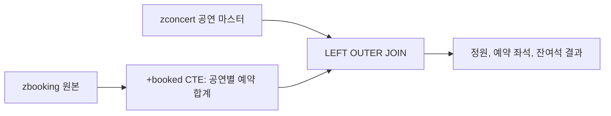
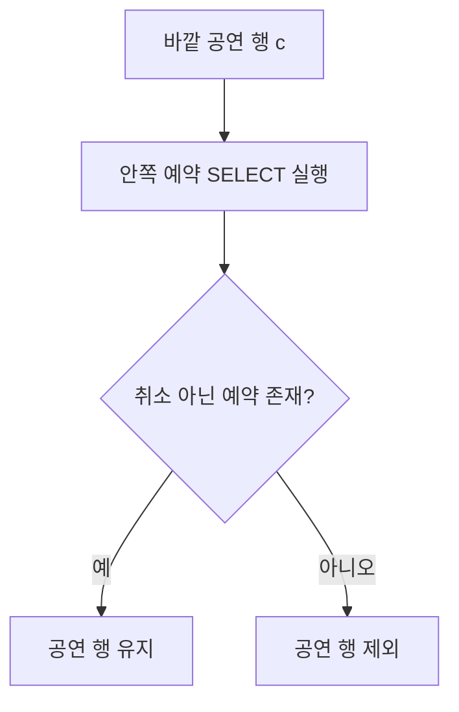
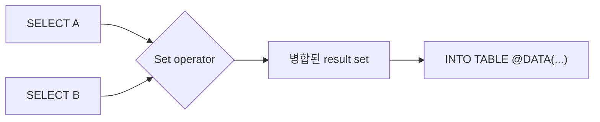
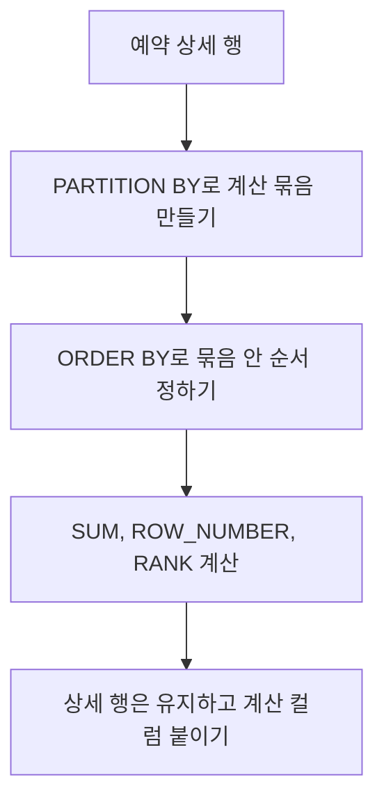

# NEWCH20_OLDCH99_REWRITE · Advanced ABAP SQL

> 주 소스: 신규 집필. `content/abap/CH19`에서 보류한 고급 Modern ABAP SQL 항목과 `reference/codex_0629_v3/00_CONCEPT_GAP_AUDIT.md`의 P1 판정을 기준으로 작성한다.  
> 연결 위치: NEWCH19_OLDCH19 Modern ABAP SQL 이후, NEWCH21_OLDCH20 OO ABAP 기본 설계 이전.  
> 목표: CH19에서 배운 modern SQL 기본 문법을 바탕으로 CTE, subquery, set operation, window expression을 입문자가 읽고 검증할 수 있는 수준까지 끌어올린다.

## NEWCH20 전체 설계

CH19에서 학습자는 `@`, 콤마 SELECT list, `@DATA( )`, SQL expression, SQL function, `SELECT FROM @itab`을 배웠다. 그러나 CH19는 일부러 CTE, 복잡한 subquery, set operation, window expression을 보류했다. 이유는 이 문법들이 한 줄을 짧게 쓰는 기술이 아니라, 데이터베이스에 질문을 설계하는 방식이기 때문이다.

예를 들어 콘서트 예매 데이터를 생각해 보자.

- 공연별 예약 합계를 먼저 구한 뒤 공연 마스터와 합치고 싶다.
- 예약이 하나라도 있는 공연만 찾고 싶다.
- 전체 공연 목록에서 이미 예약된 공연을 빼고 싶다.
- 예약 상세 행은 유지하면서 같은 공연 안의 합계와 순번을 함께 보고 싶다.

이 네 가지 요구를 모두 ABAP `LOOP`로 처리할 수도 있다. 하지만 데이터가 데이터베이스에 있고, 조건과 집계가 SQL로 자연스럽게 표현된다면, DB가 잘하는 일을 DB에 맡기는 편이 더 명확할 때가 많다. NEWCH20은 바로 그 판단을 가르친다.

입문자가 이 장을 끝낸 뒤 답할 수 있어야 하는 질문은 다음이다.

| 질문 | 기대 답 |
|---|---|
| CTE는 무엇을 해결하는가? | 하나의 SELECT 안에서 중간 결과에 이름을 붙여, 복잡한 조회를 단계별로 읽게 해 준다. |
| subquery와 JOIN은 어떻게 다른가? | JOIN은 행을 붙이고, subquery는 조건 안에서 "존재하는가", "목록에 포함되는가", "비교 가능한 값인가"를 묻는다. |
| `EXISTS`는 언제 유리한가? | 관련 행의 상세 컬럼이 필요 없고, 존재 여부만 확인하면 될 때 유리하다. |
| set operation은 무엇을 합치는가? | 두 SELECT의 결과 행 집합을 합집합, 교집합, 차집합으로 계산한다. |
| window expression은 GROUP BY와 어떻게 다른가? | `GROUP BY`는 행을 접고, window expression은 상세 행을 유지하면서 같은 그룹의 합계, 순번, 순위를 붙인다. |
| 고급 SQL을 언제 멈춰야 하는가? | 읽는 사람이 업무 규칙을 추적하지 못하거나 후속 장 주제인 CDS, RAP, Native SQL, 동적 SQL로 넘어가야 할 때 멈춘다. |

## NEWCH20 R15 경계

NEWCH20은 CH19의 Modern ABAP SQL을 심화하는 장이다. 따라서 `SELECT` 중심의 읽기 전용 SQL은 적극적으로 다루지만, 후속 장 주제는 코드로 앞당기지 않는다.

| 구분 | NEWCH20에서 정식 사용 | NEWCH20에서 보류 |
|---|---|---|
| CTE | `WITH`, `+cte_name`, CTE를 main query의 data source로 사용 | 재귀적 계층 CTE, 동적 CTE, DB hint 중심 튜닝 |
| Subquery | `EXISTS`, `NOT EXISTS`, `IN ( SELECT ... )`, correlated subquery 읽기 | 50개 이상 중첩, DB별 optimizer 분석, UPDATE/DELETE 조건 subquery |
| Set operation | `UNION`, `UNION ALL`, `INTERSECT DISTINCT`, `EXCEPT DISTINCT` | INSERT ... SELECT set operation, cursor 심화 |
| Window expression | `SUM( ) OVER( PARTITION BY ... )`, `COUNT( * ) OVER`, `ROW_NUMBER( )`, `RANK( )`, `DENSE_RANK( )` | 모든 window frame 튜닝, 통계 함수 전체, DB별 지원 차이 심화 |
| 성능/가독성 | JOIN/CTE/subquery/window 선택 기준, DB 기능 지원 주의 | ST05/SQL Monitor/PlanViz 심화 분석 |
| 후속 연결 | CDS/RAP/Native SQL/Dynamic SQL이 왜 별도 장인지 설명 | CDS DDL 코드, RAP EML 코드, ADBC 코드, 동적 SQL 코드 |

> 이 장의 핵심은 "문법을 많이 보여 주기"가 아니다. 핵심은 업무 질문을 SQL 질문으로 바꾸고, 그 SQL이 어떤 행을 만들고 어떤 행을 없애는지 검증하는 능력이다.

## 공식 문서 수동 확인 근거

Classic ABAP 및 ABAP SQL 관련 공식 문서는 자동 매칭하지 않고 `C:\ABAP_DOCU_HTML`에서 파일 존재와 주제를 수동 확인했다.

| 주제 | 확인 문서 | NEWCH20 반영 포인트 |
|---|---|---|
| WITH | `abapwith.htm`, `abapwith_subquery.htm` | CTE는 WITH statement의 subquery 결과에 이름을 붙이고, 후속 subquery/main query에서 임시 table처럼 사용한다. |
| Subquery 조건 | `abenwhere_logexp_subquery.htm`, `abenwhere_logexp_exists.htm`, `abenwhere_logexp_operand_in.htm` | subquery는 WHERE 조건의 relational expression에서 사용되고, `EXISTS`, `IN`, 비교 연산과 결합된다. |
| Set operation | `abapunion.htm`, `abapunion_clause.htm` | `UNION`, `INTERSECT`, `EXCEPT`는 여러 SELECT result set을 하나로 병합하며 `ORDER BY`, `INTO` 위치에 제약이 있다. |
| Window expression | `abapselect_over.htm`, `abensql_win_func.htm` | window function 뒤에 `OVER( ... )`를 붙이고, `PARTITION BY`, `ORDER BY`, frame으로 계산 범위를 정의한다. |
| DB 기능 확인 | `abencl_abap_dbfeatures.htm` | window expression, subquery limit 등은 DB 지원 차이가 있을 수 있으므로 실제 시스템 syntax check와 기능 확인이 필요하다. |

수동 확인 중 `abapwindow.htm`도 발견되었지만, 해당 문서는 Classic List의 `WINDOW` 문서이며 ABAP SQL window expression 문서가 아니다. 이 장의 공식 근거로 사용하지 않는다.

## NEWCH20-L01 · 고급 SQL은 언제 필요한가

### 왜 필요한가

CH19까지의 SQL은 한 번에 읽기 쉬운 조회였다.

```abap
SELECT carrid, connid, seatsmax
  FROM sflight
  WHERE carrid = @lv_carr
  INTO TABLE @DATA(lt_flight).
```

그러나 실무 조회는 곧 복잡해진다. "항공편 목록"을 보는 것이 아니라 "예약이 있는 항공편", "예약이 없는 공연", "월별 매출 순위", "상위 10개 고객", "A 목록에는 있지만 B 목록에는 없는 데이터"를 묻는다. 이때 ABAP 쪽에서 internal table을 여러 번 돌리면 작동은 하지만, 데이터가 많아질수록 코드가 길어지고 검증 지점도 늘어난다.

고급 SQL은 복잡한 업무 질문을 데이터베이스가 이해하는 질문으로 바꾸는 도구다.

### 무엇인가

NEWCH20에서 다루는 고급 SQL은 네 묶음이다.

| 도구 | 한 문장 정의 | 대표 질문 |
|---|---|---|
| CTE | SELECT 안의 중간 결과에 이름을 붙인다. | "예약 합계를 먼저 만들고, 그 결과를 공연과 합치자." |
| Subquery | 조건 안에 SELECT를 넣어 존재, 포함, 비교를 묻는다. | "예약이 하나라도 있는 공연만 보여 달라." |
| Set operation | 두 SELECT 결과를 집합처럼 합치거나 빼거나 교차시킨다. | "전체 공연 중 예약된 공연을 빼면 무엇이 남는가?" |
| Window expression | 상세 행을 유지하면서 같은 그룹의 합계, 순번, 순위를 붙인다. | "예약 한 건마다 공연별 누적 좌석과 순번을 같이 보자." |

이 장의 예제는 모두 읽기 전용 SELECT다. 데이터를 저장하거나 변경하지 않는다.

### 어떻게 확인하는가

고급 SQL은 결과를 눈으로만 보면 위험하다. 다음 네 가지를 함께 확인한다.

1. 입력 데이터 표를 먼저 본다.
2. SQL이 만든 중간 개념을 말로 설명한다.
3. 결과 행 수를 예상한다.
4. 실제 결과에서 누락된 행, 중복된 행, 계산값을 확인한다.

예를 들어 "예약이 있는 공연만"이라는 요구는 결과 행 수보다 행의 의미가 중요하다.

| 공연 | 예약 존재 | 결과에 있어야 하는가 |
|---|---:|---|
| C001 | 있음 | 예 |
| C002 | 없음 | 아니오 |
| C003 | 취소 예약만 있음 | 업무 조건에 따라 다름 |

취소 예약을 예약으로 볼 것인지 아닌지에 따라 SQL 조건이 달라진다. 고급 SQL에서 실수는 문법보다 업무 조건 누락에서 더 자주 발생한다.

### 실수/주의

- SQL이 길어졌다고 무조건 좋은 코드는 아니다. 읽기 쉬운 단계로 나뉘지 않으면 ABAP `LOOP`보다 더 위험해진다.
- `JOIN`, subquery, CTE는 서로 대체 가능해 보일 때가 많다. 하지만 행 수가 달라질 수 있으므로 결과 행 수를 반드시 비교한다.
- 이 장은 CDS가 아니다. `define view entity`, association, path expression은 CH22 이후 주제다.
- 이 장은 RAP가 아니다. `MODIFY ENTITIES`, `COMMIT ENTITIES`는 후속 RAP 장에서 다룬다.

### 정리

고급 SQL은 "DB에서 한 번에 많이 처리하기"가 아니라, 업무 질문을 데이터 집합의 질문으로 정확히 바꾸는 방법이다. 이 장에서는 결과 행이 어떻게 생기고 사라지는지를 계속 추적한다.

## NEWCH20-L02 · WITH와 CTE: 중간 결과에 이름 붙이기

### 왜 필요한가

공연별 잔여석을 조회하려면 보통 두 단계가 필요하다.

1. 예약 테이블에서 공연별 예약 좌석을 합산한다.
2. 공연 마스터의 정원에서 예약 좌석을 뺀다.

이를 한 문장에 모두 넣을 수도 있지만, 입문자에게는 읽기 어렵다. CTE는 이 문제를 해결한다. 먼저 `+booked`라는 중간 결과를 만들고, 그다음 main query에서 `+booked`를 일반 data source처럼 읽는다.

### 무엇인가

CTE는 Common Table Expression의 약자다. ABAP SQL에서는 `WITH` statement 안에서 `+`로 시작하는 이름을 사용한다.

```abap
WITH
  +booked AS (
    SELECT FROM zbooking
      FIELDS concert_id,
             perf_no,
             SUM( seats ) AS booked_seats
      WHERE status <> 'C'
      GROUP BY concert_id, perf_no )
  SELECT FROM zconcert AS c
    LEFT OUTER JOIN +booked AS b
      ON  b~concert_id = c~concert_id
      AND b~perf_no    = c~perf_no
    FIELDS c~concert_id,
           c~perf_no,
           c~title,
           c~capacity,
           COALESCE( b~booked_seats, 0 ) AS booked_seats,
           c~capacity - COALESCE( b~booked_seats, 0 ) AS remaining_seats
    INTO TABLE @DATA(lt_capacity).
```

읽는 순서는 다음과 같다.

| 부분 | 의미 |
|---|---|
| `WITH +booked AS ( ... )` | `+booked`라는 이름의 임시 결과를 만든다. |
| `SUM( seats )` | 예약 좌석을 합산한다. |
| `WHERE status <> 'C'` | 취소 예약은 합산에서 제외한다. |
| `GROUP BY concert_id, perf_no` | 공연 ID와 회차별로 합계를 만든다. |
| `LEFT OUTER JOIN +booked AS b` | 공연 마스터는 유지하고 예약 합계를 붙인다. |
| `COALESCE( b~booked_seats, 0 )` | 예약이 없는 공연의 null 합계를 0으로 바꾼다. |

CTE는 실제 DB table을 새로 만드는 것이 아니다. 현재 SQL statement 안에서만 사용할 수 있는 이름 붙은 결과다.

### 어떻게 확인하는가

CTE를 처음 배울 때는 main query 결과만 보면 안 된다. `+booked`가 어떤 표라고 가정되는지 먼저 그려야 한다.

입력 예약 데이터:

| concert_id | perf_no | seats | status |
|---|---:|---:|---|
| C001 | 1 | 2 | N |
| C001 | 1 | 3 | N |
| C001 | 1 | 1 | C |
| C002 | 1 | 4 | N |

`+booked` 예상 결과:

| concert_id | perf_no | booked_seats |
|---|---:|---:|
| C001 | 1 | 5 |
| C002 | 1 | 4 |

취소 상태 `C`의 1석이 빠졌는지 확인한다. 이후 공연 마스터와 붙였을 때 예약이 없는 공연이 사라지지 않는지도 확인한다.

### 실수/주의

- CTE 이름은 일반 DB table 이름이 아니다. 이 SQL statement 안에서만 살아 있는 임시 이름이다.
- CTE 안의 column 이름은 SELECT list의 alias에 의해 결정된다. 계산 컬럼에는 `AS booked_seats`처럼 읽기 쉬운 alias를 붙인다.
- CTE가 너무 많아지면 읽기 쉬워지는 것이 아니라 숨겨진 절차가 된다. 입문 단계에서는 1개 또는 2개 CTE까지만 명확히 쓰는 편이 좋다.
- CTE 안에서 `ORDER BY ... UP TO ...` 같은 제한을 사용할 때는 DB 지원 차이와 syntax check warning을 신경 써야 한다.

### 체험 설계

`CTE Step Viewer`를 설계한다.

| 구성 | 설명 |
|---|---|
| 데이터 | `zconcert`, `zbooking` 샘플 6행 |
| 버튼 | `예약 합계 만들기`, `공연과 조인`, `취소 예약 포함/제외`, `예약 없는 공연 표시` |
| 상태 | `cteRows`, `joinRows`, `cancelIncluded`, `nullToZeroApplied` |
| 피드백 | 취소 예약이 합계에 들어가면 "업무 조건이 합계 단계에서 빠졌습니다." 표시 |

프로세스 플로우:



### 정리

CTE는 복잡한 SELECT를 "중간 표를 만든다 -> 그 표를 다시 읽는다"는 흐름으로 바꾸는 도구다. 실제 table을 만드는 것이 아니라, 한 SQL statement 안에서만 읽을 수 있는 이름 붙은 결과다.

## NEWCH20-L03 · Subquery와 EXISTS: 조건 안에서 다시 묻기

### 왜 필요한가

JOIN은 두 표의 행을 붙인다. 하지만 어떤 요구는 행을 붙일 필요가 없다.

- 예약이 있는 공연인가?
- 취소되지 않은 예약이 하나라도 있는가?
- 특정 고객이 예약한 공연 목록에 포함되는가?

이런 요구에서 필요한 것은 예약 행의 상세 컬럼이 아니라 존재 여부다. 이때 subquery가 자연스럽다.

### 무엇인가

Subquery는 SQL 조건 안에 들어가는 SELECT다. `EXISTS`는 subquery 결과가 하나라도 있으면 true가 된다.

```abap
SELECT FROM zconcert AS c
  FIELDS c~concert_id,
         c~perf_no,
         c~title
  WHERE EXISTS (
    SELECT FROM zbooking AS b
      FIELDS b~booking_id
      WHERE b~concert_id = c~concert_id
        AND b~perf_no    = c~perf_no
        AND b~status    <> 'C' )
  INTO TABLE @DATA(lt_has_booking).
```

여기서 안쪽 SELECT는 바깥 SELECT의 `c~concert_id`, `c~perf_no`를 참조한다. 이렇게 바깥 행을 기준으로 안쪽 질문을 다시 던지는 subquery를 correlated subquery라고 부른다.

읽는 방법은 다음과 같다.

1. 바깥 공연 `c`를 한 행 고른다고 상상한다.
2. 그 공연 ID와 회차를 가진 예약 `b`가 있는지 안쪽 SELECT가 확인한다.
3. 취소가 아닌 예약이 하나라도 있으면 바깥 공연 행이 결과에 남는다.

`IN` subquery는 "목록에 포함되는가"를 묻는다.

```abap
SELECT FROM zconcert AS c
  FIELDS c~concert_id,
         c~perf_no,
         c~title
  WHERE c~concert_id IN (
    SELECT FROM zbooking
      FIELDS concert_id
      WHERE customer_id = @lv_customer )
  INTO TABLE @DATA(lt_customer_concerts).
```

### 어떻게 확인하는가

`EXISTS`는 결과 컬럼보다 조건이 중요하다. 다음 표로 검증한다.

| 공연 | 예약 N | 예약 C | `status <> 'C'` 기준 존재 | 결과 포함 |
|---|---:|---:|---:|---|
| C001-1 | 2건 | 1건 | 예 | 포함 |
| C002-1 | 0건 | 1건 | 아니오 | 제외 |
| C003-1 | 0건 | 0건 | 아니오 | 제외 |

JOIN으로 같은 결과를 만들면 예약 건수만큼 공연 행이 중복될 수 있다. `EXISTS`는 존재 여부만 판단하므로 바깥 공연 행은 한 번만 남는다.

### 실수/주의

- `EXISTS` 안에서 어떤 컬럼을 `FIELDS`로 지정하느냐보다, 조건이 맞는 행이 존재하느냐가 핵심이다.
- 바깥 alias와 안쪽 alias를 반드시 구분한다. `c~concert_id = b~concert_id`처럼 양쪽 출처를 명확히 읽는다.
- `NOT EXISTS`는 "없다"를 묻는 강력한 도구지만, 조건 하나가 빠지면 엉뚱한 결론을 만든다. 예를 들어 회차 조건을 빼면 다른 회차 예약 때문에 공연이 있는 것처럼 판정될 수 있다.
- subquery가 들어간 조건은 ABAP SQL engine이나 table buffer 관점에서 제약이 있을 수 있다. 성능 확정은 실제 시스템에서 측정해야 한다.

### 체험 설계

`EXISTS vs JOIN Comparator`를 설계한다.

| 구성 | 설명 |
|---|---|
| 데이터 | 공연 3건, 예약 5건, 취소 예약 포함 |
| 버튼 | `JOIN으로 조회`, `EXISTS로 조회`, `취소 조건 제거`, `회차 조건 제거` |
| 상태 | `outerRows`, `innerMatches`, `duplicateRows`, `conditionCompleteness` |
| 피드백 | JOIN 결과가 중복되면 "행을 붙였기 때문에 공연이 예약 건수만큼 늘었습니다." 표시 |

프로세스 플로우:



### 정리

Subquery는 조건 안에서 다시 SELECT를 실행해 "존재하는가", "목록에 들어 있는가", "비교할 값이 있는가"를 묻는 도구다. JOIN이 행을 붙이는 도구라면, `EXISTS`는 바깥 행을 남길지 말지 판단하는 도구다.

## NEWCH20-L04 · UNION, INTERSECT, EXCEPT: 결과 집합 다루기

### 왜 필요한가

업무에서는 두 조회 결과를 비교해야 할 때가 많다.

- 활성 공연 목록과 예약된 공연 목록을 합치고 싶다.
- 활성 공연 중 예약이 있는 공연만 보고 싶다.
- 활성 공연 중 아직 예약이 없는 공연만 보고 싶다.

이 요구는 JOIN보다 집합 연산으로 더 직접적으로 표현될 때가 있다.

### 무엇인가

Set operation은 여러 SELECT 결과를 하나의 result set으로 합친다.

| 연산 | 의미 | 업무 질문 |
|---|---|---|
| `UNION DISTINCT` | 중복을 제거하고 합친다. `UNION`의 기본 의도는 distinct다. | "A 또는 B에 있는 공연" |
| `UNION ALL` | 중복을 유지하고 합친다. | "두 출처에서 나온 행을 그대로 모두 보자." |
| `INTERSECT DISTINCT` | 양쪽에 모두 있는 행만 남긴다. | "활성 공연이면서 예약도 있는 공연" |
| `EXCEPT DISTINCT` | 왼쪽에는 있고 오른쪽에는 없는 행만 남긴다. | "활성 공연 중 예약이 없는 공연" |

예제는 공연 ID만 비교한다.

```abap
SELECT FROM zconcert
  FIELDS concert_id
  WHERE active = 'X'
INTERSECT DISTINCT
SELECT FROM zbooking
  FIELDS concert_id
  WHERE status <> 'C'
INTO TABLE @DATA(lt_active_booked).
```

활성 공연 중 취소되지 않은 예약이 있는 공연 ID만 남는다.

예약 없는 활성 공연은 차집합으로 표현할 수 있다.

```abap
SELECT FROM zconcert
  FIELDS concert_id
  WHERE active = 'X'
EXCEPT DISTINCT
SELECT FROM zbooking
  FIELDS concert_id
  WHERE status <> 'C'
INTO TABLE @DATA(lt_active_without_booking).
```

### 어떻게 확인하는가

집합 연산은 벤 다이어그램처럼 확인한다.

| 집합 | 값 |
|---|---|
| 활성 공연 A | C001, C002, C003 |
| 예약 있는 공연 B | C001, C003, C004 |

| 연산 | 예상 결과 |
|---|---|
| `A UNION DISTINCT B` | C001, C002, C003, C004 |
| `A UNION ALL B` | C001, C002, C003, C001, C003, C004 |
| `A INTERSECT DISTINCT B` | C001, C003 |
| `A EXCEPT DISTINCT B` | C002 |

결과가 맞는지 보려면 먼저 왼쪽 집합과 오른쪽 집합을 따로 써 보는 것이 좋다.

### 실수/주의

- 양쪽 SELECT의 컬럼 개수와 타입은 호환되어야 한다.
- inline target을 쓰는 경우 result set의 column 이름이 맞아야 한다. 특히 첫 번째 SELECT의 alias가 결과 이름을 결정하는 경우를 주의한다.
- `ORDER BY`는 각 SELECT 중간이 아니라 병합된 결과의 마지막 쪽에서 생각한다.
- standalone statement에서는 `INTO TABLE @DATA(...)`가 전체 set operation의 마지막 쪽에 온다.
- `UNION ALL`은 중복을 남긴다. "중복 제거"가 업무 요구라면 `UNION DISTINCT` 또는 기본 `UNION` 의도를 명확히 사용한다.

### 체험 설계

`SQL Set Board`를 설계한다.

| 구성 | 설명 |
|---|---|
| 데이터 | 왼쪽 집합 A, 오른쪽 집합 B를 카드로 표시 |
| 버튼 | `UNION`, `UNION ALL`, `INTERSECT`, `EXCEPT`, `왼쪽/오른쪽 바꾸기` |
| 상태 | `leftSet`, `rightSet`, `duplicatePolicy`, `resultRows` |
| 피드백 | `EXCEPT`에서 좌우를 바꾸면 결과가 달라진다는 경고 표시 |

프로세스 플로우:



### 정리

Set operation은 두 SELECT 결과를 집합처럼 다루는 문법이다. JOIN이 컬럼을 옆으로 붙인다면, set operation은 같은 모양의 행들을 위아래로 합치거나 겹치는 부분만 남기거나 빼는 방식이다.

## NEWCH20-L05 · Window Expression: 행을 유지하면서 그룹 계산 붙이기

### 왜 필요한가

`GROUP BY`는 강력하지만 한 가지 대가가 있다. 상세 행이 사라진다.

예약 상세를 보면서 같은 공연의 총 예약 좌석도 보고 싶다고 하자. `GROUP BY concert_id, perf_no`를 쓰면 공연별 합계만 남고, 개별 예약 행은 사라진다. 개별 예약 행을 유지하면서 그룹 합계를 붙이고 싶을 때 window expression을 쓴다.

### 무엇인가

Window expression은 window function 뒤에 `OVER( ... )`를 붙인다.

```abap
SELECT FROM zbooking
  FIELDS concert_id,
         perf_no,
         booking_id,
         customer_id,
         seats,
         SUM( seats ) OVER( PARTITION BY concert_id, perf_no ) AS booked_in_perf,
         ROW_NUMBER( ) OVER( PARTITION BY concert_id, perf_no
                              ORDER BY booking_id ) AS row_in_perf
  WHERE status <> 'C'
  INTO TABLE @DATA(lt_booking_window).
```

읽는 방법은 다음과 같다.

| 부분 | 의미 |
|---|---|
| `SUM( seats )` | 좌석 수를 합산한다. |
| `OVER( ... )` | 일반 집계가 아니라 window expression으로 계산한다. |
| `PARTITION BY concert_id, perf_no` | 같은 공연 ID와 회차를 하나의 계산 묶음으로 본다. |
| `ROW_NUMBER( )` | window 안에서 행 번호를 붙인다. |
| `ORDER BY booking_id` | 행 번호를 어떤 순서로 붙일지 정한다. |

`GROUP BY`와 window expression의 차이는 반드시 표로 확인해야 한다.

입력:

| booking_id | concert_id | perf_no | seats |
|---|---|---:|---:|
| B001 | C001 | 1 | 2 |
| B002 | C001 | 1 | 3 |
| B003 | C002 | 1 | 4 |

`GROUP BY` 결과:

| concert_id | perf_no | sum_seats |
|---|---:|---:|
| C001 | 1 | 5 |
| C002 | 1 | 4 |

Window expression 결과:

| booking_id | concert_id | perf_no | seats | booked_in_perf | row_in_perf |
|---|---|---:|---:|---:|---:|
| B001 | C001 | 1 | 2 | 5 | 1 |
| B002 | C001 | 1 | 3 | 5 | 2 |
| B003 | C002 | 1 | 4 | 4 | 1 |

상세 행은 유지되고, 그룹 계산값이 각 행에 붙는다.

### ranking 함수

공식 문서 기준으로 window function에는 aggregate function, ranking function, value function이 있다. 이 장에서는 입문자가 가장 자주 만나는 ranking 함수만 최소로 소개한다.

```abap
SELECT FROM zbooking
  FIELDS concert_id,
         customer_id,
         seats,
         RANK( ) OVER( PARTITION BY concert_id
                       ORDER BY seats DESCENDING ) AS seat_rank,
         DENSE_RANK( ) OVER( PARTITION BY concert_id
                             ORDER BY seats DESCENDING ) AS dense_seat_rank
  WHERE status <> 'C'
  INTO TABLE @DATA(lt_ranked_booking).
```

`RANK`는 같은 값이 있으면 다음 순위가 건너뛸 수 있다. `DENSE_RANK`는 순위를 촘촘히 이어 간다. 둘 다 `OVER( ... ORDER BY ... )`의 순서 정의가 매우 중요하다.

### 어떻게 확인하는가

Window expression은 다음 순서로 확인한다.

1. `PARTITION BY`가 어떤 그룹을 만드는지 표시한다.
2. 각 그룹 안에서 `ORDER BY`가 어떤 순서를 만드는지 표시한다.
3. 함수 결과가 각 상세 행에 반복되어 붙는지 확인한다.
4. 최종 `ORDER BY`와 `OVER( ... ORDER BY ... )`를 혼동하지 않는다.

특히 마지막 항목이 중요하다. `OVER( ... ORDER BY ... )`는 window function 계산 순서이고, SELECT statement 마지막의 `ORDER BY`는 최종 결과 표시 순서다. 둘은 같은 말이 아니다.

### 실수/주의

- Window expression은 SELECT list에서 결과 컬럼을 만들 때 사용한다. `WHERE` 조건에서 바로 필터처럼 쓰는 문법으로 생각하면 안 된다.
- `PARTITION BY`를 빼면 전체 결과가 하나의 window가 된다. 전체 합계가 모든 행에 붙는 것이 의도인지 확인한다.
- ranking 함수에서 `ORDER BY`가 없거나 불명확하면 순위가 업무적으로 의미 없어질 수 있다.
- 모든 DB와 모든 릴리스에서 같은 기능이 지원된다고 가정하지 않는다. 실제 시스템 syntax check와 DB 기능 지원을 확인한다.

### 체험 설계

`Window Partition Simulator`를 설계한다.

| 구성 | 설명 |
|---|---|
| 데이터 | 예약 상세 8건, 공연 2개, 회차 2개 |
| 버튼 | `GROUP BY 보기`, `PARTITION BY 적용`, `ROW_NUMBER 적용`, `RANK/DENSE_RANK 비교`, `ORDER BY 제거` |
| 상태 | `partitionKeys`, `windowOrder`, `detailRowsKept`, `rankMode` |
| 피드백 | `PARTITION BY`를 제거하면 "전체 예약이 하나의 계산 묶음이 되었습니다." 표시 |

프로세스 플로우:



### 정리

Window expression은 상세 행을 없애지 않는 그룹 계산이다. `GROUP BY`가 행을 접는다면, window expression은 행을 유지한 채 그룹의 합계, 순번, 순위를 옆에 붙인다.

## NEWCH20-L06 · 고급 SQL 선택 기준과 멈춤 기준

### 왜 필요한가

CTE, subquery, set operation, window expression을 배우면 모든 문제를 SQL 한 문장으로 해결하고 싶어진다. 그러나 좋은 ABAP 개발자는 "SQL로 할 수 있는가"보다 "SQL로 표현하는 것이 더 읽기 쉽고 검증 가능한가"를 먼저 묻는다.

### 무엇인가

상황별 선택 기준은 다음과 같다.

| 상황 | 우선 고려 | 이유 |
|---|---|---|
| 두 table의 컬럼을 옆으로 붙여 결과를 만든다. | `JOIN` | 컬럼 결합이 목적이다. |
| 관련 행 존재 여부만 필요하다. | `EXISTS` | 중복 행을 만들지 않고 조건으로 판단한다. |
| 같은 statement 안에서 중간 결과를 재사용하거나 단계 이름이 필요하다. | CTE | 읽기 쉬운 단계로 나눈다. |
| 두 결과 목록을 합치거나 교차하거나 뺀다. | set operation | 집합 질문을 직접 표현한다. |
| 상세 행을 유지하면서 그룹 계산을 붙인다. | window expression | `GROUP BY`로는 상세 행이 사라진다. |
| 계산 규칙이 업무 정책이고 여러 곳에서 재사용된다. | ABAP method 또는 후속 OO/CDS 설계 | SQL 한 문장에 정책을 숨기지 않는다. |

### 어떻게 확인하는가

고급 SQL 리뷰 체크리스트:

| 질문 | 확인 |
|---|---|
| 결과 행 수가 예상과 맞는가? | 입력 표 기준으로 수작업 예상표를 만든다. |
| 중복이 업무적으로 의도되었는가? | JOIN과 `UNION ALL`에서 중복을 확인한다. |
| null 처리가 명시되었는가? | outer join, CTE 결과, 계산 컬럼에서 `COALESCE` 필요성을 확인한다. |
| 조건 위치가 맞는가? | outer join 조건은 `ON`과 `WHERE` 차이를 확인한다. |
| SQL이 너무 많은 업무 정책을 숨기지 않는가? | 읽는 사람이 한 화면에서 설명할 수 있는지 확인한다. |
| 후속 장 주제를 앞당기지 않는가? | CDS, RAP, Native SQL, dynamic SQL이면 해당 장으로 넘긴다. |

### 실수/주의

- CTE가 많아질수록 절차적 코드처럼 보이지만, 디버거로 한 줄씩 중간 table을 보는 것은 어렵다. 중간 결과를 머릿속 표로 검증해야 한다.
- subquery는 직관적이지만, DB별 최적화와 buffer 사용 관점에서 차이가 있다. 성능 결론은 측정 없이 단정하지 않는다.
- window expression은 강력하지만 입문자에게는 낯설다. 단순 합계표면 `GROUP BY`가 더 낫다.
- set operation은 좌우 SELECT 모양이 같아야 한다. 컬럼 alias와 타입 호환성을 먼저 맞춘다.

### 정리

고급 SQL의 목적은 SQL을 길게 쓰는 것이 아니라 결과 행의 의미를 정확하게 만드는 것이다. 읽기 어렵고 검증하기 어렵다면 고급 문법을 줄이는 것이 더 좋은 설계일 수 있다.

## NEWCH20-L07 · 실습: 콘서트 예매 Advanced SQL Lab

### 왜 필요한가

지금까지는 문법별로 따로 보았다. 실무에서는 이 문법들이 하나의 조회 화면 안에서 함께 등장한다. 콘서트 운영자는 다음 질문을 한 화면에서 보고 싶어 한다.

- 공연별 정원, 예약 좌석, 잔여석은 얼마인가?
- 예약이 없는 공연은 무엇인가?
- 예약 상세마다 공연 안의 예약 순번과 공연별 합계는 무엇인가?
- 활성 공연과 예약 공연의 교집합, 차집합은 무엇인가?

### 실습 데이터

`zconcert`

| concert_id | perf_no | title | capacity | active |
|---|---:|---|---:|---|
| C001 | 1 | ABAP Night | 100 | X |
| C002 | 1 | SQL Morning | 80 | X |
| C003 | 1 | Legacy Day | 50 | X |
| C004 | 1 | Closed Show | 60 | - |

`zbooking`

| booking_id | concert_id | perf_no | customer_id | seats | status |
|---|---|---:|---|---:|---|
| B001 | C001 | 1 | CU01 | 2 | N |
| B002 | C001 | 1 | CU02 | 3 | N |
| B003 | C002 | 1 | CU03 | 1 | C |
| B004 | C004 | 1 | CU04 | 4 | N |

### 과제 1: CTE로 잔여석 조회

```abap
WITH
  +booked AS (
    SELECT FROM zbooking
      FIELDS concert_id,
             perf_no,
             SUM( seats ) AS booked_seats
      WHERE status <> 'C'
      GROUP BY concert_id, perf_no )
  SELECT FROM zconcert AS c
    LEFT OUTER JOIN +booked AS b
      ON  b~concert_id = c~concert_id
      AND b~perf_no    = c~perf_no
    FIELDS c~concert_id,
           c~perf_no,
           c~title,
           c~capacity,
           COALESCE( b~booked_seats, 0 ) AS booked_seats,
           c~capacity - COALESCE( b~booked_seats, 0 ) AS remaining_seats
    WHERE c~active = 'X'
    INTO TABLE @DATA(lt_capacity).
```

예상 결과:

| concert_id | booked_seats | remaining_seats |
|---|---:|---:|
| C001 | 5 | 95 |
| C002 | 0 | 80 |
| C003 | 0 | 50 |

검증 포인트:

- C002의 취소 예약 1석은 예약 좌석에 들어가지 않는다.
- C003은 예약이 없어도 `LEFT OUTER JOIN` 덕분에 남아야 한다.
- `COALESCE`가 없으면 예약 없는 공연의 합계가 null이 되어 잔여석 계산이 기대와 달라질 수 있다.

### 과제 2: EXISTS로 예약 있는 공연 찾기

```abap
SELECT FROM zconcert AS c
  FIELDS c~concert_id,
         c~perf_no,
         c~title
  WHERE c~active = 'X'
    AND EXISTS (
      SELECT FROM zbooking AS b
        FIELDS b~booking_id
        WHERE b~concert_id = c~concert_id
          AND b~perf_no    = c~perf_no
          AND b~status    <> 'C' )
  INTO TABLE @DATA(lt_active_has_booking).
```

예상 결과는 C001만이다. C002는 취소 예약만 있으므로 제외되고, C003은 예약이 없으므로 제외된다.

### 과제 3: EXCEPT로 예약 없는 활성 공연 찾기

```abap
SELECT FROM zconcert
  FIELDS concert_id
  WHERE active = 'X'
EXCEPT DISTINCT
SELECT FROM zbooking
  FIELDS concert_id
  WHERE status <> 'C'
INTO TABLE @DATA(lt_active_without_booking).
```

예상 결과는 C002와 C003이다. C002는 취소 예약만 있으므로 "취소되지 않은 예약이 있는 공연" 집합에는 들어가지 않는다.

### 과제 4: Window expression으로 예약 상세에 합계와 순번 붙이기

```abap
SELECT FROM zbooking
  FIELDS concert_id,
         perf_no,
         booking_id,
         customer_id,
         seats,
         SUM( seats ) OVER( PARTITION BY concert_id, perf_no ) AS booked_in_perf,
         ROW_NUMBER( ) OVER( PARTITION BY concert_id, perf_no
                              ORDER BY booking_id ) AS row_in_perf
  WHERE status <> 'C'
  INTO TABLE @DATA(lt_booking_window).
```

예상 결과:

| booking_id | concert_id | seats | booked_in_perf | row_in_perf |
|---|---|---:|---:|---:|
| B001 | C001 | 2 | 5 | 1 |
| B002 | C001 | 3 | 5 | 2 |
| B004 | C004 | 4 | 4 | 1 |

### 통합 체험 설계

`Concert Advanced SQL Lab` 화면을 설계한다.

| 영역 | 구성 |
|---|---|
| 원본 데이터 | `zconcert`, `zbooking` 탭 |
| 실행 버튼 | `CTE 잔여석`, `EXISTS 예약 공연`, `EXCEPT 미예약 공연`, `Window 상세`, `조건 제거 실험`, `초기화` |
| 상태 | `activeOnly`, `cancelExcluded`, `joinType`, `setOperator`, `partitionKeys`, `sqlWarnings` |
| 피드백 | 행 누락, 중복, null 계산, 취소 예약 포함 여부를 색상과 메시지로 표시 |
| 검증 패널 | "예상 행 수", "실제 행 수", "업무 규칙 통과/실패" 표시 |

피드백 예시:

| 상황 | 피드백 |
|---|---|
| CTE에서 `status <> 'C'` 제거 | "취소 예약이 예약 좌석에 포함되었습니다. 업무 규칙을 다시 확인하세요." |
| `LEFT OUTER JOIN`을 `INNER JOIN`으로 변경 | "예약 없는 공연이 결과에서 사라졌습니다." |
| `EXCEPT` 좌우를 바꿈 | "차집합은 방향이 있습니다. 왼쪽 집합에서 오른쪽 집합을 빼는 연산입니다." |
| window `PARTITION BY` 제거 | "전체 예약이 하나의 window가 되어 공연별 합계가 아니라 전체 합계가 붙었습니다." |

### 최종 정리

이번 장에서 배운 문법은 모두 SELECT의 표현력을 넓히는 도구다.

| 문법 | 한 줄 요약 |
|---|---|
| CTE | 중간 결과에 이름을 붙여 복잡한 SELECT를 단계화한다. |
| Subquery/EXISTS | 조건 안에서 관련 데이터의 존재와 포함 여부를 묻는다. |
| Set operation | 같은 모양의 SELECT 결과를 합집합, 교집합, 차집합으로 다룬다. |
| Window expression | 상세 행을 유지하면서 그룹 계산, 순번, 순위를 붙인다. |

NEWCH20을 마치면 학습자는 CH19의 modern SQL 기본 문법에서 한 단계 올라와, 실무 조회에서 자주 만나는 고급 SELECT를 읽을 준비를 갖춘다. 다음 장 NEWCH21에서는 SQL 문장이 아니라 업무 개념 자체를 class와 object로 구조화하는 OO ABAP으로 이동한다.
