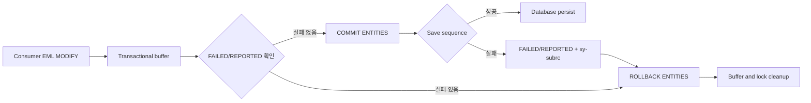

# NEWCH24_OLDCH23_REWRITE · RAP / ABAP Cloud 입문

> 주 소스: `content/abap/CH23/_chapter.md`, `content/abap/CH23/CH23-L01.md` ~ `CH23-L09.md`
> 보조 참고: `.project-docs/09_CURRICULUM_LEDGER.md`, `.project-docs/11_KEYWORD_AUDIT.md`, `reference/codex_0629_v3/NEWCH23_OLDCH22_REWRITE.md`
> 목표: CH23을 Track-1의 마무리 장으로 재집필하여, CDS 모델 위에 RAP 트랜잭션 앱과 ABAP Cloud 원칙이 어떻게 올라가는지 입문자도 누락 없이 이해하게 한다.

## CH23 전체 설계

CH22에서 CDS View Entity는 데이터를 읽고 의미를 붙이는 모델 계층이었다. 하지만 실제 업무 앱은 읽기만으로 끝나지 않는다. 사용자는 예매를 생성하고, 좌석 수를 바꾸고, 취소 버튼을 누르고, 정원 초과 같은 오류를 즉시 돌려받아야 한다. Fiori 화면이나 OData 소비자는 같은 규칙을 일관되게 써야 한다.

RAP, 즉 ABAP RESTful Application Programming Model은 이 요구를 현대 SAP 방식으로 묶는다. CDS는 데이터 모델을 제공하고, Behavior Definition은 어떤 동작이 가능한지 선언하고, Behavior Implementation은 검증과 액션의 실제 로직을 넣고, Service Definition/Binding은 OData/Fiori로 노출한다. ABAP Cloud는 이 전체 개발을 업그레이드 안정적으로 운영하기 위한 규율을 제공한다.

비전공자에게 RAP가 어려운 이유는 문법이 많아서가 아니다. 계층이 많고 각 계층의 책임이 다르기 때문이다. CH23의 목표는 모든 RAP 고급 기능을 외우는 것이 아니라, 다음 질문에 정확히 답할 수 있게 하는 것이다.

| 질문 | 기대 답 |
|---|---|
| RAP는 CDS와 무엇이 다른가? | CDS는 모델이고 RAP는 모델 위에 트랜잭션 동작과 서비스 노출까지 얹는 애플리케이션 모델이다. |
| managed와 unmanaged는 무엇이 다른가? | managed는 표준 CUD와 buffer/save를 RAP provider가 맡고, unmanaged는 기존 로직을 behavior pool에서 직접 연결한다. |
| Root Interface View는 왜 필요한가? | RAP BO의 트랜잭션 기준점이 되는 root entity를 만들기 위해서다. |
| Projection View는 왜 다시 필요한가? | 소비자에게 노출할 필드와 계약을 별도로 잡아 기반 모델을 보호하기 위해서다. |
| BDEF는 무엇인가? | 엔티티가 create/update/delete/action/validation/determination 중 무엇을 할 수 있는지 선언하는 동작 계약이다. |
| Behavior Pool은 무엇인가? | BDEF에서 선언한 검증, 결정, 액션 같은 구현 필요 로직을 담는 ABAP class pool이다. |
| EML transaction은 어디서 저장되는가? | 외부 consumer는 `MODIFY ENTITIES`로 transactional buffer를 바꾸고 `COMMIT ENTITIES`로 save sequence를 트리거한다. provider 내부에서는 직접 commit/rollback하지 않는다. |
| Service Definition/Binding은 무엇을 하는가? | 무엇을 노출할지 정하고, 어떤 프로토콜로 외부에 열지 연결한다. |
| ABAP Cloud와 Clean Core는 왜 나오는가? | 신규 SAP 개발에서 released API와 업그레이드 안정성을 지키기 위한 개발 모델이기 때문이다. |

## CH23 R15 경계

CH23은 Track-1 마지막 장이다. CDS, modern syntax, modern SQL, OO를 모두 학습한 뒤라 RAP 문법을 소개할 수 있다. 그러나 CH23은 "RAP 입문"이지 Track-2 실무 데이터 변경 전체를 대체하지 않는다.

| 구분 | CH23에서 정식 사용 | CH23에서 보류 |
|---|---|---|
| RAP 큰 그림 | RAP 계층, managed/unmanaged, RAP BO, OData/Fiori 연결 | RAP BO contract 전체 세부, draft 고급 |
| CDS | `define root view entity`, `provider contract transactional_query`, `ZI_`/`ZC_` | complex composition tree, hierarchy, analytical query |
| BDEF | `managed implementation in class ... unique`, `persistent table`, `lock master`, `create/update/delete`, `field`, `mapping` | unmanaged save, late numbering, deep composition, authorization master 심화 |
| Behavior Pool | `cl_abap_behavior_handler`, `FOR VALIDATE`, `FOR DETERMINE`, `FOR MODIFY` 개요 | saver class, local lock 구현, cross-BO contract 세부 |
| EML | handler 내부 `READ ENTITIES ... IN LOCAL MODE`, response `failed/reported`, consumer/provider 경계, transactional buffer, 외부 consumer의 `MODIFY ENTITIES` -> `COMMIT ENTITIES`/`ROLLBACK ENTITIES` 지도 | 완전한 consumer 프로그램 실습, late numbering, dynamic EML, unmanaged saver 상세 |
| Service | `define service`, `expose`, service binding, OData V4/UI preview | Gateway 운영, API lifecycle, communication arrangement 상세 |
| ABAP Cloud | released API, ADT 중심, SAP GUI 제한, Clean Core 개념 | 실제 ATC variant, package release contract, 3-tier extensibility 심화 |
| Track-2 경계 | RAP가 DB 변경을 추상화한다는 관점 | SQL `INSERT/UPDATE/MODIFY/DELETE`, `COMMIT WORK`, `ROLLBACK WORK`, Lock Object 직접 제어 |

중요한 구분이 있다. CH23의 `create; update; delete;`는 BDEF 안에서 RAP BO가 허용하는 표준 operation을 선언하는 문법이다. CH24의 SQL DML인 `INSERT`, `UPDATE`, `MODIFY`, `DELETE`와 다르다. CH23에서 직접 DB 테이블을 변경하는 ABAP SQL 예제를 만들지 않는다.

## 공식 문서 수동 확인 근거

RAP/BDL/EML/Service 관련 표준 문서는 `C:\ABAP_DOCU_DOWNLOAD\ABAP_DOCU\abap-docs-main\docs\standard\md`에서, ABAP Cloud 관련 문서는 `C:\ABAP_DOCU_DOWNLOAD\ABAP_DOCU\abap-docs-main\docs\cloud\md`에서 수동 확인했다.

| 주제 | 확인 문서 | 반영 포인트 |
|---|---|---|
| ABAP Cloud | `ABENABAP_CLOUD_GLOSRY.md` | ABAP Cloud는 cloud-ready, upgrade-stable 개발 모델이며 released API와 ADT 제한을 갖는다. |
| RAP 개요 | `ABENARAP_GLOSRY.md`, `ABENABAP_RAP.md` | RAP는 CDS entities와 behavior definitions 기반의 transactional programming model이다. |
| BDL/BDEF | `ABENBDL.md`, `ABENBDL_DEFINE_BEH.md`, `ABENBDL_BDEF_HEADER.md`, `ABENBDL_IMPL_TYPE.md` | managed/unmanaged, `define behavior for`, implementation class, strict, root entity 기준 |
| Persistent/Lock | `ABENBDL_PERSISTENT_TABLE.md`, `ABENBDL_LOCKING.md` | managed RAP BO의 persistent table, lock master, lock dependent 개념 |
| Operations | `ABENBDL_OPERATIONS.md` | standard operations와 action/function 같은 non-standard operation 구분 |
| Behavior Pool | `ABENABAP_BEHAVIOR_POOLS.md` | global class가 직접 구현하는 것이 아니라 local handler/saver class가 구현 담당 |
| Validation/Determination/Action | `ABENBDL_VALIDATIONS.md`, `ABENBDL_DETERMINATIONS.md`, `ABENBDL_ACTION.md` | validation은 save sequence에서 거부 가능, determination은 자동 계산, action은 custom operation |
| EML | `ABAPREAD_ENTITY_ENTITIES.md`, `ABAPREAD_ENTITY_ENTITIES_FIELDS.md`, `ABAPMODIFY_ENTITY_ENTITIES.md`, `ABAPCOMMIT_ENTITIES.md`, `ABAPROLLBACK_ENTITIES.md`, `ABAPIN_LOCAL_MODE.md`, `ABAPEML_RESPONSE.md`, `ABENRAP_SAVE_SEQ_GLOSRY.md` | `READ ENTITIES`, `MODIFY ENTITIES`, `COMMIT ENTITIES`, `ROLLBACK ENTITIES`, `IN LOCAL MODE`, transactional buffer, save sequence, `FAILED/MAPPED/REPORTED` |
| Service | `ABENSRVD_DEFINE_SERVICE.md`, `ABENCDS_SERVICE_BINDINGS.md` | `define service`, `expose`, service binding이 protocol에 연결 |

## CH23-L01 · RAP 아키텍처 개요

### 왜 필요한가

CH22의 CDS는 "데이터를 어떻게 읽고 모델링할 것인가"에 답했다. 그런데 콘서트 예매 앱은 읽기만으로 완성되지 않는다. 사용자는 예매를 만들고, 취소하고, 정원 초과를 막고, Fiori 화면에서 결과를 확인해야 한다. 개발자는 이 모든 동작이 API, UI, 테스트, 권한에서 같은 규칙으로 움직이게 해야 한다.

예전 방식으로는 화면별로 저장 로직을 만들고, 리포트별로 검증을 만들고, 서비스별로 또 다른 코드를 붙이기 쉽다. 이렇게 되면 같은 "정원 초과 예매 금지" 규칙이 어떤 화면에서는 적용되고 어떤 API에서는 빠지는 사고가 난다.

RAP는 이 흩어진 책임을 계층으로 정리한다.

### 무엇인가

```text
Fiori Elements / External Consumer
        |
        | OData
        v
Service Binding
        |
Service Definition
        |
Projection View (ZC_*)
        |
Behavior Definition / Behavior Implementation
        |
Root Interface View (ZI_*)
        |
Database Table (ZBOOKING, ZCONCERT, ZPERF)
```

| 계층 | 책임 |
|---|---|
| DB Table | 실제 데이터를 저장한다. |
| Root Interface View | RAP BO의 기반 데이터 모델이다. |
| Projection View | 소비자에게 보여 줄 모델이다. |
| Behavior Definition | 가능한 동작을 선언한다. |
| Behavior Implementation | 검증, 결정, 액션의 실제 로직을 구현한다. |
| Service Definition | 어떤 entity를 외부에 노출할지 정한다. |
| Service Binding | OData 같은 프로토콜로 연결하고 URL/preview를 제공한다. |

managed와 unmanaged의 구분은 저장 책임을 누가 갖는가에 가깝다.

| 방식 | 의미 | 적합한 상황 |
|---|---|---|
| managed | RAP managed provider가 standard operation과 transactional buffer를 처리한다. | 신규 개발, 단순하고 표준적인 CUD |
| unmanaged | behavior pool에서 standard operation까지 직접 구현한다. | 기존 저장 로직, 레거시 통합, 특수 처리 |

CH23은 신규 개발 입문이므로 managed 중심으로 설명한다.

### 어떻게 확인하는가

1. `ZBOOKING` 같은 persistent table이 있는지 확인한다.
2. 그 위에 `ZI_Booking` root interface view가 있는지 본다.
3. `ZC_Booking` projection view가 있는지 본다.
4. BDEF에서 `define behavior for ZI_Booking`이 있는지 확인한다.
5. Service Definition이 `ZC_Booking`을 expose하는지 확인한다.
6. Service Binding이 활성화되어 preview 또는 OData URL을 제공하는지 확인한다.

### 실수와 주의

- RAP는 CDS의 다른 이름이 아니다. CDS는 모델이고 RAP는 트랜잭션과 서비스까지 포함한다.
- UI부터 만들면 계층이 뒤집힌다. RAP에서는 데이터 모델과 behavior가 먼저다.
- managed라고 해서 검증이 필요 없다는 뜻은 아니다. standard CUD는 맡겨도 비즈니스 규칙은 선언하고 구현해야 한다.
- CH23에서는 RAP 개념을 잡고, SQL DML과 LUW 세부는 CH24로 넘긴다.

### 체험형 학습 설계

**RAP 계층 조립 지도**

| 요소 | 설계 |
|---|---|
| 데이터 | `ZBOOKING`, `ZI_Booking`, `ZC_Booking`, BDEF, Service Definition, Binding card |
| 버튼 | `계층 순서 맞추기`, `managed/unmanaged 비교`, `빠진 계층 찾기` |
| 상태 | selected layer, upstream dependency, downstream consumer |
| 피드백 | Service Binding만 있고 BDEF가 없으면 "읽기 서비스는 가능하지만 트랜잭션 동작이 없음"처럼 계층 누락 결과를 보여 준다. |

### 정리

RAP는 하나의 문법이 아니라 계층 구조다. CH23을 이해하려면 각 계층이 왜 있는지, 어느 계층이 어떤 책임을 갖는지 먼저 잡아야 한다.

## CH23-L02 · Interface View `ZI_*` 설계 (Root)

### 왜 필요한가

RAP 앱은 "무엇을 하나의 업무 객체로 볼 것인가"를 먼저 정해야 한다. 콘서트 예매 앱에서는 `ZBOOKING` 한 건이 업무의 중심이다. 한 건의 예매는 고객, 공연, 회차, 좌석 수, 상태를 가진다. 사용자가 생성하고 취소하는 대상도 예매다.

그래서 `ZBOOKING` 위에 root interface view를 만든다. root는 RAP BO의 출발점이고, OData entity key와 behavior 대상의 기준이 된다.

### 무엇인가

```abap
@AccessControl.authorizationCheck: #NOT_REQUIRED
@EndUserText.label: 'Booking root interface view'
define root view entity ZI_Booking
  as select from zbooking
  association [1..1] to ZI_Concert as _Concert
    on $projection.concert_id = _Concert.concert_id
{
  key booking_id,
      concert_id,
      perf_no,
      customer,
      seats,
      status,
      _Concert
}
```

| 구성 | 의미 |
|---|---|
| `define root view entity` | RAP BO의 root entity로 쓸 CDS view entity다. |
| `key booking_id` | 예매 인스턴스를 식별하는 키다. |
| `association [1..1] to ZI_Concert` | 예매가 어떤 공연에 속하는지 관계를 선언한다. |
| `_Concert` | 소비자나 projection이 공연 정보를 따라갈 수 있도록 관계를 노출한다. |

root 설계에서 가장 중요한 것은 key다. key가 불안정하면 URL, update 대상, action 대상, message mapping이 모두 불안정해진다.

### 어떻게 확인하는가

1. `ZBOOKING`의 key 필드를 확인한다.
2. `ZI_Booking`을 만들고 `define root view entity`로 선언한다.
3. `booking_id`가 key로 지정되어 있는지 확인한다.
4. `concert_id`, `perf_no`, `seats`, `status`처럼 behavior에 필요한 필드가 빠지지 않았는지 확인한다.
5. association target인 `ZI_Concert`가 활성화되어 있는지 확인한다.

### 실수와 주의

- root를 빼고 일반 view entity로 만들면 RAP BO의 기준점이 약해진다.
- key를 화면 표시용 번호처럼 가볍게 잡으면 수정/취소 대상이 흔들린다.
- association을 선언해도 select list에 노출하지 않으면 소비자가 따라가기 어렵다.
- `@AccessControl.authorizationCheck: #NOT_REQUIRED`는 학습 단순화다. 실무 권한은 별도 설계해야 한다.

### 체험형 학습 설계

**Root Entity 설계 검사기**

| 요소 | 설계 |
|---|---|
| 데이터 | `ZBOOKING` field 목록과 candidate key 목록 |
| 버튼 | `root 지정`, `key 선택`, `association 연결`, `활성화 검사` |
| 상태 | root flag, key stability, required fields, active associations |
| 피드백 | key 누락 시 "RAP instance를 식별할 수 없음", target view 미활성화 시 "association 활성화 실패"를 표시한다. |

### 정리

`ZI_Booking`은 예매 RAP BO의 뿌리다. root interface view를 안정적으로 잡아야 BDEF, Service, Fiori 동작이 그 위에 제대로 올라간다.

## CH23-L03 · Projection View `ZC_*` 설계

### 왜 필요한가

`ZI_Booking`은 기반 모델이다. 기반 모델은 내부 규칙과 관계를 안정적으로 담아야 한다. 그러나 외부 소비자에게 그대로 보여 주면 내부 필드나 아직 공개하고 싶지 않은 관계까지 노출될 수 있다.

Projection View는 소비자에게 보여 줄 모양을 따로 만든다. CH22에서 배운 `ZI_`/`ZC_` 분리가 RAP에서 더 중요해진다. 서비스와 Fiori는 보통 projection을 바라본다.

### 무엇인가

```abap
@AccessControl.authorizationCheck: #NOT_REQUIRED
@Metadata.allowExtensions: true
@EndUserText.label: 'Booking consumption view'
define root view entity ZC_Booking
  provider contract transactional_query
  as projection on ZI_Booking
{
  key booking_id,
      concert_id,
      perf_no,
      customer,
      seats,
      status,
      _Concert
}
```

| 구성 | 의미 |
|---|---|
| `as projection on ZI_Booking` | 기반 root interface view를 소비용으로 투영한다. |
| `provider contract transactional_query` | RAP transactional query 소비 계약을 명시한다. |
| `@Metadata.allowExtensions: true` | UI annotation을 Metadata Extension으로 분리할 수 있게 한다. |
| `_Concert` | 필요한 association을 소비 계층에도 노출한다. |

Projection은 "복사본"이 아니다. 기반 모델을 소비 목적에 맞게 보여 주는 계약이다.

### 어떻게 확인하는가

1. `ZI_Booking`이 활성화된 상태에서 `ZC_Booking`을 만든다.
2. `provider contract transactional_query`가 있는지 확인한다.
3. Data Preview에서 `ZI_Booking`과 `ZC_Booking`의 필드 노출 차이를 비교한다.
4. `@Metadata.allowExtensions: true`를 넣고 UI annotation을 DDLX로 분리할 준비를 한다.

### 실수와 주의

- 기반 `ZI_`를 바로 service에 노출하면 내부 모델과 소비 계약이 섞인다.
- projection의 header annotation이 기반에서 자동으로 다 넘어온다고 가정하면 안 된다.
- provider contract는 그냥 장식이 아니다. projection view가 어떤 시나리오에서 쓰이는지 명시한다.
- CH23에서는 projection behavior definition 심화는 다루지 않고, 소비 view 관점에 집중한다.

### 체험형 학습 설계

**Projection 노출 범위 조절기**

| 요소 | 설계 |
|---|---|
| 데이터 | `ZI_Booking` 전체 필드와 `ZC_Booking` 노출 필드 |
| 버튼 | `필드 노출`, `필드 숨김`, `association 노출`, `contract 켜기` |
| 상태 | exposed fields, hidden fields, service-visible fields |
| 피드백 | 내부 필드를 숨기면 service metadata에서 사라지고, 기반 view에는 그대로 남는 차이를 보여 준다. |

### 정리

`ZC_Booking`은 외부 소비자를 위한 계약이다. RAP에서는 기반 모델과 소비 모델을 나누는 습관이 이후 Fiori, API, 확장 안정성을 좌우한다.

## CH23-L04 · Behavior Definition 기초

### 왜 필요한가

CDS만 있으면 데이터를 읽을 수 있다. 하지만 사용자가 예매를 생성할 수 있는지, 수정할 수 있는지, 취소 action이 있는지, 어떤 필드가 readonly인지, 어떤 테이블이 persistent table인지 알 수 없다.

BDEF, 즉 Behavior Definition은 이 비어 있는 동작 계약을 채운다. "이 business object는 어떤 일을 할 수 있는가"를 선언한다.

### 무엇인가

```abap
managed implementation in class zbp_i_booking unique;
strict ( 2 );

define behavior for ZI_Booking alias Booking
persistent table zbooking
lock master
{
  create;
  update;
  delete;

  field ( readonly ) booking_id;

  mapping for zbooking
  {
    booking_id = booking_id;
    concert_id = concert_id;
    perf_no    = perf_no;
    customer   = customer;
    seats      = seats;
    status     = status;
  }
}
```

| 구성 | 의미 |
|---|---|
| `managed` | standard operation을 managed RAP BO provider가 처리한다. |
| `implementation in class zbp_i_booking unique` | 필요한 custom logic이 들어갈 behavior pool class를 지정한다. |
| `strict ( 2 )` | 엄격한 BDEF 검사 모드다. |
| `define behavior for ZI_Booking alias Booking` | root entity의 behavior를 정의하고 짧은 alias를 준다. |
| `persistent table zbooking` | 실제 저장 기반 테이블이다. |
| `lock master` | 이 root가 lock master임을 선언한다. |
| `create; update; delete;` | RAP standard operation을 허용한다. |
| `field ( readonly ) booking_id` | 외부에서 직접 바꾸면 안 되는 필드를 제한한다. |
| `mapping for zbooking` | CDS element와 DB table field 연결을 명시한다. |

여기서 `create`, `update`, `delete`는 SQL DML이 아니다. BDEF의 standard operation 허용 선언이다.

### 어떻게 확인하는가

1. BDEF source가 `managed`로 시작하는지 확인한다.
2. root entity 이름이 실제 `ZI_Booking`과 일치하는지 확인한다.
3. `persistent table zbooking`이 존재하는 DDIC table인지 확인한다.
4. `lock master`가 root entity에 지정되어 있는지 확인한다.
5. 필드명이 CDS와 DB에서 다르면 mapping이 정확한지 확인한다.

### 실수와 주의

- `persistent table`은 managed RAP BO에서 핵심이다. 어떤 테이블을 기반으로 하는지 명확해야 한다.
- `lock master`를 이해하지 않고 복사하면 동시 수정 제어 설계를 놓친다.
- key field를 editable로 열어 두면 instance 식별이 흔들릴 수 있다.
- BDEF의 `update;`와 ABAP SQL `UPDATE`를 혼동하지 않는다.
- raw SQL DML, `COMMIT WORK`, `ROLLBACK WORK`는 CH24 주제다.

### 체험형 학습 설계

**BDEF 계약 조립대**

| 요소 | 설계 |
|---|---|
| 데이터 | entity `ZI_Booking`, table `ZBOOKING`, field mapping 목록 |
| 버튼 | `managed 선택`, `operation 켜기`, `readonly 지정`, `mapping 검사`, `lock master 지정` |
| 상태 | operations enabled, persistent table, readonly fields, mapping errors |
| 피드백 | mapping 누락, key editable, persistent table 불일치, lock 누락을 각각 다른 경고로 표시한다. |

### 정리

BDEF는 RAP BO의 동작 계약이다. 데이터 모델이 "무엇인가"를 말한다면, BDEF는 "무엇을 할 수 있는가"를 말한다.

## CH23-L05 · Behavior Implementation 기초

### 왜 필요한가

BDEF에서 `create; update; delete;`를 선언하면 managed RAP가 standard operation의 많은 부분을 맡는다. 그러나 업무 규칙은 자동으로 생기지 않는다. 예매 좌석이 정원을 넘는지, 생성 시 상태를 무엇으로 둘지, 취소 action이 어떤 상태 변경을 해야 하는지는 개발자가 구현해야 한다.

이 구현이 들어가는 곳이 Behavior Pool이다.

### 무엇인가

Behavior Pool은 RAP behavior implementation을 위한 특수 class pool이다. 공식 문서 기준으로 global class 자체가 모든 로직을 직접 구현하는 것이 아니라, local handler class와 saver class가 실제 구현 책임을 가진다. CH23에서는 handler class 중심으로 이해한다.

```abap
CLASS lhc_booking DEFINITION
  INHERITING FROM cl_abap_behavior_handler.
  PRIVATE SECTION.
    METHODS validate_capacity FOR VALIDATE ON SAVE
      IMPORTING keys FOR Booking~validateCapacity.
ENDCLASS.

CLASS lhc_booking IMPLEMENTATION.
  METHOD validate_capacity.
    " CH23-L07에서 READ ENTITIES로 대상 예매를 읽고 failed/reported를 채운다.
  ENDMETHOD.
ENDCLASS.
```

| 요소 | 의미 |
|---|---|
| `lhc_booking` | local handler class다. |
| `cl_abap_behavior_handler` | RAP handler class의 기반 클래스다. |
| `FOR VALIDATE ON SAVE` | validation 구현 메서드임을 나타낸다. |
| `IMPORTING keys` | 처리 대상 instance key 집합이다. |
| `Booking~validateCapacity` | BDEF alias와 validation 이름에 연결된다. |

RAP handler는 단건 사고로 작성하면 안 된다. 여러 instance가 한 요청에 들어올 수 있으므로 `keys`를 집합으로 보고 처리해야 한다.

### 어떻게 확인하는가

1. BDEF의 implementation class 이름과 Behavior Pool 객체 이름이 연결되어 있는지 확인한다.
2. BDEF에 선언한 validation/action/determination 이름과 handler method 이름이 맞는지 확인한다.
3. method signature의 `FOR VALIDATE`, `FOR MODIFY`, `FOR DETERMINE`이 목적과 맞는지 확인한다.
4. `keys`를 단건으로 가정하지 않고 LOOP 또는 set 기반으로 처리하는지 확인한다.

### 실수와 주의

- managed라고 해서 behavior pool이 항상 필요 없는 것은 아니다. validation, determination, action을 추가하면 구현이 필요하다.
- handler method에서 한 건만 읽는 코드를 반복 호출하면 성능과 일관성이 떨어진다.
- 검증 실패는 예외를 무작정 던지는 방식이 아니라 `failed`와 `reported` response로 소비자에게 알려야 한다.
- saver class, unmanaged save, lock method 직접 구현은 CH23 입문 범위를 넘어선다.

### 체험형 학습 설계

**Behavior Pool 호출 흐름 추적기**

| 요소 | 설계 |
|---|---|
| 데이터 | BDEF 선언 목록과 handler method 목록 |
| 버튼 | `validation 호출`, `action 호출`, `keys 다건 입력`, `failed/reported 확인` |
| 상태 | trigger type, keys count, handler method, response table |
| 피드백 | BDEF 이름과 method signature가 불일치하면 "선언은 있지만 구현 연결 실패"를 보여 준다. |

### 정리

Behavior Pool은 RAP의 업무 규칙 구현 공간이다. CH20에서 배운 클래스 지식이 여기서 실제 SAP 앱의 검증과 action 구현으로 이어진다.

## CH23-L06 · Service Definition / Service Binding

### 왜 필요한가

RAP BO를 만들었더라도 외부 소비자가 접근할 길이 없으면 앱이 아니다. Fiori 화면, 외부 OData client, 테스트 도구가 사용할 수 있도록 무엇을 노출할지와 어떤 프로토콜로 노출할지를 정해야 한다.

Service Definition과 Service Binding은 이 두 질문을 분리한다.

### 무엇인가

Service Definition은 무엇을 노출할지 정한다.

```abap
@EndUserText.label: 'Booking service'
define service ZUI_Booking {
  expose ZC_Booking as Booking;
  expose ZC_Concert as Concert;
}
```

Service Binding은 Service Definition을 OData 같은 프로토콜에 연결한다. ADT의 form 기반 도구에서 만들고 activate한다.

| 객체 | 질문 | 예 |
|---|---|---|
| Service Definition | 무엇을 노출할 것인가? | `ZC_Booking`, `ZC_Concert` |
| Service Binding | 어떻게 노출할 것인가? | OData V4 UI, OData V2, Web API |
| Preview | 어떻게 확인할 것인가? | ADT preview, metadata URL, Fiori Elements preview |

공식 문서 기준으로 Service Definition은 protocol 독립적이고, Service Binding이 protocol을 묶어 business service로 제공한다.

### 어떻게 확인하는가

1. Service Definition에 `expose ZC_Booking as Booking;`이 있는지 확인한다.
2. association target을 함께 노출해야 하는지 확인한다. 예: `Booking`에서 `Concert`로 이동한다면 `Concert`도 expose하는 편이 좋다.
3. Service Binding을 만들고 OData V4 UI 같은 binding type을 선택한다.
4. Activate 후 ADT에서 service URL과 preview가 보이는지 확인한다.
5. `$metadata` 또는 preview에서 `Booking` entity가 노출되는지 확인한다.

### 실수와 주의

- Service Definition에 expose하지 않은 CDS entity는 binding에서 보이지 않는다.
- Service Definition만 만들고 Service Binding을 활성화하지 않으면 URL이 생기지 않는다.
- OData UI binding과 Web API binding은 소비 목적이 다르다.
- Service가 보인다고 해서 business rule이 자동으로 맞는 것은 아니다. BDEF와 behavior implementation이 함께 맞아야 한다.

### 체험형 학습 설계

**OData 노출 파이프라인**

| 요소 | 설계 |
|---|---|
| 데이터 | service definition entities, binding type, activation state, URL |
| 버튼 | `expose 추가`, `binding 생성`, `activate`, `metadata 보기`, `preview 열기` |
| 상태 | exposed entities, protocol, active flag, preview available |
| 피드백 | expose 누락 시 metadata에 entity가 없고, binding 미활성화 시 URL이 없음을 보여 준다. |

### 정리

Service Definition은 노출 목록이고 Service Binding은 프로토콜 연결이다. 둘을 구분하면 "CDS는 만들었는데 화면이 안 뜬다" 같은 문제를 단계별로 추적할 수 있다.

## CH23-L07 · Validation / Determination / Action 개요

### 왜 필요한가

예매 앱의 핵심은 단순 저장이 아니다. 정원을 넘는 예매는 막아야 하고, 새 예매의 기본 상태는 자동으로 채워야 하며, 사용자는 취소 버튼을 눌러 상태를 바꿀 수 있어야 한다.

RAP는 이런 업무 로직을 세 가지로 나누어 생각한다.

| 종류 | 언제 실행되는가 | 예매 앱 예 |
|---|---|---|
| Validation | save sequence에서 일관성을 검사한다. | 정원 초과 예매 거부 |
| Determination | modify 또는 save 시 값을 자동 계산/보정한다. | 생성 시 status를 `N`으로 기본 설정 |
| Action | 사용자가 명시적으로 실행하는 custom operation이다. | cancel action으로 예매 취소 |

### 무엇인가

BDEF에 업무 로직을 선언한다.

```abap
define behavior for ZI_Booking alias Booking
{
  validation validateCapacity on save { field seats, concert_id, perf_no; }
  determination setInitialStatus on modify { create; }
  action cancel result [1] $self;
}
```

Validation 구현에서는 EML `READ ENTITIES`로 대상 예매를 읽고, 실패 대상은 `failed`와 `reported`에 채운다.

```abap
METHOD validate_capacity.
  READ ENTITIES OF zi_booking IN LOCAL MODE
    ENTITY Booking
    FIELDS ( concert_id perf_no seats )
    WITH CORRESPONDING #( keys )
    RESULT DATA(lt_booking)
    FAILED DATA(lt_failed).

  failed = CORRESPONDING #( DEEP lt_failed ).

  LOOP AT lt_booking INTO DATA(ls_booking).
    " 회차 정원과 이미 예약된 좌석 합계를 읽어 정원 초과 여부를 판단한다.
    " 초과하면 failed-booking과 reported-booking에 같은 %tky 기준으로 메시지를 넣는다.
  ENDLOOP.
ENDMETHOD.
```

공식 문서에서 validation은 실패 시 current RAP transaction의 transactional buffer가 거부될 수 있고, failed/reported로 실패 대상과 메시지를 알려야 한다. 또한 validation 안에서 EML `MODIFY`를 쓰는 것은 허용되지 않는다. 그러므로 validation은 "고치기"가 아니라 "검사하고 거부하기"로 설계한다.

### 어떻게 확인하는가

1. BDEF에 validation/determination/action 선언이 있는지 확인한다.
2. Behavior Pool에 대응 method가 생성되었는지 확인한다.
3. 정원 초과 테스트 데이터를 넣고 save 시 실패 메시지가 돌아오는지 확인한다.
4. 새 예매 생성 시 status 기본값이 들어가는지 확인한다.
5. cancel action을 실행했을 때 대상 instance의 status가 취소 상태가 되는지 확인한다.

### 실수와 주의

- validation은 저장 전 검사다. 값을 자동으로 채우는 코드는 determination에 둔다.
- action은 사용자가 명시적으로 누르는 동작이다. 모든 규칙을 action에 몰아넣으면 save 검증이 빈다.
- validation 안에서 EML `MODIFY`를 쓰지 않는다.
- `IN LOCAL MODE`는 behavior implementation 내부에서 해당 RAP BO를 다룰 때 쓰는 개념이다. 아무 ABAP 프로그램에서 편하게 붙이는 옵션이 아니다.
- `failed`만 채우고 `reported` 메시지를 누락하면 사용자는 왜 실패했는지 알기 어렵다.

### 체험형 학습 설계

**RAP 업무 로직 분류 퀴즈**

| 요소 | 설계 |
|---|---|
| 데이터 | 시나리오 카드: 정원 초과, 기본 상태, 취소 버튼, 가격 재계산 |
| 버튼 | `Validation`, `Determination`, `Action` |
| 상태 | selected scenario, chosen logic type, expected trigger |
| 피드백 | 정원 초과를 action으로 고르면 "저장 경로에서 누락될 수 있음"을 보여 주고, 기본 상태를 validation으로 고르면 "검사는 값을 채우는 책임이 아님"을 알려 준다. |

### 정리

Validation, Determination, Action은 RAP 업무 로직의 기본 세트다. 각각의 실행 시점과 책임을 분리하면 앱의 규칙이 예측 가능해진다.

## CH23-L08 · EML Transaction 지도: Consumer, Provider, Transactional Buffer

### 왜 필요한가

CH23 앞부분에서 BDEF와 Behavior Pool을 만들었다. 이제 입문자가 반드시 이해해야 할 질문이 하나 남는다.

"예매를 생성한다는 것은 실제로 언제 DB에 저장된다는 뜻인가?"

RAP에서는 이 질문이 단순하지 않다. `MODIFY ENTITIES`를 실행했다고 즉시 DB table에 저장되는 것이 아니다. 먼저 RAP transactional buffer에 변경 요청이 쌓이고, save sequence가 성공해야 DB에 반영된다. Fiori처럼 RAP runtime이 transaction owner인 시나리오에서는 runtime이 commit/rollback을 처리하지만, 일반 ABAP 프로그램이나 테스트 코드처럼 외부 RAP BO consumer가 EML을 직접 호출하면 `COMMIT ENTITIES`와 실패 처리를 이해해야 한다.

이 구분을 모르면 두 가지 실수가 생긴다.

- 외부 프로그램에서 `MODIFY ENTITIES`만 호출하고 저장됐다고 착각한다.
- Behavior Pool 내부에서 `COMMIT ENTITIES`나 `ROLLBACK ENTITIES`를 직접 호출하려 한다.

둘 다 RAP contract를 깨는 방향이다.

### 무엇인가

먼저 역할을 나눈다.

| 역할 | 위치 | 할 수 있는 일 | 하면 안 되는 일 |
|---|---|---|---|
| RAP BO consumer | Fiori runtime, 외부 ABAP 프로그램, 테스트 코드, 수동 EML 호출자 | `MODIFY ENTITIES`, `READ ENTITIES`, 필요 시 `COMMIT ENTITIES`, 실패 시 `ROLLBACK ENTITIES` | `FAILED`/`REPORTED`를 무시하고 성공으로 처리 |
| RAP BO provider | Behavior Pool, handler method, saver method | validation, determination, action 구현. 같은 BO 내부 읽기/수정에 `IN LOCAL MODE` 사용 | provider 내부에서 `COMMIT ENTITIES`/`ROLLBACK ENTITIES` 호출 |
| RAP transactional engine | RAP runtime | interaction phase, save sequence, transactional buffer, lock, cleanup 조정 | 개발자가 임의로 우회할 대상이 아님 |

공식 문서 기준으로 외부 consumer의 핵심 흐름은 다음이다.

```text
1. MODIFY ENTITIES
   - RAP BO instance에 create/update/delete/action 요청
   - 변경은 transactional buffer에 쌓임
   - FAILED/MAPPED/REPORTED로 즉시 처리 결과 확인

2. COMMIT ENTITIES
   - RAP save sequence 트리거
   - validation 등 save 단계 검사 수행
   - 모두 유효하면 DB에 반영
   - 하나라도 실패하면 all-or-nothing 원칙으로 저장 실패

3. ROLLBACK ENTITIES
   - 현재 RAP transaction의 transactional buffer와 lock 정리
   - 명시적 중단, 실패 후 재시도 전 정리에 사용
```

읽기용 skeleton은 다음처럼 볼 수 있다. 이 코드는 CH23에서 "외우고 작성"하기 위한 최종 실습이 아니라, CH36 capstone에서 본격 구현할 흐름을 미리 읽는 지도다.

```abap
" 외부 RAP BO consumer 관점의 흐름 지도
MODIFY ENTITIES OF zi_booking
  ENTITY Booking
  CREATE FIELDS ( booking_id concert_id perf_no customer seats )
  WITH VALUE #(
    ( %cid       = 'B1'
      booking_id = 'B0001'
      concert_id = 'C001'
      perf_no    = 1
      customer   = '정훈영'
      seats      = 2 ) )
  MAPPED   DATA(mapped)
  FAILED   DATA(failed)
  REPORTED DATA(reported).

IF failed IS INITIAL.
  COMMIT ENTITIES RESPONSE OF zi_booking
    FAILED   DATA(failed_commit)
    REPORTED DATA(reported_commit).

  IF sy-subrc <> 0 OR failed_commit IS NOT INITIAL.
    ROLLBACK ENTITIES.
  ENDIF.
ELSE.
  ROLLBACK ENTITIES.
ENDIF.
```

여기서 중요한 것은 문장 이름보다 상태 변화다.

| 단계 | 데이터 위치 | 확인할 것 |
|---|---|---|
| `MODIFY ENTITIES` 직후 | transactional buffer | `failed`, `mapped`, `reported` |
| `COMMIT ENTITIES` 실행 중 | save sequence | validation 실패, save 실패, `sy-subrc`, commit response |
| commit 성공 후 | database | 이후 조회에서 실제 저장 확인 |
| `ROLLBACK ENTITIES` 후 | buffer 정리 | 저장되지 않아야 할 변경이 사라졌는지 확인 |

`IN LOCAL MODE`는 별도로 이해해야 한다. 이 addition은 아무 프로그램에서 편하게 붙이는 옵션이 아니다. 공식 문서 기준으로 현재는 해당 RAP BO 구현 내부, 즉 Behavior Pool 또는 그 구현에서 호출된 재사용 로직 안에서 같은 BO를 다룰 때 쓰는 성격이다. feature control과 authorization check를 우회할 수 있으므로, 외부 consumer가 "권한 문제를 피하려고" 붙이는 도구가 아니다.

### 어떻게 확인하는가

입문자는 처음부터 DB trace를 볼 필요는 없다. 대신 다음 관찰표로 흐름을 확인한다.

| 실험 | 예상 |
|---|---|
| `MODIFY ENTITIES` 후 commit을 하지 않는다. | DB에는 반영되지 않는다. 변경은 transactional buffer 수준으로 이해한다. |
| validation이 실패한 instance를 포함해 commit한다. | all-or-nothing 원칙 때문에 해당 RAP transaction의 저장이 실패한다. |
| 실패 후 `reported`를 확인한다. | 사용자에게 보여 줄 메시지와 field 표시 단서가 있어야 한다. |
| 실패 후 버퍼를 정리하지 않고 다음 변경을 시도한다. | invalid instance가 남아 다음 변경을 막을 수 있다. correction 또는 rollback이 필요하다. |
| provider 내부 action에서 `COMMIT ENTITIES`를 호출하려 한다. | provider 내부 commit은 금지 경계다. runtime/consumer가 transaction을 끝내야 한다. |

### 실수와 주의

- `MODIFY ENTITIES`는 DB commit이 아니다. transactional buffer를 바꾸는 요청이다.
- `COMMIT ENTITIES`는 RAP save sequence를 트리거한다. 일반 `COMMIT WORK`보다 RAP response와 key conversion 같은 RAP 문맥 정보를 다루기 좋다.
- Behavior Pool 내부에서 `COMMIT ENTITIES`와 `ROLLBACK ENTITIES`를 호출하지 않는다.
- Fiori/OData처럼 RAP runtime이 transaction owner인 경우에는 runtime이 commit/rollback을 수행한다. 개발자가 화면 action 안에 별도 commit을 넣는 식으로 이해하면 안 된다.
- `FAILED`를 받지 않는 `MODIFY ENTITIES`는 실패 처리를 놓치기 쉽다. 공식 문서도 consumer 쪽 proper error handling을 권장한다.
- EML을 `LOOP` 안에서 반복 호출하지 않는다. 가능한 한 한 번에 읽고, 한 번에 변경 요청을 구성한다.

### 체험형 학습 설계

**RAP Transaction Buffer Simulator**

| 요소 | 설계 |
|---|---|
| 데이터 | 예매 요청 3건: 정상 1건, 정원 초과 1건, 필수값 누락 1건 |
| 버튼 | `MODIFY 실행`, `FAILED 보기`, `COMMIT 실행`, `ROLLBACK 실행`, `Provider 내부 호출로 전환` |
| 상태 | `interactionPhase`, `bufferRows`, `failedRows`, `reportedMessages`, `commitSubrc`, `dbRows`, `providerMode` |
| 피드백 | commit 없이 DB 확인 시 "아직 transactional buffer입니다.", provider mode에서 commit 버튼 클릭 시 "Behavior Pool 내부에서는 COMMIT ENTITIES를 호출하지 않습니다." 표시 |

프로세스 플로우:



### 정리

EML transaction을 이해하려면 consumer와 provider를 분리해야 한다. 외부 consumer는 `MODIFY ENTITIES`로 transactional buffer를 바꾸고 `COMMIT ENTITIES`로 save sequence를 끝낸다. provider인 Behavior Pool은 업무 규칙을 구현하지만 transaction을 직접 끝내지 않는다. 실패는 `FAILED`와 `REPORTED`로 소비자에게 설명하고, 필요한 경우 `ROLLBACK ENTITIES`로 buffer를 정리한다.

## CH23-L09 · ABAP Cloud와 Released API 원칙

### 왜 필요한가

지금까지 배운 Classic ABAP, Dynpro, ALV, SE11 기반 개발은 온프레미스와 유지보수에서 여전히 중요하다. 하지만 신규 SAP 개발, 특히 S/4HANA Cloud와 BTP ABAP Environment에서는 업그레이드 안정성이 더 중요하다. 표준 객체를 마음대로 수정하거나 비공개 API에 기대면 다음 업그레이드에서 깨질 수 있다.

ABAP Cloud는 이 문제를 개발 모델로 통제한다.

### 무엇인가

공식 문서 기준으로 ABAP Cloud는 cloud-ready, upgrade-stable solution을 위한 ABAP development model이다. 핵심 제한은 다음과 같다.

| 원칙 | 의미 |
|---|---|
| Restricted ABAP language version | 클라우드 개발에 허용된 언어 범위 안에서 개발한다. |
| Released API 사용 | 다른 repository object 접근은 ABAP for Cloud Development에 released된 API로 제한된다. |
| ADT 중심 | SAP GUI가 아니라 ABAP Development Tools for Eclipse를 사용한다. |
| RAP 중심 | ABAP Cloud의 transactional programming model은 RAP다. |
| Clean Core | 표준을 직접 바꾸지 않고 공개 확장 지점과 released API로 업그레이드 안정성을 지킨다. |

이 말은 classic 지식이 쓸모없다는 뜻이 아니다. 오히려 기존 시스템을 이해하려면 classic을 알아야 하고, 신규 개발 방향을 잡으려면 RAP/ABAP Cloud를 알아야 한다. 두 세계의 경계를 아는 것이 실무자의 힘이다.

### 어떻게 확인하는가

1. 개발 object의 ABAP language version을 확인한다.
2. 사용하는 class, interface, CDS, API가 released 상태인지 ADT에서 확인한다.
3. SAP GUI 전용 기술을 클라우드 신규 개발에 넣고 있지 않은지 점검한다.
4. 표준 수정이 아니라 확장 방식으로 요구사항을 해결하는지 확인한다.
5. RAP와 Service를 통해 외부 소비 계약을 만들고 있는지 확인한다.

### 실수와 주의

- `CL_*`로 시작한다고 모두 cloud-safe가 아니다. released 여부를 확인해야 한다.
- 표준 테이블을 직접 읽거나 변경하는 습관은 Clean Core와 충돌할 수 있다.
- "RAP를 쓴다"는 것만으로 Clean Core가 자동 보장되지는 않는다. API 선택과 확장 방식까지 봐야 한다.
- Dynpro, classic ALV, 일부 classic tool은 온프레미스 유지보수 맥락에서는 중요하지만 ABAP Cloud 신규 개발의 중심은 아니다.

### 체험형 학습 설계

**Released API 판별 카드**

| 요소 | 설계 |
|---|---|
| 데이터 | API 후보 카드: released CDS, unreleased table, classic FM, RAP service |
| 버튼 | `Cloud-safe`, `Classic-only`, `확인 필요` |
| 상태 | language version, release state, replacement suggestion |
| 피드백 | unreleased API를 고르면 "작동할 수는 있어도 업그레이드 안정성이 없음"을 보여 준다. |

### 정리

ABAP Cloud는 기술 하나가 아니라 개발 규율이다. CH23의 RAP는 이 규율 안에서 트랜잭션 앱을 만드는 표준 경로다.

## CH23-L10 · 실습: 예매 RAP 동작 구현

### 왜 필요한가

CH09부터 콘서트 예매 앱을 키워 왔다. DDIC 관계, 입력도움말, 모듈화, SALV, Dynpro, Grid ALV, OO, CDS를 거쳐 이제 예매를 RAP business object로 묶는다. Track-1의 마지막 실습은 "예매를 읽고 보여 주는 앱"에서 "예매를 생성하고 검증하고 취소하는 앱"으로 넘어가는 경험이다.

단, 이 실습은 Track-2의 직접 SQL DML 실습이 아니다. DB 변경은 RAP managed provider와 EML 흐름이 담당한다고 이해하고, 여기서는 선언과 검증/액션 구조를 익힌다.

### 무엇인가

실습 산출물은 네 가지다.

| 산출물 | 역할 |
|---|---|
| `ZI_Booking` | root interface view |
| `ZC_Booking` | transactional query projection |
| BDEF | create/update/delete, validation, determination, action 선언 |
| Service | Fiori/OData 노출 |

기본 BDEF는 다음처럼 잡는다.

```abap
managed implementation in class zbp_i_booking unique;
strict ( 2 );

define behavior for ZI_Booking alias Booking
persistent table zbooking
lock master
{
  create;
  update;
  delete;

  field ( readonly ) booking_id;

  validation validateCapacity on save { field seats, concert_id, perf_no; }
  determination setInitialStatus on modify { create; }
  action cancel result [1] $self;

  mapping for zbooking
  {
    booking_id = booking_id;
    concert_id = concert_id;
    perf_no    = perf_no;
    customer   = customer;
    seats      = seats;
    status     = status;
  }
}
```

정원 validation은 읽기와 실패 응답 설계가 핵심이다.

```abap
METHOD validate_capacity.
  READ ENTITIES OF zi_booking IN LOCAL MODE
    ENTITY Booking
    FIELDS ( concert_id perf_no seats )
    WITH CORRESPONDING #( keys )
    RESULT DATA(lt_booking)
    FAILED DATA(lt_failed).

  failed = CORRESPONDING #( DEEP lt_failed ).

  LOOP AT lt_booking INTO DATA(ls_booking).
    " 1. ls_booking의 concert_id/perf_no 기준으로 회차 정원을 읽는다.
    " 2. 이미 예약된 좌석 합계를 읽는다.
    " 3. 합계 + ls_booking-seats가 정원을 넘으면 failed/reported에 메시지를 넣는다.
  ENDLOOP.
ENDMETHOD.
```

상태 기본값은 determination으로 설계한다.

```abap
METHOD set_initial_status.
  " create로 들어온 예매의 status가 비어 있으면 'N'으로 보정한다.
  " 실제 변경은 RAP EML modify 흐름으로 처리하며, validation과 책임을 섞지 않는다.
ENDMETHOD.
```

취소는 action으로 설계한다.

```abap
METHOD cancel.
  " 사용자가 cancel action을 실행한 예매를 취소 상태 'C'로 변경한다.
  " 성공 시 result [1] $self로 변경된 자기 자신을 돌려주는 흐름을 설계한다.
ENDMETHOD.
```

CH23 실습에서는 skeleton과 책임 분리를 명확히 한다. 완전한 운영 수준의 save sequence, draft, authorization, lock 구현은 Track-2와 실무 심화에서 다룬다.

### 어떻게 확인하는가

1. `ZI_Booking`과 `ZC_Booking`이 모두 active인지 확인한다.
2. BDEF가 active인지 확인한다.
3. Behavior Pool에 validation/determination/action method가 생성되었는지 확인한다.
4. Service Definition과 Binding이 active인지 확인한다.
5. preview에서 예매 생성 시 정원 초과를 입력해 실패 메시지가 나오는지 확인한다.
6. 취소 action을 실행했을 때 status가 `C`로 바뀌는 흐름을 확인한다.

### 실수와 주의

- validation에서 직접 값을 바꾸려 하지 않는다. 검증은 실패를 표시한다.
- action과 determination의 책임을 섞지 않는다.
- `failed`와 `reported`는 같은 실패 상황을 소비자와 RAP runtime이 이해하도록 맞춰야 한다.
- `READ ENTITIES`를 LOOP 안에서 반복 호출하지 않는다. 필요한 데이터를 한 번에 읽고 내부에서 판정한다.
- SQL `UPDATE zbooking SET ...` 같은 직접 DB 변경으로 우회하지 않는다.

### 체험형 학습 설계

**Concert RAP Transaction Lab**

| 단계 | 버튼 | 상태 | 피드백 |
|---|---|---|---|
| 1 | `Root View 확인` | `ZI_Booking active`, key fields | root/key 누락 경고 |
| 2 | `BDEF 활성화` | operations, persistent table, lock master | mapping/readonly 오류 표시 |
| 3 | `Validation 테스트` | requested seats, capacity, booked sum | 초과 시 failed/reported 메시지 표시 |
| 4 | `Determination 테스트` | initial status, calculated status | status 기본값 자동 반영 |
| 5 | `Cancel Action` | current status, action result | result self와 status 변경 표시 |
| 6 | `Service Preview` | OData entity, Fiori list/object page | 노출 누락 또는 binding 비활성 경고 |

### 정리

CH23-L10은 Track-1의 종합 실습이다. CH22의 CDS 모델 위에 BDEF, Behavior Pool, Service를 얹어 예매 앱을 RAP 트랜잭션 앱으로 끌어올린다. 여기까지가 Track-1의 큰 한 바퀴다.

## CH23 최종 정리

| 레슨 | 핵심 |
|---|---|
| L01 | RAP는 CDS 모델 위에 트랜잭션 동작과 서비스 노출을 얹는 계층형 개발 모델이다. |
| L02 | `ZI_Booking` root interface view가 RAP BO의 기준점이다. |
| L03 | `ZC_Booking` projection view는 소비자에게 보여 줄 계약이다. |
| L04 | BDEF는 가능한 operation, persistent table, lock, field, mapping을 선언한다. |
| L05 | Behavior Pool은 validation, determination, action의 구현 공간이다. |
| L06 | Service Definition은 노출 목록, Service Binding은 프로토콜 연결이다. |
| L07 | Validation, Determination, Action은 업무 로직을 실행 시점별로 분리한다. |
| L08 | EML transaction은 consumer/provider, transactional buffer, save sequence 경계를 분리해서 읽는다. |
| L09 | ABAP Cloud는 released API와 Clean Core를 통해 업그레이드 안정성을 지킨다. |
| L10 | 콘서트 예매 앱을 RAP BO와 OData/Fiori 흐름으로 마무리한다. |

CH23까지 마치면 학습자는 SAP 개발의 첫 큰 지도를 가진다. Classic ABAP로 데이터와 화면의 기초를 이해했고, Modern ABAP/SQL과 OO로 표현력을 키웠고, CDS와 RAP로 현대 SAP 앱의 표준 계층을 경험했다. 다음 CH24부터는 Track-2다. 이제는 RAP가 감싸 주던 저장, 트랜잭션, 동시성, 운영 품질의 내부를 더 실무적으로 파고든다.
