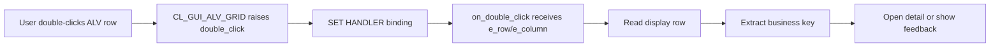
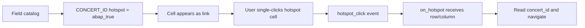
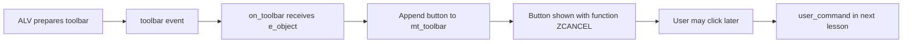
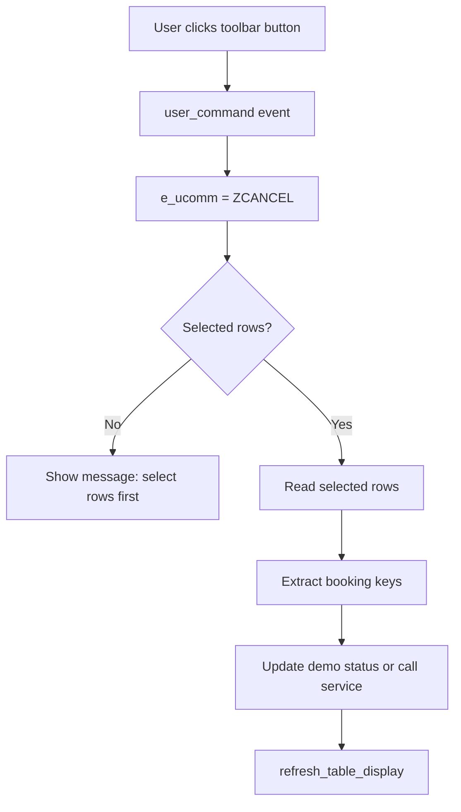
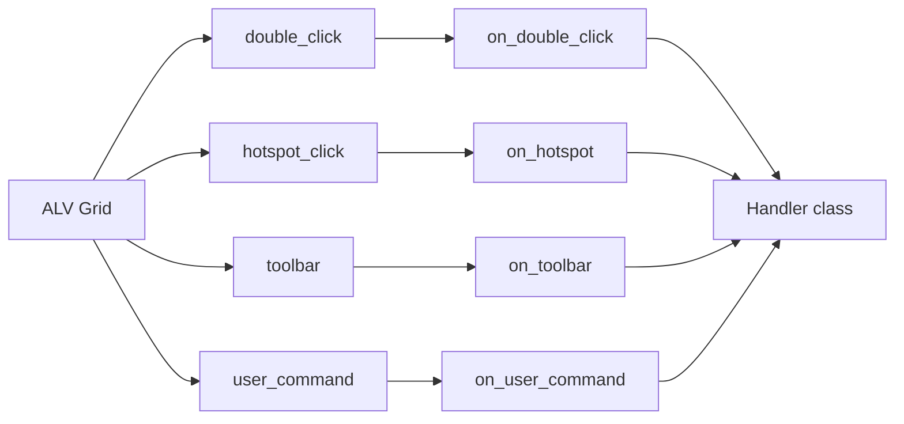

# NEWCH30_OLDCH27_REWRITE - ALV 고급 Event 응용

> 기준 원본: `content/abap/CH27`
> 보조 참고: `reference/codex_0625_v2/CH27_REWRITE.md`, `.project-docs/11_KEYWORD_AUDIT.md`, `.project-docs/TRACK2_ENRICHMENT.md`, `reference/codex_0629_v3/00_CONCEPT_GAP_AUDIT.md`
> 재집필 목표: ALV 이벤트 API 이름을 나열하는 장이 아니라, 사용자의 클릭과 버튼 조작이 어떤 이벤트로 들어오고 어떤 핸들러가 어떤 상태를 읽어 어떤 업무 반응으로 이어지는지 입문자가 추적하게 만든다.
> Classic-first 경계: 이 장은 SAP GUI 기반 `CL_GUI_ALV_GRID` 이벤트 수업이다. ABAP Cloud/RAP/Fiori 액션 설계로 대체하지 않고, Cloud 경계는 "그대로 실행 가능한 패턴이 아님"으로 명확히 둔다.

## NEWCH30 전체 강의 지도

CH17에서는 `CL_GUI_ALV_GRID`로 표를 화면에 올리는 법을 배웠고, CH20에서는 ABAP Objects의 클래스, 메서드, 참조 변수, 이벤트, `SET HANDLER`를 배웠다. CH21에서는 표시용 ALV를 더 풍부하게 다루었다. NEWCH30은 그 다음 단계다. 이제 ALV는 단순히 데이터를 보여 주는 표가 아니라, 사용자가 행을 더블클릭하고, 링크처럼 보이는 셀을 누르고, 툴바 버튼을 클릭했을 때 프로그램이 반응하는 화면이 된다.

입문자가 이 장에서 가장 자주 헷갈리는 지점은 "이벤트 발생 시점"과 "업무 처리 시점"을 섞는 것이다. `toolbar` 이벤트는 버튼을 추가하는 시점이지 취소를 실행하는 시점이 아니다. `user_command`는 사용자가 버튼을 누른 뒤 function code를 받아 처리하는 시점이다. `double_click`은 행이나 셀을 두 번 클릭했을 때의 반응이고, `hotspot_click`은 hotspot으로 지정한 셀을 한 번 클릭했을 때의 반응이다.

| v3 레슨 | 원본 | 주제 | 이번 레슨에서 고정할 판단 |
|---|---|---|---|
| NEWCH30-L01 | CH27-L01 | Double Click Event | 행 더블클릭은 이벤트이고, 상세 조회는 핸들러 안에서 업무 키로 이어진다 |
| NEWCH30-L02 | CH27-L02 | Hotspot Click Event | 링크처럼 보이는 컬럼은 field catalog 설정과 hotspot 이벤트가 함께 필요하다 |
| NEWCH30-L03 | CH27-L03 | Toolbar Event | `toolbar`는 버튼을 만드는 이벤트이며 업무 실행 이벤트가 아니다 |
| NEWCH30-L04 | CH27-L04 | USER_COMMAND 처리 | 버튼의 function code가 `e_ucomm`으로 오고, 선택 행 확인 뒤 업무 반응으로 분기한다 |
| NEWCH30-L05 | CH27-L05 | ALV Event Handler Class 설계 | 흩어진 이벤트 메서드를 한 핸들러 클래스로 모아 배선을 보이게 만든다 |

### R15 게이팅과 공식 근거

NEWCH30은 CH20 이후의 장이므로 `CLASS`, `METHODS`, `FOR EVENT`, `SET HANDLER`, 참조 변수, `NEW`, inline `DATA`, `FIELD-SYMBOLS`, `VALUE #(...)`를 사용할 수 있다. 다만 CH28의 editable grid, `data_changed`, 변경 프로토콜, 저장 전 검증은 이 장의 본문 실습으로 끌어오지 않는다. NEWCH30은 "클릭/버튼 이벤트" 장이고, NEWCH31이 될 OLDCH28은 "입력/변경 검증" 장이다.

수동 확인한 로컬 공식 문서 범위는 OO 이벤트 문법과 SAP GUI/Cloud 경계다. `C:\ABAP_DOCU_HTML\abapmethods_event_handler.htm`, `abapset_handler.htm`, `abapset_handler_instance.htm`, `abapevents.htm`, `abapevents_parameters.htm`, `abapclass_definition.htm`, `abapmethods_general.htm`, `abengui_control_glosry.htm`, `abensap_gui_glosry.htm`을 확인했다. ABAP Cloud 경계는 `C:\ABAP_DOCU_DOWNLOAD\ABAP_DOCU\abap-docs-main\docs\cloud\md\ABENABAP_CLOUD_GLOSRY.md`, `ABENRELEASED_API_GLOSRY.md`, `ABENCLASSIC_ABAP_GLOSRY.md`에서 확인했다.

`CL_GUI_ALV_GRID`의 구체 이벤트명인 `double_click`, `hotspot_click`, `toolbar`, `user_command`와 `get_selected_rows`, `refresh_table_display`, `set_toolbar_interactive`는 ALV Grid Control API 영역이다. 로컬 ABAP Keyword Documentation은 언어 문법 문서이므로, 구체 ALV API는 SAP Help의 ALV Grid Control 공식 문서로 보충했다.

### 이 장의 핵심 분리

| 혼동 지점 | 올바른 분리 |
|---|---|
| `FOR EVENT`와 `SET HANDLER` | `FOR EVENT`는 처리 가능한 메서드 선언, `SET HANDLER`는 특정 grid 객체와 실제 연결 |
| `double_click`과 `hotspot_click` | 더블클릭은 행/셀 중심 탐색, hotspot은 링크형 컬럼 한 번 클릭 |
| `toolbar`와 `user_command` | `toolbar`는 버튼 정의 추가, `user_command`는 버튼 클릭 후 명령 처리 |
| 행 번호와 업무 키 | `e_row-index`는 화면 행 위치, 실제 업무 처리는 `booking_id` 같은 키로 수행 |
| 표시 이벤트와 편집 이벤트 | NEWCH30은 클릭/버튼 이벤트, OLDCH28은 editable grid 변경 검증 |

## NEWCH30-L01 - Double Click Event

### 왜 필요한가

업무 화면에서 ALV 행은 대개 "목록"이고, 사용자가 실제로 보고 싶은 것은 그 행의 상세 정보다. 예매 목록에서 한 행을 더블클릭하면 예매 상세, 고객 상세, 좌석 변경 화면으로 이동하는 식이다. 사용자가 표를 보고 있는데 화면 아래에 따로 "상세 조회" 버튼을 찾아 누르게 만들 수도 있지만, 이미 보고 있는 행을 더블클릭하는 흐름이 훨씬 자연스럽다.

중요한 점은 ALV가 자동으로 상세 화면을 열어 주는 것이 아니라는 점이다. ALV는 더블클릭이 발생했다는 사실과 클릭된 행/컬럼 정보를 이벤트로 알려 준다. 프로그램은 그 이벤트를 받을 메서드를 만들고, `SET HANDLER`로 ALV 객체와 연결한 뒤, 이벤트 메서드 안에서 어떤 업무 반응을 할지 결정해야 한다.

비전공자 관점에서는 "클릭했는데 코드가 왜 실행되지?"가 처음엔 낯설 수 있다. 핵심은 순서다. 사용자가 화면에서 조작을 한다. ALV Control이 이벤트를 발생시킨다. 등록된 핸들러 메서드가 호출된다. 핸들러는 이벤트 파라미터를 읽고 내부 테이블이나 업무 서비스를 통해 다음 동작을 수행한다.

### 무엇인가

`double_click`은 `CL_GUI_ALV_GRID` 인스턴스에서 발생하는 사용자 이벤트다. 핸들러 메서드는 다음 세 가지를 갖춰야 한다.

1. 메서드 선언에 `FOR EVENT double_click OF cl_gui_alv_grid`가 있어야 한다.
2. 이벤트가 넘겨주는 `e_row`, `e_column`을 `IMPORTING`으로 받을 수 있어야 한다.
3. 실제 ALV 객체에 `SET HANDLER ... FOR go_grid`로 등록되어야 한다.

`e_row-index`는 사용자가 더블클릭한 현재 화면 행 번호다. 이 번호로 내부 테이블을 읽을 수 있지만, 정렬/필터/집계가 적용된 화면에서는 내부 테이블의 물리 순서와 사용자가 보는 순서가 다를 수 있다. 그래서 초급 실습에서는 `INDEX`로 흐름을 이해하되, 실무 설계에서는 행에 들어 있는 업무 키를 중심으로 상세 조회를 해야 한다.

```abap
CLASS lcl_alv_handler DEFINITION.
  PUBLIC SECTION.
    METHODS constructor
      IMPORTING it_booking TYPE ztt_booking.

    METHODS on_double_click
      FOR EVENT double_click OF cl_gui_alv_grid
      IMPORTING e_row e_column.

  PRIVATE SECTION.
    DATA mt_booking TYPE ztt_booking.
ENDCLASS.

CLASS lcl_alv_handler IMPLEMENTATION.
  METHOD constructor.
    mt_booking = it_booking.
  ENDMETHOD.

  METHOD on_double_click.
    READ TABLE mt_booking INTO DATA(ls_booking) INDEX e_row-index.
    IF sy-subrc <> 0.
      MESSAGE '선택한 행을 찾을 수 없습니다.' TYPE 'I'.
      RETURN.
    ENDIF.

    MESSAGE |예매 { ls_booking-booking_id } 상세로 이동| TYPE 'I'.
  ENDMETHOD.
ENDCLASS.

DATA(go_handler) = NEW lcl_alv_handler( it_booking = lt_booking ).
SET HANDLER go_handler->on_double_click FOR go_grid.
```

이 예시는 학습을 위해 `ztt_booking`이라는 예매 내부 테이블 타입이 이미 있다고 가정한다. 실제 프로그램에서는 핸들러가 내부 테이블 복사본을 오래 들고 있기보다, 현재 화면 모델이나 서비스 객체를 통해 업무 키로 상세 데이터를 조회하도록 분리하는 편이 좋다.

### 어떻게 확인하는가

첫 번째 확인은 핸들러가 실제로 호출되는가다. 더블클릭했는데 아무 반응이 없다면 이벤트 메서드 내부 로직보다 먼저 `SET HANDLER`가 실행되었는지 확인해야 한다. `FOR EVENT` 메서드가 존재하는 것과 grid 객체에 등록되는 것은 다르다.

두 번째 확인은 넘어온 행과 컬럼이 내가 클릭한 위치와 맞는가다. 실습에서는 이벤트 로그에 `e_row-index`, `e_column-fieldname`을 출력한다. 예를 들어 세 번째 행의 `BOOKING_ID` 컬럼을 눌렀다면 로그에 `row=3`, `column=BOOKING_ID`가 보여야 한다.

세 번째 확인은 행 번호를 업무 키로 바꿀 수 있는가다. `e_row-index = 3`은 업무 식별자가 아니다. 내부 테이블의 세 번째 행을 읽은 뒤, 그 행의 `booking_id`, `customer_id`, `concert_id` 같은 키를 꺼내 상세 조회나 화면 이동으로 이어야 한다.

네 번째 확인은 화면 정렬/필터와의 관계다. 학습용 위젯에서는 정렬 버튼을 누른 뒤 더블클릭해 보게 한다. 정렬 전후 `row=3`이 가리키는 업무 키가 달라질 수 있다는 점을 보여 주면, 행 번호를 DB 키처럼 쓰면 안 된다는 사실이 분명해진다.

### 실수와 주의

`FOR EVENT`를 선언했는데 `SET HANDLER`를 빠뜨리면 메서드는 존재하지만 호출되지 않는다. 이벤트 수업에서 가장 흔한 오류다. 선언은 "이 메서드는 이런 이벤트를 처리할 수 있다"는 뜻이고, 등록은 "이 ALV 객체의 이벤트가 발생하면 이 메서드를 호출하라"는 뜻이다.

핸들러 객체 참조를 너무 불명확하게 두면 디버깅이 어렵다. 화면 프로그램에서는 가독성과 제어를 위해 핸들러 참조를 전역 데이터나 controller 속성처럼 명확한 위치에 보관하는 편이 좋다. 그래야 나중에 해제, 재등록, breakpoint 설정이 쉽다.

`e_row-index`를 곧바로 DB 키처럼 사용하면 안 된다. 행 번호는 화면 상태에 따라 바뀔 수 있다. 이 레슨에서는 행 번호로 내부 테이블을 읽어 이벤트 흐름을 익히고, 실제 상세 조회는 해당 행의 업무 키로 수행한다고 이해한다.

마지막으로 더블클릭 이벤트에서 곧바로 DB 변경을 수행하지 않는다. 사용자가 상세를 보고 취소/저장 같은 결정을 해야 하는 업무라면 더블클릭은 상세 이동이나 선택 확정 정도로 두고, 실제 변경은 별도 확인 흐름과 lock/transaction을 거친다.

### 프로세스 플로우와 체험형 학습 설계



기존 체험물 `CH27-L01-S01`은 행 더블클릭 이벤트 로그다. 학습 화면은 왼쪽에 예매 목록 ALV, 오른쪽에 이벤트 로그 패널을 둔다. 사용자가 첫 번째 행을 더블클릭하면 로그에 `double_click`, `row=1`, `column=BOOKING_ID`, `handler=on_double_click`이 추가된다.

추가 설계는 네 단계 상태 표시다.

| 상태 | 화면 표시 | 피드백 |
|---|---|---|
| `대기` | "행을 더블클릭하세요" | 아직 이벤트가 없다 |
| `이벤트 발생` | `e_row`, `e_column` 강조 | ALV가 클릭 위치를 전달했다 |
| `데이터 조회` | 내부 테이블에서 읽은 `booking_id` 표시 | 행 위치를 업무 키로 바꾸었다 |
| `상세 이동 준비` | 상세 패널 활성화 | 실제 navigation은 업무 키 기준이다 |

진단 버튼은 `SET HANDLER 끄기`와 `정렬 적용` 두 개면 충분하다. `SET HANDLER 끄기`는 더블클릭해도 로그가 쌓이지 않는 증상을 보여 준다. `정렬 적용`은 화면 순서를 바꾼 뒤 행 번호와 업무 키를 비교하게 만들어, 행 번호 의존 설계의 위험을 보여 준다.

### 정리

`double_click`은 사용자가 ALV 행이나 셀을 더블클릭했다는 신호다. `FOR EVENT`로 받을 메서드를 선언하고, `SET HANDLER`로 ALV 객체에 등록해야 호출된다. `e_row-index`는 화면 행 위치를 알려 주지만 업무 키가 아니므로, 실무 반응은 내부 테이블에서 키를 읽은 뒤 상세 조회나 화면 이동으로 이어져야 한다.

## NEWCH30-L02 - Hotspot Click Event

### 왜 필요한가

모든 셀을 더블클릭 대상으로 만들면 사용자는 어디를 눌러야 하는지 헷갈린다. 예매 목록에서 콘서트 ID, 고객 번호, 예매 번호처럼 "눌러서 이동할 수 있는 값"은 링크처럼 보여 주는 편이 낫다. ALV에서는 이런 셀을 hotspot으로 지정하고, 사용자가 그 셀을 한 번 클릭했을 때 `hotspot_click` 이벤트를 처리할 수 있다.

이 레슨의 핵심은 이벤트를 받기 전에 셀을 클릭 가능한 셀로 만들어야 한다는 점이다. `hotspot_click` 핸들러만 만들면 끝이 아니다. Field Catalog에서 특정 필드의 `hotspot` 속성을 켜야 화면에서 링크처럼 보이고, 사용자의 한 번 클릭이 hotspot 이벤트로 이어진다.

Hotspot은 "이 값은 누르면 이동하거나 세부 정보를 볼 수 있다"는 시각 신호다. 초보자는 이벤트 코드를 먼저 보지만, 사용자에게는 셀이 링크처럼 보이는지가 더 먼저다. 따라서 CH27-L02는 field catalog 설정과 이벤트 핸들러를 한 흐름으로 묶어 배운다.

### 무엇인가

Hotspot은 ALV 셀을 링크처럼 보이게 하는 표시 속성이다. 일반 셀 클릭은 hotspot 이벤트가 아니다. Field Catalog에서 특정 필드에 `hotspot = abap_true`를 지정하면 해당 컬럼의 셀이 클릭 가능한 링크처럼 보이고, 사용자가 그 셀을 한 번 클릭하면 `hotspot_click` 이벤트가 발생한다.

```abap
LOOP AT lt_fcat REFERENCE INTO DATA(lr_fcat).
  IF lr_fcat->fieldname = 'CONCERT_ID'.
    lr_fcat->hotspot = abap_true.
  ENDIF.
ENDLOOP.
```

핸들러는 클릭된 행과 컬럼을 받는다. `e_column_id-fieldname`으로 어떤 컬럼이 눌렸는지 확인하고, 의도한 hotspot 컬럼일 때만 업무 반응을 수행한다.

```abap
METHODS on_hotspot
  FOR EVENT hotspot_click OF cl_gui_alv_grid
  IMPORTING e_row_id e_column_id.

METHOD on_hotspot.
  IF e_column_id-fieldname <> 'CONCERT_ID'.
    RETURN.
  ENDIF.

  READ TABLE mt_booking INTO DATA(ls_booking) INDEX e_row_id-index.
  IF sy-subrc <> 0.
    MESSAGE '클릭한 콘서트 행을 찾을 수 없습니다.' TYPE 'I'.
    RETURN.
  ENDIF.

  MESSAGE |콘서트 { ls_booking-concert_id } 상세로 이동| TYPE 'I'.
ENDMETHOD.
```

`double_click`과 `hotspot_click`은 둘 다 사용자 클릭을 다루지만 사용 경험이 다르다. `double_click`은 행 전체를 대상으로 상세 조회에 어울리고, hotspot은 특정 컬럼 값이 링크 역할을 한다는 것을 명확히 보여 주고 싶을 때 어울린다.

### 어떻게 확인하는가

첫 번째 확인은 화면에서 hotspot 컬럼이 일반 셀과 다르게 보이는지다. 학습 화면에서는 `CONCERT_ID`에 링크 색이나 밑줄을 적용해 일반 셀과 구분한다. 사용자가 시각적으로 "여기는 누를 수 있다"를 알아야 한다.

두 번째 확인은 해당 셀을 한 번 클릭했을 때 이벤트 로그에 `hotspot_click`이 남는지다. 더블클릭이 아니다. ALV Grid Control 공식 문서도 hotspot으로 표시된 컬럼에서 사용자의 mouse click에 반응하는 이벤트로 `hotspot_click`을 설명한다.

세 번째 확인은 `e_row_id-index`와 `e_column_id-fieldname`이다. 학습자는 `CONCERT_ID` 셀을 클릭했을 때만 상세 패널이 바뀌고, 일반 텍스트 셀을 클릭했을 때는 hotspot 반응이 없다는 차이를 확인해야 한다.

네 번째 확인은 같은 화면에서 더블클릭과 hotspot을 동시에 둘 때의 UX다. 행 전체 더블클릭은 예매 상세, `CONCERT_ID` hotspot은 공연 상세처럼 목적이 분명히 다르면 괜찮다. 하지만 같은 셀의 한 번 클릭과 더블클릭이 서로 다른 위험 업무를 수행하면 안 된다.

### 실수와 주의

가장 흔한 실수는 Field Catalog에 `hotspot`을 켜지 않고 핸들러만 만드는 것이다. 이 경우 사용자는 셀이 클릭 가능한지 알 수 없고 기대한 이벤트도 발생하지 않는다.

두 번째 실수는 `double_click`과 hotspot을 같은 기능으로 중복 설계하는 것이다. 같은 동작을 두 이벤트로 모두 처리하면 코드는 늘어나고 사용자 경험은 애매해진다. 행 전체 상세는 double click, 특정 키 이동은 hotspot처럼 역할을 나눈다.

세 번째 실수는 `e_row_id-index`를 그대로 DB 키로 취급하는 것이다. L01과 마찬가지로 행 위치는 업무 키가 아니다. 내부 테이블에서 해당 행을 읽은 뒤 `concert_id` 같은 업무 키로 다음 처리를 수행한다.

네 번째 실수는 hotspot을 편집 기능으로 착각하는 것이다. Hotspot은 탐색이나 명령에 가깝다. 셀 값을 바꾸고 입력값을 검증하는 흐름은 NEWCH31이 될 OLDCH28 Editable Grid에서 다룬다.

### 프로세스 플로우와 체험형 학습 설계



기존 체험물 `CH27-L02-S01`은 링크 셀 클릭 이벤트다. `concert_id`가 링크처럼 보이고, 해당 셀을 한 번 클릭하면 오른쪽 로그에 `hotspot_click`, `e_row_id`, `e_column_id`가 표시된다.

추가 시뮬레이터는 세 개의 컬럼을 보여 준다. `BOOKING_ID`는 일반 텍스트, `CONCERT_ID`는 hotspot, `STATUS`는 일반 상태 값이다. 사용자가 각 셀을 클릭하면 상태 패널에 서로 다른 메시지가 나온다.

| 조작 | 상태 | 피드백 |
|---|---|---|
| 일반 셀 클릭 | 이벤트 없음 | 이 셀은 hotspot이 아니다 |
| `CONCERT_ID` 클릭 | `hotspot_click` 발생 | 링크형 컬럼이므로 공연 상세로 이동할 수 있다 |
| hotspot 토글 끄기 | 링크 스타일 제거 | field catalog 설정이 없으면 이벤트도 기대하지 않는다 |
| 더블클릭 시도 | `double_click`과 비교 표시 | 클릭 횟수와 이벤트 종류를 구분한다 |

### 정리

Hotspot은 특정 ALV 셀을 링크처럼 보이게 하고, 한 번 클릭으로 `hotspot_click` 이벤트를 발생시키는 방식이다. Field Catalog에서 `hotspot`을 켜고, 핸들러에서는 `e_row_id`와 `e_column_id`를 받아 클릭 위치를 확인한다. 더블클릭은 행 중심 탐색, hotspot은 컬럼 값 중심 탐색에 어울린다.

## NEWCH30-L03 - Toolbar Event

### 왜 필요한가

ALV를 업무 화면으로 쓰다 보면 표 위쪽에 "예매 취소", "메일 발송", "상세 조회", "엑셀 다운로드" 같은 화면 고유 기능을 놓고 싶어진다. 표 밖에 별도 버튼을 배치할 수도 있지만, 사용자가 표 데이터를 선택한 뒤 곧바로 실행할 기능이라면 ALV 툴바 안에 버튼을 두는 편이 흐름이 좋다.

`toolbar` 이벤트는 바로 이 지점에서 필요하다. ALV가 툴바를 구성할 때 프로그램이 끼어들어 버튼을 추가할 수 있다. 다만 이 이벤트에서 업무 처리를 실행하는 것은 아니다. `toolbar`는 버튼을 만드는 이벤트이고, 버튼을 눌렀을 때 처리하는 이벤트는 다음 레슨의 `user_command`다.

초보자에게 이 분리는 특히 중요하다. 화면에 버튼이 생기는 순간과 사용자가 버튼을 누르는 순간은 다르다. 버튼 생성 시점에 취소 로직을 넣으면 ALV가 툴바를 다시 그릴 때마다 취소가 실행되는 위험한 코드가 된다.

### 무엇인가

`toolbar` 이벤트 핸들러는 `e_object`를 받는다. 이 객체 안의 `mt_toolbar` 테이블에 버튼 정보를 추가하면 ALV 툴바에 버튼이 나타난다. 버튼에서 가장 중요한 값은 `function`이다. 사용자가 버튼을 누르면 이 function code가 `user_command` 이벤트의 `e_ucomm`으로 넘어간다.

```abap
METHODS on_toolbar
  FOR EVENT toolbar OF cl_gui_alv_grid
  IMPORTING e_object.

METHOD on_toolbar.
  APPEND VALUE #(
    function  = 'ZCANCEL'
    icon      = icon_delete
    text      = '예매 취소'
    quickinfo = '선택한 예매를 취소합니다'
    butn_type = 0
  ) TO e_object->mt_toolbar.
ENDMETHOD.
```

이 코드는 버튼을 추가할 뿐이다. `ZCANCEL`이라는 문자열은 아직 취소 로직이 아니다. 사용자가 버튼을 눌렀을 때 `user_command` 이벤트가 발생하고, 그때 `e_ucomm = 'ZCANCEL'`인지 확인해 취소 로직으로 분기한다.

동적으로 툴바 구성이 바뀌는 화면에서는 `go_grid->set_toolbar_interactive( )` 같은 처리가 필요할 수 있다. SAP Help의 toolbar 관련 문서도 self-defined function을 추가할 때 toolbar 이벤트와 interactive toolbar 흐름을 함께 다룬다. 입문 단계에서는 먼저 "툴바 이벤트에서 버튼을 추가한다"와 "버튼 클릭 처리는 별도 이벤트로 넘어간다"를 분리해 이해한다.

### 어떻게 확인하는가

첫 번째 확인은 버튼이 실제 툴바에 나타나는지다. `toolbar` 핸들러가 등록되지 않았거나 `e_object->mt_toolbar`에 append하지 않으면 원하는 버튼을 볼 수 없다.

두 번째 확인은 버튼의 `function` 값이 다음 이벤트로 전달될 준비가 되었는지다. 버튼 텍스트는 사용자에게 보이는 이름이고, `function`은 프로그램이 분기할 내부 명령 코드다. 예제에서는 `text = '예매 취소'`, `function = 'ZCANCEL'`로 둘을 분리한다.

세 번째 확인은 `toolbar` 이벤트에서 업무 처리가 실행되지 않는다는 점이다. 로그는 "버튼 추가" 단계까지만 보여 주어야 한다. 선택 행 취소나 화면 갱신은 L04에서 확인한다.

네 번째 확인은 버튼을 다시 그리는 상황이다. 화면 상태에 따라 버튼 활성/비활성이나 버튼 추가 조건이 달라지면 toolbar 구성이 다시 만들어질 수 있다. 이때도 업무 처리 로직은 실행되면 안 된다.

### 실수와 주의

`toolbar`에서 바로 DB 삭제나 취소 처리를 수행하면 안 된다. 툴바는 여러 번 다시 그려질 수 있고, 그때마다 업무 처리가 반복되면 치명적이다. `toolbar`에서는 버튼 정의만 추가하고, 실제 처리는 `user_command`에서 한다.

`function` 값은 명확하고 충돌이 적게 정한다. SAP 표준 기능 코드와 헷갈리지 않게 예제에서는 `ZCANCEL`처럼 커스텀 명령임을 드러낸다. 버튼의 `text`와 `quickinfo`는 사용자에게 보이는 설명이고, `function`은 코드에서 분기하는 키다.

버튼이 보이지 않는 문제는 보통 세 곳에서 난다. `SET HANDLER` 누락, `e_object->mt_toolbar`에 append하지 않음, 동적 툴바 갱신 누락이다. 학습자는 이 세 가지를 순서대로 확인하는 습관을 가져야 한다.

아이콘만 믿고 기능을 숨기면 안 된다. 학습용 화면에서는 text와 quickinfo를 함께 보여 주어 사용자가 기능을 이해하게 한다. 실제 현장에서도 위험 업무 버튼은 명확한 이름과 확인 절차가 필요하다.

### 프로세스 플로우와 체험형 학습 설계



기존 체험물 `CH27-L03-S01`은 커스텀 툴바 버튼 추가 확인이다. 표준 버튼 옆에 `예매 취소` 버튼이 추가되는 모습을 확인하고, 로그는 `toolbar event`와 `function=ZCANCEL`을 보여 준다.

추가 시뮬레이터는 ALV 상단에 기본 버튼 영역과 커스텀 버튼 영역을 나누어 표시한다. `toolbar 이벤트 실행` 버튼을 누르면 `e_object->mt_toolbar` 테이블에 한 줄이 추가되는 애니메이션을 보여 주고, 그 결과 툴바에 `예매 취소` 버튼이 생긴다.

오른쪽에는 버튼 정의 테이블을 보여 준다.

| 필드 | 의미 | 오류 피드백 |
|---|---|---|
| `function` | `user_command`로 넘어갈 내부 명령 코드 | 비어 있으면 분기할 수 없다 |
| `icon` | 버튼의 시각 기호 | 기능을 대신 설명하지 않는다 |
| `text` | 사용자가 읽는 버튼명 | 위험 업무는 모호하면 안 된다 |
| `quickinfo` | hover 안내 | 초보 사용자에게 기능을 설명한다 |
| `butn_type` | 버튼 모양/구분 | 기본값으로 시작해도 충분하다 |

### 정리

`toolbar` 이벤트는 ALV 툴바를 구성할 때 커스텀 버튼을 추가하는 지점이다. `e_object->mt_toolbar`에 버튼 정의를 append하고, 그 버튼의 `function` 값을 다음 단계의 명령 코드로 사용한다. 실제 업무 처리는 `toolbar`가 아니라 `user_command`에서 수행한다.

## NEWCH30-L04 - USER_COMMAND 처리

### 왜 필요한가

L03에서 버튼을 만들었다면 이제 사용자가 그 버튼을 눌렀을 때 프로그램이 반응해야 한다. 예매 취소 버튼을 눌렀는데 아무 일도 없으면 버튼은 장식일 뿐이다. 반대로 버튼을 누르자마자 어떤 행을 대상으로 처리할지 확인하지 않고 취소를 수행하면 위험하다.

`user_command`는 ALV 툴바의 커스텀 버튼을 눌렀을 때 명령 코드를 받아 업무 흐름으로 분기하는 이벤트다. 이 레슨에서는 `ZCANCEL` 버튼을 눌렀을 때 선택된 행을 가져오고, 학습용 상태를 취소로 바꾼 뒤 ALV를 새로 고치는 흐름을 다룬다.

여기서도 범위 경계가 중요하다. CH27의 목적은 ALV 이벤트와 선택 행 처리다. 실제 예매 취소 저장은 CH24 DML, CH25 Lock, 권한 확인, transaction 처리, 오류 복구와 함께 설계해야 한다.

### 무엇인가

`user_command` 핸들러는 `e_ucomm`을 받는다. `e_ucomm`은 사용자가 누른 버튼의 function code다. L03에서 버튼을 만들 때 `function = 'ZCANCEL'`로 지정했다면, 버튼 클릭 시 `e_ucomm` 값으로 `ZCANCEL`이 들어온다.

```abap
METHODS on_user_command
  FOR EVENT user_command OF cl_gui_alv_grid
  IMPORTING e_ucomm.

METHOD on_user_command.
  CASE e_ucomm.
    WHEN 'ZCANCEL'.
      mo_grid->get_selected_rows(
        IMPORTING et_index_rows = DATA(lt_rows)
      ).

      IF lt_rows IS INITIAL.
        MESSAGE '먼저 취소할 행을 선택하세요.' TYPE 'I'.
        RETURN.
      ENDIF.

      LOOP AT lt_rows INTO DATA(ls_row).
        READ TABLE mt_booking ASSIGNING FIELD-SYMBOL(<ls_booking>)
          INDEX ls_row-index.
        IF sy-subrc = 0.
          <ls_booking>-status = 'CANCELLED'.
        ENDIF.
      ENDLOOP.

      mo_grid->refresh_table_display( ).
  ENDCASE.
ENDMETHOD.
```

SAP Help의 `user_command` 설명은 self-defined function이 선택되었을 때 function code를 조회해 associated function을 수행하는 이벤트로 안내한다. `get_selected_rows`는 grid에서 선택된 row 정보를 돌려주고, `refresh_table_display`는 출력 테이블이 바뀐 뒤 grid 표시를 새로 고치는 메서드다. 따라서 이 레슨의 기본 골격은 "명령 코드 확인 -> 선택 행 조회 -> 대상 검증 -> 처리 -> refresh"다.

### 어떻게 확인하는가

첫 번째 확인은 행을 선택하지 않고 `예매 취소` 버튼을 누르는 것이다. 이때 "먼저 취소할 행을 선택하세요"라는 피드백이 나와야 한다. 아무 반응이 없거나 전체 행을 처리하면 안 된다.

두 번째 확인은 한 행을 선택하고 버튼을 누르는 것이다. 로그에는 `user_command`, `e_ucomm=ZCANCEL`, `selected_rows=1`이 남아야 한다. 표의 상태 컬럼은 취소 상태로 바뀐다.

세 번째 확인은 여러 행 선택이다. 선택 행 수가 로그에 표시되고, 각 행의 상태가 `CANCELLED`로 바뀌어야 한다. 이때 실무에서는 각 행의 업무 키를 모아 취소 서비스로 넘기는 구조가 되어야 한다.

네 번째 확인은 화면 갱신이다. 내부 테이블 값만 바뀌고 ALV가 새로 그려지지 않으면 사용자는 변경 결과를 볼 수 없다. 처리 후 `refresh_table_display( )`를 호출하는 이유가 여기에 있다.

다섯 번째 확인은 알 수 없는 function code다. 나중에 버튼이 늘어날 수 있으므로 `CASE e_ucomm`의 `WHEN OTHERS` 또는 기본 무시 정책을 정해야 한다. 학습용 위젯에서는 처리되지 않은 function code가 로그로만 남게 한다.

### 실수와 주의

`CASE e_ucomm` 없이 바로 처리하면 나중에 버튼이 늘어날 때 위험하다. 명령 코드는 반드시 분기하고, 알 수 없는 명령은 무시하거나 로그로 남긴다.

선택 행이 없을 때의 피드백은 필수다. 사용자는 버튼을 눌렀는데 아무 반응이 없으면 프로그램이 멈춘 것으로 생각한다. 반대로 선택 행이 없는데 전체 행을 대상으로 처리하면 더 위험하다. "선택 없음"은 업무 오류가 아니라 사용자 조작 미완료이므로 정보 메시지로 돌려보낸다.

행 번호 기반 처리는 화면 정렬/필터와 충돌할 수 있다. 이 레슨의 코드는 이벤트 흐름을 보여 주기 위해 index를 사용하지만, 실제 취소 처리는 선택 행에서 `booking_id` 같은 키를 읽고 서비스나 DB 처리로 넘기는 구조가 되어야 한다.

실제 DB 변경은 이 레슨에서 하지 않는다. DML, lock object, authorization, commit/rollback, application log는 별도 책임이다. NEWCH30은 화면 이벤트가 업무 서비스 호출 전 단계까지 어떻게 연결되는지를 훈련한다.

### 프로세스 플로우와 체험형 학습 설계



기존 체험물 `CH27-L04-S01`은 선택 행 취소와 갱신을 보여 준다. 행을 체크한 뒤 `예매 취소` 버튼을 누르면 로그가 `e_ucomm`, 선택 행 목록, refresh 호출을 순서대로 보여 주고 표의 상태 컬럼이 바뀐다.

추가 상태 설계는 세 가지다.

| 상태 | 사용자 조작 | 피드백 |
|---|---|---|
| `선택 없음` | 버튼 클릭 | 대상 행이 없다고 안내 |
| `선택 있음` | 1개 이상 선택 후 버튼 클릭 | 선택 행 강조, 명령 처리 |
| `처리 완료` | 상태 변경 후 refresh | 화면과 내부 데이터가 같은 상태 |

이벤트 로그는 최소 다섯 줄을 보여 준다. `toolbar에서 ZCANCEL 버튼 등록`, `user_command 발생`, `e_ucomm=ZCANCEL`, `get_selected_rows 결과`, `refresh_table_display 호출`이다. 이 순서는 버튼 생성과 버튼 실행이 다른 이벤트라는 점을 학습자에게 각인시킨다.

### 정리

`user_command`는 툴바 버튼의 function code를 받아 실제 반응으로 분기하는 이벤트다. L03에서 추가한 `ZCANCEL` 버튼은 L04에서 `e_ucomm`으로 확인된다. 선택 행을 가져오고, 대상이 없으면 피드백을 주고, 처리 후 ALV를 새로 고치는 흐름이 기본 골격이다.

## NEWCH30-L05 - ALV Event Handler Class 설계

### 왜 필요한가

레슨 1부터 4까지는 이벤트를 하나씩 배웠다. 하지만 실제 화면에는 더블클릭, hotspot, 툴바 버튼, user command가 동시에 존재한다. 이벤트 메서드와 `SET HANDLER`가 프로그램 곳곳에 흩어지면 어떤 이벤트가 어디로 연결되는지 추적하기 어렵다. 초보자는 이 상태에서 버튼 하나가 안 먹히면 화면 생성 문제인지, 핸들러 등록 문제인지, 메서드 내부 로직 문제인지 구분하지 못한다.

그래서 마지막 레슨은 이벤트 핸들러 클래스를 설계한다. 목표는 거대한 클래스를 만드는 것이 아니라, ALV 사용자 이벤트의 배선을 한 곳에서 보이게 만드는 것이다. 어떤 이벤트가 어떤 메서드로 연결되는지, 그 메서드가 어떤 화면 상태를 읽고 어떤 업무 서비스로 넘기는지 구조를 잡는다.

CH26에서 MVC와 controller 책임을 배웠다면, 여기서는 그 감각을 ALV 이벤트에 적용한다. View인 grid는 이벤트를 발생시키고, handler/controller는 이벤트를 받아 현재 선택, 클릭 위치, function code를 읽은 뒤 업무 흐름으로 연결한다.

### 무엇인가

핸들러 클래스는 ALV 이벤트 메서드를 모아 둔 객체다. 보통 생성자에서 ALV Grid 참조와 화면 데이터 참조를 받고, 생성자 안에서 `SET HANDLER`를 한 번에 수행한다. 이렇게 하면 화면 초기화 코드에서는 핸들러 객체를 생성하기만 해도 이벤트 배선이 완료된다.

```abap
CLASS lcl_alv_handler DEFINITION.
  PUBLIC SECTION.
    METHODS constructor
      IMPORTING
        io_grid    TYPE REF TO cl_gui_alv_grid
        it_booking TYPE ztt_booking.

    METHODS on_double_click
      FOR EVENT double_click OF cl_gui_alv_grid
      IMPORTING e_row e_column.

    METHODS on_hotspot
      FOR EVENT hotspot_click OF cl_gui_alv_grid
      IMPORTING e_row_id e_column_id.

    METHODS on_toolbar
      FOR EVENT toolbar OF cl_gui_alv_grid
      IMPORTING e_object.

    METHODS on_user_command
      FOR EVENT user_command OF cl_gui_alv_grid
      IMPORTING e_ucomm.

  PRIVATE SECTION.
    DATA mo_grid TYPE REF TO cl_gui_alv_grid.
    DATA mt_booking TYPE ztt_booking.
ENDCLASS.

CLASS lcl_alv_handler IMPLEMENTATION.
  METHOD constructor.
    mo_grid    = io_grid.
    mt_booking = it_booking.

    SET HANDLER me->on_double_click
                me->on_hotspot
                me->on_toolbar
                me->on_user_command
      FOR mo_grid.
  ENDMETHOD.

  METHOD on_double_click.
    " 상세 조회 또는 화면 이동으로 위임
  ENDMETHOD.

  METHOD on_hotspot.
    " 링크형 컬럼 클릭 처리로 위임
  ENDMETHOD.

  METHOD on_toolbar.
    " 커스텀 버튼 정의 추가
  ENDMETHOD.

  METHOD on_user_command.
    " function code별 업무 반응 분기
  ENDMETHOD.
ENDCLASS.

DATA(go_handler) = NEW lcl_alv_handler(
  io_grid    = go_grid
  it_booking = lt_booking
).
```

이 구조에서 `mo_grid`는 선택 행 조회나 화면 갱신에 필요하다. `mt_booking`은 학습용 예제에서 화면 데이터를 읽기 위해 둔다. 실제 프로그램에서는 핸들러가 모든 업무 규칙을 직접 갖기보다, 화면 controller나 service 객체에 위임하는 구조가 더 유지보수하기 쉽다.

### 어떻게 확인하는가

가장 먼저 확인할 것은 생성자 한 곳에 모든 `SET HANDLER`가 모였는지다. `on_double_click`만 등록하고 `on_user_command`를 빠뜨리면 더블클릭은 되지만 버튼은 반응하지 않는다. 체크리스트로는 이벤트 이름, 핸들러 메서드 이름, `SET HANDLER` 등록 여부, 필요한 파라미터 이름을 나란히 놓고 본다.

두 번째 확인은 이벤트 발생 순서다. `toolbar`는 화면이 툴바를 만들 때 먼저 발생하고, 사용자가 추가 버튼을 누른 뒤에 `user_command`가 발생한다. `double_click`과 `hotspot_click`은 사용자의 클릭 조작에서 직접 발생한다. 이 네 가지를 같은 "클릭 이벤트"로 뭉뚱그리면 흐름을 잘못 설계하게 된다.

세 번째 확인은 handler가 너무 많은 일을 하지 않는지다. 예매 취소의 잠금, DB 변경, commit/rollback, application log까지 handler 안에 모두 넣으면 화면 이벤트 코드가 업무 transaction 코드와 얽힌다. handler는 이벤트를 받아 업무 service로 넘기는 연결점이라는 정도가 좋다.

네 번째 확인은 ABAP Cloud 경계다. `CL_GUI_ALV_GRID`와 SAP GUI Control Framework는 Classic ABAP/SAP GUI 화면의 기술이다. ABAP Cloud는 ADT, RAP, released API 중심이고 SAP GUI 접근이 없다. 따라서 이 장을 Cloud에서 그대로 실행 가능한 패턴으로 소개하지 않는다.

### 실수와 주의

핸들러 클래스에 모든 업무 로직을 밀어 넣으면 금방 비대해진다. 핸들러는 사용자 이벤트를 받아 화면 상태와 업무 서비스를 연결하는 층으로 두는 편이 좋다. 예매 취소의 잠금, DB 변경, 커밋 제어, 오류 복구는 CH24/CH25에서 배운 별도 책임으로 분리한다.

생성자에서 `SET HANDLER`를 수행하는 방식은 배선을 한 곳에 모으는 장점이 있지만, 동적 화면에서는 해제와 재등록 정책도 함께 생각해야 한다. 같은 이벤트에 같은 핸들러를 중복 등록하려 할 때의 동작은 공식 `SET HANDLER` 문서와 실제 디버깅으로 확인한다.

ALV 이벤트는 화면 기술이다. 도메인 규칙을 화면 이벤트 안에만 두면 나중에 batch, API, RAP action에서 같은 검증을 재사용할 수 없다. CH27에서는 이벤트 연결을 배우고, 업무 규칙은 별도 service 또는 model로 옮길 준비를 한다.

CH28 경계도 지킨다. `data_changed`, `data_changed_finished`, `check_changed_data`, 변경 프로토콜은 editable grid의 입력 검증 주제다. NEWCH30-L05의 핸들러 클래스에 그 이름을 미리 넣지 않는다.

### 프로세스 플로우와 체험형 학습 설계



기존 체험물 `CH27-L05-S01`은 이벤트에서 핸들러 메서드로 이어지는 배선 시각화다. 왼쪽에는 `double_click`, `hotspot_click`, `toolbar`, `user_command`가 있고, 오른쪽에는 `on_double_click`, `on_hotspot`, `on_toolbar`, `on_user_command`가 있다. 가운데에는 `SET HANDLER` 배선 선이 보인다.

추가 시뮬레이터는 세 덩어리 상태 데이터를 분리해 보여 준다.

| 상태 영역 | 표시 내용 | 학습 목적 |
|---|---|---|
| Grid 상태 | 선택 행, 클릭 컬럼, function code | 화면에서 발생한 원시 조작을 본다 |
| Handler 상태 | 호출된 메서드, 받은 파라미터 | 이벤트와 메서드 배선을 확인한다 |
| Business 상태 | 상세 조회 준비, 링크 이동, 취소 대상 수, refresh 여부 | 이벤트가 업무 흐름으로 이어지는 지점을 본다 |

진단 버튼은 `핸들러 하나 해제`, `function 코드 변경`, `CH28 경계 보기` 세 개다. `핸들러 하나 해제`는 특정 이벤트 선을 끊어 해당 조작이 반응하지 않는 상태를 보여 준다. `function 코드 변경`은 툴바 버튼의 function을 `ZVOID`로 바꾸어 `CASE e_ucomm`에서 처리되지 않는 상태를 보여 준다. `CH28 경계 보기`는 editable ALV의 변경 검증은 다음 장임을 안내한다.

### 정리

NEWCH30의 완성 형태는 이벤트 메서드를 많이 아는 것이 아니라, 이벤트 발생 시점과 핸들러 배선을 안정적으로 설명할 수 있는 것이다. `double_click`은 행/셀 더블클릭, `hotspot_click`은 링크형 셀 한 번 클릭, `toolbar`는 버튼 추가, `user_command`는 버튼 클릭 후 명령 처리다. 이 네 가지를 하나의 핸들러 클래스에서 `SET HANDLER`로 연결하면 ALV 화면의 사용자 반응 구조가 선명해진다.

## NEWCH30 마무리

NEWCH30은 표시용 ALV를 "반응하는 업무 화면"으로 확장하는 장이다. 사용자가 클릭하거나 버튼을 누르는 순간, ALV는 이벤트를 발생시키고, 등록된 핸들러는 이벤트 파라미터를 받아 업무 키와 화면 상태를 확인한다. 이때 중요한 것은 API 이름보다 책임 분리다.

`double_click`은 행/셀 더블클릭, `hotspot_click`은 링크형 컬럼 한 번 클릭, `toolbar`는 버튼 추가, `user_command`는 버튼 클릭 후 명령 처리다. `FOR EVENT`는 핸들러 메서드 선언이고, `SET HANDLER`는 grid 객체와 실제 배선이다. 행 번호는 업무 키가 아니며, 실제 변경은 CH24 DML, CH25 Lock, 이후 운영 품질 흐름과 함께 설계해야 한다.

다음 장인 OLDCH28은 editable grid다. 거기서는 사용자가 표 안의 값을 직접 바꾸고, `data_changed`, 변경 프로토콜, 저장 전 검증, refresh/stable 처리까지 다룬다. NEWCH30이 클릭/명령 이벤트라면, NEWCH31은 입력/검증 이벤트다.
