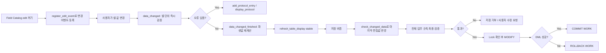

# NEWCH31_OLDCH28_REWRITE - Editable Grid ALV와 입력 검증

> 기준: `content/abap/CH28/*`, `reference/codex_0625_v2/CH28_REWRITE.md`, `reference/codex_0629_v3/00_CONCEPT_GAP_AUDIT.md`, `.project-docs/11_KEYWORD_AUDIT.md`, `.project-docs/TRACK2_ENRICHMENT.md`

## 이 장의 위치

NEWCH30에서 학습자는 ALV Grid의 `double_click`, `hotspot_click`, `toolbar`, `user_command`를 배웠다. 그 이벤트들은 사용자가 화면을 클릭하거나 버튼을 누를 때 프로그램이 반응하는 방법이었다. NEWCH31은 한 단계 더 들어간다. 사용자가 ALV 셀 안에 값을 직접 입력하고, 그 값을 검증하고, 문제가 없을 때만 DB 저장 흐름으로 넘기는 장이다.

비전공자 입장에서는 "표에서 값을 바꾸면 저장된 것 아닌가?"라고 생각하기 쉽다. 실제 ABAP 프로그램에서는 그렇지 않다. 화면에 보이는 값, ALV Grid가 들고 있는 프론트엔드 값, ABAP 내부 테이블 값, DB 테이블 값은 서로 다른 단계다. Editable Grid ALV는 이 단계를 연결하는 도구이지만, 연결을 잘못하면 마지막 셀 입력 누락, 잘못된 값 저장, 잠금 없는 중복 변경, 사용자가 어느 셀을 고쳐야 하는지 모르는 문제가 바로 생긴다.

이 장은 다음 질문에 답한다.

| 질문 | 이 장에서 배우는 답 |
|---|---|
| 어떤 컬럼만 입력 가능하게 열 것인가 | Field Catalog의 `edit` 속성 |
| 사용자가 값을 바꾼 순간을 어떻게 받을 것인가 | `register_edit_event`, `data_changed` |
| 검증 오류를 어느 셀에 보여 줄 것인가 | `CL_ALV_CHANGED_DATA_PROTOCOL`, `add_protocol_entry`, `display_protocol` |
| 검증 뒤 합계와 파생값은 언제 다시 계산할 것인가 | `data_changed_finished`, `e_modified`, stable refresh |
| 같은 컬럼이라도 특정 행만 잠글 수 있는가 | `LVC_T_STYL`, `stylefname`, `mc_style_disabled` |
| 저장 버튼 앞에서 무엇을 다시 확인해야 하는가 | `check_changed_data`, 전체 검증, DML, `COMMIT WORK`/`ROLLBACK WORK` |

## R15 게이팅과 classic-first 경계

이 장은 Classic SAP GUI의 `CL_GUI_ALV_GRID` 기반 수업이다. SAP GUI Control Framework 위에서 동작하는 화면 기술이므로 ABAP Cloud, RAP, Fiori Elements의 입력 검증 방식으로 바꾸어 설명하지 않는다. Cloud-ready 설계가 필요한 경우에는 released API, RAP behavior validation, Fiori 메시지 표시를 별도로 검토해야 하지만, 여기서는 Classic ABAP 현장에서 여전히 읽고 유지보수해야 하는 Editable Grid ALV를 정확히 배운다.

선행 지식 경계는 다음과 같다.

| 선행 장 | 이 장에서 사용하는 정도 |
|---|---|
| CH17/CH21 | `CL_GUI_ALV_GRID`, Field Catalog, Layout, `refresh_table_display` 감각을 전제로 한다. |
| CH20 | `FOR EVENT`, `SET HANDLER`, handler method 선언을 사용한다. |
| CH24 | `MODIFY dbtab`, `sy-subrc`, `sy-dbcnt`, LUW 개념을 저장 레슨에서 다시 연결한다. |
| CH25 | 저장 전 Lock과 권한 확인이 필요하다는 경계만 연결한다. Lock 설계 자체를 새로 확장하지 않는다. |
| CH27/NEWCH30 | ALV 이벤트 배선은 이미 배웠으므로, 이번 장은 "입력값 변경 이벤트"에 집중한다. |
| CH29 이후 | Enhancement, BAdI, Gateway, RAP, Fiori 검증은 다루지 않는다. |

CH28 원문 L04에서 한때 `COND` 같은 constructor expression을 섣불리 쓰면 학습 게이팅이 흔들릴 수 있다는 감사가 있었다. v3에서는 셀 스타일 결정 예제에 의도적으로 `IF`를 사용한다. CH18 이후라서 new syntax를 읽을 수는 있지만, 이 장의 핵심은 "셀별 입력 제어 흐름"이지 expression 축약이 아니다.

## 공식 문서 확인 메모

Classic ABAP 문법과 DB/LUW 경계는 로컬 ABAP Keyword Documentation에서 수동 확인했다.

| 범위 | 확인 파일 | 본문 반영 |
|---|---|---|
| 이벤트 핸들러 선언 | `C:\ABAP_DOCU_HTML\abapmethods_event_handler.htm` | `METHODS ... FOR EVENT ... OF ... IMPORTING ...` 구조 |
| 이벤트 등록 | `C:\ABAP_DOCU_HTML\abapset_handler_instance.htm`, `abapevents.htm` | handler method는 선언만으로 실행되지 않고 `SET HANDLER ... FOR go_grid`가 필요하다는 설명 |
| DB 반영 | `C:\ABAP_DOCU_HTML\abapmodify_dbtab.htm` | `MODIFY dbtab`, `sy-subrc`, `sy-dbcnt` 확인 |
| SAP LUW 확정/취소 | `C:\ABAP_DOCU_HTML\abapcommit.htm`, `abaprollback.htm` | `COMMIT WORK`와 `ROLLBACK WORK`의 저장 경계 |
| 메시지 | `C:\ABAP_DOCU_HTML\abapmessage.htm` | application logic보다 presentation feedback 위치에서 메시지 사용을 주의 |
| SAP GUI/Control 경계 | `C:\ABAP_DOCU_HTML\abengui_control_glosry.htm`, `abensap_gui_glosry.htm` | 이 장이 SAP GUI 기반 Classic 화면 기술임을 명시 |
| ABAP Cloud 경계 | `C:\ABAP_DOCU_DOWNLOAD\ABAP_DOCU\abap-docs-main\docs\cloud\md\ABENABAP_CLOUD_GLOSRY.md`, `ABENRELEASED_API_GLOSRY.md`, `ABENCLASSIC_ABAP_GLOSRY.md` | Cloud에서는 SAP GUI ALV Grid를 그대로 전제하지 않는다는 경계 |

`CL_GUI_ALV_GRID`의 세부 메서드와 이벤트는 ABAP Keyword Documentation이 아니라 ALV Grid Control API 영역이다. SAP Help Portal의 ALV Grid Control 문서와 support content를 보조 근거로 확인했다. 특히 `REGISTER_EDIT_EVENT`, `CHECK_CHANGED_DATA`, `DATA_CHANGED`, `DATA_CHANGED_FINISHED`, cell style, `stylefname`는 Grid Control의 API로 다룬다.

## 전체 프로세스 지도



학습자는 이 흐름을 외우기보다 상태를 구분해야 한다. `edit`는 입력칸을 열 뿐이고, `data_changed`는 바뀐 값을 검증할 기회이며, `check_changed_data`는 저장 직전 화면의 마지막 편집값을 내부 테이블로 밀어 넣는 단계다. 각 단계의 책임이 다르다.

## NEWCH31-L01 - Editable Field Catalog 설정

### 왜 필요한가

ALV를 처음 배울 때는 "표 형태로 데이터를 잘 보여 주는 것"이 목표였다. 실무에서는 사용자가 표에서 바로 수량, 상태, 비고 같은 값을 고치고 싶어 한다. 예매 관리 화면에서 담당자가 좌석 수를 조정하거나, 승인 목록에서 처리 상태를 바꾸거나, 재고 조정 화면에서 조정 수량을 입력하는 식이다.

하지만 표 전체를 입력 가능하게 열면 위험하다. 예약번호, 고객번호, 전표번호 같은 키 값은 사용자가 바꾸면 안 된다. 계산 컬럼도 사용자가 직접 바꾸면 안 된다. 그래서 Editable ALV의 첫 단계는 "입력을 받을 컬럼을 정확히 고르는 것"이다.

### 무엇인가

Field Catalog는 ALV Grid가 내부 테이블을 화면 컬럼으로 그릴 때 참고하는 컬럼별 설정표다. 여기서 특정 컬럼의 `edit` 속성을 켜면 그 컬럼은 입력 가능한 셀로 표시된다.

예를 들어 예매 실적 테이블에 `PERF_ID`, `TITLE`, `SEATS`, `AMOUNT`가 있을 때 사용자가 바꿀 수 있는 값이 `SEATS`뿐이라면 `SEATS` 컬럼에만 `edit = abap_true`를 준다.

```abap
LOOP AT gt_fieldcat REFERENCE INTO DATA(lr_fcat).
  IF lr_fcat->fieldname = 'SEATS'.
    lr_fcat->edit = abap_true.
  ELSE.
    lr_fcat->edit = abap_false.
  ENDIF.
ENDLOOP.
```

여기서 중요한 점은 `edit`가 저장을 의미하지 않는다는 것이다. `edit`는 화면 셀을 입력 가능하게 그리라는 설정이다. 사용자가 값을 바꾼 사실을 프로그램이 받으려면 edit event도 등록해야 한다.

```abap
SET HANDLER go_receiver->on_data_changed FOR go_grid.
SET HANDLER go_receiver->on_changed_finished FOR go_grid.

go_grid->register_edit_event(
  i_event_id = cl_gui_alv_grid=>mc_evt_modified ).

go_grid->register_edit_event(
  i_event_id = cl_gui_alv_grid=>mc_evt_enter ).
```

`mc_evt_modified`는 셀이 변경되었을 때 프로그램이 변경을 더 적극적으로 감지하게 만드는 등록이고, `mc_evt_enter`는 사용자가 Enter를 눌렀을 때 변경 이벤트를 받는 등록이다. 실무 화면에서는 사용자가 꼭 Enter를 누른다는 보장이 없으므로, 어떤 사용자 행동을 기준으로 검증할지 화면 설계와 함께 결정한다.

### 어떻게 확인하는가

첫 번째 확인은 화면이다. 편집 모드를 켰을 때 `SEATS`만 입력 가능한 셀로 보여야 한다. `PERF_ID`, `TITLE`, `AMOUNT`가 입력칸으로 변하면 Field Catalog 범위를 잘못 열었다는 뜻이다.

두 번째 확인은 이벤트 준비 상태다. 화면에서 값을 바꿨는데 이후 L02의 `data_changed` 로그가 찍히지 않는다면 다음을 점검한다.

| 점검 | 기대 상태 |
|---|---|
| `edit` 속성 | 입력받을 컬럼에만 `abap_true` |
| `SET HANDLER` | `on_data_changed`, `on_changed_finished`가 `go_grid`에 등록됨 |
| `register_edit_event` | `mc_evt_modified` 또는 `mc_evt_enter` 등록 |
| 화면 상태 | Grid가 ready for input 상태 |

:::embed CH28-L01-S01 | Editable 컬럼 - 편집 모드 토글 | 360::

### 실수와 주의

가장 흔한 실수는 `edit`만 켜고 이벤트 등록을 하지 않는 것이다. 사용자는 화면에서 값을 바꾸지만, 프로그램은 어느 셀이 바뀌었는지 받지 못한다. "입력 가능"과 "변경 감지"는 같은 일이 아니다.

두 번째 실수는 모든 컬럼을 편집 가능하게 여는 것이다. 비전공자 학습자는 "테스트하기 편하니 전부 열자"라고 생각할 수 있지만, 실무 데이터에서는 키 컬럼이 바뀌면 어떤 DB 행을 수정해야 하는지 기준이 무너진다. Editable ALV는 편리함을 위해 쓰지만, 그 편리함 때문에 데이터 보호 경계가 더 중요해진다.

세 번째 실수는 `mc_evt_enter`만 등록하고 사용자가 마우스로 다른 버튼을 누르는 흐름을 놓치는 것이다. 사용자가 셀에 값을 입력한 뒤 Enter를 누르지 않고 바로 저장 버튼을 누를 수 있다. 그래서 L06에서 `check_changed_data`를 다시 호출해야 한다.

### 체험형 학습 설계

시뮬레이터는 "표시 전용", "SEATS만 편집", "전체 편집 위험" 세 모드를 가진다.

| 버튼/상태 | 학습 피드백 |
|---|---|
| 표시 전용 | 모든 셀이 회색 또는 읽기 전용으로 보이고, 이벤트 로그가 비어 있다. |
| SEATS만 편집 | `SEATS` 셀만 입력 가능하고, Field Catalog 패널에서 `fieldname=SEATS`, `edit=X`가 강조된다. |
| 전체 편집 위험 | 키 컬럼까지 입력칸으로 열리며 "업무 키 변경 위험" 경고가 표시된다. |
| 이벤트 등록 끄기 | 셀은 입력되지만 `data_changed` 로그가 생기지 않는 상태를 보여 준다. |

학습 화면에는 세 개의 상태 패널을 둔다. "화면 입력 가능 여부", "이벤트 등록 여부", "내부 테이블 반영 여부"를 따로 표시해 입문자가 edit와 저장을 혼동하지 않게 한다.

### 정리

Editable ALV의 출발점은 필요한 컬럼만 `edit`로 여는 것이다. 그러나 `edit`는 입력칸을 만드는 설정일 뿐이다. 변경을 검증하려면 `SET HANDLER`와 `register_edit_event`로 이벤트를 받을 준비를 해야 한다. 키 컬럼과 계산 컬럼은 기본적으로 보호하고, 업무상 수정 가능한 값만 입력 가능하게 만든다.

## NEWCH31-L02 - DATA_CHANGED Event

### 왜 필요한가

사용자가 셀에 잘못된 값을 넣은 뒤 저장 버튼을 누를 때까지 아무 피드백도 없다면 학습자와 실무 사용자는 모두 답답해진다. 예를 들어 좌석 수는 1 이상 10 이하만 허용되는데 사용자가 `99`를 입력했다면, 그 자리에서 바로 알려 주는 것이 좋다. 저장 버튼을 눌렀을 때 한꺼번에 오류를 보여 주면 어떤 셀을 고쳐야 하는지 찾기 어렵다.

`data_changed` 이벤트는 사용자가 셀 값을 바꾼 직후 프로그램이 끼어들 수 있는 지점이다. 이 이벤트에서 "방금 바뀐 셀"을 보고, 값이 업무 규칙에 맞는지 검사하고, 잘못되었으면 ALV 변경 프로토콜에 오류를 등록한다.

### 무엇인가

`data_changed`는 `CL_GUI_ALV_GRID`의 이벤트다. handler method는 `FOR EVENT data_changed OF cl_gui_alv_grid`로 선언하고, `er_data_changed`라는 변경 프로토콜 객체를 받는다.

```abap
CLASS lcl_event_receiver DEFINITION.
  PUBLIC SECTION.
    METHODS on_data_changed
      FOR EVENT data_changed OF cl_gui_alv_grid
      IMPORTING er_data_changed.
ENDCLASS.

CLASS lcl_event_receiver IMPLEMENTATION.
  METHOD on_data_changed.
    DATA lv_seats TYPE i.

    LOOP AT er_data_changed->mt_good_cells INTO DATA(ls_cell).
      IF ls_cell-fieldname <> 'SEATS'.
        CONTINUE.
      ENDIF.

      TRY.
          lv_seats = ls_cell-value.
        CATCH cx_sy_conversion_no_number.
          er_data_changed->add_protocol_entry(
            i_msgid     = 'ZBK'
            i_msgty     = 'E'
            i_msgno     = '001'
            i_msgv1     = '숫자로 입력하세요'
            i_fieldname = ls_cell-fieldname
            i_row_id    = ls_cell-row_id ).
          CONTINUE.
      ENDTRY.

      IF lv_seats < 1 OR lv_seats > 10.
        er_data_changed->add_protocol_entry(
          i_msgid     = 'ZBK'
          i_msgty     = 'E'
          i_msgno     = '002'
          i_msgv1     = '좌석 수는 1~10만 가능합니다'
          i_fieldname = ls_cell-fieldname
          i_row_id    = ls_cell-row_id ).
      ENDIF.
    ENDLOOP.
  ENDMETHOD.
ENDCLASS.
```

`mt_good_cells`라는 이름 때문에 "이미 업무적으로 좋은 셀"이라고 오해할 수 있다. 여기서는 ALV가 변경 후보로 넘겨 준 셀 목록으로 이해하는 편이 안전하다. 이 목록에서 내가 관심 있는 컬럼만 골라 업무 규칙을 다시 확인한다.

오류가 있을 때는 일반 `MESSAGE '오류' TYPE 'E'`만 던지는 방식보다 `add_protocol_entry`가 더 적합하다. Editable ALV에서는 어느 행, 어느 컬럼이 틀렸는지 셀 위치와 메시지를 함께 알려야 하기 때문이다.

### 어떻게 확인하는가

다음 값을 직접 입력해 결과를 확인한다.

| 입력값 | 기대 결과 |
|---|---|
| `5` | 통과. 오류 프로토콜이 생기지 않고 값이 반영 후보가 된다. |
| `0` | 오류. 좌석 수 최소값 위반 메시지가 해당 셀에 연결된다. |
| `11` | 오류. 1인 최대 좌석 수 위반 메시지가 해당 셀에 연결된다. |
| `ABC` | 오류. 숫자 변환 실패 메시지가 해당 셀에 연결된다. |
| 빈 값 | 업무 규칙에 따라 오류 또는 초기값 허용으로 분기한다. 이 예제에서는 오류로 처리한다. |

이벤트 로그에는 `data_changed`, `row_id`, `fieldname=SEATS`, `value`가 표시되어야 한다. 로그가 없다면 L01의 `register_edit_event`와 `SET HANDLER`를 먼저 확인한다.

:::embed CH28-L02-S01 | DATA_CHANGED - 셀 변경 즉시 검증 | 460::

### 실수와 주의

첫 번째 실수는 모든 행을 매번 검증하는 것이다. `data_changed`는 사용자가 셀을 고치는 동안 여러 번 발생할 수 있다. 이 이벤트에서는 바뀐 셀 중심으로 빠르게 검사하고, 여러 행을 합쳐야 하는 전체 규칙은 L06 저장 전 검증으로 남겨 둔다.

두 번째 실수는 문자 입력을 숫자처럼 바로 비교하는 것이다. 사용자가 `ABC`를 넣으면 숫자 비교 전에 변환 오류가 발생할 수 있다. 그래서 예제처럼 `TRY...CATCH`로 변환 실패를 별도 오류로 등록해야 한다.

세 번째 실수는 프로토콜 대신 팝업 메시지만 남기는 것이다. 팝업은 사용자가 읽고 닫으면 끝이다. 반면 프로토콜은 셀 위치와 연결되어 "이 셀을 고쳐야 한다"는 피드백을 남긴다.

### 체험형 학습 설계

시뮬레이터는 입력 버튼 네 개를 제공한다: `5 입력`, `0 입력`, `11 입력`, `ABC 입력`. 버튼을 누르면 셀 값, 이벤트 로그, 프로토콜 목록이 동시에 바뀐다.

상태는 다음 네 단계로 표시한다.

| 상태 | 화면 표시 |
|---|---|
| 대기 | 변경 셀이 없고 프로토콜도 없다. |
| 변경 감지 | `mt_good_cells` 테이블에 행이 추가된다. |
| 검증 통과 | 셀 테두리가 정상색이고 저장 후보 표시가 켜진다. |
| 프로토콜 오류 | 셀이 빨간색으로 표시되고 오류 목록에 메시지가 추가된다. |

코드 패널은 `LOOP AT mt_good_cells`, 숫자 변환, 범위 검사, `add_protocol_entry` 순서로 하이라이트한다. 입문자가 이벤트가 "자동으로 모든 것을 해결하는 것"이 아니라 "프로그램이 검사할 기회를 주는 것"임을 체감하게 한다.

### 정리

`data_changed`는 셀 값이 바뀐 직후 검증하는 이벤트다. `er_data_changed->mt_good_cells`에서 바뀐 셀을 확인하고, 잘못된 값은 `add_protocol_entry`로 ALV 변경 프로토콜에 등록한다. 이 레슨의 목표는 모든 저장 규칙을 끝내는 것이 아니라, 사용자가 방금 입력한 셀에 즉시 피드백을 주는 것이다.

## NEWCH31-L03 - DATA_CHANGED_FINISHED Event

### 왜 필요한가

입력값 검증과 후처리는 다르다. 좌석 수가 1~10 범위에 들어오는지 확인하는 것은 검증이다. 좌석 수가 바뀐 뒤 총 좌석 수, 잔여 좌석, 합계 금액을 다시 계산하는 것은 후처리다.

검증과 후처리를 같은 위치에 섞으면 문제가 생긴다. 아직 값이 확정되지 않은 단계에서 합계를 계산하면 틀릴 수 있고, 후처리 중에 다시 값이 바뀌면 이벤트가 반복되어 화면이 흔들릴 수 있다. `data_changed_finished`는 변경이 내부 테이블에 반영된 뒤 파생값을 정리하기 좋은 지점이다.

### 무엇인가

`data_changed_finished`는 ALV가 변경 처리를 끝낸 뒤 발생하는 이벤트다. handler method는 `e_modified`를 받아 실제 변경이 있었는지 확인할 수 있다.

```abap
CLASS lcl_event_receiver DEFINITION.
  PUBLIC SECTION.
    METHODS on_changed_finished
      FOR EVENT data_changed_finished OF cl_gui_alv_grid
      IMPORTING e_modified.
ENDCLASS.

CLASS lcl_event_receiver IMPLEMENTATION.
  METHOD on_changed_finished.
    IF e_modified <> abap_true.
      RETURN.
    ENDIF.

    LOOP AT gt_perf ASSIGNING FIELD-SYMBOL(<ls_perf>).
      <ls_perf>-amount = <ls_perf>-seats * <ls_perf>-price.
    ENDLOOP.

    go_grid->refresh_table_display(
      EXPORTING
        is_stable = VALUE #( row = abap_true col = abap_true ) ).
  ENDMETHOD.
ENDCLASS.
```

여기서 `refresh_table_display`는 내부 테이블에 다시 계산된 값이 화면에 보이게 한다. `is_stable`은 사용자가 보고 있던 행과 컬럼 위치가 불필요하게 튀지 않도록 돕는다.

### 어떻게 확인하는가

확인은 세 단계로 한다.

| 단계 | 기대 결과 |
|---|---|
| `SEATS`를 정상값으로 변경 | `data_changed` 검증이 통과한다. |
| Enter 또는 셀 이동으로 변경 확정 | `data_changed_finished` 로그가 찍힌다. |
| 합계/금액 컬럼 확인 | 변경된 좌석 수 기준으로 파생값이 다시 계산된다. |

변경하지 않고 셀만 이동했을 때는 `e_modified`가 false일 수 있다. 이때는 불필요한 재계산과 refresh를 하지 않는 것이 정상이다.

:::embed CH28-L03-S01 | DATA_CHANGED_FINISHED - 합계 재계산 | 460::

### 실수와 주의

첫 번째 실수는 `data_changed_finished`에서 검증 오류를 처음 발견하려는 것이다. 셀 단위 즉시 오류는 L02/L05의 `data_changed`에서 처리하는 편이 사용자에게 더 친절하다. `data_changed_finished`는 통과한 변경 뒤 파생값을 정리하는 자리로 생각한다.

두 번째 실수는 refresh가 다시 변경 이벤트를 일으키는 구조를 만드는 것이다. 후처리에서 사용자가 입력한 필드를 다시 바꾸거나, handler 안에서 같은 이벤트를 반복 유발하면 화면이 흔들리거나 성능이 나빠진다. 파생 컬럼만 계산하고 stable refresh를 사용한다.

세 번째 실수는 `e_modified`를 무시하는 것이다. 변경이 없는데도 매번 전체 계산과 refresh를 하면 사용자는 화면이 불안정하다고 느끼고, 대량 데이터에서는 성능 문제가 생긴다.

### 체험형 학습 설계

시뮬레이터는 "입력 중", "검증 통과", "변경 완료", "합계 갱신"을 시간 순서로 보여 준다. 사용자가 `SEATS`를 바꾸면 아래 패널이 순서대로 켜진다.

| 패널 | 보여 줄 내용 |
|---|---|
| 변경 셀 | row, fieldname, old value, new value |
| 검증 결과 | 통과 또는 프로토콜 오류 |
| 후처리 | `e_modified = X`, 금액 재계산 |
| 화면 갱신 | stable row/column 유지 여부 |

진단 버튼은 `e_modified 무시`와 `stable 옵션 끄기`를 둔다. `stable 옵션 끄기`를 누르면 refresh 뒤 스크롤 위치가 흔들리는 예시를 보여 주어, 작은 옵션이 사용성에 미치는 영향을 확인하게 한다.

### 정리

`data_changed`는 변경 직후 검증에 적합하고, `data_changed_finished`는 변경이 반영된 뒤 파생값을 갱신하는 데 적합하다. `e_modified`로 실제 변경 여부를 확인하고, 필요한 경우에만 합계나 금액을 다시 계산한 뒤 stable refresh로 화면을 갱신한다.

## NEWCH31-L04 - Cell Style 기반 입력 제어

### 왜 필요한가

Field Catalog의 `edit`는 컬럼 단위 설정이다. 그런데 실무 규칙은 컬럼 단위로만 끝나지 않는다. 같은 `SEATS` 컬럼이라도 어떤 공연은 수정 가능하고, 어떤 공연은 이미 마감되어 수정 불가일 수 있다. 같은 표 안에서 특정 행의 특정 셀만 잠가야 하는 상황이 많다.

예를 들어 다음과 같은 규칙을 생각할 수 있다.

| 행 상태 | `SEATS` 수정 가능 여부 |
|---|---|
| 판매 중 | 가능 |
| 매진 | 불가 |
| 정산 완료 | 불가 |
| 잠금 중 | 불가 |

이때 Field Catalog만으로는 부족하다. Field Catalog로 `SEATS` 컬럼을 입력 가능하게 열고, 예외적으로 잠글 셀은 Cell Style로 제어한다.

### 무엇인가

Cell Style은 각 행 안에 "특정 셀의 표시/동작 속성"을 담는 내부 테이블을 두는 방식이다. 보통 출력 행 구조에 `LVC_T_STYL` 타입 컴포넌트를 추가하고, Layout의 `stylefname`에 그 컴포넌트 이름을 지정한다.

```abap
TYPES: BEGIN OF ty_perf,
         perf_id    TYPE zperf_id,
         title      TYPE ztitle,
         status     TYPE zstatus,
         seats      TYPE i,
         capacity   TYPE i,
         cellstyles TYPE lvc_t_styl,
       END OF ty_perf.

DATA gt_perf TYPE STANDARD TABLE OF ty_perf.
DATA gs_layout TYPE lvc_s_layo.

LOOP AT gt_perf ASSIGNING FIELD-SYMBOL(<ls_perf>).
  DATA lv_style TYPE i.

  IF <ls_perf>-status = 'SOLD_OUT'
     OR <ls_perf>-status = 'CLOSED'.
    lv_style = cl_gui_alv_grid=>mc_style_disabled.
  ELSE.
    lv_style = cl_gui_alv_grid=>mc_style_enabled.
  ENDIF.

  CLEAR <ls_perf>-cellstyles.
  APPEND VALUE #(
    fieldname = 'SEATS'
    style     = lv_style ) TO <ls_perf>-cellstyles.
ENDLOOP.

gs_layout-stylefname = 'CELLSTYLES'.
```

핵심은 두 단계다. 먼저 Field Catalog에서 `SEATS` 컬럼을 입력 가능하게 열어 둔다. 그 다음 각 행의 `CELLSTYLES`에서 필요한 셀만 `mc_style_disabled`로 잠근다. 컬럼 전체가 닫혀 있으면 셀별 style을 켜도 사용자가 입력할 수 없다.

### 어떻게 확인하는가

화면에서 다음 상태를 확인한다.

| 데이터 상태 | 기대 화면 |
|---|---|
| 판매 중 행 | `SEATS` 셀이 입력 가능 |
| 매진 행 | 같은 `SEATS` 컬럼이지만 해당 행의 셀만 읽기 전용 |
| 정산 완료 행 | 수정 불가 표시 |
| 상태를 판매 중에서 매진으로 변경 | style 재계산 후 `SEATS` 셀이 잠김 |

또한 Layout 패널에서 `stylefname = 'CELLSTYLES'`가 설정되어 있는지 확인한다. 출력 구조 안에 style 테이블이 있어도 `stylefname`을 지정하지 않으면 ALV Grid가 그 정보를 읽지 않는다.

:::embed CH28-L04-S01 | Cell Style - 매진 행 입력 잠금 | 360::

### 실수와 주의

첫 번째 실수는 Field Catalog `edit`와 Cell Style의 역할을 거꾸로 이해하는 것이다. Field Catalog의 `edit`는 컬럼을 입력 가능 후보로 여는 설정이고, Cell Style은 행/셀 단위 예외를 적용하는 설정이다.

두 번째 실수는 데이터 상태가 바뀐 뒤 style을 다시 계산하지 않는 것이다. 예를 들어 사용자가 매진 토글을 눌렀는데 기존 style이 그대로 남아 있으면 화면은 여전히 입력 가능하게 보인다. 데이터 상태와 style은 함께 갱신해야 한다.

세 번째 실수는 UI 잠금을 보안으로 착각하는 것이다. Cell Style은 사용자가 화면에서 입력하지 못하게 돕는 UI 제어다. 악의적 호출, 병렬 변경, 권한 없는 저장까지 막는 보안 장치가 아니다. 저장 전 L06 검증과 CH25의 Lock/Authorization 경계를 반드시 다시 적용해야 한다.

### 체험형 학습 설계

시뮬레이터는 각 행에 `판매 중`, `매진`, `정산 완료` 토글을 둔다. 토글을 바꾸면 row data, `CELLSTYLES` 내부 테이블, 실제 화면 셀 상태가 동시에 바뀐다.

진단 버튼은 두 개다.

| 진단 버튼 | 보여 줄 오류 |
|---|---|
| `stylefname 누락` | `CELLSTYLES` 데이터는 존재하지만 화면에 적용되지 않는다. |
| `style 재계산 누락` | 상태는 매진인데 셀은 계속 입력 가능해 보인다. |

학습자는 "데이터", "style 테이블", "layout-stylefname", "화면 결과" 네 층을 함께 보면서 Cell Style이 단순한 색칠 기능이 아니라 입력 가능 여부를 제어하는 화면 메타데이터임을 이해한다.

### 정리

같은 컬럼 안에서도 행마다 입력 가능 여부가 다르면 Cell Style을 사용한다. 출력 행 구조에 `LVC_T_STYL` 컴포넌트를 두고, Layout의 `stylefname`에 그 이름을 지정한 뒤, 각 행에서 `mc_style_enabled` 또는 `mc_style_disabled`를 설정한다. 단, Cell Style은 UI 제어일 뿐이므로 저장 전 검증과 권한/잠금 검사를 대신하지 않는다.

## NEWCH31-L05 - Grid 입력값 검증과 오류 표시

### 왜 필요한가

L02에서 `data_changed` 이벤트를 배웠다면, L05는 사용자에게 "고칠 수 있는 오류"로 보여 주는 방법을 더 구체화한다. 업무 프로그램에서 좋은 검증은 단순히 "오류입니다"라고 말하지 않는다. 어느 행, 어느 컬럼, 어떤 규칙이 틀렸는지 알려 주고, 사용자가 바로 수정할 수 있게 해야 한다.

입문자는 오류 메시지를 만들 때 `MESSAGE '잘못되었습니다' TYPE 'E'`를 먼저 떠올리기 쉽다. 하지만 Editable ALV에서는 메시지가 셀과 연결되어야 한다. 사용자가 표 안에서 작업하고 있으므로, 오류도 표 안의 위치와 함께 보여 주는 것이 자연스럽다.

### 무엇인가

`CL_ALV_CHANGED_DATA_PROTOCOL`은 ALV Grid 변경 데이터 처리 중 오류와 메시지를 관리하는 프로토콜 객체다. `data_changed` 이벤트에서 전달되는 `er_data_changed`를 통해 오류 메시지를 등록하고 표시할 수 있다.

```abap
METHOD on_data_changed.
  DATA lv_seats TYPE i.
  DATA lv_has_error TYPE abap_bool.

  LOOP AT er_data_changed->mt_good_cells INTO DATA(ls_cell).
    CASE ls_cell-fieldname.
      WHEN 'SEATS'.
        CLEAR lv_has_error.

        TRY.
            lv_seats = ls_cell-value.
          CATCH cx_sy_conversion_no_number.
            lv_has_error = abap_true.
            er_data_changed->add_protocol_entry(
              i_msgid     = 'ZBK'
              i_msgty     = 'E'
              i_msgno     = '001'
              i_msgv1     = '좌석 수'
              i_msgv2     = '숫자만 입력'
              i_fieldname = ls_cell-fieldname
              i_row_id    = ls_cell-row_id ).
        ENDTRY.

        IF lv_has_error = abap_false
           AND ( lv_seats < 1 OR lv_seats > 10 ).
          lv_has_error = abap_true.
          er_data_changed->add_protocol_entry(
            i_msgid     = 'ZBK'
            i_msgty     = 'E'
            i_msgno     = '002'
            i_msgv1     = '1~10'
            i_msgv2     = '범위만 허용'
            i_fieldname = ls_cell-fieldname
            i_row_id    = ls_cell-row_id ).
        ENDIF.

      WHEN OTHERS.
        CONTINUE.
    ENDCASE.
  ENDLOOP.

  er_data_changed->display_protocol( ).
ENDMETHOD.
```

`add_protocol_entry`에는 메시지 클래스, 메시지 타입, 메시지 번호, 메시지 변수, 필드명, 행 번호를 넘긴다. 이 정보가 있어야 ALV가 오류 목록과 셀 표시를 연결할 수 있다.

`display_protocol`은 오류 목록을 사용자에게 보여 주는 데 사용한다. 시스템이나 설정에 따라 프로토콜 표시 방식은 다르게 보일 수 있지만, 원칙은 같다. 오류를 "텍스트 한 줄"로 끝내지 않고 변경 프로토콜에 등록한다.

### 어떻게 확인하는가

다음 확인 시나리오를 실행한다.

| 시나리오 | 기대 결과 |
|---|---|
| `SEATS=5` 입력 | 오류 목록이 비어 있고 셀은 정상 표시 |
| `SEATS=0` 입력 | 해당 셀에 범위 오류 등록 |
| `SEATS=11` 입력 | 해당 셀에 최대 허용 수량 오류 등록 |
| `SEATS=ABC` 입력 | 해당 셀에 숫자 변환 오류 등록 |
| 오류 셀을 정상값으로 수정 | 오류 표시가 해소되고 정상 흐름으로 복귀 |

오류 목록에는 행 번호와 컬럼이 식별 가능해야 한다. 사용자가 "어디를 고쳐야 하는지"를 찾느라 표를 헤매면 검증 설계가 부족한 것이다.

:::embed CH28-L05-S01 | 입력 검증 - 오류 셀과 목록 | 480::

### 실수와 주의

첫 번째 실수는 메시지를 너무 추상적으로 쓰는 것이다. "입력 오류"보다 "좌석 수는 1~10만 가능합니다"가 낫다. 사용자가 다음 행동을 바로 알 수 있어야 한다.

두 번째 실수는 검증 오류가 있어도 저장 버튼을 계속 통과시키는 것이다. L05의 오류는 사용자 경험을 위한 즉시 피드백이고, L06에서는 저장 직전에 다시 전체 검증을 해야 한다. 두 방어선이 모두 있어야 한다.

세 번째 실수는 프로토콜 표시를 너무 공격적으로 띄우는 것이다. 사용자가 한 글자를 입력할 때마다 팝업이 반복되면 불편하다. 교육용 시뮬레이터에서는 `display_protocol`을 명확히 보여 주되, 실무 화면에서는 이벤트 발생 시점과 표시 방식을 사용자 흐름에 맞게 조정한다.

### 체험형 학습 설계

시뮬레이터는 Grid, 오류 목록, 메시지 상세, 저장 가능 여부를 한 화면에 둔다.

| 영역 | 보여 줄 피드백 |
|---|---|
| Grid | 오류 셀 빨간 표시, 정상 셀 일반 표시 |
| 오류 목록 | row, fieldname, message id/type/number, message text |
| 메시지 상세 | `i_msgv1`~`i_msgv4`가 실제 문장에 들어가는 방식 |
| 저장 상태 | 오류가 있으면 "저장 불가", 오류가 없으면 "저장 가능 후보" |

버튼은 `범위 오류 만들기`, `문자 오류 만들기`, `오류 수정`, `프로토콜 보기`를 둔다. 학습자는 오류가 생기고 사라지는 과정을 직접 보면서 프로토콜이 단순 로그가 아니라 입력 UX의 핵심 장치임을 이해한다.

### 정리

Editable ALV의 검증은 사용자가 어느 셀을 어떻게 고쳐야 하는지 알려 주어야 한다. `add_protocol_entry`는 오류 메시지와 셀 위치를 함께 등록하고, `display_protocol`은 오류 목록을 보여 준다. L05의 목표는 입력 단계에서 친절하게 수정하게 하는 것이고, 최종 저장 가능 여부는 L06에서 다시 판단한다.

## NEWCH31-L06 - 변경 데이터 DB 반영 전 검증

### 왜 필요한가

화면에서 검증이 통과했다고 해서 곧바로 DB에 써도 되는 것은 아니다. 사용자는 마지막 셀에 값을 입력한 뒤 Enter를 누르지 않고 저장 버튼을 누를 수 있다. 이때 화면에는 새 값이 보이지만 내부 테이블에는 아직 이전 값이 남아 있을 수 있다.

또한 셀 하나만 보면 정상이어도 전체 규칙을 보면 오류일 수 있다. 각 행의 `SEATS`는 1~10 범위 안이지만, 같은 고객의 총 예매 좌석 수가 한도를 넘을 수 있다. 특정 회차의 잔여석보다 전체 변경 합계가 클 수도 있다. 이런 규칙은 저장 직전에 전체 데이터 기준으로 다시 봐야 한다.

저장 직전 검증은 데이터 무결성의 마지막 방어선이다. 화면 검증은 사용자를 돕는 장치이고, 저장 검증은 DB를 보호하는 장치다.

### 무엇인가

저장 버튼 처리의 기본 흐름은 다음과 같다.

1. `check_changed_data( )`로 화면의 마지막 편집값을 내부 테이블에 반영한다.
2. ALV 변경 프로토콜이나 변환 오류가 있으면 저장을 중단한다.
3. 내부 테이블 전체를 기준으로 업무 규칙을 검증한다.
4. 권한, 잠금, 최신 DB 상태를 확인한다.
5. 통과한 변경분만 DML로 반영한다.
6. DML 결과를 확인한 뒤 `COMMIT WORK` 또는 `ROLLBACK WORK`를 수행한다.

```abap
DATA lv_valid TYPE abap_bool.
DATA lt_errors TYPE STANDARD TABLE OF string.

" 1) 화면의 마지막 편집값을 내부 테이블로 반영
go_grid->check_changed_data(
  IMPORTING
    e_valid = lv_valid ).

IF lv_valid <> abap_true.
  MESSAGE '입력 오류를 먼저 수정하세요' TYPE 'E'.
  RETURN.
ENDIF.

" 2) 전체 업무 규칙 최종 검증
LOOP AT gt_perf INTO DATA(ls_perf).
  IF ls_perf-seats < 1.
    APPEND |{ ls_perf-perf_id }: 좌석 수는 1 이상이어야 합니다| TO lt_errors.
  ENDIF.

  IF ls_perf-seats > ls_perf-capacity.
    APPEND |{ ls_perf-perf_id }: 정원을 초과했습니다| TO lt_errors.
  ENDIF.
ENDLOOP.

IF lt_errors IS NOT INITIAL.
  " 실제 화면에서는 ALV protocol, application log, 메시지 영역 등으로 표시한다.
  MESSAGE '저장 전 검증 오류가 있습니다' TYPE 'E'.
  RETURN.
ENDIF.

" 3) CH25에서 배운 잠금/권한 확인이 선행되어야 한다.
" ENQUEUE_EZPERF ...

" 4) 실제 시스템에서는 전체 테이블이 아니라 변경된 행만 반영한다.
MODIFY zperf FROM TABLE @gt_perf.

IF sy-subrc = 0.
  COMMIT WORK.
  MESSAGE |{ sy-dbcnt }건이 저장되었습니다| TYPE 'S'.
ELSE.
  ROLLBACK WORK.
  MESSAGE '저장 중 오류가 발생했습니다' TYPE 'E'.
ENDIF.
```

예제는 흐름 이해를 위해 단순화했다. 실무에서는 전체 `gt_perf`를 무조건 `MODIFY`하지 않고 변경된 행만 수집해 반영하는 편이 안전하다. 또한 저장 전에 enqueue lock, authorization check, 최신 DB 재조회, 병렬 변경 충돌 확인을 적용해야 한다. 이 장에서는 CH24/CH25에서 배운 경계를 Editable ALV 저장 버튼 앞에 다시 연결한다.

### 어떻게 확인하는가

확인은 네 가지 시나리오로 한다.

| 시나리오 | 기대 결과 |
|---|---|
| 셀에 값을 입력하고 Enter 없이 바로 저장 | `check_changed_data` 이후 내부 테이블에 마지막 입력값이 반영된다. |
| 셀 단위 오류가 남아 있음 | `e_valid` 또는 프로토콜 상태 때문에 저장이 중단된다. |
| 셀은 정상이나 전체 규칙 위반 | 전체 검증에서 저장이 거부된다. DML은 실행되지 않는다. |
| 모든 검증 통과 | Lock/권한 확인 후 `MODIFY`, 성공 시 `COMMIT WORK`, 실패 시 `ROLLBACK WORK` 흐름을 탄다. |

:::embed CH28-L06-S01 | 저장 전 검증 - 거부 vs MODIFY+COMMIT | 520::

시뮬레이터에서는 `화면 값`, `내부 테이블 값`, `DB 반영 예정 값`을 나란히 보여 준다. 사용자가 셀에 값을 입력했지만 아직 확정하지 않은 상태에서는 화면 값과 내부 테이블 값이 다르게 보인다. 저장 버튼을 누르면 `check_changed_data` 이후 두 값이 같아지는 것을 확인한다.

### 실수와 주의

첫 번째 실수는 `check_changed_data`를 저장 버튼 앞에서 호출하지 않는 것이다. 마지막 셀 편집이 내부 테이블에 반영되지 않은 채 이전 값이 저장될 수 있다. 이 문제는 테스트 중에는 잘 보이지 않다가 사용자가 빠르게 입력하고 바로 저장할 때 나타난다.

두 번째 실수는 화면 검증만 믿는 것이다. 사용자는 중간에 오류를 고쳤을 수 있고, 다른 사용자가 같은 데이터를 바꿨을 수 있으며, 전체 합계 규칙은 셀 하나만 보고 판단할 수 없다. 저장 전에는 전체 규칙을 다시 검증해야 한다.

세 번째 실수는 `COMMIT WORK`를 너무 빨리 호출하는 것이다. 공식 문서 기준으로 `COMMIT WORK`는 현재 SAP LUW의 변경 요청을 확정한다. 한 번 commit한 뒤 화면에서 "취소"를 눌렀다고 DB 변경이 자동으로 되돌아가지 않는다. 검증, Lock, DML 결과 확인이 끝난 뒤에만 commit한다.

네 번째 실수는 UI 잠금과 DB 보호를 혼동하는 것이다. L04에서 셀을 disabled로 만들었더라도 저장 요청을 신뢰하면 안 된다. 저장 로직은 화면 상태와 별개로 권한, 잠금, 업무 규칙을 다시 확인해야 한다.

### 체험형 학습 설계

시뮬레이터는 저장 버튼을 중심으로 여섯 단계 로그를 보여 준다.

| 단계 | 성공 피드백 | 실패 피드백 |
|---|---|---|
| `check_changed_data` | 마지막 편집값 반영 | 입력 프로토콜 오류로 중단 |
| 셀 오류 확인 | 오류 없음 | 오류 셀 목록 표시 |
| 전체 규칙 검증 | 합계/정원/중복 통과 | 위반 규칙 목록 표시 |
| Lock/권한 확인 | 저장 가능 | 다른 사용자 잠금 또는 권한 없음 |
| DML 실행 | `MODIFY` 실행, `sy-dbcnt` 표시 | `sy-subrc` 오류 표시 |
| LUW 종료 | `COMMIT WORK` | `ROLLBACK WORK` |

화면은 세 개의 테이블을 동시에 보여 준다: "화면에 보이는 값", "ABAP 내부 테이블 값", "DB 저장 예정 값". 사용자는 저장 버튼을 누를 때 어떤 값이 어디로 이동하는지 직접 확인한다.

### 정리

Editable ALV의 저장은 입력칸에서 끝나지 않는다. 저장 직전에 `check_changed_data`로 마지막 편집값을 내부 테이블에 반영하고, 셀 단위 오류와 전체 업무 규칙을 다시 검증한 뒤, 통과한 경우에만 DML과 `COMMIT WORK`로 DB에 반영한다. 오류가 있으면 DB에 쓰지 않고 사용자가 수정할 수 있는 정보를 제공한다. 화면 검증은 편의이고, 저장 검증은 무결성의 마지막 방어선이다.

## 장 전체 정리

NEWCH31의 핵심은 Editable ALV를 "표에서 바로 고치는 편리한 기능"이 아니라 "입력, 검증, 피드백, 저장 방어선을 모두 가진 작은 화면 트랜잭션"으로 이해하는 것이다.

| 단계 | 키워드 | 책임 |
|---|---|---|
| 입력 가능 컬럼 열기 | `fieldcat-edit` | 어떤 컬럼을 입력 가능하게 할지 결정 |
| 변경 이벤트 등록 | `register_edit_event`, `SET HANDLER` | 사용자의 셀 변경을 받을 준비 |
| 즉시 검증 | `data_changed`, `mt_good_cells` | 방금 바뀐 셀 검사 |
| 오류 표시 | `add_protocol_entry`, `display_protocol` | 어느 셀을 고쳐야 하는지 안내 |
| 후처리 | `data_changed_finished`, `e_modified` | 파생값 재계산과 화면 refresh |
| 셀별 잠금 | `LVC_T_STYL`, `stylefname` | 행/셀 단위 입력 가능 여부 제어 |
| 저장 전 최종 방어 | `check_changed_data`, `MODIFY`, `COMMIT WORK`, `ROLLBACK WORK` | DB 무결성 보호 |

이 장을 끝낸 학습자는 "ALV에서 입력칸을 만들 수 있다"를 넘어, "사용자가 입력한 값이 화면에서 내부 테이블과 DB로 이동하는 경로를 통제할 수 있다"는 감각을 가져야 한다. 이 감각이 있어야 다음 장의 Enhancement/BAdI나 이후 Interface, 파일 업로드, RAP/Fiori 검증을 배울 때도 입력 검증과 저장 경계를 놓치지 않는다.
