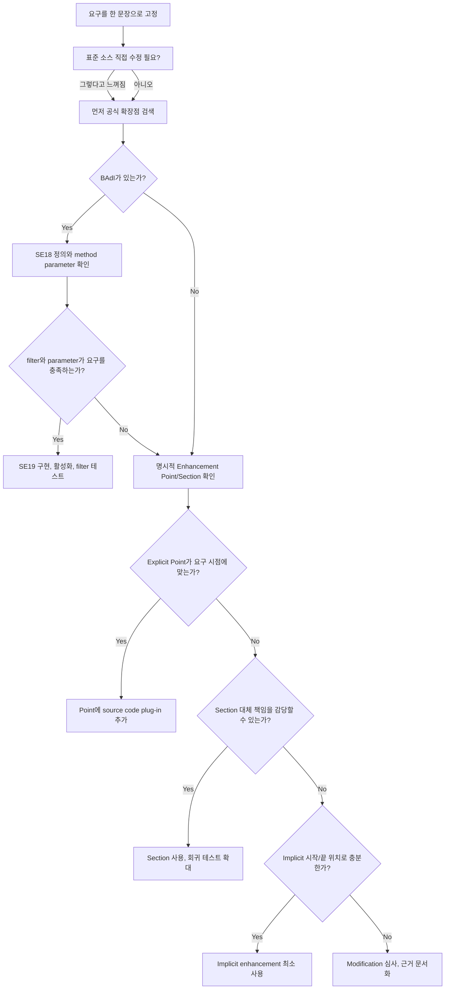

# NEWCH32_OLDCH29_REWRITE - Enhancement / BAdI / User Exit

> 기준: `content/abap/CH29/*`, `reference/codex_0625_v2/CH29_REWRITE.md`, `reference/codex_0629_v3/00_CONCEPT_GAP_AUDIT.md`, `.project-docs/11_KEYWORD_AUDIT.md`, `.project-docs/TRACK2_ENRICHMENT.md`

## 이 장의 위치

NEWCH31까지 학습자는 직접 만든 ABAP 프로그램, Selection Screen, Dynpro, ALV, DB 저장, Lock, OO 설계 안에서 기능을 구현했다. NEWCH32부터는 성격이 달라진다. 실무에서는 내가 만든 Z 프로그램만 고치는 것이 아니라, SAP 표준 판매오더, 구매오더, 전표, 자재, 납품 같은 표준 흐름 중간에 회사 규칙을 넣어야 하는 요구가 자주 온다.

이때 가장 위험한 초보자 반응은 "표준도 ABAP 소스니까 열어서 고치면 되지 않나?"이다. 표준 소스를 직접 수정하면 업그레이드, SAP Note, Support Package, S/4HANA 전환, 운영 장애 분석 때 비용이 커진다. CH29의 핵심은 표준을 수정하는 기술이 아니라, 표준이 허용한 확장 지점을 찾아 고객 로직을 안전하게 연결하는 판단력이다.

이 장의 학습 목표는 다음과 같다.

| 질문 | 이 장에서 배우는 답 |
|---|---|
| 표준을 직접 고치면 왜 위험한가 | modification과 upgrade risk |
| 오래된 표준에서 보이는 User Exit/Customer Exit는 무엇인가 | `FORM userexit_...`, `CALL CUSTOMER-FUNCTION`, `SMOD`, `CMOD` |
| Enhancement Point와 Section은 무엇이 다른가 | Point는 추가, Section은 대체 |
| BAdI는 왜 더 권장되는가 | interface contract, implementation, filter, activation |
| explicit과 implicit은 어떻게 고르는가 | BAdI -> Explicit Point -> Section -> Implicit -> Modification |
| Clean Core 관점에서 무엇을 피해야 하는가 | private API, standard source modification, 과도한 implicit 의존 |

## R15 게이팅과 classic-first 경계

이 장은 Classic ABAP 시스템에서 실제로 만나는 표준 확장 기술을 먼저 다룬다. User Exit, Customer Exit, Enhancement Framework, BAdI는 오래된 ECC와 S/4HANA on-premise 유지보수에서 여전히 읽을 일이 많다. 따라서 "Cloud에서는 이런 방식이 제한될 수 있다"는 이유로 Classic 개념을 생략하지 않는다.

다만 ABAP Cloud, RAP, Key User Extensibility, Developer Extensibility는 L05에서 판단 기준으로만 다룬다. 이 장은 RAP behavior validation, EML save sequence, Fiori Elements extension, Gateway service extension 구현 장이 아니다. 그런 구현은 후속 장 또는 별도 Cloud/RAP 장에서 다룰 주제다.

선행 지식은 다음처럼 연결한다.

| 선행 장 | 이 장에서 사용하는 정도 |
|---|---|
| CH05 | 표준 객체를 직접 고치지 않는다는 `.APPEND`/extension 감각을 표준 확장 판단으로 회수한다. |
| CH10 | Function Module과 `CALL FUNCTION` 감각을 Customer Exit 이해에 사용한다. |
| CH18~CH20 | interface, class, method, polymorphism 감각을 BAdI 이해에 사용한다. |
| CH23 | Clean Core 사고와 표준 변경 금지 원칙을 확장 판단으로 연결한다. |
| CH24~CH25 | 확장 안에서 임의 commit, update, lock 우회를 하지 말아야 한다는 저장 경계를 연결한다. |
| CH30 이후 | RFC/BAPI/IDoc/OData/RAP 구현 세부는 이 장에서 앞당기지 않는다. |

## 공식 문서 확인 메모

Classic ABAP 확장 구문과 개념은 로컬 ABAP Keyword Documentation에서 수동 확인했다.

| 범위 | 확인 파일 | 본문 반영 |
|---|---|---|
| Customer Exit | `C:\ABAP_DOCU_HTML\abapcall_customer-function.htm`, `abencustomer_exit_glosry.htm` | `CALL CUSTOMER-FUNCTION`, `SMOD`, `CMOD`, activation, obsolete 경계 |
| FORM 기반 User Exit 경계 | `C:\ABAP_DOCU_HTML\abapform_definition.htm` | `FORM userexit_...`를 신규 설계 모델이 아니라 레거시 읽기 능력으로 설명 |
| Enhancement Framework | `C:\ABAP_DOCU_HTML\abenenhancement_framework.htm`, `abenenhancement_framework_glosry.htm` | source code plug-in, enhancement option, BAdI가 modification 없이 확장하는 틀 |
| Explicit source enhancement | `C:\ABAP_DOCU_HTML\abapenhancement-point.htm`, `abapenhancement-section.htm`, `abenexplicit_enh_points.htm` | Point와 Section의 추가/대체 차이 |
| Implicit enhancement | `C:\ABAP_DOCU_HTML\abenimplicit_enh_points.htm` | procedure 시작/끝, include/compilation unit 조건, editor 표시 절차 |
| BAdI | `C:\ABAP_DOCU_HTML\abenbadi_glosry.htm`, `abenbadi_enhancement.htm`, `abapget_badi.htm`, `abapcall_badi.htm`, `abapinterface_definition.htm` | BAdI interface, filter, fallback, `GET BADI`, `CALL BADI`, single-use/multiple-use |
| ABAP Cloud/Clean Core 경계 | `C:\ABAP_DOCU_DOWNLOAD\ABAP_DOCU\abap-docs-main\docs\cloud\md\ABENABAP_CLOUD_GLOSRY.md`, `ABENRELEASED_API_GLOSRY.md`, `ABENABAP_FOR_CLOUD_DEV_GLOSRY.md`, `ABENABAP_FOR_KEY_USERS_GLOSRY.md`, `ABENDEV_EXTENSIBILITY_GLOSRY.md`, `ABENCLASSIC_ABAP_GLOSRY.md` | released API, restricted language version, Key User/Developer Extensibility, Classic ABAP 경계 |

## 전체 판단 지도



이 판단 지도에서 가장 중요한 점은 "코드를 넣을 수 있는가"보다 "그 위치가 안정적인 계약인가"이다. 좋은 ABAP 개발자는 빠르게 끼워 넣는 사람보다, 나중에 업그레이드해도 깨지지 않을 자리를 고르는 사람이다.

## NEWCH32-L01 - Customer Exit / User Exit 개념

### 왜 필요한가

SAP 표준 프로그램은 모든 회사의 세부 업무 규칙을 미리 알 수 없다. 어떤 회사는 판매오더 저장 전에 VIP 고객 주문이면 경고를 띄워야 하고, 어떤 회사는 특정 플랜트와 자재 조합을 금지해야 하며, 어떤 회사는 전표 생성 직전에 자체 승인 번호를 검사해야 한다.

이 요구를 표준 소스에 직접 넣으면 처음에는 빠르다. 하지만 표준 프로그램이 SAP 패치로 바뀌거나 업그레이드되면 고객 수정과 표준 변경이 충돌한다. SAP 지원도 어려워지고, 다음 개발자는 "이 로직이 표준인지 고객 수정인지"부터 찾아야 한다.

User Exit와 Customer Exit는 이런 문제를 줄이기 위해 등장한 오래된 확장 방식이다. 표준 프로그램이 자기 흐름 중간에 고객 로직이 들어올 수 있는 빈 자리를 마련해 두고, 고객은 그 자리에 로직을 넣는다. 핵심은 표준 본문을 고치지 않는 것이다.

### 무엇인가

User Exit는 넓게는 SAP 표준 흐름 중 고객 코드를 넣는 오래된 자리를 뜻한다. 특히 SD 같은 오래된 모듈에서는 표준 include 안에 `FORM userexit_...` 형태로 보이는 경우가 많다. 이 방식은 현업에서 읽을 줄 알아야 하지만, 신규 설계의 이상적인 모델로 받아들이면 안 된다.

Customer Exit는 조금 더 구조가 정해져 있다. SAP 표준 프로그램이 `CALL CUSTOMER-FUNCTION`으로 고객 함수 모듈 exit를 호출하고, 고객은 `FUNCTION EXIT_...` 안에 로직을 작성한다. SAP가 제공한 enhancement 정의는 `SMOD`에서 조회하고, 고객 시스템에서는 `CMOD` 프로젝트로 묶고 활성화한다.

```abap
" SAP standard side: simplified reading example
CALL CUSTOMER-FUNCTION '001'
  EXPORTING
    is_sales_order = ls_sales_order.
```

```abap
" Customer side: implementation body prepared by the exit
FUNCTION exit_saplxxxx_001.
  IF is_sales_order-netwr > 100000.
    " Customer-specific validation or enrichment.
  ENDIF.
ENDFUNCTION.
```

여기서 학습자가 반드시 구분해야 할 단어는 네 개다.

| 단어 | 의미 |
|---|---|
| `CALL CUSTOMER-FUNCTION` | SAP 표준이 고객 exit를 호출하는 지점 |
| `EXIT_...` | 고객이 로직을 작성하는 함수 모듈 exit |
| `SMOD` | SAP가 제공한 enhancement 정의를 조회하는 트랜잭션 |
| `CMOD` | 고객 프로젝트로 enhancement를 묶고 활성화하는 트랜잭션 |

공식 문서 기준으로 CMOD 방식의 customer exit 실행은 obsolete 경계가 있다. 그렇다고 실무에서 몰라도 된다는 뜻은 아니다. 오래 운영된 시스템에서는 여전히 분석해야 한다. 다만 신규 요구를 받았을 때는 BAdI나 명시적 Enhancement Point가 있는지 먼저 확인한다.

### 어떻게 확인하는가

첫 번째 확인은 요구 시점이다. "저장 전에", "번호 채번 후에", "금액 계산 직전에"처럼 표준 흐름의 어느 순간이 필요한지 문장으로 고정한다. 시점이 흐리면 이름이 비슷한 exit를 잘못 선택하기 쉽다.

두 번째 확인은 `SMOD`와 `CMOD` 역할 분리다. `SMOD`에서 enhancement와 component를 찾고, `CMOD`에서 고객 프로젝트에 포함되어 있는지와 activation 상태를 확인한다. `SMOD에서 봤다`는 실행된다는 뜻이 아니다.

세 번째 확인은 디버깅이다. 표준 프로그램이 `CALL CUSTOMER-FUNCTION`에 도달하는지, CMOD 프로젝트가 활성화되어 고객 함수 모듈 안으로 들어가는지 확인한다. 코드가 맞는데 실행되지 않는 문제는 activation 누락, 프로젝트 연결 누락, 요구 시점 불일치인 경우가 많다.

네 번째 확인은 변경 범위다. 표준 include나 표준 프로그램 본문이 직접 수정되었는지 확인한다. 이 레슨의 목표는 "표준 소스 변경 0줄"이다.

:::embed CH29-L01-S01 | User/Customer Exit - 빈 자리에 내 코드 | 360::

### 실수와 주의

첫 번째 실수는 "User Exit"라는 이름만 듣고 표준 include를 직접 수정하는 것이다. 오래된 프로젝트에 그런 흔적이 있을 수 있지만, 그것을 모범으로 배우면 안 된다. 표준 변경은 modification이며, 업그레이드와 충돌 분석 책임이 커진다.

두 번째 실수는 exit 안에 너무 많은 로직을 넣는 것이다. exit는 표준 트랜잭션 흐름 중간에서 실행된다. 느린 SELECT, 외부 통신, 임의 commit, 화면 의존 로직을 넣으면 표준 트랜잭션 전체가 불안정해진다. exit 안에서는 판단과 위임을 두고, 복잡한 규칙은 별도 Z 클래스나 함수로 분리한다.

세 번째 실수는 Customer Exit를 신규 개발의 첫 선택으로 보는 것이다. 레거시 분석에는 중요하지만, 신규 요구라면 먼저 BAdI와 명시적 Enhancement Point를 찾는다. Customer Exit는 "알아야 하는 과거 기술"이지 "항상 먼저 쓰는 기술"이 아니다.

### 체험형 학습 설계

시뮬레이터는 표준 판매오더 처리 흐름을 왼쪽에, 고객 확장 slot을 가운데에, 결과 로그를 오른쪽에 둔다.

| 버튼/상태 | 피드백 |
|---|---|
| `표준만 실행` | 고객 slot이 비어 있고 로그에 `customer exit inactive`가 표시된다. |
| `CMOD 활성화` | 고객 slot에 `EXIT_SAPLXXXX_001`이 꽂히고 실행 로그가 생긴다. |
| `표준 소스 수정 시도` | `Modification risk` 경고가 뜨고 표준 변경 카운터가 빨간색이 된다. |
| `디버그 흐름 보기` | `CALL CUSTOMER-FUNCTION -> EXIT_... -> 결과 반환` 순서를 단계별로 보여 준다. |

데이터는 `customer = VIP`, `netwr = 120000`, `memo = blank`인 판매오더 한 건을 사용한다. 활성화 전에는 메모가 비어 있고, 활성화 후에는 고객 exit가 메모를 채우는 방식으로 "표준 흐름은 그대로, 고객 로직만 추가"되는 감각을 준다.

### 정리

User Exit와 Customer Exit는 표준 프로그램을 직접 고치지 않고 고객 로직을 넣기 위한 오래된 확장 방식이다. Customer Exit는 `CALL CUSTOMER-FUNCTION`, `FUNCTION EXIT_...`, `SMOD`, `CMOD`, activation 흐름으로 이해한다. 레거시 분석에는 반드시 필요하지만, 신규 확장에서는 BAdI와 명시적 Enhancement Framework를 먼저 검토한다.

## NEWCH32-L02 - Enhancement Point / Section

### 왜 필요한가

Customer Exit는 SAP가 함수 모듈 exit를 제공한 곳에서만 쓸 수 있다. 하지만 표준 프로그램에는 "이 줄 다음에 고객 로직을 추가하면 좋겠다"거나 "이 작은 검증 블록을 고객 로직으로 바꿀 수 있으면 좋겠다"는 지점이 있다. Enhancement Framework는 이런 소스 코드 확장을 더 일반적인 방식으로 관리한다.

이 레슨의 핵심은 Enhancement Point와 Enhancement Section을 구분하는 것이다. Point는 고객 코드를 추가하는 자리이고, Section은 표준 코드 구간을 고객 코드로 대체하는 자리다. 이름은 비슷하지만 책임은 크게 다르다.

### 무엇인가

`ENHANCEMENT-POINT`는 특정 위치에 source code plug-in을 삽입할 수 있게 만든 명시적 enhancement option이다. 구현 plug-in이 있으면 그 위치에서 고객 코드가 추가로 실행된다.

```abap
" Standard source: prepared explicit enhancement point
ENHANCEMENT-POINT ep_before_save SPOTS es_booking.
```

```abap
" Customer source code plug-in
ENHANCEMENT zenh_vip_before_save.
  IF ls_booking-customer_group = 'VIP'
     AND ls_booking-amount > 100000.
    MESSAGE 'VIP 고액 주문입니다' TYPE 'I'.
  ENDIF.
ENDENHANCEMENT.
```

`ENHANCEMENT-SECTION`은 표준 코드 블록 자체를 대체할 수 있게 한다. 구현 plug-in이 없으면 section 안의 원래 코드가 실행되고, 구현이 있으면 고객 코드가 그 section을 대신한다.

```abap
" Standard source: replaceable section
ENHANCEMENT-SECTION es_amount_check SPOTS es_booking.
  IF ls_booking-amount > gv_limit.
    MESSAGE e001(zbk) WITH 'Limit exceeded'.
  ENDIF.
END-ENHANCEMENT-SECTION.
```

Point는 더하기이고, Section은 바꾸기다. Section은 표준 로직 일부를 고객이 대신 맡는 것이므로 테스트 범위가 넓다.

### 어떻게 확인하는가

먼저 Enhancement Mode를 켜고 요구 위치 근처에 명시적 option이 있는지 확인한다. 이름만 검색하지 말고 위치를 본다. 저장 전 검증 요구인데 저장 후 point에 코드를 넣으면 로직은 맞아도 시점이 틀린다.

다음으로 추가인지 대체인지 판단한다.

| 요구 | 적합한 후보 |
|---|---|
| 표준 검증 뒤 메시지를 하나 더 추가 | Enhancement Point |
| 표준 계산 뒤 로그만 남김 | Enhancement Point |
| 표준 계산 공식을 회사 공식으로 완전히 교체 | Enhancement Section 후보 |
| 표준 권한 검사나 update 흐름을 우회 | 보통 부적절, modification 심사급 위험 |

세 번째로 activation, transport, 실행 순서를 확인한다. Enhancement implementation은 생성만으로 실행되지 않는다. 활성화되어 있어야 하고, 운영 시스템까지 transport되어야 한다. 같은 point에 여러 plug-in이 있으면 실행 순서가 결과에 영향을 줄 수 있다.

:::embed CH29-L02-S01 | Enhancement Point - 라인 사이 코드 추가 | 380::

### 실수와 주의

첫 번째 실수는 Point와 Section을 같은 강도의 기능으로 보는 것이다. Point는 표준 흐름 옆에 고객 로직을 추가한다. Section은 표준 블록을 고객이 대신 실행한다. 대체 책임이 생기면 표준 로직의 메시지, 예외, 데이터 변경, side effect까지 모두 이해해야 한다.

두 번째 실수는 표준 내부 변수에 깊게 의존하는 것이다. Enhancement 구현에서 어떤 변수가 보인다고 해서 안정적인 계약이라는 뜻은 아니다. SAP 패치로 내부 변수명이나 처리 순서가 바뀌면 깨질 수 있다.

세 번째 실수는 구현 이름과 근거를 남기지 않는 것이다. Enhancement는 나중에 분석하기 어렵다. 어떤 요구 때문에, 어느 프로그램 어느 지점에, 왜 Point나 Section을 선택했는지 문서화해야 한다.

### 체험형 학습 설계

시뮬레이터는 줄 번호가 있는 표준 코드 뷰를 보여 준다. 30번 줄과 40번 줄 사이에는 `ENHANCEMENT-POINT ep_before_save`가 있고, 50~60번 줄은 `ENHANCEMENT-SECTION es_amount_check`로 표시한다.

| 버튼/상태 | 피드백 |
|---|---|
| `Point plug-in 켜기` | 표준 줄은 그대로이고 30번 뒤에 고객 메시지 로직이 추가된다. |
| `Section plug-in 켜기` | 50~60번 표준 블록이 고객 블록으로 대체되고 위험도 배지가 노란색으로 바뀐다. |
| `표준 줄 변경 보기` | Point/Section 구현에서는 표준 줄 변경 카운터가 0이어야 함을 보여 준다. |
| `활성화 끄기` | 구현은 존재하지만 실행되지 않는 상태를 보여 준다. |

피드백 패널은 `표준 변경 0줄`, `고객 plug-in 활성`, `Point 추가`, `Section 대체`, `테스트 범위 확대`를 구분한다.

### 정리

Enhancement Point와 Section은 ABAP Enhancement Framework의 명시적 소스 코드 확장 지점이다. Point는 추가, Section은 대체다. 가능하면 Point를 우선 검토하고, Section은 표준 블록의 책임을 충분히 이해하고 회귀 테스트를 넓힐 수 있을 때만 선택한다.

## NEWCH32-L03 - BAdI 정의와 구현

### 왜 필요한가

Point와 Section은 소스 코드 위치에 가까운 확장 방식이다. 반면 BAdI는 객체지향 interface 계약에 가까운 확장 방식이다. 표준 프로그램은 "고객 구현 클래스 이름"을 직접 알 필요가 없다. 표준은 BAdI interface의 method를 호출하고, 고객은 그 interface를 구현한 implementation class를 제공한다.

CH20에서 interface를 배운 이유가 여기서 살아난다. Interface는 "호출자가 기대하는 method 모양"이다. BAdI는 그 method 모양을 표준과 고객 코드 사이의 계약으로 사용한다. 그래서 신규 확장 요구에서는 BAdI가 가장 먼저 검토되는 경우가 많다.

### 무엇인가

BAdI, Business Add-In은 Enhancement Framework 안에서 제공되는 명시적 객체지향 확장점이다. 하나의 BAdI는 보통 다음 구성 요소를 가진다.

| 구성 요소 | 의미 |
|---|---|
| BAdI definition | 확장점의 이름, 설명, 사용 방식 |
| BAdI interface | 표준이 호출할 method 계약 |
| filter | 회사코드, 국가, 프로세스 유형 등 조건별 구현 선택 기준 |
| implementation | 고객이 만든 구현 plug-in |
| activation | 구현이 실제 호출 대상이 되는 상태 |
| fallback | 조건에 맞는 구현이 없을 때 사용할 수 있는 기본 구현 |

개념 코드는 다음처럼 읽는다.

```abap
DATA lo_badi TYPE REF TO if_ex_booking_check.

GET BADI lo_badi
  FILTERS country = ls_booking-country.

CALL BADI lo_badi->check_booking
  EXPORTING
    is_booking = ls_booking
  CHANGING
    ct_message = lt_message.
```

`GET BADI`는 filter 조건에 맞는 object plug-in을 준비하고, `CALL BADI`는 BAdI interface의 method를 호출한다. 공식 문서 기준으로 filter 조건, single-use/multiple-use 설정, fallback implementation 여부에 따라 호출 결과가 달라질 수 있다.

### 어떻게 확인하는가

첫 번째 확인은 `SE18`이다. BAdI definition을 열어 interface, method, parameter, filter, single-use/multiple-use, fallback 여부를 확인한다. 이름이 비슷하다고 바로 구현하지 말고 method signature를 읽어야 한다. 필요한 데이터가 importing parameter로 들어오는지, 변경 가능한 값이 changing parameter인지, 메시지를 어디로 반환해야 하는지가 여기서 결정된다.

두 번째 확인은 `SE19`이다. 구현을 만들거나 기존 구현을 확인하고, implementation class가 활성화되어 있는지 본다. filter BAdI라면 filter 값이 표준 호출의 `GET BADI ... FILTERS` 값과 맞는지 확인한다.

세 번째 확인은 실행 로그다. 디버깅으로 `GET BADI` 이후 어떤 implementation이 선택되는지, `CALL BADI`가 method 안으로 들어가는지 본다. 구현이 없거나 filter가 맞지 않으면 내 코드가 실행되지 않는다.

네 번째 확인은 계약 밖 접근 여부다. BAdI method parameter에 없는 표준 내부 테이블이나 전역 변수를 억지로 찾는다면 BAdI의 장점을 잃는다. 먼저 interface 계약 안에서 가능한 설계를 해야 한다.

:::embed CH29-L03-S01 | BAdI 플러그인 - 구현 on/off | 440::

### 실수와 주의

첫 번째 실수는 `SE19` 구현만 만들고 activation을 잊는 것이다. 구현 클래스가 있어도 활성화되지 않으면 표준은 호출하지 않는다.

두 번째 실수는 filter를 가볍게 보는 것이다. filter BAdI에서 filter 값이 `KR`인데 표준 호출이 `US`로 들어오면 구현은 선택되지 않는다. 코드가 틀린 것이 아니라 선택 조건이 맞지 않는 것이다.

세 번째 실수는 multiple-use BAdI에서 실행 순서와 중복 처리를 고려하지 않는 것이다. 여러 구현이 모두 호출될 수 있다면 같은 메시지가 중복되거나, 한 구현이 바꾼 값이 다음 구현의 입력이 될 수 있다. definition의 사용 방식과 call order를 확인해야 한다.

네 번째 실수는 BAdI 안에서 commit이나 update를 독자적으로 처리하는 것이다. BAdI는 표준 트랜잭션 흐름 중간에서 호출된다. 표준이 LUW를 관리하는데 고객 구현이 임의로 `COMMIT WORK`를 호출하면 전체 트랜잭션 일관성이 깨질 수 있다.

### 체험형 학습 설계

시뮬레이터는 왼쪽에 표준 프로그램의 `GET BADI`/`CALL BADI`, 가운데에 BAdI interface 소켓, 오른쪽에 고객 implementation plug-in을 둔다.

| 버튼/상태 | 피드백 |
|---|---|
| `SE18 정의 보기` | method signature, filter, single/multiple-use가 표시된다. |
| `SE19 구현 켜기` | implementation card가 활성화되고 plug-in이 소켓에 꽂힌다. |
| `Filter KR/US 전환` | filter 일치 시 method 실행, 불일치 시 `No matching implementation` 표시 |
| `Multiple-use 켜기` | 여러 implementation이 순서대로 호출되고 중복 메시지 경고가 표시된다. |
| `호출 로그 펼치기` | `GET BADI selected ... -> CALL BADI entered method` 흐름을 보여 준다. |

기본 데이터는 `country = KR`, `amount = 120000`, `customer_group = VIP`로 둔다. filter를 `KR`로 맞추면 고액 VIP 경고가 생성되고, `US`로 바꾸면 구현이 선택되지 않는 차이를 보여 준다.

### 정리

BAdI는 표준 프로그램과 고객 구현 사이를 interface 계약으로 분리하는 객체지향 확장 방식이다. 표준은 `GET BADI`로 구현 plug-in을 준비하고 `CALL BADI`로 method를 호출한다. 고객은 `SE19`에서 implementation class를 만들고 BAdI interface method를 구현한다. 신규 확장에서는 BAdI가 가장 먼저 검토할 후보인 경우가 많다.

## NEWCH32-L04 - Implicit / Explicit Enhancement 판단

### 왜 필요한가

확장 기술을 많이 아는 것보다 중요한 것은 선택 순서다. BAdI를 배웠다고 무조건 BAdI가 맞는 것도 아니고, implicit enhancement가 보인다고 바로 쓰면 되는 것도 아니다. 실무에서는 요구 시점, 제공된 계약, 데이터 접근 범위, 업그레이드 위험, 테스트 범위를 함께 비교해야 한다.

이 레슨의 목표는 "어디에 코드를 넣을 수 있는가"가 아니라 "어디에 넣는 것이 맞는가"를 판단하는 것이다.

### 무엇인가

Explicit enhancement option은 SAP 또는 개발자가 의도적으로 만들어 둔 확장 지점이다. BAdI, `ENHANCEMENT-POINT`, `ENHANCEMENT-SECTION`이 여기에 속한다. 즉 "여기는 확장하라고 준비된 자리"다.

Implicit enhancement option은 ABAP 시스템이 특정 위치에 자동으로 제공하는 확장 가능 위치다. 공식 문서 기준으로 실행 프로그램, 함수 풀, 모듈 풀, include 끝, procedure 구현의 첫 줄 앞과 마지막 줄 뒤, source code plug-in의 시작과 끝, 글로벌 클래스 visibility section, function/method parameter interface 일부 위치 등에 implicit option이 존재한다. Editor에서 implicit enhancement points 표시를 켜야 보인다.

Modification은 표준 객체 자체를 직접 바꾸는 선택이다. 기술적으로 가능한 경우가 있어도 마지막 심사 대상으로 남겨야 한다.

판단 우선순위는 다음과 같다.

| 우선순위 | 선택지 | 선택 이유 | 멈춰야 하는 신호 |
|---|---|---|---|
| 1 | BAdI | interface contract, filter, activation 관리가 좋다 | method parameter가 요구를 충족하지 않음 |
| 2 | Explicit Enhancement Point | SAP가 추가 위치를 명시했다 | point 위치가 요구 시점과 다름 |
| 3 | Explicit Enhancement Section | 대체를 명시적으로 허용했다 | 표준 블록 책임을 대신할 준비가 없음 |
| 4 | Implicit Enhancement | 시작/끝 같은 제한 위치에서 최소 보강 가능 | 내부 변수 의존, 중간 흐름 변경, 과도한 로직 |
| 5 | Modification | 다른 수단이 없을 때 예외 심사 대상 | 단순 편의, 일정 압박, 테스트 부족 |

### 어떻게 확인하는가

먼저 요구를 한 문장으로 고정한다. 예를 들어 "판매오더 저장 전에 VIP 고액 주문이면 경고 메시지를 추가한다"처럼 업무 객체, 시점, 조건, 결과가 들어가야 한다.

그다음 BAdI를 찾는다. `SE18`, package, enhancement spot, IMG 문서, SAP Note를 통해 해당 업무 시점의 BAdI가 있는지 확인한다. BAdI가 있으면 method parameter와 filter가 요구를 충족하는지 본다.

BAdI가 맞지 않으면 명시적 source enhancement를 본다. 요구 시점 근처에 `ENHANCEMENT-POINT`나 `ENHANCEMENT-SECTION`이 있는지 확인한다. Point가 있으면 추가로 해결 가능한지 먼저 생각하고, Section은 대체 책임을 감당할 수 있을 때만 검토한다.

그다음 implicit enhancement를 본다. 시작/끝 위치로 충분한 요구인지 확인한다. 예를 들어 "procedure 시작 전 기본값 보강" 또는 "procedure 종료 뒤 로그 추가"는 후보가 될 수 있다. 하지만 중간 검증 로직을 우회하거나 표준 내부 테이블을 깊게 건드리는 요구라면 위험하다.

마지막으로 modification 여부를 판단한다. 이 단계까지 오면 기술 선택이 아니라 의사결정 문서가 필요하다. 왜 다른 확장 수단이 불가능한지, 어떤 표준 객체가 변경되는지, 업그레이드 때 어떤 충돌이 예상되는지, 회귀 테스트 범위가 무엇인지 적어야 한다.

:::embed CH29-L04-S01 | 확장 수단 선택 트리 | 380::

### 실수와 주의

첫 번째 실수는 implicit enhancement를 자유권처럼 보는 것이다. 보인다고 안정적인 계약은 아니다. 내부 변수, 내부 순서, 표준 include 구조에 기대면 업그레이드 후 깨질 수 있다.

두 번째 실수는 explicit section을 항상 안전하다고 보는 것이다. Section은 modification보다 관리 도구가 좋지만, 표준 블록을 고객이 대체한다는 점은 변하지 않는다.

세 번째 실수는 "BAdI parameter가 부족해서 불편하다"는 이유만으로 implicit enhancement로 우회하는 것이다. 먼저 BAdI 계약 안에서 설계를 조정해야 한다. 계약 밖 접근은 단기 편의일 수 있지만 장기 안정성을 낮춘다.

네 번째 실수는 선택 근거를 남기지 않는 것이다. 확장은 나중에 반드시 분석 대상이 된다. "왜 BAdI가 아니라 implicit인가", "왜 Section인가", "왜 modification 심사가 필요한가"를 기록해야 한다.

### 체험형 학습 설계

시뮬레이터는 요구 카드 네 개를 제공한다.

| 요구 카드 | 기대 판단 |
|---|---|
| 저장 전 VIP 검증 | BAdI 우선, 없으면 explicit point |
| 계산 후 단순 로그 추가 | BAdI 또는 explicit point, 끝 implicit도 제한 후보 |
| 표준 계산 공식 대체 | Section 후보지만 테스트 범위 확대 |
| 프로그램 시작 시 기본값 세팅 | 시작 implicit 후보, 단 내부 의존 주의 |

사용자는 질문형 decision tree를 따라간다. 결과 카드는 위험도 색상으로 표시한다. BAdI는 녹색, Explicit Point는 연녹색, Section은 노란색, Implicit은 주황색, Modification은 빨간색이다. 각 결과에는 `표준 소스 변경 여부`, `계약 강도`, `업그레이드 위험`, `테스트 범위` 점수가 붙는다.

### 정리

CH29-L04의 핵심은 확장 수단의 우선순위다. 먼저 BAdI를 찾고, 그다음 explicit point, 필요 시 section, 제한적 implicit, 마지막으로 modification 심사다. 좋은 ABAP 개발자는 "여기에 넣을 수 있다"에서 멈추지 않고 "이 위치가 표준이 의도한 확장 계약인가"를 확인한다.

## NEWCH32-L05 - Clean Core 관점의 확장 기준

### 왜 필요한가

확장은 고객 요구를 빠르게 해결하는 도구지만, 잘못 쓰면 표준 시스템을 점점 무겁게 만든다. 처음에는 작은 exit 하나였는데 몇 년 뒤에는 업그레이드 때마다 충돌하는 표준 변경, 어디서 실행되는지 모르는 implicit enhancement, private table에 직접 접근하는 Z 로직이 쌓일 수 있다.

Clean Core는 표준 핵심을 가능한 깨끗하게 유지하고, 고객 확장은 안정적인 계약과 공개된 API를 통해 분리하자는 사고방식이다. 이 레슨은 Cloud 용어를 외우는 시간이 아니다. 앞에서 배운 User Exit, Enhancement, BAdI를 실제 운영 시스템에 넣을 때 미래의 업그레이드와 전환 가능성을 해치지 않는지 판단하는 시간이다.

### 무엇인가

Clean Core 관점에서 좋은 확장은 네 가지 특성을 가진다.

| 기준 | 설명 |
|---|---|
| 표준 소스 직접 수정 없음 | modification을 피하고 확장 지점 사용 |
| 공개 계약 우선 | BAdI, released API, 공식 extension point 사용 |
| 고객 코드 분리 | Z/Y package, 의미 있는 이름, transport 추적 |
| 테스트와 문서 | 활성화 조건, filter, 비활성 상태, 회귀 범위 기록 |

Classic ABAP에서는 여러 확장 수단을 사용할 수 있다. 하지만 ABAP Cloud 관점에서는 restricted ABAP language version과 released API 접근 제한이 중요하다. Released API는 단순히 SAP가 만든 객체가 아니라, ABAP Cloud에서 접근하도록 release contract와 visibility가 부여된 repository object 또는 그 일부다.

ABAP for Cloud Development는 restricted language scope와 released API 접근을 사용하는 ABAP 언어 버전이다. Developer Extensibility는 ADT에서 released API 기반 custom ABAP code를 만드는 접근이고, Key User Extensibility는 제한된 도구와 dedicated enhancement points를 사용하는 접근이다.

이 구분은 Classic 개발자에게도 중요하다. 오늘은 on-premise라서 내부 테이블을 직접 읽을 수 있어도, 그것이 미래에도 안정적인 계약이라는 뜻은 아니다.

### 어떻게 확인하는가

첫 번째로 요구 유형을 분류한다. 단순 필드 추가인지, 저장 전 검증인지, 계산 보강인지, 표준 프로세스 변경인지 구분한다. 설정이나 key user 도구로 해결 가능한 요구를 개발 확장으로 바로 끌고 오면 시스템이 불필요하게 무거워진다.

두 번째로 공개 계약을 찾는다. BAdI, released API, 명시적 Enhancement Point, 공식 extension point가 있는지 확인한다. BAdI가 있다면 interface method와 filter가 요구를 충족하는지 본다. Cloud-ready 관점이 필요한 대상이면 released API 여부를 확인한다.

세 번째로 구현 위치를 확인한다. 고객 코드는 별도 Z/Y package에 두고, 의미 있는 이름을 붙이고, transport와 activation 상태를 추적한다. Enhancement implementation도 "어느 요구 때문에, 어느 표준 지점에, 어떤 조건으로 실행되는지" 설명이 있어야 한다.

네 번째로 금지 신호를 찾는다. 표준 소스 직접 수정, private table 직접 접근, 내부 include 변수 의존, 과도한 implicit enhancement, 표준 흐름 중간의 임의 commit/update task 제어는 Clean Core 점수를 크게 낮춘다.

마지막으로 테스트 범위를 정한다. 확장은 표준 흐름에 붙기 때문에 단위 테스트만으로 충분하지 않다. 정상 흐름, 예외 흐름, 구현 비활성 상태, filter 불일치 상태, 업그레이드 후 재확인 항목을 함께 적는다.

:::embed CH29-L05-S01 | Clean Core 친화 판별 퀴즈 | 520::

### 실수와 주의

첫 번째 실수는 Clean Core를 Cloud에서만 필요한 이야기로 보는 것이다. on-premise에서도 업그레이드, 패치, 운영 분석, 개발자 교체는 계속 발생한다. 표준 핵심을 깨끗하게 유지하는 습관은 Classic 시스템에서도 비용을 줄인다.

두 번째 실수는 SAP 표준 객체와 released API를 같은 뜻으로 보는 것이다. SAP가 제공한 객체라고 해서 ABAP Cloud에서 접근이 release된 API라는 뜻은 아니다.

세 번째 실수는 implicit enhancement를 Clean Core 예외 구멍으로 쓰는 것이다. 직접 modification이 아니더라도 표준 내부 흐름에 깊게 붙고 내부 변수에 의존하면 업그레이드 안정성이 낮다.

네 번째 실수는 확장 구현을 문서화하지 않는 것이다. 어느 BAdI에 어떤 filter로 구현했는지, 어떤 business rule을 담당하는지, 비활성화하면 어떤 기능이 사라지는지 모르면 운영 중 장애 분석이 어렵다.

### 체험형 학습 설계

시뮬레이터는 여섯 개의 확장 후보 카드를 제공한다.

| 카드 | 기대 분류 | 피드백 |
|---|---|---|
| 공개 BAdI 구현 | Clean Core 친화 | interface contract와 activation 관리 가능 |
| released API 사용 | Clean Core 친화 | Cloud-ready 접근 |
| Z package의 validation class | 친화 또는 주의 | 표준과 분리되지만 호출 지점의 계약 확인 필요 |
| 표준 include 직접 수정 | 위험 | modification과 upgrade conflict 위험 |
| private standard table 직접 SELECT | 위험 | 공개 계약 부재 |
| implicit enhancement로 핵심 흐름 가로채기 | 주의 또는 위험 | 내부 순서 의존과 회귀 위험 |

버튼은 `채점`, `개선 제안 보기`, `Classic 허용성과 Cloud-ready 비교`, `내 선택 기록 저장`을 둔다. 각 위험 카드에는 개선 제안을 제공한다. 예를 들어 표준 include 직접 수정 카드는 BAdI 또는 explicit enhancement 검색으로 되돌아가게 하고, private table 직접 SELECT 카드는 released API 또는 CDS view release 상태 확인으로 안내한다.

### 정리

CH29의 마지막 결론은 "확장을 할 수 있다"가 아니라 "표준을 깨끗하게 유지하면서 확장할 수 있다"이다. Classic ABAP에서는 User Exit, Customer Exit, Enhancement Point, BAdI, implicit enhancement를 모두 만날 수 있지만, 선택 기준은 항상 안정적인 계약과 최소 침범이다.

Clean Core 관점에서는 BAdI와 released API처럼 공개된 계약을 우선한다. Customer Exit와 implicit enhancement는 레거시 이해와 제한적 사용의 영역으로 두고, modification은 마지막 심사 대상으로 남긴다. 이 장을 마친 학습자는 표준 확장 요구를 받았을 때 바로 코드를 쓰기보다 먼저 확장 지점과 책임 범위를 판단한다.

## 장 전체 정리

NEWCH32는 표준 확장 기술의 이름을 외우는 장이 아니다. 핵심은 표준 시스템과 고객 코드 사이의 경계를 지키는 판단이다.

| 선택지 | 사용할 때 | 조심할 점 |
|---|---|---|
| Customer Exit/User Exit | 레거시 표준 분석, 이미 제공된 exit 유지보수 | obsolete 경계, activation, 과도한 로직 |
| Enhancement Point | 명시적 추가 위치가 요구 시점과 맞을 때 | 내부 변수 의존 금지, activation/transport |
| Enhancement Section | 표준 블록 대체가 명시적으로 허용되고 책임을 감당할 때 | 회귀 테스트 확대 |
| BAdI | interface 계약과 filter가 요구를 충족할 때 | activation, filter, single/multiple-use |
| Implicit Enhancement | 시작/끝 위치의 최소 보강으로 충분할 때 | 내부 구현 의존과 업그레이드 위험 |
| Modification | 다른 수단이 없고 심사 근거가 있을 때 | 최후의 수단, 충돌/지원/테스트 책임 |

이 장을 끝낸 학습자는 표준 요구를 받았을 때 "어디에 코드를 넣지?"보다 먼저 "SAP가 보장한 확장 계약이 어디에 있지?"라고 묻는 습관을 가져야 한다. 이것이 Classic ABAP 유지보수에서도, S/4HANA 전환에서도, ABAP Cloud 방향에서도 오래 가는 개발자의 기본 태도다.
