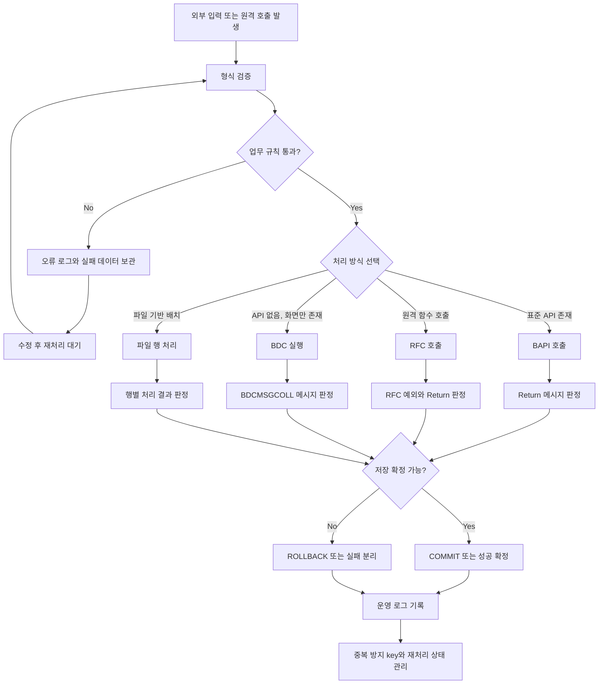

# NEWCH33_OLDCH30_REWRITE - 인터페이스 실무: BAPI/RFC/BDC/File

> 기준: `content/abap/CH30/*`, `reference/codex_0625_v2/CH30_REWRITE.md`, `reference/codex_0629_v3/00_CONCEPT_GAP_AUDIT.md`

## 이 장의 위치

NEWCH32까지 학습자는 SAP 안에서 직접 프로그램을 만들고, 화면을 만들고, ALV를 다루고, DB 저장과 Lock을 제어하고, 표준 기능의 확장 지점을 판단하는 방법을 배웠다. NEWCH33은 시야를 시스템 밖으로 넓힌다. 실무 ABAP 개발자는 자기 프로그램 안에서만 데이터를 처리하지 않는다. 외부 쇼핑몰 주문을 SAP 판매오더로 넣고, 다른 SAP 시스템에서 재고나 예매 정보를 조회하고, 현업이 준 엑셀 파일을 검증해서 등록하고, 서버에 쌓이는 파일을 야간 배치로 처리한다.

초보자가 이 장에서 가장 먼저 버려야 할 생각은 "호출이 성공하면 인터페이스도 성공"이라는 생각이다. 인터페이스 실무에서 성공은 함수 호출이 끝났다는 뜻이 아니다. 받은 데이터가 유효하고, 업무 규칙을 통과했고, 저장 확정 여부가 올바르게 결정되었고, 실패 이유가 로그에 남았고, 운영자가 재처리할 수 있어야 성공이다.

이 장의 핵심 질문은 다음과 같다.

| 질문 | 이 장에서 배우는 답 |
|---|---|
| 표준 SAP 데이터를 직접 `UPDATE`하지 말아야 할 때 무엇을 쓰는가 | BAPI와 `BAPIRET2` Return 처리 |
| 다른 시스템의 함수를 부르거나 내 함수를 외부에 노출하려면 무엇이 필요한가 | RFC destination, remote-enabled Function Module, RFC 예외 처리 |
| 표준 API가 없는 오래된 트랜잭션은 어떻게 대량 입력하는가 | BDC, `BDCDATA`, `CALL TRANSACTION`, Session Method |
| 현업이 준 Excel 파일은 왜 바로 등록하면 안 되는가 | 업로드, parsing, header skip, row validation, 오류 피드백 |
| 서버 파일 기반 인터페이스는 어떤 운영 구조가 필요한가 | `OPEN DATASET`, `READ DATASET`, `TRANSFER`, `CLOSE DATASET`, 로그, 재처리, 멱등성 |

이 장 전체를 한 문장으로 요약하면 다음과 같다.

> BAPI, RFC, BDC, Excel, File은 기술 이름은 다르지만 운영 구조는 같다. 수신하고, 검증하고, 처리하고, 메시지를 판정하고, commit 또는 rollback을 결정하고, 로그와 재처리를 남긴다.

## R15 게이팅과 classic-first 경계

이 장은 Classic ABAP 실무 인터페이스를 먼저 다룬다. BAPI, RFC Function Module, BDC, SAP GUI 기반 PC 파일 업로드, application server 파일 입출력은 ECC와 S/4HANA on-premise 유지보수에서 여전히 중요하다. 따라서 ABAP Cloud에서 허용되는 released API만 말하고 Classic 기술을 생략하지 않는다.

다만 경계도 분명히 둔다. ABAP Cloud, Clean Core, released API는 "공개된 계약을 우선한다"는 판단 기준으로만 사용한다. RAP 서비스 구현, OData service definition, IDoc/ALE 운영, Gateway 구현, aRFC 병렬 처리, background job scheduler 상세는 이 장의 본문으로 끌어오지 않는다. CH31은 IDoc/ALE/Gateway로 넘어가는 다음 장이고, CH32 성능 장은 병렬 처리와 성능 설계를 맡는다.

선행 지식과의 연결은 다음과 같다.

| 선행 장 | 이 장에서 사용하는 정도 |
|---|---|
| CH04 | 문자열 `SPLIT`, 형식 변환, 외부 텍스트 parsing 감각 |
| CH06 | Internal Table에 업로드 행, Return 메시지, BDC row를 모으는 감각 |
| CH10 | Function Module, `CALL FUNCTION`, interface parameter 이해 |
| CH16 | 화면 기반 트랜잭션과 BDC가 화면 흐름에 의존한다는 감각 |
| CH18 | `line_exists`, inline `DATA` 같은 modern ABAP 읽기 |
| CH24 | LUW, `COMMIT WORK`, `ROLLBACK WORK`, 재처리와 로그 원칙 |
| CH25 | 저장 전 Lock과 중복 처리, 운영 오류 분석 감각 |
| CH29 | 표준 기능을 직접 수정하지 않고 공개된 확장/인터페이스를 찾는 원칙 |

## 공식 문서 확인 메모

Classic ABAP 문법은 로컬 ABAP Keyword Documentation에서 수동 확인했다. ABAP Cloud와 released API 경계는 로컬 다운로드 문서에서 확인했다. 확인된 범위만 본문에 반영했고, 인터넷 검색이나 NotebookLM 보충은 사용하지 않았다.

| 범위 | 확인 파일 | 본문 반영 |
|---|---|---|
| Function Module 호출 | `C:\ABAP_DOCU_HTML\abapcall_function.htm` | `CALL FUNCTION`, `sy-subrc`, function module 호출 구조 |
| RFC destination | `C:\ABAP_DOCU_HTML\abapcall_function_destination.htm`, `abapcall_function_destination_para.htm` | `CALL FUNCTION ... DESTINATION`, blank destination local call 위험, SM59 확인 |
| RFC 예외 | `C:\ABAP_DOCU_HTML\abenrfc_exception.htm` | `communication_failure`, `system_failure`, `MESSAGE lv_msg` |
| BDC | `C:\ABAP_DOCU_HTML\abapcall_transaction_using.htm`, `abencall_transaction_bdc_abexa.htm` | `BDCDATA`, `CALL TRANSACTION ... USING`, `MODE`, `UPDATE`, `OPTIONS FROM`, `MESSAGES INTO` |
| 파일 열기 | `C:\ABAP_DOCU_HTML\abapopen_dataset.htm`, `abapopen_dataset_access.htm`, `abapopen_dataset_error_handling.htm` | `OPEN DATASET`, access type, `MESSAGE` addition |
| 파일 읽기/쓰기/닫기 | `C:\ABAP_DOCU_HTML\abapread_dataset.htm`, `abaptransfer.htm`, `abapclose_dataset.htm` | `READ DATASET`, `TRANSFER`, `CLOSE DATASET` |
| 문자열 분리 | `C:\ABAP_DOCU_HTML\abapsplit.htm` | Excel/CSV 텍스트 parsing의 `SPLIT` |
| 트랜잭션 제어 | `C:\ABAP_DOCU_HTML\abapcommit.htm`, `abaprollback.htm` | BAPI 뒤 commit/rollback 판단, SAP LUW 경계 |
| BAPI 개념 | `C:\ABAP_DOCU_DOWNLOAD\ABAP_DOCU\abap-docs-main\docs\standard\md\ABENBUSINESS_APP_PROG_INTER_GLOSRY.md`, `...\docs\cloud\md\ABENBUSINESS_APP_PROG_INTER_GLOSRY.md` | BAPI는 SAP application data/process에 접근하는 predefined interface이며 remote-called function module 기반 |
| ABAP Cloud 경계 | `C:\ABAP_DOCU_DOWNLOAD\ABAP_DOCU\abap-docs-main\docs\cloud\md\ABENABAP_CLOUD_GLOSRY.md`, `ABENABAP_FOR_CLOUD_DEV_GLOSRY.md`, `ABENRELEASED_API_GLOSRY.md`, `ABENCLASSIC_ABAP_GLOSRY.md` | restricted language version, released API, Classic ABAP 경계 |

## 전체 운영 지도



이 지도에서 `처리 방식 선택`보다 더 중요한 것은 앞뒤 단계다. 어떤 기술을 쓰든 검증, 메시지 판정, 로그, 재처리, 중복 방지가 없으면 운영 가능한 인터페이스가 아니다.

## NEWCH33-L01 - BAPI 호출과 Return 처리

### 왜 필요한가

SAP 표준 데이터는 보통 단순한 테이블 한 개가 아니다. 판매오더를 예로 들면 header, item, schedule line, partner, pricing, status, output, credit check, text, change document 같은 여러 요소가 서로 연결된다. 초보자가 표준 테이블을 직접 `INSERT`하거나 `UPDATE`하면 처음에는 데이터가 들어간 것처럼 보일 수 있다. 하지만 후속 테이블이 맞지 않거나, status가 깨지거나, 표준 검증을 우회해서 운영 장애가 된다.

BAPI는 이런 문제를 줄이기 위해 SAP가 제공하는 표준 업무 interface다. SAP 업무 객체의 data와 process를 외부 프로그램이나 고객 프로그램이 사용할 수 있게 만든 공개된 진입점이다. BAPI는 보통 remote-enabled function module로 구현되며, 이름은 `BAPI_<business object>_<method>` 형태를 따르는 경우가 많다. 예를 들어 판매오더 생성에는 `BAPI_SALESORDER_CREATEFROMDAT2` 같은 BAPI가 있다.

그러나 BAPI를 호출했다고 끝난 것이 아니다. BAPI는 업무 메시지를 Return으로 돌려준다. Return을 읽고 오류가 있으면 rollback하고, 오류가 없을 때만 commit해야 한다. 이 레슨의 목표는 BAPI 이름을 외우는 것이 아니라 `RETURN -> 판정 -> COMMIT/ROLLBACK -> 로그` 흐름을 몸에 익히는 것이다.

### 무엇인가

`BAPIRET2`는 BAPI에서 결과 메시지를 전달할 때 자주 사용하는 표준 구조다. 핵심 필드는 다음과 같다.

| 필드 | 의미 | 실무에서 보는 방법 |
|---|---|---|
| `TYPE` | 메시지 유형 | `E`, `A`는 보통 실패. `W`는 업무 정책에 따라 실패 또는 경고 |
| `ID` | 메시지 클래스 | 메시지 원문과 번역을 찾을 때 사용 |
| `NUMBER` | 메시지 번호 | 같은 메시지 클래스 안의 상세 번호 |
| `MESSAGE` | 조립된 메시지 텍스트 | 운영 로그와 사용자 피드백에 사용 |
| `MESSAGE_V1`~`MESSAGE_V4` | 메시지 변수 | 원인 key, 필드명, 값 등을 추적할 때 사용 |

다음 코드는 BAPI 호출의 최소 골격이다. 실제 BAPI마다 parameter 이름은 다르지만, Return을 읽고 저장 확정을 판단하는 모양은 반복된다.

```abap
DATA lt_return TYPE TABLE OF bapiret2.

CALL FUNCTION 'BAPI_..._CREATE'
  EXPORTING
    is_header = ls_header
  TABLES
    return    = lt_return.

IF line_exists( lt_return[ type = 'E' ] )
   OR line_exists( lt_return[ type = 'A' ] ).
  CALL FUNCTION 'BAPI_TRANSACTION_ROLLBACK'.
ELSE.
  CALL FUNCTION 'BAPI_TRANSACTION_COMMIT'
    EXPORTING
      wait = abap_true.
ENDIF.
```

`BAPI_TRANSACTION_COMMIT`은 BAPI가 만든 변경 요청을 확정한다. `wait = abap_true`는 update 처리가 끝날 때까지 기다리겠다는 뜻이다. 운영 로그를 쓰거나 바로 후속 조회를 해야 한다면 기다리는 편이 확인하기 쉽다. 반대로 Return에 `E` 또는 `A`가 있으면 `BAPI_TRANSACTION_ROLLBACK`으로 현재 작업 단위를 취소한다.

주의할 점은 `W` 경고다. 모든 경고가 실패는 아니다. 하지만 어떤 업무에서는 경고도 저장 금지일 수 있다. 예를 들어 가격 조건 누락 경고, 납기 초과 경고, credit 관련 경고가 업무상 치명적이면 실패로 처리해야 한다. 따라서 메시지 유형만 기계적으로 보지 말고 BAPI 문서와 업무 정책을 같이 봐야 한다.

### 어떻게 확인하는가

첫 번째 확인은 BAPI 문서다. `SE37` 또는 BAPI Explorer에서 BAPI 이름, 필수 입력값, Return 구조, commit 필요 여부를 확인한다. 어떤 BAPI는 Return 단일 구조를 쓰고, 어떤 BAPI는 Return table을 쓴다. 어떤 BAPI는 성공 메시지를 주지 않을 수도 있다. 따라서 "내가 아는 예제와 비슷하겠지"로 처리하면 안 된다.

두 번째 확인은 정상 케이스와 오류 케이스를 모두 테스트하는 것이다. 정상 입력만 넣어 보면 commit 경로만 확인된다. 필수값 누락, 존재하지 않는 고객, 허용되지 않는 조직 조합, 중복 key 같은 오류를 일부러 만들어 Return에 어떤 메시지가 오는지 본다. 운영 로그 설계는 이 메시지들을 사람이 읽을 수 있어야 한다.

세 번째 확인은 commit 뒤 재조회다. BAPI 호출과 commit이 끝난 뒤 생성된 문서 번호나 key로 표준 조회 트랜잭션, API, 또는 검증용 SELECT를 통해 결과를 확인한다. "함수 호출이 `sy-subrc = 0`"인 것과 "업무 데이터가 확정되어 조회된다"는 것은 다르다.

네 번째 확인은 실패 로그다. 입력 key, BAPI 이름, Return 전체, commit/rollback 결정, 처리 시각, 처리 사용자 또는 job 이름을 남긴다. 운영자는 개발자 없이도 "어느 파일의 몇 번째 행이 어떤 메시지로 실패했는지" 알아야 한다.

### 실수와 주의

가장 흔한 실수는 Return을 보지 않고 commit하는 것이다. BAPI가 오류 메시지를 줬는데도 commit하면 일부 데이터만 반영되거나 후속 상태가 맞지 않을 수 있다.

두 번째 실수는 commit을 누락하는 것이다. 많은 BAPI는 스스로 commit하지 않는다. 함수 호출은 성공했는데 데이터가 보이지 않는 문제는 commit 누락에서 자주 나온다. 단, BAPI마다 commit 정책이 다를 수 있으므로 해당 BAPI 문서를 확인한다.

세 번째 실수는 경고 정책을 정하지 않는 것이다. `TYPE = 'W'`를 항상 성공으로 넘길지, 특정 메시지는 실패로 볼지 프로젝트 기준이 필요하다. 이 기준이 없으면 같은 입력이 배치에서는 성공, 화면에서는 실패처럼 흔들린다.

네 번째 실수는 BAPI를 Clean Core의 만능 답으로 오해하는 것이다. Classic ABAP에서는 BAPI가 표준 테이블 직접 변경보다 안전한 공개 interface인 경우가 많다. 그러나 ABAP Cloud 관점에서는 해당 객체가 released API인지가 별도 판단 기준이다.

### 체험형 학습 설계

`CH30-L01-S01`은 "BAPI Return 처리 - COMMIT vs ROLLBACK" 시뮬레이터로 설계한다.

| 요소 | 설계 |
|---|---|
| 버튼 | `정상 입력`, `오류 입력`, `경고 입력`, `BAPI 호출`, `로그 보기`, `초기화` |
| 상태 | `입력 준비`, `호출 완료`, `판정 대기`, `COMMIT`, `ROLLBACK`, `경고 검토` |
| 데이터 | 예매 생성 요청 한 건. 정상은 고객과 날짜가 있음. 오류는 고객 없음과 필수값 누락. 경고는 좌석 등급 정책 위반 |
| 패널 | 요청 데이터, `RETURN (TABLE OF bapiret2)`, 판정 결과, 운영 로그 |
| 피드백 | "함수 호출 성공 여부가 아니라 Return 메시지 판정이 저장 여부를 결정한다" |

경고 입력을 넣었을 때는 `W` 메시지가 나타나고, 사용자가 정책 스위치 `경고도 실패 처리`를 켜면 rollback, 끄면 commit으로 갈라지게 한다. 이렇게 하면 메시지 타입과 업무 정책이 함께 움직인다는 점을 체감할 수 있다.

### 정리

BAPI는 표준 업무 객체를 다루기 위한 SAP 제공 interface다. 하지만 실무의 중심은 호출문이 아니라 Return 처리다. `BAPIRET2` 메시지를 읽고, 오류와 경고 정책을 판단하고, `BAPI_TRANSACTION_COMMIT` 또는 `BAPI_TRANSACTION_ROLLBACK`을 호출하고, 로그를 남겨야 한다.

다음 레슨에서는 다른 시스템의 함수 모듈을 호출하거나, 외부 시스템이 내 SAP 함수를 호출할 수 있게 하는 RFC 구조를 배운다.

## NEWCH33-L02 - RFC Function Module 설계

### 왜 필요한가

인터페이스에는 두 방향이 있다. 첫 번째는 ABAP 프로그램이 SAP 표준 기능을 호출하는 방향이다. L01의 BAPI가 여기에 가깝다. 두 번째는 시스템과 시스템이 서로 함수를 호출하는 방향이다. 예를 들어 외부 예매 사이트가 SAP에 "공연별 남은 좌석을 알려 달라"고 요청하거나, 다른 SAP 시스템이 "예약 번호로 상태를 조회해 달라"고 요청할 수 있다.

RFC(Remote Function Call)는 이런 원격 호출을 위한 SAP의 오래된 핵심 기술이다. 호출 측은 `CALL FUNCTION ... DESTINATION`으로 대상 시스템을 지정하고, 대상 시스템의 remote-enabled function module을 호출한다.

입문자가 꼭 알아야 할 점은 원격 호출이 로컬 함수 호출보다 실패 지점이 많다는 것이다. 네트워크가 끊길 수 있고, destination 설정이 틀릴 수 있고, 로그온 사용자가 잠길 수 있고, 권한이 없을 수 있고, 대상 시스템에서 dump가 날 수 있고, parameter 변환이 실패할 수 있다. 그래서 RFC 설계는 function module 하나 만드는 일이 아니라 연결, 계약, 예외, 로그를 함께 설계하는 일이다.

### 무엇인가

Remote-Enabled Function Module은 외부 시스템 또는 다른 SAP 시스템에서 호출할 수 있도록 설정한 function module이다. `SE37`에서 processing type을 remote-enabled로 설정하고, import/export/table parameter를 외부 호출 계약으로 설계한다.

호출 측 코드는 다음 모양을 가진다.

```abap
DATA lv_msg TYPE string.
DATA lt_booking TYPE TABLE OF zbooking.

CALL FUNCTION 'Z_GET_BOOKINGS'
  DESTINATION 'TARGET_SYS'
  EXPORTING
    iv_event_id = p_event
  TABLES
    et_booking  = lt_booking
  EXCEPTIONS
    communication_failure = 1 MESSAGE lv_msg
    system_failure        = 2 MESSAGE lv_msg
    OTHERS                = 3.

CASE sy-subrc.
  WHEN 0.
    " Continue with lt_booking.
  WHEN 1 OR 2.
    " Log lv_msg with destination, function name, and input key.
  WHEN OTHERS.
    " Log unexpected technical failure.
ENDCASE.
```

`DESTINATION 'TARGET_SYS'`는 `SM59`에 등록된 RFC destination 이름이다. destination은 대상 시스템, 로그온 방식, client, user, connection type, gateway 설정 같은 연결 정보를 가진다.

`communication_failure`는 통신 계층 문제를 나타낸다. 예를 들어 네트워크 단절, 대상 시스템 접속 불가, 리소스 문제 등이 원인일 수 있다. `system_failure`는 원격 시스템에서 실행 중 runtime error나 심각한 메시지가 발생한 경우와 연결된다. 두 예외 모두 `MESSAGE lv_msg`를 붙이면 원격 실패 텍스트를 받아 로그에 남길 수 있다.

### 어떻게 확인하는가

첫 번째 확인은 function module 속성이다. 원격 호출 대상 function module이 remote-enabled인지 확인한다. 외부에서 호출되는 함수는 SAP GUI 화면을 띄우거나 사용자 입력을 기다리면 안 된다. 호출자는 사람이 아니라 다른 시스템일 수 있기 때문이다.

두 번째 확인은 interface 계약이다. parameter는 외부 시스템이 이해할 수 있는 구조여야 한다. ABAP 내부에서만 의미가 있는 복잡한 전역 상태나 화면 필드에 의존하면 안 된다. 입력 key, 조회 조건, 출력 table, Return 메시지 구조를 명확히 해야 한다.

세 번째 확인은 `SM59` destination이다. destination 이름이 존재하는지, connection test가 성공하는지, authorization test가 필요한지, 로그온 사용자가 잠기지 않았는지 확인한다. 공식 문서상 destination 값이 blank이면 `DESTINATION` addition이 무시되어 local call처럼 동작할 수 있다. 설정 누락을 조용히 지나치지 않도록 destination 값 검증을 넣어야 한다.

네 번째 확인은 실패 케이스다. 네트워크 오류, destination 오타, 권한 부족, 대상 함수 dump를 실제 또는 테스트 환경에서 재현해 `communication_failure`, `system_failure`, `MESSAGE lv_msg`가 어떻게 기록되는지 확인한다. 인터페이스 장애 분석에서 원격 오류 메시지는 가장 중요한 단서다.

### 실수와 주의

첫 번째 실수는 RFC를 로컬 함수처럼 생각하는 것이다. 로컬 함수는 같은 LUW와 같은 시스템 안에서 실행된다. RFC는 대상 시스템 상태, 네트워크, 로그온, 권한, serialization의 영향을 받는다.

두 번째 실수는 RFC 함수 안에 대화형 처리를 넣는 것이다. popup, selection screen, `CALL SCREEN`, `WRITE` 중심 출력은 원격 호출자에게 적합하지 않다. RFC 함수는 input과 output parameter로만 의미가 전달되도록 설계해야 한다.

세 번째 실수는 RFC 예외를 `OTHERS` 하나로 뭉개는 것이다. `communication_failure`와 `system_failure`는 운영 대응이 다르다. 전자는 연결과 인프라를 먼저 보고, 후자는 대상 시스템 dump, 메시지, application logic을 먼저 봐야 한다.

네 번째 실수는 권한과 감사 로그를 빼는 것이다. RFC user가 너무 강한 권한을 가지면 보안 위험이 크고, 너무 약하면 운영 중 오류가 난다. 누가 어떤 destination으로 어떤 function module을 호출했는지 추적할 수 있어야 한다.

### 체험형 학습 설계

`CH30-L02-S01`은 "RFC 원격 호출 - DESTINATION과 통신 예외" 시뮬레이터로 설계한다.

| 요소 | 설계 |
|---|---|
| 버튼 | `정상 호출`, `Destination 없음`, `통신 실패`, `원격 Dump`, `권한 오류`, `로그 보기` |
| 상태 | `연결 전`, `SM59 확인`, `원격 실행`, `communication_failure`, `system_failure`, `성공` |
| 데이터 | `iv_event_id = EVT-1001`, destination `TARGET_SYS`, remote FM `Z_GET_BOOKINGS` |
| 패널 | 호출 코드, SM59 destination 카드, `sy-subrc`, `lv_msg`, 운영 로그 |
| 피드백 | "원격 호출은 함수 로직뿐 아니라 연결과 시스템 실패를 함께 판정해야 한다" |

`Destination 없음`을 누르면 destination 검증에서 실패하고, `통신 실패`는 `communication_failure = 1 MESSAGE lv_msg`, `원격 Dump`는 `system_failure = 2 MESSAGE lv_msg`로 표시한다. 로그 패널은 destination, function name, input key, `sy-subrc`, `lv_msg`, 발생 시각을 함께 보여 준다.

### 정리

RFC는 시스템 간 원격 function module 호출이다. 핵심은 `CALL FUNCTION ... DESTINATION` 문법만이 아니라 `SM59` destination, remote-enabled 속성, interface 계약, `communication_failure`, `system_failure`, `MESSAGE lv_msg`, 권한과 로그다.

다음 레슨에서는 표준 BAPI나 명확한 API가 없을 때 화면 입력을 자동화하는 레거시 수단인 BDC를 배운다.

## NEWCH33-L03 - BDC / Batch Input 실무 기준

### 왜 필요한가

현대적인 개발에서는 표준 API, BAPI, released API, OData, RAP 같은 명시적 interface를 우선 검토해야 한다. 그러나 오래된 SAP 업무에서는 적절한 API가 없고, 표준 트랜잭션 화면만 존재하는 경우가 있다. 대량 데이터를 수동으로 입력할 수는 없으므로, 프로그램이 사용자의 화면 입력을 흉내 내야 할 때가 있다. 이때 사용하는 classic 기술이 BDC(Batch Data Communication)다.

BDC는 강력하지만 취약하다. 화면 번호, 필드 이름, OK code, 메시지 흐름에 의존하기 때문이다. 표준 화면이 바뀌거나, 권한에 따라 필드가 달라지거나, customizing으로 popup이 추가되면 BDC가 깨질 수 있다. 그래서 BDC는 "편한 자동화 도구"가 아니라 "공식 API가 없을 때 조심해서 쓰는 레거시 대응 수단"으로 배워야 한다.

### 무엇인가

BDC의 핵심 자료 구조는 `BDCDATA`다. `BDCDATA` table에는 화면 시작 row와 필드 입력 row가 순서대로 쌓인다.

| row 종류 | 핵심 필드 | 의미 |
|---|---|---|
| 화면 시작 row | `PROGRAM`, `DYNPRO`, `DYNBEGIN = 'X'` | 어떤 프로그램의 어떤 dynpro 화면으로 들어가는지 |
| 필드 입력 row | `FNAM`, `FVAL` | 화면 필드 이름과 입력값 |
| OK code row | `FNAM = 'BDC_OKCODE'`, `FVAL = '=SAVE'` 등 | Enter, Save, Back 같은 사용자 동작 |

Call Transaction 방식의 기본 코드는 다음과 같다.

```abap
DATA lt_bdc TYPE TABLE OF bdcdata.
DATA lt_msg TYPE TABLE OF bdcmsgcoll.
DATA ls_opt TYPE ctu_params.

PERFORM fill_bdc USING 'SAPLZBOOK' '0100' abap_true.
PERFORM fill_bdc USING 'ZBOOK-EVENT_ID' p_event.
PERFORM fill_bdc USING 'ZBOOK-CUSTOMER' p_customer.
PERFORM fill_bdc USING 'BDC_OKCODE' '=SAVE'.

ls_opt-dismode = 'N'.
ls_opt-updmode = 'S'.

CALL TRANSACTION 'XX01'
  USING lt_bdc
  OPTIONS FROM ls_opt
  MESSAGES INTO lt_msg.
```

`MODE` 또는 `ctu_params-dismode`는 화면 표시 방식을 정한다. `A`는 모든 화면을 보며 실행, `E`는 오류 시만 화면 표시, `N`은 화면 없이 실행이다. 개발 중에는 `A` 또는 `E`로 흐름을 확인하고, 운영 배치에서는 보통 `N`을 사용한다.

`UPDATE` 또는 `ctu_params-updmode`는 update 처리 방식을 정한다. `S`는 synchronous update라서 결과 확인에 유리하다. 운영 인터페이스에서는 메시지와 저장 결과를 안정적으로 확인해야 하므로 update mode를 아무 생각 없이 두면 안 된다.

Session Method도 있다. `BDC_OPEN_GROUP`, `BDC_INSERT`, `BDC_CLOSE_GROUP`으로 session을 만들고, `SM35`에서 실행하거나 재처리한다.

```abap
CALL FUNCTION 'BDC_OPEN_GROUP'
  EXPORTING
    client = sy-mandt
    group  = 'ZBOOK'.

CALL FUNCTION 'BDC_INSERT'
  EXPORTING
    tcode     = 'XX01'
  TABLES
    dynprotab = lt_bdc.

CALL FUNCTION 'BDC_CLOSE_GROUP'.
```

Call Transaction은 프로그램이 즉시 실행하고 결과를 받는 방식에 가깝고, Session Method는 큐를 만들어 나중에 실행하거나 실패 건을 `SM35`에서 확인하고 재처리하는 방식에 가깝다.

### 어떻게 확인하는가

첫 번째 확인은 API 우선순위다. BAPI나 released API가 있으면 BDC보다 그쪽을 먼저 검토한다. BDC는 화면 변경에 취약하므로 장기 운영 비용이 크다.

두 번째 확인은 `SHDB` 녹화다. BDC를 손으로 처음부터 작성하지 말고, `SHDB`에서 트랜잭션을 녹화해 실제 화면 번호, 필드 이름, OK code를 확인한다. 생성된 코드는 시작점일 뿐이고, 운영용으로 만들 때는 입력값, 메시지 처리, 예외 처리를 다듬어야 한다.

세 번째 확인은 실행 모드다. 개발 중에는 `MODE 'A'`로 실제 화면 흐름을 보며 필드가 맞는지 확인한다. 그 다음 `MODE 'E'`로 오류 시 화면 표시를 확인하고, 마지막에 `MODE 'N'` 운영 실행을 검증한다.

네 번째 확인은 메시지다. `MESSAGES INTO lt_msg`를 사용해 `BDCMSGCOLL` 메시지를 모은다. `sy-subrc`만 보고 끝내면 사용자가 어떤 화면 메시지 때문에 실패했는지 알 수 없다. 메시지 ID, 번호, 변수, 입력 key를 함께 로그에 남긴다.

다섯 번째 확인은 재처리 방식이다. 대량 입력에서 일부 실패가 발생할 수 있다. 실패 건을 별도 table에 저장할지, BDC Session으로 넘겨 `SM35`에서 처리할지, 원인 수정 후 재실행할 key를 어떻게 관리할지 정해야 한다.

### 실수와 주의

첫 번째 실수는 BDC를 신규 개발의 기본 수단으로 쓰는 것이다. BDC는 마지막 선택지에 가깝다. API가 있으면 API가 우선이다.

두 번째 실수는 화면 흐름이 항상 같다고 가정하는 것이다. 같은 transaction도 회사코드, 사용자 권한, customizing, SAP GUI 설정, 메시지 popup에 따라 흐름이 달라질 수 있다.

세 번째 실수는 `MESSAGES INTO`를 빼는 것이다. BDC 실패 원인은 화면 메시지에 담기는 경우가 많다. 메시지를 버리면 재처리와 운영 지원이 불가능해진다.

네 번째 실수는 BDC 안에서 commit 경계를 혼동하는 것이다. BDC는 트랜잭션 화면을 실행하는 것이므로 해당 transaction의 저장 로직과 update mode를 이해해야 한다. CH24에서 배운 LUW 감각을 그대로 가져와야 한다.

다섯 번째 실수는 테스트 데이터를 너무 적게 잡는 것이다. 정상 한 건만 성공해도 운영에서는 popup, warning, authorization, optional field, 필드 숨김 때문에 실패할 수 있다. BDC 테스트는 화면 variation을 넓게 잡는다.

### 체험형 학습 설계

`CH30-L03-S01`은 "BDC 녹화 - BDCDATA 채우기" 시뮬레이터로 설계한다.

| 요소 | 설계 |
|---|---|
| 버튼 | `다음 동작`, `화면 오류 만들기`, `CALL TRANSACTION`, `Session 만들기`, `초기화` |
| 상태 | `Recording`, `Ready to execute`, `Executed`, `Message collected`, `Session queued`, `Reset` |
| 데이터 | `lt_bdc (TABLE OF bdcdata)`, `lt_msg (TABLE OF bdcmsgcoll)`, session group `ZBOOK` |
| 패널 | 화면 미리보기, `BDCDATA` row table, 실행 옵션, 메시지 로그, `SM35` queue |
| 피드백 | "BDC는 화면과 필드 입력을 순서대로 담은 table을 실행하는 방식이다" |

`다음 동작`을 누를 때마다 `PROGRAM/DYNPRO/DYNBEGIN` row, field row, `BDC_OKCODE` row가 순서대로 추가된다. 필요한 row가 모두 쌓이기 전에는 `CALL TRANSACTION` 버튼이 비활성화된다. `화면 오류 만들기`를 누르면 필수 field row를 제거하고, 실행 후 `BDCMSGCOLL`에 오류 메시지가 들어가는 모습을 보여 준다.

### 정리

BDC는 공식 API가 없거나 레거시 transaction을 자동 입력해야 할 때 사용하는 화면 기반 인터페이스 수단이다. `BDCDATA`에 화면과 필드 입력을 순서대로 쌓고 `CALL TRANSACTION ... USING` 또는 Session Method로 실행한다.

하지만 화면 의존성이 크기 때문에 BAPI나 released API가 있으면 그쪽을 우선한다. BDC를 쓴다면 `SHDB`, `MODE`, `UPDATE`, `OPTIONS FROM`, `MESSAGES INTO`, `SM35` 재처리를 함께 설계해야 한다.

## NEWCH33-L04 - Excel Upload 처리

### 왜 필요한가

현업은 자주 Excel 파일로 데이터를 준다. 신규 고객 목록, 예매 내역, 자재 가격, 행사 좌석, 일괄 변경 대상 같은 데이터가 Excel로 전달된다. 개발자는 파일을 읽어서 SAP에 등록하는 프로그램을 만든다. 여기서 초보자가 하기 쉬운 실수는 "Excel을 읽었다"를 "데이터를 등록해도 된다"로 착각하는 것이다.

외부 파일은 신뢰할 수 없다. 필수값이 비어 있을 수 있고, 숫자처럼 보이지만 문자일 수 있고, 날짜 형식이 지역 설정에 따라 다를 수 있고, 같은 key가 두 번 있을 수 있고, 이미 SAP에 존재하는 데이터일 수 있다. Excel Upload의 본질은 파일 읽기가 아니라 검증 관문이다.

### 무엇인가

Classic ABAP에서 자주 쓰는 방식은 Excel을 CSV 또는 탭 구분 텍스트로 저장한 뒤, SAP GUI 프론트엔드의 PC 파일을 읽어 내부 테이블로 만드는 방식이다. 원본 레슨은 `cl_gui_frontend_services=>gui_upload`와 `SPLIT`을 사용한다.

```abap
DATA lt_raw TYPE TABLE OF string.
DATA lt_booking TYPE TABLE OF zbooking_upload.

cl_gui_frontend_services=>gui_upload(
  EXPORTING
    filename = p_file
    filetype = 'ASC'
  CHANGING
    data_tab = lt_raw ).

LOOP AT lt_raw INTO DATA(lv_line).
  IF sy-tabix = 1.
    CONTINUE. " Header row
  ENDIF.

  SPLIT lv_line AT cl_abap_char_utilities=>horizontal_tab
    INTO DATA(lv_event_id)
         DATA(lv_customer)
         DATA(lv_seat_grade)
         DATA(lv_quantity).

  " Convert, validate, and append only valid parsed rows.
ENDLOOP.
```

`gui_upload`는 사용자의 PC에 있는 파일을 읽는다. application server에 있는 파일을 읽는 `OPEN DATASET`과 다르다. 대화형 프로그램에서 사용자가 직접 파일을 고르는 경우에는 `gui_upload`가 자연스럽지만, background job에서 자동 처리할 파일은 L05의 server file interface로 설계해야 한다.

`SPLIT`은 한 줄을 delimiter 기준으로 나눈다. 탭 구분 텍스트라면 `cl_abap_char_utilities=>horizontal_tab`을 사용할 수 있다. CSV는 따옴표, 쉼표, 줄바꿈 escape 같은 규칙이 더 복잡하므로 단순 `SPLIT AT ','`가 항상 안전하지 않다. 실제 프로젝트에서는 파일 형식을 명확히 정하거나 검증된 parser 또는 라이브러리를 검토해야 한다.

오래된 시스템에서는 `ALSM_EXCEL_TO_INTERNAL_TABLE` 같은 예제를 볼 수 있다. 다만 신규 설계에서는 지원 범위, 프론트엔드 의존성, 파일 형식, 시스템 정책을 확인해야 한다. ABAP Cloud나 최신 개발에서는 XCO, released API, 검증된 외부 라이브러리 정책을 따져야 하며, 이 장에서는 Classic ABAP의 기본 흐름만 다룬다.

### 어떻게 확인하는가

첫 번째 확인은 파일 형식이다. 진짜 Excel binary인지, CSV인지, 탭 구분 텍스트인지 정한다. "확장자가 xlsx"라는 말만으로 처리 방식을 정하면 안 된다. 사용자가 저장한 형식과 프로그램이 기대하는 형식이 일치해야 한다.

두 번째 확인은 header다. 첫 줄이 컬럼명인지 데이터인지 정한다. header를 데이터로 처리하면 첫 번째 행에서 타입 오류가 나거나, 더 나쁘게는 잘못된 값이 등록될 수 있다.

세 번째 확인은 행 단위 검증이다. 필수값, 타입 변환, 숫자 범위, 날짜 형식, 코드값, 중복 key, 참조 데이터 존재 여부를 확인한다. 검증 실패 행은 버리지 말고 행 번호와 오류 사유를 사용자에게 돌려줘야 한다.

네 번째 확인은 등록 전 dry run이다. 가능하면 `검증만 실행` 버튼을 두어 SAP 저장 없이 오류 목록을 먼저 보여 준다. 대량 파일은 한번 등록되면 되돌리기 어렵기 때문에, 저장 전 검증 결과를 사용자가 확인할 수 있어야 한다.

다섯 번째 확인은 성공과 실패의 분리다. 전체 파일을 한 LUW로 묶을지, 행 단위 또는 묶음 단위로 commit할지 정책을 정한다. 한 행 실패 때문에 전체를 막을지, 성공 행은 저장하고 실패 행만 재처리할지 업무와 운영 기준을 정해야 한다.

### 실수와 주의

첫 번째 실수는 업로드 직후 바로 BAPI나 DML을 호출하는 것이다. 외부 데이터는 항상 의심해야 한다. 검증되지 않은 파일을 바로 등록하면 Return 오류가 대량 발생하거나 일부 성공, 일부 실패 상태가 된다.

두 번째 실수는 Excel 화면에 보이는 값과 실제 파일 값을 같다고 믿는 것이다. Excel은 날짜, 앞자리 0, 큰 숫자, 통화, 소수점을 표시 형식으로 바꿔 보여 준다. SAP에 들어가는 원본 문자열을 기준으로 검증해야 한다.

세 번째 실수는 PC 파일과 서버 파일을 혼동하는 것이다. `gui_upload`는 대화형 SAP GUI 세션의 PC 파일을 읽는다. background job에서는 사용자 PC에 접근할 수 없다. 자동 처리 요구라면 `OPEN DATASET` 기반 server file interface를 설계한다.

네 번째 실수는 오류 피드백을 행 번호 없이 주는 것이다. "데이터 오류"라고만 보여 주면 사용자는 파일을 고칠 수 없다. `12행: 고객번호 누락`, `27행: 수량이 숫자가 아님`, `31행: 같은 예매번호 중복`처럼 수정 가능한 메시지를 제공해야 한다.

### 체험형 학습 설계

`CH30-L04-S01`은 "Excel 업로드 - 파싱과 검증" 시뮬레이터로 설계한다.

| 요소 | 설계 |
|---|---|
| 버튼 | `업로드`, `검증만 실행`, `오류 파일 보기`, `성공 행 등록`, `초기화` |
| 상태 | `Raw loaded`, `Header skipped`, `Parsed`, `Validated`, `Rejected rows`, `Ready to post`, `Posted` |
| 데이터 | 탭 구분 텍스트 6행. 정상 3행, 필수값 누락 1행, 숫자 오류 1행, 중복 1행 |
| 패널 | 원본 파일 미리보기, parsing 결과 table, 검증 오류 목록, 성공/실패 count |
| 피드백 | "파일 읽기보다 검증과 사용자 수정 피드백이 Excel Upload의 핵심이다" |

`업로드`를 누르면 원본 텍스트가 표시되고 header row가 강조된다. `검증만 실행`을 누르면 header는 제외되고, 각 행에 `OK`, `ERROR`, `DUPLICATE` 상태가 붙는다. 오류 파일 보기 패널은 사용자가 수정해야 할 행 번호와 사유를 보여 준다. `성공 행 등록` 버튼은 오류가 없는 행만 등록 대상으로 넘긴다.

### 정리

Excel Upload는 외부 파일을 SAP 데이터로 바꾸기 전의 검증 관문이다. `gui_upload`로 PC 파일을 읽고, `SPLIT`으로 줄을 컬럼으로 나누고, header, 필수값, 타입, 중복, 참조 데이터, 업무 규칙을 확인해야 한다.

다음 레슨에서는 사람이 SAP GUI에서 고르는 PC 파일이 아니라, application server에 쌓이는 파일을 자동 처리하고 재처리하는 구조를 배운다.

## NEWCH33-L05 - File Interface와 재처리

### 왜 필요한가

운영 인터페이스는 사람이 버튼을 눌러 Excel을 올리는 방식만으로 끝나지 않는다. 외부 시스템이 매일 밤 서버 경로에 파일을 내려놓고, SAP 배치 job이 그 파일을 읽어 처리하는 경우가 많다. 예를 들어 물류 시스템이 출고 결과 파일을 만들고, SAP가 새벽에 읽어 납품 상태를 갱신할 수 있다.

서버 파일 인터페이스의 기술 키워드는 `OPEN DATASET`, `READ DATASET`, `TRANSFER`, `CLOSE DATASET`이다. 하지만 이 레슨의 진짜 목표는 파일 문법 암기가 아니다. 운영 가능한 파일 인터페이스는 파일 수신, 경로 보안, 행 검증, 처리, 로그, 재처리, 중복 방지까지 포함해야 한다.

### 무엇인가

`OPEN DATASET`은 application server의 파일을 연다. PC 파일을 읽는 `gui_upload`와 대상 위치가 다르다. `FOR INPUT`은 읽기, `FOR OUTPUT`은 새로 쓰기, `FOR APPENDING`은 이어쓰기다. 파일을 열 때는 `MESSAGE lv_msg`를 붙여 운영체제 오류 원인을 받아야 한다.

```abap
DATA lv_path TYPE string VALUE '/usr/sap/interfaces/in/booking_20260707.txt'.
DATA lv_msg  TYPE string.

OPEN DATASET lv_path FOR INPUT IN TEXT MODE ENCODING UTF-8
  MESSAGE lv_msg.

IF sy-subrc <> 0.
  " Log lv_path, sy-subrc, and lv_msg.
  RETURN.
ENDIF.

DO.
  READ DATASET lv_path INTO DATA(lv_record).
  IF sy-subrc <> 0.
    EXIT.
  ENDIF.

  " Parse, validate, and process one record.
ENDDO.

CLOSE DATASET lv_path.
```

`READ DATASET`은 열린 파일에서 현재 위치의 데이터를 읽는다. 더 읽을 데이터가 없으면 `sy-subrc`가 0이 아닌 값이 된다. `TRANSFER`는 열린 파일에 데이터를 쓴다. 오류 파일이나 처리 결과 파일을 만들 때 사용할 수 있다.

```abap
OPEN DATASET lv_error_path FOR OUTPUT IN TEXT MODE ENCODING UTF-8
  MESSAGE lv_msg.

IF sy-subrc = 0.
  TRANSFER lv_error_line TO lv_error_path.
  CLOSE DATASET lv_error_path.
ENDIF.
```

파일 인터페이스의 공통 구조는 다음과 같다.

| 단계 | 설명 | 로그에 남길 것 |
|---|---|---|
| 수신 | 지정 경로에 파일이 있는지 확인 | 파일명, 크기, 수신 시각 |
| 열기 | `OPEN DATASET ... MESSAGE lv_msg` | `sy-subrc`, OS 메시지 |
| 읽기 | `READ DATASET`으로 행 처리 | 행 번호, 원본 key |
| 검증 | 필수값, 타입, 중복, 업무 규칙 확인 | 오류 코드, 오류 메시지 |
| 등록 | BAPI, DML, BDC 등으로 처리 | 처리 방식, Return 메시지 |
| 확정 | commit/rollback 또는 행별 결과 분리 | 성공/실패 count |
| 보관 | 처리 완료 파일 이동 또는 상태 변경 | archive path, 처리 id |
| 재처리 | 실패 건 수정 후 다시 처리 | retry count, 마지막 오류 |

여기에 멱등성(idempotency)이 붙는다. 멱등성이란 같은 파일이나 같은 메시지가 두 번 들어와도 중복 등록되지 않게 하는 성질이다. 파일 인터페이스에서는 외부 시스템이 같은 파일을 다시 보낼 수 있고, 배치 job이 중간 실패 후 재실행될 수 있다. 따라서 파일 id, 행 key, 외부 document number, hash 등을 기준으로 이미 처리한 데이터인지 확인해야 한다.

### 어떻게 확인하는가

첫 번째 확인은 경로와 권한이다. `OPEN DATASET`은 application server 파일을 연다. AL11 같은 도구로 서버 경로를 확인하고, 배치 user가 해당 경로를 읽고 쓸 권한이 있는지 본다.

두 번째 확인은 경로 보안이다. 외부에서 받은 파일명을 그대로 경로에 붙이면 directory traversal 위험이 있다. 예를 들어 파일명에 `../`가 들어가면 허용하지 않은 상위 경로에 접근할 수 있다. 파일명 whitelist, 허용 확장자, 경로 정규화, 고정 root directory 검증이 필요하다.

세 번째 확인은 `MESSAGE lv_msg`다. 파일을 열 수 없을 때 `sy-subrc`만으로는 권한 문제인지, 경로 문제인지, 파일 없음인지 알기 어렵다. `OPEN DATASET ... MESSAGE lv_msg`로 OS 오류 텍스트를 받아 운영 로그에 남긴다.

네 번째 확인은 commit 단위다. 파일 전체를 하나의 LUW로 처리할지, 행별로 commit할지, 일정 건수마다 commit할지 정한다. 전체 rollback은 정합성이 좋지만 대량 파일에서는 한 건 오류로 전체가 막힐 수 있다. 행별 commit은 재처리가 쉽지만 부분 성공 상태를 명확히 관리해야 한다.

다섯 번째 확인은 실패 건 보관이다. 실패 행을 원본 파일 안에서 찾으라고 하면 운영이 어렵다. 실패 table, error file, Application Log, 재처리 queue 중 하나 이상으로 실패 데이터를 보관하고, retry count와 마지막 오류를 남긴다.

### 실수와 주의

첫 번째 실수는 `CLOSE DATASET`을 빼는 것이다. 프로그램 종료 시 정리될 수 있다고 기대하지 말고 명시적으로 닫는다. 특히 여러 파일을 처리하는 배치에서는 열린 파일 handle을 오래 유지하면 장애 분석이 어려워진다.

두 번째 실수는 외부 파일명을 그대로 믿는 것이다. 파일명은 입력 데이터다. 경로 조작, 잘못된 확장자, 예상보다 긴 이름, 특수문자, 같은 이름 재전송을 모두 고려해야 한다.

세 번째 실수는 실패 파일을 바로 삭제하는 것이다. 실패 원인을 분석할 수 없고 재처리도 할 수 없다. 원본 파일과 오류 로그는 보관 정책에 따라 일정 기간 남겨야 한다.

네 번째 실수는 멱등성을 설계하지 않는 것이다. 배치가 중간 실패 후 다시 돌면 이미 성공한 행이 다시 등록될 수 있다. 외부 key와 처리 이력 table로 중복을 막아야 한다.

다섯 번째 실수는 모든 실패를 개발자에게만 보이게 하는 것이다. 운영자는 파일명, 행 번호, 외부 key, 메시지, 재처리 상태를 화면이나 로그에서 볼 수 있어야 한다.

### 체험형 학습 설계

`CH30-L05-S01`은 "File Interface 운영 흐름 - 검증, 로그, 재처리" 시뮬레이터로 설계한다.

| 요소 | 설계 |
|---|---|
| 버튼 | `파일 수신`, `OPEN DATASET`, `행 검증`, `처리 실행`, `오류 파일 생성`, `재처리`, `중복 파일 재수신` |
| 상태 | `Received`, `Open failed`, `Opened`, `Validated`, `Posted`, `Logged`, `Queued for retry`, `Duplicate blocked`, `Closed` |
| 데이터 | 서버 파일 5행. 정상 3행, 타입 오류 1행, 이미 처리된 외부 key 1행 |
| 패널 | 서버 경로, `sy-subrc/lv_msg`, 행별 상태, 처리 로그, 재처리 queue, idempotency key |
| 피드백 | "파일을 읽는 것보다 실패를 보관하고 안전하게 다시 처리할 수 있는지가 운영 품질이다" |

`OPEN DATASET` 버튼은 정상 경로와 권한 오류 경로를 전환할 수 있게 한다. 권한 오류에서는 `sy-subrc`와 `lv_msg`가 로그에 남는다. `중복 파일 재수신`을 누르면 같은 external key가 다시 들어오고, idempotency check가 `Duplicate blocked` 상태로 막는다. `재처리`는 오류 행을 수정한 뒤 다시 검증과 처리로 보내며 retry count를 증가시킨다.

### 정리

서버 파일 인터페이스는 `OPEN DATASET`, `READ DATASET`, `TRANSFER`, `CLOSE DATASET`으로 application server 파일을 읽고 쓴다. 그러나 운영 관점의 핵심은 파일 문법이 아니라 경로 보안, 오류 메시지, 행별 검증, commit 단위, 로그, 재처리, 멱등성이다.

## 장 전체 정리

CH30의 기술 이름은 많다. BAPI, RFC, BDC, Excel Upload, File Interface가 한 장에 들어 있다. 하지만 학습자가 가져가야 할 중심은 하나다.

| 기술 | 가장 먼저 물어야 할 질문 | 실패 시 남겨야 할 것 |
|---|---|---|
| BAPI | Return을 읽고 commit/rollback을 결정했는가 | `BAPIRET2`, 입력 key, commit/rollback 결정 |
| RFC | destination, remote-enabled, RFC 예외를 확인했는가 | destination, function name, `communication_failure/system_failure`, `lv_msg` |
| BDC | API가 없어서 쓰는 최후 수단인가, 메시지를 모으는가 | `BDCMSGCOLL`, tcode, 화면 단계, 입력 key |
| Excel Upload | 파일을 읽은 뒤 검증하고 오류를 수정 가능하게 돌려주는가 | 행 번호, 원본 값, 오류 사유, 성공/실패 count |
| File Interface | 재처리와 중복 방지를 설계했는가 | 파일명, 행 key, 처리 상태, retry count, idempotency key |

이 장을 마친 학습자는 "인터페이스 프로그램을 만들었다"라는 말을 더 엄격하게 써야 한다. 호출 코드를 작성한 것이 아니라, 외부 데이터가 들어와도 검증하고, 실패해도 추적하고, 다시 처리해도 중복 등록되지 않는 구조를 만든 것이 인터페이스 개발이다.

다음 장에서는 표준 메시지 기반 연계와 서비스 연계인 IDoc, ALE, Gateway로 넘어간다. 다만 이 장에서 배운 로그, 메시지 판정, 재처리, 멱등성 원칙은 다음 장에서도 그대로 이어진다.
