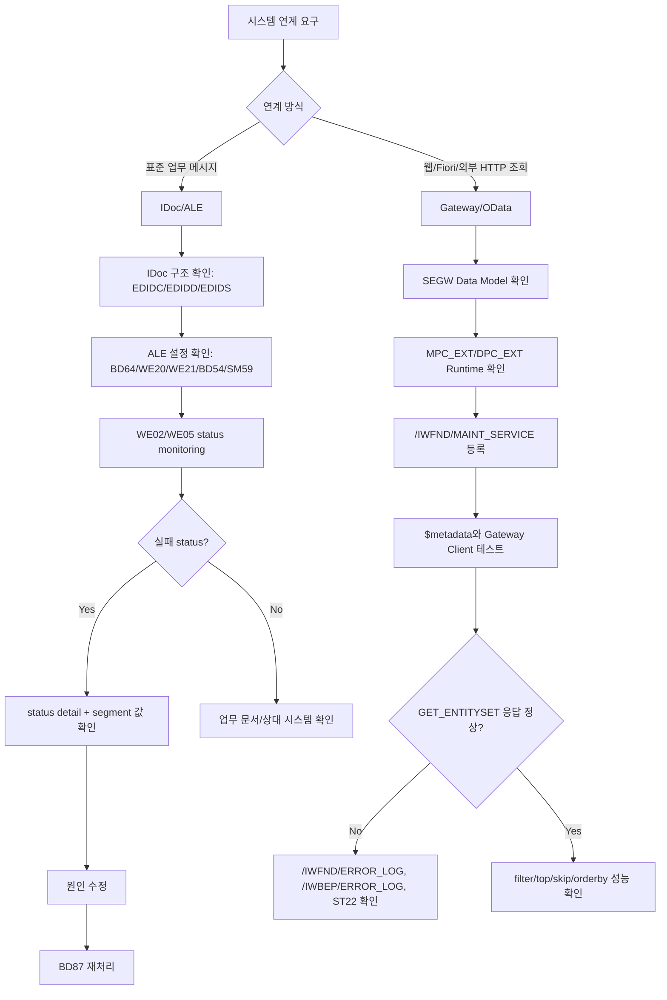
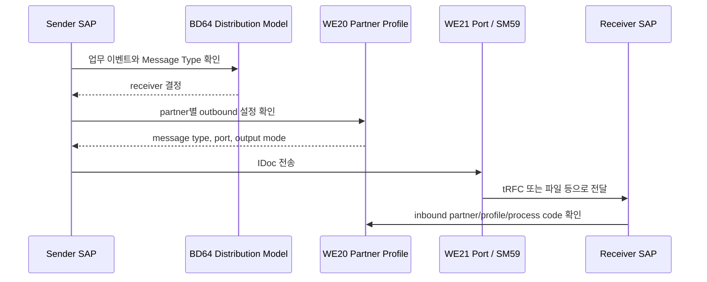
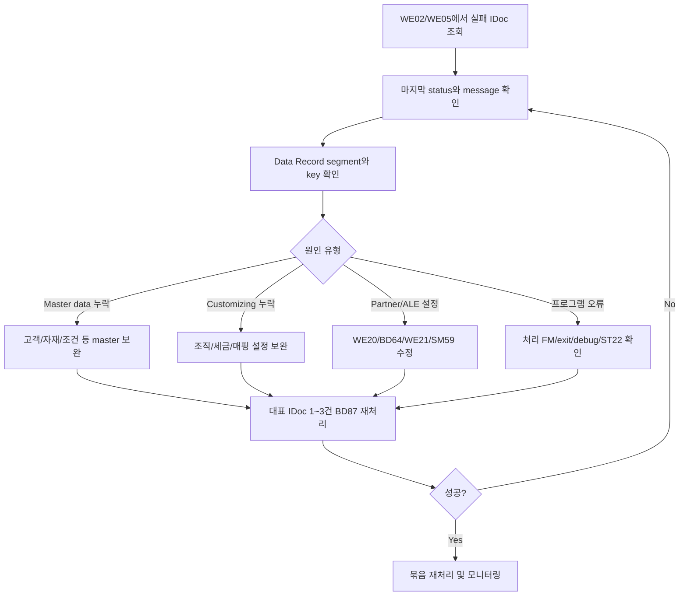

# NEWCH34_OLDCH31_REWRITE - IDoc / ALE / Gateway

> 기준: `content/abap/CH31/*`, `reference/codex_0625_v2/CH31_REWRITE.md`, `reference/codex_0629_v3/00_CONCEPT_GAP_AUDIT.md`, `.project-docs/11_KEYWORD_AUDIT.md`, `.project-docs/TRACK2_ENRICHMENT.md`

## 이 장의 위치

NEWCH33에서 학습자는 BAPI, RFC, BDC, Excel Upload, File Interface를 배웠다. 그 장의 핵심은 "외부와 데이터를 주고받는 코드를 작성한다"가 아니라 "수신, 검증, 처리, 메시지 판정, 로그, 재처리, 멱등성까지 포함해야 운영 가능한 인터페이스다"였다.

NEWCH34는 그 생각을 SAP 표준 연계 방식으로 확장한다. IDoc/ALE는 표준 메시지를 비동기로 주고받고 상태를 추적하는 방식이다. Gateway/OData는 웹, 모바일, Fiori, 외부 서비스가 HTTP로 ABAP 데이터를 조회하거나 변경할 수 있게 하는 방식이다. 둘 다 시스템 연계이지만 성격이 다르다.

| 구분 | 중심 질문 | 대표 도구 |
|---|---|---|
| IDoc | 표준 메시지가 만들어졌고 어느 상태에서 실패했는가 | `WE02`, `WE05`, `WE60`, `BD87` |
| ALE | 어느 시스템이 누구에게 어떤 메시지를 보내는가 | `BD64`, `WE20`, `WE21`, `BD54`, `SM59` |
| Gateway/OData | HTTP 요청이 어떤 ABAP 로직과 데이터 응답으로 연결되는가 | `SEGW`, `/IWFND/MAINT_SERVICE`, `/IWFND/GW_CLIENT`, `DPC_EXT` |

이 장의 학습 목표는 다음과 같다.

| 질문 | 이 장에서 배우는 답 |
|---|---|
| IDoc은 파일과 무엇이 다른가 | Control/Data/Status record를 가진 SAP 표준 메시지 컨테이너 |
| Basic Type, Segment, Message Type은 어떻게 구분하는가 | 업무 의미와 실제 segment 구조의 차이 |
| ALE 설정 오류는 어디서 찾는가 | Distribution Model, Partner Profile, Port, Logical System, RFC destination |
| IDoc 실패는 어떻게 재처리하는가 | status detail 확인, 원인 수정, `BD87` 재처리 |
| Classic Gateway 서비스는 어떤 부품으로 구성되는가 | Data Model, Runtime Artifacts, `MPC_EXT`, `DPC_EXT`, Service Registration |
| `GET_ENTITYSET`은 무엇을 구현하는가 | OData query option을 ABAP SELECT와 `et_entityset`으로 매핑 |

이 장의 결론은 단순하다.

> IDoc/ALE는 메시지와 상태를 운영하는 기술이고, Gateway/OData는 URL 요청과 ABAP 응답을 운영하는 기술이다. 둘 다 "어디서 실패했는지 찾고 다시 처리할 수 있는 구조"까지 설명할 수 있어야 한다.

## R15 게이팅과 classic-first 경계

이 장은 Classic SAP 현장에서 많이 만나는 IDoc/ALE와 Classic Gateway `SEGW`를 먼저 다룬다. ABAP Cloud와 RAP 시대에도 기존 시스템에는 IDoc, ALE, OData V2, SEGW 서비스가 많이 남아 있다. 유지보수 개발자는 이 자산을 읽고 오류를 분석할 수 있어야 한다.

다만 신규 개발 방향의 경계도 명확히 둔다. ABAP Cloud, Clean Core, RAP business service, service binding은 L04/L05에서 "신규 개발이라면 우선 검토할 방향"으로만 설명한다. 이 장은 RAP behavior definition, service definition, service binding 생성 실습을 반복하는 장이 아니다. 그 내용은 이미 CH23과 NEWCH39에서 다뤘다.

선행 지식은 다음처럼 연결한다.

| 선행 장 | 이 장에서 사용하는 정도 |
|---|---|
| CH06 | IDoc data record와 Gateway response를 internal table 감각으로 읽는다. |
| CH08 | Gateway `GET_ENTITYSET`의 SELECT 조회를 이해한다. |
| CH10 | IDoc 처리 function, RFC destination, Gateway runtime class 호출 구조를 이해한다. |
| CH18 | inline declaration, method chain, modern ABAP 코드를 읽는다. |
| CH19 | `SELECT ... ORDER BY ... UP TO ... OFFSET` 절 순서를 이해한다. |
| CH20 | `DPC_EXT` method redefinition과 class/method 구현을 이해한다. |
| CH23 | RAP과 Classic Gateway의 역할 차이를 구분한다. |
| CH24 | 로그, 재처리, LUW, 오류 원인 수정 후 재실행 원칙을 적용한다. |
| CH30 | BAPI/RFC/File Interface에서 배운 운영형 인터페이스 사고를 IDoc/Gateway에 적용한다. |

## 공식 문서 확인 메모

Classic ABAP 문법은 로컬 ABAP Keyword Documentation에서 수동 확인했다. OData/Gateway/ABAP Cloud glossary는 로컬 다운로드 문서에서 확인했다. IDoc/ALE customizing과 Classic Gateway 운영 화면은 ABAP Keyword Documentation의 직접 범위를 벗어나므로 SAP Help Portal 공식 자료를 보충 확인했다. NotebookLM은 사용하지 않았다.

| 범위 | 확인 자료 | 본문 반영 |
|---|---|---|
| Method 구현 | `C:\ABAP_DOCU_HTML\abapmethod.htm`, `abapmethods.htm` | `METHOD ... ENDMETHOD`, method declaration/implementation 감각 |
| Method redefinition | `C:\ABAP_DOCU_HTML\abapmethods_redefinition.htm` | `DPC_EXT`에서 generated method를 redefine한다는 설명 |
| SELECT target | `C:\ABAP_DOCU_HTML\abapselect_into_target.htm` | `INTO CORRESPONDING FIELDS OF TABLE @et_entityset` |
| ORDER BY | `C:\ABAP_DOCU_HTML\abaporderby_clause.htm` | 정렬 없는 result set은 순서가 정의되지 않음, paging 정렬 필요 |
| UP TO/OFFSET | `C:\ABAP_DOCU_HTML\abapselect_up_to_offset.htm` | `UP TO`, `OFFSET`, `OFFSET`은 `ORDER BY` 필요 |
| MESSAGE/예외 | `C:\ABAP_DOCU_HTML\abapmessage.htm`, `abaptry.htm`, `abapcatch_try.htm` | Gateway/IDoc 오류 메시지와 예외 경계 |
| OData/Gateway glossary | `C:\ABAP_DOCU_DOWNLOAD\ABAP_DOCU\abap-docs-main\docs\standard\md\ABENODATA_GLOSRY.md`, `ABENSAP_GATEWAY_GLOSRY.md` | OData는 RESTful API 표준, SAP Gateway는 AS ABAP 접근 framework |
| RAP/Cloud 경계 | `ABENSERVICE_BINDING_GLOSRY.md`, `ABENBUSINESS_SERVICE_GLOSRY.md`, `ABENABAP_CLOUD_GLOSRY.md`, `ABENRELEASED_API_GLOSRY.md`, `ABENCLASSIC_ABAP_GLOSRY.md` | 신규 Cloud 개발은 RAP business service, service binding, released API 우선 |
| IDoc 구조 | SAP Help Portal: IDoc Structure Technical Implementation, IDoc Display | control/data/status record, EDIDC/EDIDD/EDIDS, WE02 tree |
| ALE Distribution Model | SAP Help Portal: Distribution Model, Creating the ALE Distribution Model | logical system, message type, BAPI/filter relationship, model distribution |
| Gateway/OData | SAP Help Portal: Service Builder extension, Activate OData Services, `$filter` option, entity set query option APIs | SEGW redefine, service activation, query option, `$top/$skip` paging |

보충 확인 URL:

| 범위 | SAP Help URL |
|---|---|
| IDoc technical structure | `https://help.sap.com/docs/ABAP_PLATFORM_NEW/8f3819b0c24149b5959ab31070b64058/4b38633ead7f74fee10000000a421937.html` |
| IDoc display | `https://help.sap.com/docs/ABAP_PLATFORM_NEW/8f3819b0c24149b5959ab31070b64058/4b4c78b74a712597e10000000a42189b.html` |
| ALE Distribution Model | `https://help.sap.com/docs/ABAP_PLATFORM_NEW/8f3819b0c24149b5959ab31070b64058/4abb4af3479926c4e10000000a42189b.html` |
| Gateway Service Builder redefine | `https://help.sap.com/docs/ABAP_PLATFORM_NEW/68bf513362174d54b58cddec28794093/c972141b977a4182930c192bfaf2c0b1.html` |
| Activate OData Services | `https://help.sap.com/docs/ABAP_PLATFORM_NEW/1b0aa06133bd47ce8843635a99ee8ef5/aeff6f6c319447f1b293c7cbcacd9f18.html` |
| OData `$filter` option | `https://help.sap.com/docs/ABAP_PLATFORM_NEW/68bf513362174d54b58cddec28794093/4186dfb43183416cae68c828ffe42f1f.html` |
| EntitySet request context APIs | `https://help.sap.com/doc/saphelp_nw75/7.5.5/en-US/0e/9b2451f8c0266ee10000000a445394/content.htm` |

## 전체 흐름 지도



이 지도에서 IDoc/ALE와 Gateway/OData는 서로 다른 기술처럼 보이지만 운영 질문은 같다. "어디서 실패했는가?", "누가 볼 수 있는 로그가 남는가?", "원인을 고친 뒤 다시 처리할 수 있는가?", "대량 데이터에서 성능과 중복 문제가 없는가?"를 계속 물어야 한다.

## NEWCH34-L01 - IDoc 기본 구조

### 왜 필요한가

CH30의 파일 인터페이스는 파일을 열고 줄을 읽고 검증한 뒤 처리했다. 하지만 기업 간 거래나 SAP 시스템 간 표준 연계에서는 단순한 파일 한 줄보다 더 많은 정보가 필요하다. 누가 보냈는지, 누가 받아야 하는지, 어떤 업무 메시지인지, 실제 데이터는 어떤 구조인지, 지금 어디까지 처리되었는지, 실패했다면 어떤 메시지가 남았는지를 함께 관리해야 한다.

IDoc(Intermediate Document)은 이 문제를 해결하는 SAP 표준 메시지 컨테이너다. 주문, 납품, 송장, 자재, 고객 같은 업무 메시지를 시스템 사이에서 비동기로 주고받을 때 많이 사용한다. "비동기"라는 말은 상대 시스템의 업무 처리가 즉시 끝나야만 다음 줄이 실행되는 RFC 호출과 다르다는 뜻이다. IDoc은 먼저 생성되고, 전송되고, 수신 시스템에서 처리되고, 각 단계의 상태가 기록된다.

이 구조가 중요한 이유는 운영 때문이다. 외부 주문 1,000건이 들어왔는데 37건이 실패했다면 개발자는 "연계가 실패했습니다"라고만 말할 수 없다. 운영자는 어떤 IDoc 번호가 실패했는지, 어느 segment 값이 문제인지, status message가 무엇인지, 다시 처리할 수 있는지를 알아야 한다. IDoc은 이런 추적 가능한 표준 봉투를 제공한다.

### 무엇인가

IDoc은 세 층으로 이해한다.

| 층 | 대표 테이블 | 역할 | 입문자식 해석 |
|---|---|---|---|
| Control Record | `EDIDC` | 발신자, 수신자, Message Type, Basic Type, 방향, IDoc 번호 | "이 메시지가 누구에게서 누구에게 가는가" |
| Data Records | `EDIDD` | 실제 업무 데이터 segment의 반복 묶음 | "주문 헤더, 품목, 파트너 같은 내용이 어디에 담겼는가" |
| Status Records | `EDIDS` | 생성, 전송, 수신, 오류, 성공의 처리 이력 | "지금 어디까지 처리됐고 왜 실패했는가" |

용어도 분리해야 한다.

| 용어 | 의미 | 예시 |
|---|---|---|
| Message Type | 업무 의미 | `ORDERS`, `INVOIC`, `DEBMAS` |
| Basic Type | IDoc의 segment 구조 버전 | `ORDERS05` |
| Segment | Data Record 안의 데이터 조각 | 주문 헤더, 품목, 파트너 segment |
| Extension | 표준 Basic Type에 고객 segment를 추가한 구조 | `Z...` extension |
| Direction | 우리 시스템 기준 수신/발신 | inbound, outbound |

Message Type은 "무슨 업무 메시지인가"이고, Basic Type은 "그 메시지가 어떤 segment 구조를 갖는가"다. 같은 주문 메시지라도 Basic Type 버전이나 extension에 따라 실제 data record 구조가 다를 수 있다.

Inbound 처리 function을 아주 단순화하면 다음처럼 생각할 수 있다. 실제 signature와 table type은 IDoc processing framework와 message type에 따라 다르지만, Control과 Data를 받아 segment를 해석하고 application document를 만들며 Status를 남긴다는 큰 흐름은 같다.

```abap
" Conceptual inbound processing skeleton.
" The IDoc framework calls the processing function.
LOOP AT idoc_data INTO DATA(ls_data).
  CASE ls_data-segnam.
    WHEN 'E1EDK01'.
      " Parse header segment.
    WHEN 'E1EDP01'.
      " Parse item segment.
    WHEN OTHERS.
      " Ignore or log unsupported segment according to policy.
  ENDCASE.
ENDLOOP.

" Validate parsed data, create application document,
" and return status/message to the IDoc framework.
```

초보자는 이 예제를 "내가 직접 IDoc framework를 구현한다"로 받아들이면 안 된다. 목표는 `WE02`에서 보이는 Control/Data/Status 구조가 처리 function의 입력과 운영 status로 이어진다는 감각을 갖는 것이다.

### 어떻게 확인하는가

첫 번째 확인은 `WE02` 또는 `WE05`다. IDoc 번호를 열고 Control Record에서 direction, sender, receiver, Message Type, Basic Type을 본다. 먼저 "이 IDoc은 우리 시스템이 받은 것인가, 보낸 것인가"를 말로 설명해 봐야 한다. 방향을 모르면 status 해석도 틀어진다.

두 번째 확인은 Data Records다. Segment 목록을 열고 segment 이름, 반복 횟수, 계층을 본다. 주문 IDoc이라면 header segment는 한 번, item segment는 여러 번 나올 수 있다. CH06에서 internal table을 배웠던 이유가 여기서 드러난다. 연계 데이터는 한 줄짜리 flat structure가 아니라 반복 segment 묶음으로 오는 경우가 많다.

세 번째 확인은 `WE60`이다. Basic Type 문서를 열어 segment가 어떤 순서와 계층으로 구성되는지 확인한다. 실패한 IDoc만 보지 말고 정상 IDoc의 구조도 함께 봐야 한다. 정상 구조를 알아야 오류 segment가 어디에 있어야 하는 값인지 이해할 수 있다.

네 번째 확인은 Status Records다. Status는 현재 값 하나만 보는 것이 아니라 처리 이력을 보는 것이다. Outbound에서 생성되었는지, port로 전달되었는지, 상대 처리 성공 확인이 있는지, inbound에서 application document 생성이 성공했는지를 순서대로 읽는다.

다섯 번째 확인은 application document 연결이다. `WE02`에서 관련 object나 application document link가 보이는 경우, 실제 업무 문서와 IDoc 번호를 연결해서 본다. IDoc status가 성공이어도 업무 담당자가 원하는 문서가 맞게 생성되었는지 확인해야 한다.

### 실수와 주의

가장 흔한 실수는 IDoc을 "큰 문자열 하나"로 생각하는 것이다. IDoc은 control, data, status가 분리된 구조이고, data도 segment 단위로 나뉜다. 오류 분석도 "IDoc 실패"에서 멈추지 말고 "어떤 status에서, 어떤 segment 값 때문에 실패했는가"로 좁혀야 한다.

두 번째 실수는 Message Type과 Basic Type을 섞는 것이다. `ORDERS`는 업무 의미이고 `ORDERS05`는 구조다. Message Type이 같아도 Basic Type과 extension이 다르면 segment 구조가 달라질 수 있다.

세 번째 실수는 inbound/outbound 방향을 혼동하는 것이다. Inbound는 우리 시스템이 받는 IDoc이고, Outbound는 우리 시스템이 보내는 IDoc이다. 같은 상태 코드도 방향과 시나리오에 따라 운영 담당 지점이 달라진다.

네 번째 실수는 Status Record를 개발자 로그 정도로만 보는 것이다. Status는 운영자가 장애를 찾는 표준 단서다. 그래서 custom inbound 처리에서 남기는 메시지는 "Error occurred"가 아니라 "고객 10000001이 회사코드 1000에 존재하지 않음"처럼 원인을 좁혀야 한다.

다섯 번째 실수는 extension segment를 무조건 나쁘게 보는 것이다. Classic IDoc에서는 고객 확장을 위해 extension을 쓰는 경우가 있다. 다만 표준 Basic Type 구조, partner 합의, 수신 처리 로직, 운영 문서를 함께 맞춰야 한다.

### 체험형 학습 설계

`CH31-L01-S01`은 "IDoc 3층 구조 - 클릭 탐색" 시뮬레이터로 설계한다.

| 요소 | 설계 |
|---|---|
| 버튼/동작 | `Control 보기`, `Data 펼치기`, `Status 보기`, `오류 IDoc 보기`, `WE60 구조 보기` |
| 상태 | `Normal outbound`, `Inbound error`, `Structure view`, `Status trace` |
| 데이터 | `ORDERS05` 예시, header segment 1건, item segment 3건, status `03 -> 12 -> 53` 또는 `64 -> 51` |
| 패널 | EDIDC card, EDIDD segment tree, EDIDS timeline, Basic Type structure |
| 피드백 | "업무 값은 Data Record에 있고, 장애 원인은 Status와 Data를 함께 봐야 한다" |

오류 IDoc 보기에서는 필수 segment 값이 빠진 샘플을 보여 준다. 학습자가 status `51`만 보면 "실패"라고만 나오지만, Data Record의 특정 segment를 열면 원인 값이 보이게 한다. 이 연결을 통해 `WE02`에서 status와 segment를 함께 읽는 습관을 만든다.

### 정리

IDoc은 SAP 표준 메시지 봉투다. Control Record는 누가 누구에게 어떤 메시지를 보내는지, Data Records는 실제 업무 데이터를 segment로, Status Records는 처리 이력과 오류를 담는다. `WE02`/`WE05`로 IDoc을 보고, `WE60`으로 Basic Type 구조를 확인한다.

다음 레슨에서는 이 IDoc을 어느 시스템에서 어느 시스템으로 보낼지 정하는 ALE Distribution Model을 배운다.

## NEWCH34-L02 - ALE Distribution Model

### 왜 필요한가

IDoc 구조를 이해했다면 다음 질문은 "이 메시지를 누가 누구에게 보내는가"이다. IDoc 자체는 봉투와 내용물이다. 하지만 봉투를 어느 주소로 보낼지, 어떤 message type을 어떤 상대에게 보낼지, 전송 경로는 RFC인지 파일인지, 수신 쪽에서는 어떤 처리 함수를 실행할지 정하지 않으면 운영 흐름이 되지 않는다.

ALE(Application Link Enabling)는 SAP 시스템 사이에서 application data를 분산 처리하기 위한 연계 틀이다. Distribution Model은 발신 시스템, 수신 시스템, Message Type, BAPI, filter 관계를 정의해서 데이터 배포를 제어한다.

이 레슨이 필요한 이유는 실무 오류의 상당수가 코드가 아니라 설정에서 나오기 때문이다. IDoc 생성 프로그램은 정상인데 Partner Profile이 없어서 처리되지 않거나, Port가 잘못되어 다른 RFC destination으로 가거나, Logical System 이름이 client와 맞지 않아 엉뚱한 대상으로 보내는 일이 있다. ALE는 "개발자는 설정 몰라도 된다"가 아니라, 개발자도 운영 흐름을 읽을 수 있어야 하는 영역이다.

### 무엇인가

ALE 연계 흐름은 다섯 구성요소로 나눠서 본다.

| 구성요소 | 대표 T-code | 역할 | 초보자식 비유 |
|---|---|---|---|
| Logical System | `BD54`, `SALE` | SAP client 또는 외부 시스템을 논리 이름으로 식별 | 주소록의 시스템 이름 |
| Distribution Model | `BD64` | sender, receiver, message type, filter 관계 정의 | 누가 누구에게 무엇을 보낼지 정한 배포 규칙 |
| Partner Profile | `WE20` | 파트너별 inbound/outbound 처리 계약 | 상대별 송수신 계약서 |
| Port | `WE21` | 실제 전송 경로 정의 | 우편, 택배, 전용선 같은 통로 |
| RFC Destination | `SM59` | tRFC port가 참조하는 원격 접속 대상 | 실제 접속 정보 |

"모델, 파트너, 통로"로 기억하면 쉽다. Distribution Model은 어떤 메시지를 보낼지 정하는 설계도다. Partner Profile은 특정 partner와 주고받을 때 어떤 message type, process code, port, 처리 방식을 쓸지 정한다. Port는 실제 이동 경로이고, Logical System은 시스템의 논리 주소다.

Outbound 흐름을 단순화하면 다음과 같다.



수신 시스템에서는 inbound Partner Profile과 process code에 따라 처리 function 또는 application logic이 실행된다. 따라서 "보내는 쪽 설정만 맞다"로는 충분하지 않다. 수신 쪽도 상대 partner, message type, process code, port 설정이 맞아야 한다.

### 어떻게 확인하는가

첫 번째 확인은 Logical System이다. `BD54` 또는 `SALE` 경로에서 logical system 이름을 확인하고, client에 어떤 logical system이 할당되어 있는지 본다. 시스템 복사 뒤 이 이름이 꼬이면 IDoc이 예상과 다른 partner로 흐를 수 있다.

두 번째 확인은 `BD64`의 Distribution Model이다. sender, receiver, Message Type이 정확히 연결되어 있는지 본다. 모델을 만들기만 하고 distribute하지 않으면 상대 시스템과 설정이 맞지 않을 수 있다. "모델이 있다"와 "모델이 배포되어 양쪽이 같은 관계를 안다"를 구분한다.

세 번째 확인은 `WE20` Partner Profile이다. Outbound라면 partner number, partner type, Message Type, receiver port, output mode, package size, process code 관련 설정을 본다. Inbound라면 Message Type별 process code와 처리 function 연결을 본다. IDoc이 생성되었는데 처리되지 않는다면 Partner Profile 누락을 먼저 의심한다.

네 번째 확인은 `WE21` Port와 `SM59` RFC destination이다. Port가 어떤 RFC destination이나 파일 경로를 가리키는지 본다. CH30의 RFC에서 배운 connection test, logon, authorization, target client 확인이 ALE에서도 그대로 중요하다.

다섯 번째 확인은 테스트 IDoc의 status 흐름이다. 설정 화면만 보고 끝내지 말고 실제 한 건을 생성해 `WE02`에서 status가 어떻게 바뀌는지 본다. Outbound가 생성되었는지, port로 넘어갔는지, 수신 처리까지 성공했는지 status로 증명해야 한다.

### 실수와 주의

가장 흔한 실수는 `BD64`만 만들고 Partner Profile을 빼먹는 것이다. Distribution Model은 "보낼 관계"를 정의하지만, Partner Profile은 "어떻게 처리할지"를 정한다. 둘 중 하나만 있으면 운영 흐름이 완성되지 않는다.

두 번째 실수는 Port와 RFC Destination을 같은 것으로 생각하는 것이다. Port는 IDoc 전송 설정이고, RFC Destination은 원격 접속 대상이다. tRFC port가 RFC destination을 참조할 수 있지만 둘은 같은 개념이 아니다.

세 번째 실수는 개발 시스템 설정을 운영 시스템에 그대로 복사하는 것이다. Logical System, RFC destination, partner number는 환경별로 달라질 수 있다. transport로 이동할 설정과 운영에서 직접 맞출 설정을 구분해야 한다.

네 번째 실수는 model distribute를 잊는 것이다. ALE model은 만든 뒤 배포해야 상대 시스템과 일관성을 맞출 수 있다. "내 시스템에는 보이는데 상대 시스템에는 없다"는 상태는 실제 프로젝트에서 자주 발생한다.

다섯 번째 실수는 filter 조건을 운영 문서에 남기지 않는 것이다. Distribution Model에는 Message Type뿐 아니라 filter 조건이 들어갈 수 있다. 어떤 회사코드, 플랜트, 조직만 보내는지 문서화하지 않으면 "왜 어떤 데이터는 IDoc이 안 나가나요?"라는 질문을 추적하기 어렵다.

### 체험형 학습 설계

`CH31-L02-S01`은 "ALE 분배 흐름도"를 설정 완성도 점검판으로 설계한다.

| 요소 | 설계 |
|---|---|
| 토글 | `Logical System 정상`, `BD64 모델 있음`, `모델 배포 완료`, `WE20 Partner Profile 있음`, `WE21/SM59 정상` |
| 버튼 | `IDoc 발행`, `수신 처리`, `설정 누락 진단`, `초기화` |
| 상태 | `Ready`, `Model missing`, `Partner missing`, `Port failure`, `Inbound missing`, `Transferred` |
| 패널 | sender/receiver 관계, partner contract, port/RFC route, status timeline |
| 피드백 | "IDoc 코드는 맞아도 ALE 설정 하나가 빠지면 운영 흐름은 멈춘다" |

`IDoc 발행`을 눌렀을 때 모든 토글이 켜져 있으면 status가 정상 흐름으로 이동한다. Partner Profile이 꺼져 있으면 "보낼 관계는 있지만 처리 계약이 없다"는 피드백을 준다. Port/RFC가 꺼져 있으면 "WE21에서 port가 가리키는 SM59 destination을 확인하라"는 피드백을 준다.

### 정리

ALE Distribution Model은 IDoc의 배포 설계다. `BD64`는 누가 누구에게 어떤 Message Type을 보낼지 정의하고, `WE20`은 partner별 처리 계약을, `WE21`과 `SM59`는 전송 경로를 담당한다. IDoc이 만들어졌다고 연계가 끝난 것이 아니다. 모델, partner profile, port, logical system, 실제 status까지 이어서 확인해야 한다.

다음 레슨에서는 이렇게 흘러간 IDoc이 실패했을 때 status로 원인을 찾고 재처리하는 법을 배운다.

## NEWCH34-L03 - IDoc 오류 추적과 재처리

### 왜 필요한가

IDoc 연계의 장점은 실패가 남는다는 것이다. 하지만 실패가 남는다는 사실만으로 운영이 안정되는 것은 아니다. 실패한 IDoc을 누가 언제 확인할지, 어떤 원인을 먼저 고칠지, 재처리를 해도 되는지, 다시 실패하면 어떻게 기록할지까지 정해져 있어야 한다.

실무에서 IDoc 오류는 개발 오류보다 업무 데이터 오류인 경우가 많다. 고객 번호가 없거나, 자재가 해당 플랜트에 확장되지 않았거나, 세금 코드가 맞지 않거나, partner mapping이 누락될 수 있다. 이때 `BD87`을 반복 실행한다고 해결되지 않는다. 원인을 고치고 다시 처리해야 한다.

이 레슨의 목표는 status code를 외우는 것이 아니다. status를 보고 "발신 문제인가, 통신 문제인가, 수신 application 문제인가, 데이터 문제인가"를 분류하고, 재처리 전에 무엇을 고쳐야 하는지 판단하는 것이다.

### 무엇인가

IDoc status는 처리 단계의 숫자 코드다. 시스템과 시나리오에 따라 세부 status는 더 많지만, 입문자는 다음 상태를 먼저 읽을 수 있어야 한다.

| 방향 | 대표 status | 의미 | 운영 질문 |
|---|---|---|---|
| Outbound | `01` | IDoc 생성됨 | 생성 프로그램은 실행되었는가 |
| Outbound | `03` | IDoc이 port로 전달됨 | 발신 측 전송 단계는 지나갔는가 |
| Outbound | `12` | dispatch 성공 확인 | 상대 또는 통신 계층 확인은 필요한가 |
| Outbound | `02`, `26` | 전송/처리 오류 계열 | port, RFC, partner 설정을 확인했는가 |
| Inbound | `64` | application으로 넘길 준비 | 처리 job 또는 trigger가 필요한가 |
| Inbound | `51` | application document posting 오류 | 데이터, master, customizing 원인을 고쳤는가 |
| Inbound | `53` | application document posted | 업무 문서가 실제로 생성되었는가 |

`51`은 "원인"이 아니라 "결과"다. "Inbound application 처리 중 실패했다"는 뜻이지, 왜 실패했는지는 status detail, message, segment 값, application log, dump, customizing을 함께 봐야 한다.

재처리 흐름은 다음처럼 정리한다.



`BD87`은 실패 IDoc을 다시 application processing으로 넘기는 도구다. 이미 실패한 원인이 그대로 남아 있으면 같은 오류가 반복된다. 따라서 재처리는 원인 수정 뒤에 실행해야 한다.

### 어떻게 확인하는가

첫 번째 확인은 `WE02` 또는 `WE05`에서 status 목록을 보는 것이다. 마지막 status만 보지 말고 status history를 본다. 이전 status가 어디까지 진행되었는지에 따라 담당 영역이 달라진다.

두 번째 확인은 status detail message다. message class, number, variable이 있으면 원인 key를 추적한다. "고객 없음", "자재 플랜트 확장 없음", "세금 코드 없음", "partner profile 없음"처럼 수정 가능한 원인을 찾아야 한다.

세 번째 확인은 Data Record segment다. 오류 메시지의 key가 segment 안에 있는지 확인한다. 예를 들어 고객 번호 오류라면 partner segment, 자재 오류라면 item segment, 조직 오류라면 header나 control record를 확인한다.

네 번째 확인은 application document다. status `53`이면 성공이지만, 실제 업무 문서가 기대한 값으로 생성되었는지 확인한다. status 성공만으로 업무 정합성이 완전히 증명되는 것은 아니다.

다섯 번째 확인은 재처리 전 대표 샘플이다. 같은 오류가 5,000건 있어도 먼저 1~3건으로 원인 수정이 맞는지 확인한다. 대표 건이 `53`으로 성공하면 묶음 재처리를 검토한다.

여섯 번째 확인은 재처리 로그다. 누가 언제 어떤 원인 수정 후 어떤 IDoc을 재처리했는지 남긴다. 운영 감사 관점에서 "실패 데이터를 임의로 바꿨는가"와 "원인 수정 후 정상 재처리했는가"는 다르다.

### 실수와 주의

가장 위험한 실수는 원인을 고치지 않고 `BD87`만 반복 실행하는 것이다. 데이터 오류는 데이터가 바뀌거나 master/customizing이 고쳐져야 해결된다. 재처리는 처리 기회를 다시 주는 기능이지 오류를 자동으로 고치는 기능이 아니다.

두 번째 실수는 outbound status `03`을 최종 업무 성공으로 오해하는 것이다. `03`은 발신 시스템에서 port로 전달되었다는 의미일 수 있다. 수신 시스템에서 application document가 성공적으로 생성되었는지는 별도 확인이 필요하다.

세 번째 실수는 실패 IDoc data를 임의로 수정하는 것이다. 운영 시스템에서 IDoc data를 직접 바꾸는 행위는 감사와 정합성에 영향을 준다. 테스트 환경에서는 `WE19`로 학습과 재현을 할 수 있지만, 운영에서는 승인된 절차와 기록 없이 원본 메시지를 바꾸면 안 된다.

네 번째 실수는 대량 재처리를 한 번에 실행하는 것이다. 같은 원인으로 실패한 수천 건을 원인 확인 없이 재처리하면 시스템 부하와 반복 실패 로그만 늘어난다.

다섯 번째 실수는 성공 status만 보고 업무 확인을 생략하는 것이다. `53`은 application posting 성공을 뜻하지만, 생성된 문서의 값이 업무 기대와 맞는지는 별도 검증이 필요할 수 있다.

### 체험형 학습 설계

`CH31-L03-S01`은 "IDoc 상태 생애주기 - 오류와 재처리" 시뮬레이터로 설계한다.

| 요소 | 설계 |
|---|---|
| 버튼 | `전송(Outbound)`, `수신 처리(Inbound)`, `오류 주입`, `원인 수정`, `BD87 재처리`, `초기화` |
| 상태 | `01 Created`, `03 Port passed`, `64 Ready`, `51 Error`, `53 Posted`, `Retry blocked`, `Retry success` |
| 데이터 | 고객 누락 오류, 자재 플랜트 확장 누락 오류, partner profile 누락 오류 |
| 패널 | status timeline, status message, segment value, 원인 분류, 재처리 로그 |
| 피드백 | "`51`은 실패 결과다. 원인을 고치지 않으면 `BD87`은 같은 실패를 반복한다" |

`BD87 재처리` 버튼은 `원인 수정` 상태가 켜져야 성공하도록 만든다. 오류 주입 상태에서 바로 재처리를 누르면 "원인 미수정: status 51 반복"을 보여 준다. 학습자는 재처리가 만능 버튼이 아니라 운영 절차라는 점을 체험한다.

### 정리

IDoc 운영의 핵심은 status를 읽고 원인을 고친 뒤 재처리하는 루프다. `WE02`/`WE05`로 실패를 찾고, status detail과 data record를 읽고, 원인을 수정한 뒤 `BD87`로 재처리한다. `51`은 원인이 아니라 실패 결과다.

다음 레슨에서는 메시지 기반 연계와 다른 축인 Classic Gateway OData 구조를 배운다.

## NEWCH34-L04 - Gateway SEGW 프로젝트 구조

### 왜 필요한가

IDoc/ALE는 시스템 사이에서 표준 메시지를 주고받는 방식이다. 하지만 웹 화면, 모바일 앱, Fiori, 외부 서비스가 "지금 예매 목록을 조회해 달라"라고 요청할 때는 메시지 봉투보다 HTTP 서비스가 더 자연스럽다. ABAP 백엔드 데이터를 OData 서비스로 노출하는 대표적인 Classic 방식이 SAP Gateway와 `SEGW` 프로젝트다.

CH23에서 RAP을 배웠다면 "요즘은 RAP service binding으로 OData를 노출할 수 있지 않나?"라는 질문이 생긴다. 맞다. 신규 ABAP Cloud 또는 Clean Core 방향에서는 RAP, released API, service definition, service binding을 우선 검토한다. 하지만 현장에는 Classic Gateway로 만든 OData V2 서비스가 매우 많다. 유지보수자는 `SEGW`, `DPC_EXT`, `MPC_EXT`, `/IWFND/MAINT_SERVICE`, Gateway Client, error log를 읽을 수 있어야 한다.

이 레슨의 목표는 `SEGW` 화면 버튼을 외우는 것이 아니다. OData 서비스가 모델, 구현, runtime class, 등록, 테스트, 오류 로그로 나뉘어 운영된다는 구조를 이해하는 것이다. 구조를 알아야 다음 레슨에서 `GET_ENTITYSET` 메서드를 어디에 왜 구현하는지 이해할 수 있다.

### 무엇인가

로컬 ABAP glossary 기준으로 OData는 RESTful API를 정의하고 소비하기 위한 표준 프로토콜이며, SAP Gateway는 AS ABAP에 대해 OData 같은 표준 open protocol 접근을 가능하게 하는 framework다.

Classic `SEGW` 프로젝트는 보통 다음 영역으로 나뉜다.

| 영역 | 대표 요소 | 역할 |
|---|---|---|
| Data Model | `EntityType`, `EntitySet`, `Association`, Property, Key | 외부에 보일 데이터 모양과 관계 정의 |
| Service Implementation | `GetEntitySet`, `GetEntity`, `Create`, `Update`, `Delete` | OData operation과 ABAP 처리 로직 연결 |
| Runtime Artifacts | `*_MPC`, `*_MPC_EXT`, `*_DPC`, `*_DPC_EXT` | 생성된 provider class와 확장 class |
| Service Registration | `/IWFND/MAINT_SERVICE` | Gateway server에 서비스를 등록하고 활성화 |
| Test/Log | `/IWFND/GW_CLIENT`, `/IWFND/ERROR_LOG`, `/IWBEP/ERROR_LOG`, ST22 | 요청 테스트와 오류 분석 |

`MPC`는 Model Provider Class다. EntityType, property, metadata 같은 모델 정보를 담당한다. `DPC`는 Data Provider Class다. 실제 데이터를 읽고, 만들고, 수정하고, 삭제하는 ABAP 로직이 여기에 들어간다.

생성된 base class인 `*_MPC`, `*_DPC`를 직접 고치지 않고 `*_MPC_EXT`, `*_DPC_EXT`에 구현하는 이유는 재생성 때문이다. `SEGW`에서 runtime artifact를 다시 generate하면 base class가 다시 만들어질 수 있다. 고객 로직은 extension class에 두어야 유지된다.

EntityType과 EntitySet도 반드시 구분한다.

| 개념 | 뜻 | 예시 |
|---|---|---|
| EntityType | 한 건의 데이터 구조 | `Concert` with `ConcertId`, `Artist`, `Venue`, `Capacity` |
| EntitySet | EntityType의 collection | `ConcertSet` |
| Property | EntityType 안의 필드 | `Venue` |
| Key | 한 건을 식별하는 property | `ConcertId` |
| Association | Entity 간 관계 | Concert -> Booking |

외부 소비자는 `/sap/opu/odata/sap/ZCONCERT_SRV/ConcertSet` 같은 URL로 EntitySet을 호출한다. `$metadata`는 이 서비스가 어떤 EntityType, EntitySet, property, 관계를 노출하는지 알려 주는 계약서다.

### 어떻게 확인하는가

첫 번째 확인은 `SEGW` 프로젝트의 Data Model이다. EntityType과 EntitySet 이름, property 이름, key 지정, nullable 여부, type mapping을 확인한다. 외부 URL과 JSON/XML payload는 ABAP 테이블명이 아니라 OData 모델 이름을 기준으로 움직인다.

두 번째 확인은 Runtime Artifacts다. Generate Runtime Objects 후 어떤 class가 생성되었는지 본다. `*_MPC_EXT`에는 모델 보강 로직이, `*_DPC_EXT`에는 데이터 처리 로직이 들어간다. 다음 레슨의 `GET_ENTITYSET` 구현 위치는 `DPC_EXT`다.

세 번째 확인은 service registration이다. `SEGW`에서 project를 만들고 class를 generate했다고 바로 URL이 열리는 것이 아니다. `/IWFND/MAINT_SERVICE`에서 서비스를 등록하고 활성화해야 `/sap/opu/odata/sap/<SERVICE_NAME>/...` endpoint가 준비된다. SAP Help의 OData activation 문서도 이 transaction을 서비스 활성화 지점으로 안내한다.

네 번째 확인은 `$metadata`다. `/IWFND/GW_CLIENT` 또는 browser에서 `/sap/opu/odata/sap/ZCONCERT_SRV/$metadata`를 호출해 EntityType, EntitySet, property가 예상대로 노출되는지 본다. metadata가 틀리면 `GET_ENTITYSET` 구현을 보기 전에 모델부터 고쳐야 한다.

다섯 번째 확인은 Gateway Client다. `/IWFND/GW_CLIENT`에서 service document, `$metadata`, EntitySet 요청을 순서대로 실행한다. HTTP status, response body, error text, response time을 확인한다.

여섯 번째 확인은 error log다. HTTP 500이면 `/IWFND/ERROR_LOG`, `/IWBEP/ERROR_LOG`, ST22를 확인한다. 403이면 권한, 404이면 service 등록과 URL, 400이면 query option이나 property 이름을 의심한다. Gateway 오류는 browser 메시지만으로 판단하면 안 된다.

### 실수와 주의

가장 흔한 실수는 generated base class를 직접 수정하는 것이다. `*_DPC`나 `*_MPC` base class는 재생성 시 덮일 수 있다. 업무 로직은 `*_DPC_EXT`, 모델 확장은 `*_MPC_EXT`에 둔다.

두 번째 실수는 EntityType과 EntitySet을 섞는 것이다. EntityType은 한 건의 구조이고 EntitySet은 그 구조의 목록이다. `GET_ENTITY`와 `GET_ENTITYSET`이 헷갈리는 이유도 이 구분이 약하기 때문이다.

세 번째 실수는 서비스 등록을 빼먹는 것이다. `SEGW` 프로젝트가 active이고 class가 생성되어도 `/IWFND/MAINT_SERVICE` 등록이 없으면 소비자가 호출할 endpoint가 준비되지 않는다.

네 번째 실수는 Classic Gateway와 RAP을 한 문장으로 섞어 버리는 것이다. Classic Gateway는 `SEGW`, generated provider class, method redefinition 중심이다. RAP은 CDS, behavior, service definition, service binding 중심이다. 둘 다 OData를 만들 수 있지만 개발 모델과 Cloud 적합성이 다르다.

다섯 번째 실수는 `$metadata`를 확인하지 않고 데이터 코드만 고치는 것이다. property 이름이나 key가 모델과 다르면 데이터 로직이 맞아도 소비자 요청은 실패한다.

### 체험형 학습 설계

`CH31-L04-S01`은 "SEGW 프로젝트 구조 - 펼쳐 보기" 시뮬레이터로 설계한다.

| 요소 | 설계 |
|---|---|
| 버튼/동작 | `Data Model 펼치기`, `Runtime Artifacts 보기`, `Service 등록`, `$metadata 호출`, `오류 상태 전환` |
| 상태 | `Model defined`, `Runtime generated`, `Registered`, `Metadata OK`, `Service missing`, `DPC_EXT missing` |
| 데이터 | `ZCONCERT_SRV`, `Concert` EntityType, `ConcertSet` EntitySet, `ZCL_ZCONCERT_DPC_EXT` |
| 패널 | project tree, URL preview, metadata preview, error log hint |
| 피드백 | "URL 하나가 열리려면 모델, 구현, runtime, 등록, 테스트가 모두 이어져야 한다" |

오류 상태 전환은 세 가지로 둔다. `서비스 미등록`은 404/service not found와 `/IWFND/MAINT_SERVICE` 확인을 보여 준다. `모델 불일치`는 `$metadata`에는 property가 없는데 응답에 값을 채우려는 상황을 보여 준다. `DPC_EXT 미구현`은 URL은 열리지만 빈 목록 또는 method not implemented 흐름을 보여 준다.

### 정리

Classic Gateway `SEGW` 프로젝트는 모델, 구현, runtime class, 서비스 등록, 테스트/로그로 나뉜다. 모델은 `MPC_EXT`, 데이터 로직은 `DPC_EXT`가 중심이다. EntityType은 한 건의 모양이고 EntitySet은 목록이다. `/IWFND/MAINT_SERVICE` 등록과 `$metadata` 확인 없이는 서비스가 완성되었다고 볼 수 없다.

다음 레슨에서는 `GET_ENTITYSET`을 재정의해 실제 목록 조회를 구현한다.

## NEWCH34-L05 - OData V2 EntitySet 조회 구현

### 왜 필요한가

Gateway 구조를 이해했다면 소비자가 실제로 데이터를 요청했을 때 어떤 일이 일어나는지 봐야 한다. 예를 들어 Fiori 화면이 공연 목록을 조회하면서 다음 URL을 호출할 수 있다.

```text
/sap/opu/odata/sap/ZCONCERT_SRV/ConcertSet?$filter=Venue eq '서울'&$top=10&$skip=20
```

이 요청을 ABAP backend가 받아 database 조회로 바꾸고, 결과를 `et_entityset`에 채워 돌려주는 method가 `GET_ENTITYSET`이다.

입문자가 여기서 가장 경계해야 할 생각은 "SELECT 해서 전부 넘기면 되겠지"이다. 서비스는 화면 안의 작은 list와 다르다. 호출자는 많을 수 있고, 네트워크를 타고, 응답 크기가 성능에 영향을 주며, filter와 paging을 무시하면 사용자가 선택한 조건과 다른 결과를 받는다. 특히 `$top`과 `$skip`은 목록 화면의 paging에 직접 연결된다. 정렬 없는 skip은 page마다 결과가 흔들릴 수 있으므로 안정적인 `ORDER BY`가 필요하다.

### 무엇인가

Classic Gateway에서 EntitySet 목록 조회는 보통 `*_DPC_EXT` class의 `<entityset>_GET_ENTITYSET` method를 redefine해서 구현한다. 이 method는 OData request context를 받고, 결과 table인 `et_entityset`을 채워 반환한다.

핵심 매핑은 다음과 같다.

| OData 요청 | ABAP 구현 의미 |
|---|---|
| `/ConcertSet` | Concert 목록 조회 |
| `$filter=Venue eq '서울'` | WHERE 조건 또는 range 조건 |
| `$top=10` | 최대 10건 반환 |
| `$skip=20` | 앞의 20건 건너뛰기 |
| `$orderby=ConcertId` | 안정적인 정렬 기준 |
| response body | `et_entityset`에 채운 internal table |

아래 코드는 학습용 예시다. 실제 Gateway project의 method signature와 type 이름은 생성된 서비스에 따라 다르다. 중요한 것은 request option을 읽고, filter와 paging을 SELECT에 반영하고, 결과를 `et_entityset`에 채우는 흐름이다.

```abap
METHOD concertset_get_entityset.
  DATA lt_select_options TYPE /iwbep/t_mgw_select_option.
  DATA lr_venue          TYPE RANGE OF zconcert-venue.
  DATA lv_top            TYPE i VALUE 100.
  DATA lv_skip           TYPE i VALUE 0.

  lt_select_options =
    io_tech_request_context->get_filter( )->get_filter_select_options( ).

  IF iv_top IS NOT INITIAL AND iv_top <= 100.
    lv_top = iv_top.
  ENDIF.

  lv_skip = iv_skip.

  READ TABLE lt_select_options INTO DATA(ls_filter)
       WITH KEY property = 'Venue'.
  IF sy-subrc = 0.
    lr_venue = CORRESPONDING #( ls_filter-select_options ).
  ENDIF.

  IF lr_venue IS INITIAL.
    SELECT concert_id, artist, venue, capacity
      FROM zconcert
      ORDER BY concert_id
      INTO CORRESPONDING FIELDS OF TABLE @et_entityset
      UP TO @lv_top ROWS
      OFFSET @lv_skip.
  ELSE.
    SELECT concert_id, artist, venue, capacity
      FROM zconcert
      WHERE venue IN @lr_venue
      ORDER BY concert_id
      INTO CORRESPONDING FIELDS OF TABLE @et_entityset
      UP TO @lv_top ROWS
      OFFSET @lv_skip.
  ENDIF.
ENDMETHOD.
```

로컬 ABAP 문서 기준으로 `METHOD ... ENDMETHOD`는 class implementation part에서 method 기능을 구현하는 문법이다. `METHODS ... REDEFINITION`은 subclass에서 상속받은 instance method를 다시 구현하는 문법이다. `SELECT ... INTO target`은 result set을 internal table 같은 target에 쓴다. `UP TO n ROWS`와 `OFFSET o`는 읽을 row 수와 건너뛸 row 수를 제한한다. `OFFSET`은 `ORDER BY`가 있어야 사용할 수 있고, `ORDER BY`가 없으면 result set의 순서는 정의되지 않는다.

### 어떻게 확인하는가

첫 번째 확인은 `$metadata`다. `ConcertSet`이라는 EntitySet이 실제로 metadata에 있는지, property 이름이 `ConcertId`, `Artist`, `Venue`, `Capacity`처럼 외부 이름으로 어떻게 노출되는지 확인한다. ABAP 필드명과 OData property 이름이 다르면 filter property mapping도 달라질 수 있다.

두 번째 확인은 Gateway Client다. `/IWFND/GW_CLIENT`에서 다음 요청을 순서대로 실행한다.

```text
/sap/opu/odata/sap/ZCONCERT_SRV/ConcertSet
/sap/opu/odata/sap/ZCONCERT_SRV/ConcertSet?$filter=Venue eq '서울'
/sap/opu/odata/sap/ZCONCERT_SRV/ConcertSet?$filter=Venue eq '서울'&$top=3
/sap/opu/odata/sap/ZCONCERT_SRV/ConcertSet?$filter=Venue eq '서울'&$top=3&$skip=3
```

각 요청에서 HTTP status가 `200`인지, response count가 예상과 맞는지, `$top`을 바꾸면 건수가 바뀌는지, `$skip`을 바꾸면 다음 page가 나오는지 확인한다. 같은 요청을 두 번 실행했을 때 row 순서가 흔들리면 `ORDER BY`가 부족한 것이다.

세 번째 확인은 ABAP debugger다. `GET_ENTITYSET`에 breakpoint를 걸고 `io_tech_request_context`에서 filter select options가 어떻게 들어오는지 본다. property 이름이 예상과 다르면 metadata와 Gateway model mapping을 다시 확인한다.

네 번째 확인은 오류 로그다. HTTP 500이면 `/IWFND/ERROR_LOG`, `/IWBEP/ERROR_LOG`, ST22를 확인한다. 403이면 권한, 404이면 service 등록과 URL, 400이면 query option 문법이나 property 이름을 먼저 의심한다.

다섯 번째 확인은 성능이다. filter 없는 전체 조회, `$top` 없는 대량 조회, 정렬 없는 paging은 운영에서 위험하다. ST05 SQL Trace나 runtime analysis로 실제 SELECT가 기대한 WHERE, ORDER BY, row limit을 사용하고 있는지 확인한다.

### 실수와 주의

가장 큰 실수는 `$filter`를 무시하고 전체 데이터를 반환하는 것이다. 처음에는 화면에 데이터가 보여서 성공처럼 보이지만, 데이터가 많아지면 응답이 느려지고 사용자가 다른 조건을 선택해도 결과가 바뀌지 않는다. 서비스는 request option을 계약으로 받아들여야 한다.

두 번째 실수는 `$top`과 `$skip`을 무시하는 것이다. 목록 화면은 page 단위로 데이터를 요청한다. 서버가 항상 전체 데이터를 보내면 network, memory, response time이 모두 나빠진다.

세 번째 실수는 `OFFSET`을 쓰면서 안정적인 `ORDER BY`를 두지 않는 것이다. paging에서 순서가 흔들리면 같은 데이터가 다른 page에 중복되거나 빠질 수 있다.

네 번째 실수는 OData property 이름과 ABAP field 이름을 혼동하는 것이다. 외부 요청은 OData metadata의 property 이름을 사용한다. ABAP 내부 필드와 이름이 다르면 filter mapping에서 변환이 필요하다.

다섯 번째 실수는 client가 보낸 `$top`을 무제한 신뢰하는 것이다. 소비자가 `$top=100000`을 보내면 그대로 응답할 것인지, 서버 상한을 둘 것인지 정책이 필요하다. 예제의 `lv_top` 기본값과 상한 검사는 이 감각을 보여 주기 위한 장치다.

여섯 번째 실수는 generated base class를 직접 수정하는 것이다. L04와 같은 원칙이다. 조회 구현은 `DPC_EXT`의 redefined method에 둔다.

### 체험형 학습 설계

`CH31-L05-S01`은 "OData 조회 - $filter, $top, $skip" 시뮬레이터로 설계한다.

| 요소 | 설계 |
|---|---|
| 컨트롤 | `Venue` select, `$top` number input, `$skip` number input, `ORDER BY 끄기`, `filter 미반영` |
| 상태 | `Filtered`, `Paged`, `Unstable order`, `Full scan warning`, `HTTP 200`, `HTTP 400` |
| 데이터 | 공연 목록 12건, 서울/부산/대구 venue, page size 3 |
| 패널 | URL preview, Gateway context, ABAP SELECT 대응 줄, response table, error log hint |
| 피드백 | "URL query option은 ABAP SELECT 조건, row limit, offset, 정렬로 번역되어야 한다" |

학습자가 `Venue = 서울`을 선택하면 URL에 `$filter=Venue eq '서울'`이 붙고 결과가 서울 공연으로 줄어든다. `$top = 3`, `$skip = 3`을 입력하면 다음 page가 표시된다. `ORDER BY 끄기`를 누르면 page 이동 때 row 순서가 흔들리는 예를 보여 준다. `filter 미반영`을 누르면 Venue를 바꿔도 결과가 바뀌지 않고 "filter를 ABAP WHERE로 매핑하지 않았다"는 피드백을 준다.

코드 연결 영역은 지금 선택한 option이 ABAP 코드의 어느 줄과 대응되는지 표시한다. `Venue`는 filter select options와 `WHERE venue IN @lr_venue`, `$top`은 `UP TO @lv_top ROWS`, `$skip`은 `OFFSET @lv_skip`, 정렬은 `ORDER BY concert_id`에 연결된다.

### 정리

`GET_ENTITYSET`은 OData 목록 요청을 ABAP 조회로 바꾸는 지점이다. `$filter`는 WHERE 조건, `$top`은 row limit, `$skip`은 offset, `$orderby`는 안정적인 정렬로 연결된다. 결과는 `et_entityset`에 채운다. Classic Gateway에서는 `DPC_EXT`에 구현하고, 서비스 등록과 `$metadata`, Gateway Client, error log로 확인한다.

## 장 전체 정리

CH31은 "시스템 연계가 보내는 코드만으로 끝나지 않는다"는 사실을 다룬다.

| 기술 | 핵심 운영 질문 | 확인 화면/도구 |
|---|---|---|
| IDoc | 메시지의 Control/Data/Status를 읽을 수 있는가 | `WE02`, `WE05`, `WE60` |
| ALE | sender/receiver/message/port/partner 설정이 맞는가 | `BD64`, `WE20`, `WE21`, `BD54`, `SM59` |
| IDoc 재처리 | 실패 원인을 고친 뒤 재처리하는가 | `BD87`, status detail, segment, application log |
| Gateway | 모델, runtime, 등록, metadata, 테스트가 이어지는가 | `SEGW`, `/IWFND/MAINT_SERVICE`, `$metadata` |
| OData 조회 | query option을 ABAP SELECT로 안전하게 매핑하는가 | `DPC_EXT`, `/IWFND/GW_CLIENT`, `/IWFND/ERROR_LOG` |

IDoc/ALE는 표준 메시지와 운영 status를 중심으로 설계하고, Gateway/OData는 HTTP 요청을 ABAP 조회와 응답으로 매핑한다. 둘 다 실패 확인 지점이 명확해야 한다. 다음 장에서는 이렇게 만든 연계와 조회가 느려졌을 때 성능을 분석하고 튜닝하는 방법으로 넘어간다.
