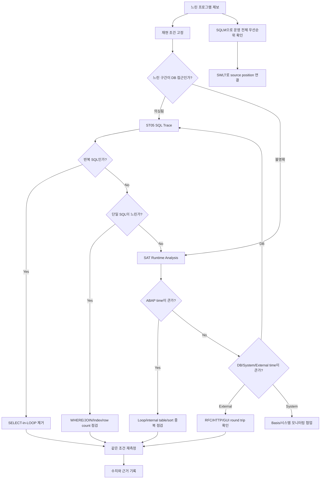

# NEWCH35_OLDCH32_REWRITE - 성능 분석과 튜닝

> 기준: `content/abap/CH32/*`, `reference/codex_0625_v2/CH32_REWRITE.md`, `reference/codex_0629_v3/00_CONCEPT_GAP_AUDIT.md`, `.project-docs/11_KEYWORD_AUDIT.md`, `.project-docs/TRACK2_ENRICHMENT.md`

## 이 장의 위치

NEWCH34까지 학습자는 ABAP 프로그램을 만들고, DB를 조회하고, ALV와 화면을 다루고, 표준 확장과 인터페이스를 이해했다. 이제 실무에서 가장 자주 듣는 말을 마주한다.

> "동작은 하는데 너무 느립니다."

입문자는 이 말을 들으면 곧바로 index를 만들거나 `LOOP`를 줄이거나 SQL을 바꾸고 싶어진다. 하지만 성능 튜닝은 감으로 하는 일이 아니다. 느린 이유가 DB 접근인지, ABAP 내부 처리인지, 원격 호출인지, 같은 SQL 반복인지, 대량 데이터를 한 번에 처리해서인지 먼저 증명해야 한다.

이 장의 핵심은 다음 순서다.


성능 작업의 완료 조건은 "코드를 바꿨다"가 아니다. 같은 입력, 같은 조건에서 수정 전후 수치가 어떻게 바뀌었는지 설명할 수 있어야 한다. 좋은 튜닝 기록은 실행 조건, 데이터 규모, 측정 도구, 병목 위치, 수정 내용, 재측정 결과를 남긴다.

이 장에서 배우는 질문은 다음과 같다.

| 질문 | 이 장에서 배우는 답 |
|---|---|
| DB 접근이 느린지 어떻게 확인하는가 | `ST05` SQL Trace |
| ABAP 코드 자체가 느린지 어떻게 확인하는가 | `SAT` Runtime Analysis |
| 운영 전체에서 먼저 고칠 SQL은 어떻게 고르는가 | `SQLM`, `SWLT` |
| 가장 흔한 1+N DB 왕복은 어떻게 제거하는가 | JOIN, `FOR ALL ENTRIES`, 사전 조회, internal table key 접근 |
| 수백만 건 처리는 무엇이 다른가 | package, commit/restart, pushdown, 병렬 처리 기준 |

## R15 게이팅과 classic-first 경계

이 장은 Classic ABAP 시스템에서 자주 쓰는 성능 분석 도구와 튜닝 패턴을 먼저 다룬다. `ST05`, `SAT`, `SQLM`, `SWLT`, Open SQL 튜닝, `FOR ALL ENTRIES`, internal table key access, 대량 처리 package 설계는 기존 ECC와 S/4HANA on-premise 유지보수에서 계속 중요하다.

ABAP Cloud와 Clean Core는 경계로만 다룬다. 신규 Cloud 개발에서는 released API, RAP, CDS 기반 pushdown, framework가 제공하는 query/paging/filtering을 우선 검토한다. 하지만 기존 Classic ABAP 리포트, 배치, 인터페이스를 유지보수하는 개발자는 ST05/SAT/SQLM 결과를 읽고 Open SQL과 internal table 구조를 개선할 수 있어야 한다.

선행 지식 연결은 다음과 같다.

| 선행 장 | 이 장에서 사용하는 정도 |
|---|---|
| CH06 | `READ TABLE`, internal table search, sorted/binary search 감각 |
| CH08 | 기본 `SELECT`, WHERE 조건, DB 조회 비용 |
| CH13 | JOIN, `FOR ALL ENTRIES`, Open SQL 조합 |
| CH18 | inline `DATA`, modern ABAP 읽기 |
| CH19 | host variable `@`, aggregate SQL, `GROUP BY`, SQL expression |
| CH24 | package 처리, commit/rollback, 재처리 기록 |
| CH25 | lock 충돌과 중복 처리 위험 |
| CH30~CH31 | 인터페이스와 Gateway 조회가 운영 부하를 만들 수 있다는 감각 |
| CH33 | AMDP/ADBC는 다음 장에서 구현하며, 이 장에서는 pushdown 판단 기준만 예고 |

## 공식 문서 확인 메모

Classic ABAP 문법은 로컬 ABAP Keyword Documentation에서 수동 확인했다. 성능 분석 도구는 ABAP Keyword Documentation의 문법 영역이 아니므로 SAP Help Portal 공식 자료를 보충 확인했다. NotebookLM은 사용하지 않았다.

| 범위 | 확인 자료 | 본문 반영 |
|---|---|---|
| `FOR ALL ENTRIES` | `C:\ABAP_DOCU_HTML\abenwhere_all_entries.htm` | FAE 동작, 중복 제거, 빈 driver table 전체 조회 위험, JOIN 대안 |
| `READ TABLE` | `C:\ABAP_DOCU_HTML\abapread_table.htm`, `abapread_table_key.htm` | `sy-subrc`, `sy-tabix`, sorted key, `BINARY SEARCH`, key access |
| 정렬 | `C:\ABAP_DOCU_HTML\abapsort_itab.htm` | `BINARY SEARCH` 전 key 순서 정렬 필요 |
| Aggregate | `C:\ABAP_DOCU_HTML\abapselect_aggregate.htm` | `SUM`, `COUNT`, `MIN`, `MAX` 같은 aggregate expression |
| `GROUP BY` | `C:\ABAP_DOCU_HTML\abapgroupby_clause.htm` | DB에서 group/aggregate를 만들어 전송량을 줄이는 원칙 |
| SELECT 구조 | `C:\ABAP_DOCU_HTML\abapselect_clause.htm` | SELECT list, DISTINCT, result set 구조 |
| ABAP Cloud/RAP 경계 | `ABENABAP_CLOUD_GLOSRY.md`, `ABENRELEASED_API_GLOSRY.md`, `ABENABAP_RAP_GLOSRY.md`, `ABENARAP_GLOSRY.md`, `ABENCLASSIC_ABAP_GLOSRY.md` | Cloud-ready/released API/RAP 경계를 튜닝 구현과 분리 |
| ST05 | SAP Help Portal ST05 Performance Analysis | database access, locking, remote call 등을 trace file로 기록하는 도구 |
| SAT | SAP Help Portal ABAP Runtime Analysis | runtime/memory 소비 위치, bottleneck, Hit List, hits/net runtime 해석 |
| SQLM/SWLT | SAP Help Portal SQL Monitor/SWLT usage scenarios | 운영 runtime data와 static check 결과를 source position 기준으로 결합 |

보충 확인 URL:

| 범위 | SAP Help URL |
|---|---|
| ST05 Performance Analysis | `https://help.sap.com/docs/SUPPORT_CONTENT/basis/3354611581.html` |
| ABAP Runtime Analysis / SAT | `https://help.sap.com/saphelp_em92/helpdata/en/3c/74c6163ce4459888bc06dedda37685/content.htm` |
| SQL Monitor / SWLT usage | `https://help.sap.com/saphelp_snc700_ehp04/helpdata/de/1e/c2329419b64f3992a9c342437d3a0f/content.htm` |
| SQL Performance Monitoring | `https://help.sap.com/docs/ABAP_PLATFORM_NEW/a24970c68fcf4770a64bf9a78e3719e2/355d59ff44ce4f789d6b29cda7ec45fa.html` |

## 전체 판단 지도



이 지도에서 중요한 점은 도구 선택이다. DB 상세는 ST05, ABAP runtime 위치는 SAT, 운영 전체 우선순위는 SQLM/SWLT다. 하나의 도구로 모든 성능 문제를 해결하려고 하면 원인 분류가 흐려진다.

## NEWCH35-L01 - ST05 SQL Trace

### 왜 필요한가

사용자가 "예매현황 리포트가 느립니다"라고 말하면 초보 개발자는 코드를 열고 눈에 보이는 `LOOP`나 `SELECT`부터 고치고 싶어진다. 하지만 성능 문제는 눈으로 코드를 훑는 것만으로 잘 보이지 않는다. 800ms짜리 SQL 한 번이 문제일 수도 있고, 1ms짜리 SQL이 10,000번 반복되어 문제일 수도 있다. 두 문제는 해결 방법이 완전히 다르다.

ST05 SQL Trace는 한 실행 안에서 실제 DB 접근이 어떻게 일어났는지 확인하는 도구다. 어떤 SQL이 실행되었는지, 몇 번 실행되었는지, 총 시간이 얼마나 걸렸는지, 몇 건을 읽었는지 본다. 이 레슨의 목표는 "느린 SELECT를 찾는다"가 아니라 "느린 이유를 분류한다"이다.

성능 튜닝의 첫 문장은 "어디가 느린지 측정했습니다"여야 한다. "아마 index 문제 같습니다"는 가설이고, ST05 결과가 있어야 근거가 된다.

### 무엇인가

ST05는 SAP GUI에서 사용하는 Performance Trace 도구다. SAP Help 기준으로 ST05 Performance Trace는 database access, lock activity, remote call 같은 활동을 trace file로 기록할 수 있다. CH32에서는 그중 SQL Trace를 중심으로 본다.

Trace 결과에서 입문자가 먼저 봐야 할 항목은 다음과 같다.

| 항목 | 의미 | 판단 질문 |
|---|---|---|
| SQL statement | 실행된 SQL | 어느 table을 어떤 조건으로 읽는가 |
| Executions | 실행 횟수 | 같은 SQL이 반복되는가 |
| Total time | 누적 소요 시간 | 전체 병목에서 비중이 큰가 |
| Records | 읽거나 반환한 row 수 | 너무 많은 데이터를 가져오는가 |
| Identical/Redundant Selects | 동일하거나 불필요하게 반복된 SELECT | 한 번 읽어 재사용할 수 있는가 |

ST05는 "특정 실행의 실제 DB 대화"를 보여 준다. 어떤 사용자가 어떤 선택 화면 조건으로 느린 프로그램을 실행했을 때, 그 한 번의 실행을 깊게 보는 데 강하다. 반대로 운영 전체에서 지난 7일간 어떤 SQL이 가장 비싼지 보는 일은 L03의 SQLM이 더 적합하다.

### 어떻게 확인하는가

첫 번째 단계는 재현 조건을 고정하는 것이다. 선택 화면 값, 사용자, client, 데이터 건수, 실행 시간대, 프로그램 버전을 기록한다. 수정 전후 비교는 같은 조건이어야 의미가 있다.

두 번째 단계는 trace 범위를 좁히는 것이다. `ST05`에서 Trace On을 하기 전에 대상 user나 program을 제한한다. 운영 시스템에서 여러 사용자를 오래 trace하면 부하와 trace file 크기가 커질 수 있으므로 짧게, 필요한 범위만 측정한다.

세 번째 단계는 측정이다. Trace On을 누르고 대상 프로그램을 실행한 뒤 Trace Off를 누른다. trace를 켠 상태로 오래 방치하지 않는다. 사용 흐름은 `Trace On -> 프로그램 실행 -> Trace Off -> Display Trace`다.

네 번째 단계는 Display Trace에서 정렬하는 것이다. 먼저 Total time이 큰 SQL을 찾고, 다음으로 Executions가 큰 SQL을 본다. Total time이 큰 단일 SQL은 WHERE 조건, index, join 방식, 반환 column, row count를 점검한다. Executions가 큰 동일 SQL은 SELECT-in-LOOP 가능성이 높다.

다섯 번째 단계는 code 위치와 연결하는 것이다. Trace에 나온 SQL statement와 table 이름을 기준으로 ABAP code의 SELECT 위치를 찾는다. 같은 table을 읽는 SELECT가 여러 곳이면 SQL 조건, line, 실행 call path를 함께 보며 병목을 좁힌다.

여섯 번째 단계는 재측정이다. 수정 후 같은 조건으로 다시 ST05를 실행한다. 좋은 결과 기록은 "SQL이 빨라졌다"가 아니라 "동일 SELECT 실행 횟수 5,000회가 2회로 줄었고 total time이 2,400ms에서 90ms로 줄었다"처럼 수치를 남긴다.

### 실수와 주의

가장 흔한 실수는 측정 없이 index부터 추가하는 것이다. Index는 읽기를 빠르게 할 수 있지만 쓰기 비용과 저장 공간을 늘릴 수 있다. S/4HANA 환경에서는 HANA column store, CDS/pushdown, 표준 객체 변경 제한까지 고려해야 하므로 측정 근거 없이 secondary index를 추가하면 안 된다.

두 번째 실수는 Total time만 보고 Executions를 놓치는 것이다. 1회 800ms SQL도 문제지만, 1ms SQL이 10,000번이면 더 큰 병목이 된다. L04의 SELECT-in-LOOP는 보통 execution count에서 먼저 드러난다.

세 번째 실수는 운영에서 trace를 오래 켜 두는 것이다. ST05는 분석 도구이지 상시 모니터링 도구가 아니다. 장기간 누적 분석은 SQLM으로 넘긴다.

네 번째 실수는 한 번의 trace만 보고 결론 내리는 것이다. 성능은 데이터 분포와 조건에 따라 달라진다. 문제 재현 조건과 정상 조건을 구분해서 측정한다.

다섯 번째 실수는 trace 결과를 코드 수정과 연결하지 않는 것이다. "어떤 SQL이 느렸다"에서 끝내면 튜닝이 아니다. 그 SQL이 어느 프로그램 어느 위치에서 왜 실행되는지 찾아야 한다.

### 체험형 학습 설계

`CH32-L01-S01`은 "ST05 트레이스 분석 - 정렬과 병목 찾기" 시뮬레이터로 설계한다.

| 요소 | 설계 |
|---|---|
| 버튼 | `Trace On`, `프로그램 실행`, `Trace Off`, `Display Trace`, `수정 후 재측정` |
| 상태 | `비활성`, `수집 중`, `수집 완료`, `분석 중`, `개선 확인` |
| 데이터 | SQL statement 6개, total time, executions, records, 반복 SQL 표시 |
| 패널 | trace table, 정렬 header, 병목 분류 카드, before/after 비교 |
| 피드백 | "느린 단일 SQL과 자주 반복되는 SQL은 해결 방법이 다르다" |

학습자는 먼저 `총 시간(ms)`으로 정렬해 가장 비싼 SQL을 찾는다. 다음으로 `실행횟수`로 정렬해 같은 SQL이 1,000회 실행된 행을 찾는다. 위젯은 이 행에 "LOOP 안 SELECT 의심" 표시를 붙인다. 마지막으로 `수정 후 재측정`을 누르면 execution count가 1,000에서 2로 줄어드는 before/after table을 보여 준다.

### 정리

ST05는 한 실행에서 DB 접근 병목을 찾는 도구다. Total time, execution count, records를 함께 보고 느린 단일 SQL인지, 반복 SQL인지, 과도한 row 조회인지 분류한다. 운영에서 오래 켜 두는 도구가 아니며, 수정 후 같은 조건으로 재측정해야 한다.

다음 레슨에서는 DB가 아니라 ABAP 코드 자체가 시간을 쓰는지 SAT로 확인한다.

## NEWCH35-L02 - SAT Runtime Analysis

### 왜 필요한가

ST05로 DB 접근을 봤는데 SQL은 생각보다 괜찮을 수 있다. 그런데 프로그램은 여전히 느리다. 이때 병목은 ABAP 코드 안에 있을 수 있다. 큰 internal table을 매번 linear search로 읽거나, loop 안에서 같은 table을 반복 정렬하거나, 불필요한 method 호출이 너무 많거나, 문자열을 비효율적으로 조립할 수 있다.

SAT Runtime Analysis는 ABAP 코드가 어디에서 시간을 쓰는지 보여 준다. ST05가 "DB와 어떤 대화를 했는가"를 보는 도구라면, SAT는 "ABAP 실행 흐름 안에서 어떤 statement, method, function, block이 runtime을 소비했는가"를 보는 도구다.

이 레슨의 핵심은 ST05와 SAT의 역할 분리다. DB 시간이 크면 ST05로 SQL을 깊게 본다. ABAP 시간이 크면 loop, sort, internal table access, method structure를 본다. External processing 시간이 크면 RFC, HTTP, GUI round trip을 본다.

### 무엇인가

SAT는 ABAP Runtime Analysis 도구다. SAP Help의 Runtime Analysis 문서는 ABAP application의 performance를 정량화하고, runtime과 memory 소비 위치를 찾아 bottleneck을 식별하는 도구라고 설명한다. Hit List는 runtime 소비가 두드러진 항목을 찾는 데 사용한다.

SAT 결과에서 먼저 볼 항목은 다음과 같다.

| 항목 | 의미 | 판단 질문 |
|---|---|---|
| Hit List | 시간이 큰 호출 또는 statement 목록 | 어디가 가장 runtime을 쓰는가 |
| Net time / Own time | 해당 항목 자체가 소비한 시간 | 내부 처리 자체가 무거운가 |
| Total time | 하위 호출까지 포함한 시간 | 이 block 전체가 병목인가 |
| Hits | 호출 횟수 | 반복 처리 때문에 커졌는가 |
| ABAP/DB/System/External 비율 | 시간의 성격 | DB, ABAP, 외부 호출 중 어디가 병목인가 |

SAT는 절대 시간을 숭배하는 도구가 아니라 상대 비교 도구로 이해해야 한다. 측정 자체가 오버헤드를 만들 수 있고, 시스템 상태에 따라 절대 시간은 달라진다. 같은 데이터, 같은 조건, 같은 variant로 수정 전후를 비교해야 한다.

### 어떻게 확인하는가

첫 번째 확인은 측정 variant다. 대상 transaction, report, user, statement 범위, aggregation 방식을 정한다. SAP Help도 runtime analysis에서 aggregation과 Hit List를 통해 비싼 statement와 procedure를 먼저 보라고 안내한다.

두 번째 확인은 Hit List다. Net time 또는 Total time 기준으로 정렬한다. Hits가 많은 항목은 반복 처리 문제일 수 있고, hits가 적지만 시간이 큰 항목은 비싼 단일 작업일 수 있다.

세 번째 확인은 시간의 성격이다. Data Access 또는 DB time이 크면 ST05로 해당 SQL을 확인한다. ABAP processing이 크면 internal table 접근, 중복 loop, sort, 문자열 처리, 불필요한 변환을 본다. External processing이 크면 RFC, HTTP, GUI round trip 같은 외부 호출을 본다.

네 번째 확인은 code 위치다. Hit List에서 항목을 열어 실제 code 또는 call hierarchy로 이동한다. 병목 이름만 보고 끝내지 말고 "어느 line에서 어떤 data size로 반복되었는가"를 확인한다.

다섯 번째 확인은 개선 후 비교다. 예를 들어 standard table linear search를 sorted key 또는 hashed table 접근으로 바꿨다면, 같은 데이터로 SAT를 다시 실행해 해당 block의 hits와 time이 줄었는지 본다.

### 실수와 주의

가장 흔한 실수는 Hit List 1위 항목을 무조건 고치는 것이다. 1위 항목이 실제 업무상 필요한 큰 처리일 수도 있고, 하위 호출 시간이 포함된 Total time일 수도 있다. Own time, total time, hits, call hierarchy를 함께 본다.

두 번째 실수는 대표성이 없는 데이터로 측정하는 것이다. 운영에서는 100,000건으로 느린데 테스트 10건으로 SAT를 돌리면 병목이 드러나지 않는다.

세 번째 실수는 ST05와 SAT를 혼동하는 것이다. SAT에서 DB time이 크면 다음 단계는 ST05다. 반대로 ST05에서 SQL은 적은데 느리면 SAT로 ABAP 시간을 봐야 한다.

네 번째 실수는 측정 도구가 만든 오버헤드를 절대 수치처럼 믿는 것이다. "142ms"보다 "수정 전에는 loop 집계가 전체의 70%였고 수정 후 15%로 줄었다"가 더 중요하다.

다섯 번째 실수는 system-wide 문제를 SAT 하나로 해결하려는 것이다. 시스템 전체가 느린 경우에는 Basis 모니터링, workload monitor, DB monitor, OS monitor와 함께 봐야 한다. SAT는 특정 program/transaction 분석에 강하다.

### 체험형 학습 설계

`CH32-L02-S01`은 "SAT Hit List - ABAP/DB 시간 막대" 시뮬레이터로 설계한다.

| 요소 | 설계 |
|---|---|
| 버튼 | `측정 실행`, `Hit List 정렬`, `원인 분류`, `수정 후 비교`, `초기화` |
| 상태 | `측정 전`, `Hit List 확인`, `원인 분류`, `개선 전/후 비교` |
| 데이터 | code block 5개, hits, own time, total time, ABAP/DB/External 비율 |
| 패널 | stacked bar chart, Hit List table, 다음 도구 선택 카드 |
| 피드백 | "DB 시간이 크면 ST05, ABAP 시간이 크면 loop/internal table 접근을 본다" |

학습자는 1위 항목이 ABAP time 때문인지 DB time 때문인지 읽는다. 각 row 옆에는 `ST05로 이동`, `Internal Table 접근 점검`, `외부 호출 확인` 선택 버튼을 둔다. 원인 성격에 맞는 버튼을 고르면 다음 분석 방향을 보여 주고, 틀리면 왜 맞지 않는지 설명한다.

### 정리

SAT는 ABAP 실행 흐름 안에서 시간이 많이 쓰인 위치를 찾는 도구다. Hit List, hits, own time, total time, ABAP/DB/System/External 비율을 함께 본다. DB 시간이 크면 ST05로, ABAP 시간이 크면 loop와 internal table 접근으로, 외부 시간이 크면 RFC/HTTP 같은 외부 호출로 분석 방향을 나눈다.

다음 레슨에서는 한 실행이 아니라 운영 전체에서 누적 비용이 큰 SQL을 SQLM으로 찾는다.

## NEWCH35-L03 - SQL Monitor / SQLM

### 왜 필요한가

ST05와 SAT는 특정 실행을 깊게 보는 데 좋다. 하지만 운영에서는 "어느 프로그램부터 고쳐야 가장 효과가 큰가"가 더 중요한 질문일 때가 많다. 어떤 SQL은 한 번 실행하면 빠르지만 하루에 200,000번 실행되어 전체 비용이 크고, 어떤 SQL은 한 번은 느리지만 거의 실행되지 않을 수 있다.

SQLM(SQL Monitor)은 운영 기간 동안 실행된 SQL 정보를 누적해서 보여 주는 도구다. 개발자가 특정 케이스를 재현하지 못해도 실제 운영 사용량 기준으로 총 실행시간, 실행 횟수, 평균 시간, 영향 프로그램을 볼 수 있다. SQLM은 "개별 병목 분석"보다 "튜닝 우선순위 선정"에 강하다.

이 레슨이 필요한 이유는 튜닝 자원이 제한되어 있기 때문이다. 모든 느린 SQL을 다 고칠 수는 없다. 운영 전체에서 총 비용이 큰 것, 자주 실행되는 것, 사용자 영향이 큰 것부터 골라야 한다.

### 무엇인가

SQLM은 SQL Monitor transaction이며 일정 기간 실제 SQL 실행 정보를 수집한다. SWLT(SQL Performance Tuning Worklist)는 SQL Monitor snapshot과 static check 결과를 source position 기준으로 결합해 성능 개선 가능성이 있는 ABAP SQL 코드를 찾는 데 사용한다.

SQLM/SWLT에서 먼저 볼 항목은 다음과 같다.

| 항목 | 의미 | 판단 질문 |
|---|---|---|
| Total execution time | 기간 전체 누적 시간 | 운영 전체 비용이 큰가 |
| Number of executions | 실행 횟수 | 자주 호출되어 비용이 쌓이는가 |
| Average time | 1회 평균 시간 | 단일 실행 자체가 느린가 |
| Records | 읽은 row 수 | 과도하게 많은 데이터를 읽는가 |
| Program / source position | 코드 위치 | 어느 프로그램을 고쳐야 하는가 |

SQLM과 ST05의 차이는 관찰 범위다. ST05는 특정 실행을 자세히 보고, SQLM은 기간 전체의 누적 경향을 본다. 자연스러운 흐름은 `SQLM으로 후보 선정 -> SWLT로 source position 연결 -> ST05로 특정 실행 상세 분석 -> SAT로 ABAP runtime 확인`이다.

### 어떻게 확인하는가

첫 번째 확인은 수집 기간과 대상이다. SQLM을 활성화할 때 어떤 system, client, workload, 기간을 볼 것인지 정한다. SAP Help의 SWLT usage scenario도 productive system에서 SQL Monitor를 충분한 기간 켜고, 그 결과를 snapshot으로 분석에 활용하는 흐름을 설명한다.

두 번째 확인은 Total execution time 기준 정렬이다. 평균 시간이 크지 않아도 실행 횟수가 많으면 전체 비용이 클 수 있다. 평균 0.4ms SQL이 210,000번 실행되면 누적 시간은 무시할 수 없다.

세 번째 확인은 Average time 기준 정렬이다. 평균 시간이 큰 SQL은 단일 실행 자체가 비싸다. 조건 누락, index 부적합, 대량 row 반환, join 조건 문제를 의심할 수 있다.

네 번째 확인은 program과 source position이다. 운영에서 비싼 SQL이 발견되어도 어떤 코드에서 나왔는지 모르면 고칠 수 없다. SWLT는 runtime data와 static check 결과를 source position 기준으로 연결해 개선 후보 위치를 좁힌다.

다섯 번째 확인은 개선 후보 분류다. 자주 실행되는 SQL은 buffer, 한 번 읽기, 호출 위치 줄이기, cache 검토가 후보가 된다. 평균 시간이 큰 SQL은 WHERE 조건, join, index, aggregate, pushdown이 후보가 된다. 모든 후보를 index로 해결하려고 하면 안 된다.

### 실수와 주의

가장 흔한 실수는 평균 시간만 보고 우선순위를 정하는 것이다. 평균 100ms SQL이 하루 10번 실행되는 것보다 평균 5ms SQL이 하루 200,000번 실행되는 것이 더 큰 비용일 수 있다. total time과 executions를 함께 본다.

두 번째 실수는 SQLM 결과만 보고 곧바로 수정하는 것이다. SQLM은 우선순위를 잡는 데 강하지만, 특정 실행의 상세 조건과 bind 값은 ST05로 더 자세히 봐야 한다.

세 번째 실수는 secondary index를 남발하는 것이다. Index는 읽기 성능을 개선할 수 있지만 쓰기 비용과 저장 공간을 늘린다. 특히 S/4HANA에서는 HANA column store와 표준 객체 변경 제한, Clean Core 정책을 함께 고려해야 한다.

네 번째 실수는 운영 데이터 수집 권한과 절차를 무시하는 것이다. SQLM과 SWLT는 운영 성능 데이터와 관련될 수 있으므로 권한, 수집 기간, 대상 범위를 운영 정책에 맞춰야 한다.

다섯 번째 실수는 튜닝 우선순위를 사용자 영향과 분리해서 보는 것이다. 총 비용이 작아도 특정 마감 업무를 막는 SQL이면 우선순위가 높을 수 있다. 숫자와 업무 중요도를 함께 본다.

### 체험형 학습 설계

`CH32-L03-S01`은 "SQLM - 운영 누적 SQL 우선순위" 시뮬레이터로 설계한다.

| 요소 | 설계 |
|---|---|
| 버튼 | `운영 1일`, `운영 7일`, `배치 시간대`, `SWLT로 코드 위치 연결`, `정렬 초기화` |
| 상태 | `Snapshot loaded`, `Sorted by total`, `Sorted by executions`, `Sorted by average`, `Source linked` |
| 데이터 | SQL 7개, total time, executions, average time, program/source position |
| 패널 | SQLM table, priority card, source position card, next-action checklist |
| 피드백 | "한 번 느린 SQL과 자주 실행되어 비싼 SQL은 우선순위 판단이 다르다" |

학습자는 `총 시간`, `실행횟수`, `평균 시간`으로 정렬하며 우선순위가 어떻게 바뀌는지 본다. `SWLT로 코드 위치 연결`을 누르면 runtime SQL이 source position과 연결되고, 이후 ST05/SAT로 상세 분석하라는 흐름이 나타난다.

### 정리

SQLM은 운영 기간 전체에서 누적 비용이 큰 SQL을 찾는 도구다. ST05가 특정 실행의 상세 trace라면, SQLM은 전체 workload의 우선순위 지도다. Total time, executions, average time을 함께 보고, SWLT로 source position과 static check를 연결한다.

다음 레슨에서는 ST05와 SQLM에서 자주 발견되는 대표 병목인 SELECT-in-LOOP를 제거한다.

## NEWCH35-L04 - SELECT in LOOP 제거

### 왜 필요한가

성능 문제 중 가장 자주 만나는 패턴이 SELECT-in-LOOP다. 예매 1,000건을 읽어 놓고 각 예매 건마다 공연명을 찾기 위해 DB에 `SELECT SINGLE`을 1,000번 보내는 식이다. 프로그램은 단순해 보이지만 DB 왕복이 1+N번으로 폭발한다.

이 문제는 개발 초기에는 잘 드러나지 않는다. 테스트 데이터가 5건이면 빠르게 끝난다. 운영에서 50,000건이 되면 DB와 ABAP 서버 사이를 수만 번 왕복하면서 느려진다. ST05에서는 같은 SQL이 비정상적으로 많이 실행된 것으로 보인다.

이 레슨의 목표는 "LOOP 안 SELECT 금지"를 외우는 것이 아니다. 먼저 필요한 key를 모으고, 관련 데이터를 한 번에 읽고, loop 안에서는 internal table에서 key로 찾는 구조를 익히는 것이다. 또는 CH13에서 배운 JOIN으로 한 번에 가져온다. 핵심은 DB 왕복을 줄이는 것이다.

### 무엇인가

나쁜 패턴은 다음과 같다.

```abap
LOOP AT lt_booking INTO DATA(ls_booking).
  SELECT SINGLE artist
    FROM zconcert
    WHERE concert_id = @ls_booking-concert_id
    INTO @DATA(lv_artist).
ENDLOOP.
```

이 코드는 booking 한 건마다 DB에 다시 간다. `lt_booking`이 10건이면 10번, 10,000건이면 10,000번이다. ST05에서는 같은 SQL statement의 execution count가 커진다.

개선 패턴은 "먼저 필요한 key 목록을 만들고, 관련 데이터를 한 번에 읽고, loop 안에서는 internal table에서 찾는다"이다.

```abap
DATA lt_keys TYPE TABLE OF zbooking.

lt_keys = lt_booking.
SORT lt_keys BY concert_id.
DELETE ADJACENT DUPLICATES FROM lt_keys COMPARING concert_id.

IF lt_keys IS NOT INITIAL.
  SELECT concert_id, artist
    FROM zconcert
    FOR ALL ENTRIES IN @lt_keys
    WHERE concert_id = @lt_keys-concert_id
    INTO TABLE @DATA(lt_concert).

  SORT lt_concert BY concert_id.
ENDIF.

LOOP AT lt_booking INTO DATA(ls_booking2).
  READ TABLE lt_concert INTO DATA(ls_concert)
       WITH KEY concert_id = ls_booking2-concert_id
       BINARY SEARCH.

  IF sy-subrc = 0.
    " ls_concert-artist 사용
  ENDIF.
ENDLOOP.
```

`FOR ALL ENTRIES`는 internal table의 값을 SQL 조건에 사용하는 Open SQL 기능이다. 로컬 ABAP 문서 기준으로 `FOR ALL ENTRIES IN @itab`의 각 row에 대해 WHERE 조건이 평가되고, 결과에서 중복 row는 제거된다. 가장 중요한 경고는 driver internal table이 비어 있으면 WHERE 조건이 무시되어 database table의 모든 row가 읽힐 수 있다는 점이다. 그래서 `IF lt_keys IS NOT INITIAL.` guard가 필수다.

`READ TABLE ... BINARY SEARCH`는 정렬된 internal table에서 빠르게 key를 찾는 방식이다. 단, binary search를 쓰려면 해당 key 순서로 정렬되어 있어야 한다. 더 명확한 설계로는 sorted table이나 hashed table, secondary key를 사용할 수 있다.

JOIN과 FAE 선택도 판단해야 한다.

| 선택지 | 적합한 경우 | 주의 |
|---|---|---|
| JOIN | DB table 간 관계가 명확하고 한 번의 SQL로 필요한 결과를 만들 수 있음 | cardinality와 중복 row 확인 |
| `FOR ALL ENTRIES` | 이미 ABAP memory에 driver key list가 있고, key 기반으로 관련 table을 한 번에 읽고 싶음 | 빈 driver guard, key 중복 제거 |
| 사전 조회 + hashed/sorted table | 같은 참조 데이터를 여러 번 재사용 | memory 사용량과 key 설계 |

### 어떻게 확인하는가

첫 번째 확인은 ST05다. 수정 전 trace에서 같은 `SELECT SINGLE`이 몇 번 실행되는지 본다. input row 수와 execution count가 비슷하면 SELECT-in-LOOP 가능성이 높다.

두 번째 확인은 코드 구조다. `LOOP AT lt_booking` 안에 `SELECT`, `SELECT SINGLE`, `CALL FUNCTION`, HTTP/RFC 같은 외부 접근이 있는지 본다. 모든 LOOP 안 SELECT가 무조건 나쁜 것은 아니지만, 대량 데이터 loop에서 key 조회를 반복하는 패턴은 우선 제거 대상이다.

세 번째 확인은 driver table 비어 있음 처리다. `FOR ALL ENTRIES`를 쓰기 전에 `IF lt_keys IS NOT INITIAL.`이 있는지 본다. 이 조건이 없으면 빈 테이블일 때 전체 조회가 발생할 수 있다.

네 번째 확인은 key 중복 제거다. `SORT`와 `DELETE ADJACENT DUPLICATES`로 driver key를 줄인다. key가 중복되면 DB 조건이 불필요하게 커지고, trace 해석도 어려워진다.

다섯 번째 확인은 결과 동등성이다. 성능만 빨라지고 결과가 달라지면 실패다. 수정 전후로 같은 booking 수, 같은 artist mapping, 누락 건 처리, `sy-subrc` 처리 결과를 비교한다.

여섯 번째 확인은 수정 후 trace다. ST05에서 반복 SQL이 1,000회에서 1회 또는 2회로 줄었는지 본다. SAT에서는 ABAP loop 시간이 과하게 늘지 않았는지 확인한다.

### 실수와 주의

가장 위험한 실수는 빈 driver table로 `FOR ALL ENTRIES`를 실행하는 것이다. 이 경우 WHERE 조건이 무시되어 전체 table을 읽을 수 있다. 항상 비어 있으면 건너뛰는 guard를 둔다.

두 번째 실수는 duplicate key를 정리하지 않는 것이다. 결과 중복은 제거될 수 있지만, driver key 중복은 조건을 불필요하게 키운다. key 목록은 줄여서 전달한다.

세 번째 실수는 `BINARY SEARCH` 전에 정렬하지 않는 것이다. 정렬 기준과 검색 key가 맞지 않으면 잘못된 결과를 얻을 수 있다. sorted table이나 secondary sorted key를 쓰면 의도를 더 명확히 할 수 있다.

네 번째 실수는 FAE와 JOIN 선택 기준을 무시하는 것이다. 두 table의 관계가 명확하고 한 번에 가져올 수 있으면 JOIN이 더 단순할 수 있다. 상황별로 ST05와 결과 동등성으로 검증한다.

다섯 번째 실수는 DB 왕복은 줄였지만 memory 폭발을 만드는 것이다. 사전 조회 table이 너무 크면 L05의 package 설계가 필요하다.

### 체험형 학습 설계

`CH32-L04-S01`은 "SELECT in LOOP - 1+N vs FAE/JOIN" 시뮬레이터로 설계한다.

| 요소 | 설계 |
|---|---|
| 컨트롤 | 예매 건수 slider `0/10/100/1,000/10,000`, `FAE guard 켜기`, `중복 key 제거`, `JOIN 보기` |
| 상태 | `N=0`, `1+N 폭발`, `FAE guarded`, `Duplicate reduced`, `JOIN selected` |
| 데이터 | booking N건, distinct concert_id 수, SQL execution count, estimated time |
| 패널 | 나쁜 코드, 개선 코드, ST05 before/after, 결과 동등성 체크 |
| 피드백 | "문제는 SELECT 문법이 아니라 반복 DB 왕복이다" |

N이 0일 때는 `FAE guard`가 꺼져 있으면 "빈 driver table 전체 조회 위험"을 표시한다. N이 커질수록 왼쪽 DB 왕복 수는 `1+N`으로 늘고, 오른쪽은 FAE/JOIN 기준으로 1~2회 수준을 보여 준다.

### 정리

SELECT-in-LOOP는 DB 왕복을 1+N으로 늘리는 대표 병목이다. ST05에서 같은 SQL의 execution count가 크게 보이면 의심한다. 해결은 JOIN, `FOR ALL ENTRIES`, 사전 조회 후 internal table key 접근이다. FAE는 빈 driver table이면 전체 조회가 될 수 있으므로 반드시 guard가 필요하다.

다음 레슨에서는 데이터가 더 커질 때 package, pushdown, 병렬 기준으로 설계를 나눈다.

## NEWCH35-L05 - 대량 데이터 처리와 Package 설계

### 왜 필요한가

SELECT-in-LOOP를 제거해도 수백만 건 처리는 여전히 위험할 수 있다. 한 번에 모든 데이터를 internal table에 담으면 memory가 커지고, 한 transaction에서 너무 오래 lock을 잡고, 실패했을 때 처음부터 다시 처리해야 할 수 있다. 빠른 SELECT 하나만으로는 대량 처리 운영을 해결할 수 없다.

대량 처리에서는 속도와 안정성을 함께 본다. 얼마씩 끊어 처리할지, 언제 commit할지, 실패한 package를 어떻게 다시 시작할지, 가공을 ABAP에서 할지 DB에서 할지, 병렬로 나눌 수 있는지 판단해야 한다.

이 레슨은 CH24의 package/commit 관점과 CH32-L04의 DB 왕복 줄이기를 연결한다. 또한 CH33의 AMDP/ADBC/pushdown으로 넘어가기 전에, 어떤 일은 DB에 맡기고 어떤 일은 ABAP에서 나눠 처리해야 하는지 기준을 잡는다.

### 무엇인가

대량 처리 전략은 네 가지 질문으로 나눠 본다.

| 질문 | 예 | 적합한 방향 |
|---|---|---|
| DB가 잘하는 일인가 | 집계, 정렬, 필터, join | SQL `GROUP BY`, aggregate, CDS, pushdown |
| 한 번에 memory에 담아도 되는가 | 수천 건 vs 수백만 건 | 크면 package 처리 |
| 실패 후 다시 시작해야 하는가 | 야간 batch, 외부 파일 처리 | restart key, 처리 상태, 로그 |
| 독립 분할이 가능한가 | 회사코드, 기간, 문서번호 범위 | 병렬 처리 후보 |

가공을 DB에서 할 수 있다면 먼저 DB에서 줄인다. 로컬 ABAP 문서 기준으로 aggregate expression은 여러 row의 값을 집계하고, `GROUP BY`와 aggregate function을 쓰면 group과 aggregate가 database system에서 만들어져 DB에서 AS ABAP로 운반해야 하는 데이터 양을 줄일 수 있다.

예를 들어 ABAP으로 모든 항공편 row를 가져와 `LOOP`로 합계를 내기보다 DB에서 carrier별 합계를 만들어 결과만 가져온다.

```abap
SELECT carrid,
       SUM( seatsocc ) AS occupied_seats
  FROM sflight
  GROUP BY carrid
  INTO TABLE @DATA(lt_occupied_by_carrier).
```

Package 처리는 "전체를 한 번에"가 아니라 "안전한 단위로" 읽고 처리하는 방식이다.

```abap
DATA lv_last_id TYPE zbooking-booking_id.
DATA lv_pack_size TYPE i VALUE 10000.

DO.
  SELECT booking_id, customer_id, status
    FROM zbooking
    WHERE booking_id > @lv_last_id
    ORDER BY booking_id
    INTO TABLE @DATA(lt_pack)
    UP TO @lv_pack_size ROWS.

  IF lt_pack IS INITIAL.
    EXIT.
  ENDIF.

  " Validate and process one package.
  " Write success/failure log for restart.

  lv_last_id = lt_pack[ lines( lt_pack ) ]-booking_id.
  COMMIT WORK.
ENDDO.
```

이 코드는 개념 예시다. 실제 업무에서는 commit 단위가 업무 원자성과 맞는지, lock 범위가 적절한지, 실패한 package를 어떻게 다시 시작할지 설계해야 한다.

병렬 처리도 조심해서 판단한다. aRFC나 병렬 framework로 작업을 나누면 처리 시간이 줄 수 있지만, lock 충돌, 자원 고갈, 순서 문제, 로그 통합 문제가 생긴다. 병렬은 "독립 분할이 가능하고, 같은 key를 동시에 갱신하지 않고, 실패를 package 단위로 추적할 수 있을 때" 검토한다.

### 어떻게 확인하는가

첫 번째 확인은 데이터 규모다. 예상 대상 건수, 한 건당 memory 크기, 총 처리 시간, commit 가능 단위, lock 범위를 추정한다. 운영 최대 건수를 모르면 package size를 정할 수 없다.

두 번째 확인은 DB에서 줄일 수 있는지다. 단순 filter, join, aggregate, group by는 DB가 잘한다. ST05로 row 수와 SQL 시간을 보고, ABAP에서 loop로 계산하던 부분을 SQL aggregate로 바꿀 수 있는지 검토한다.

세 번째 확인은 package 단위다. package size가 너무 작으면 commit과 round trip이 많아지고, 너무 크면 memory와 lock이 커진다. 예를 들어 10,000건 단위로 읽고 처리한 뒤 commit하고 마지막 처리 key를 로그에 남기는 방식을 검토한다.

네 번째 확인은 실패 재시작이다. 대량 처리에서 실패는 예외가 아니라 설계 대상이다. 처리 상태 table, 성공/실패 count, 마지막 key, 오류 메시지, 재처리 대상 추출 기준을 남긴다.

다섯 번째 확인은 병렬 가능성이다. 회사코드, 기간, 문서번호 범위처럼 독립된 단위로 나눌 수 있으면 병렬 처리 후보가 된다. 하지만 같은 lock object나 같은 집계 row를 갱신하면 병렬은 오히려 충돌을 늘린다.

여섯 번째 확인은 운영 자원이다. 병렬 처리 수를 늘리면 DB, application server work process, enqueue, RFC resource를 더 쓴다. "내 프로그램만 빨라지는가"가 아니라 "시스템 전체에 부담을 주지 않는가"를 확인해야 한다.

### 실수와 주의

가장 흔한 실수는 모든 데이터를 한 번에 internal table에 담는 것이다. 테스트에서는 잘 돌아가도 운영에서는 memory 부족, paging, 긴 lock, timeout으로 실패할 수 있다.

두 번째 실수는 ABAP에서 할 필요 없는 집계를 ABAP으로 가져오는 것이다. 합계, 개수, group by, 기본 filter는 DB가 잘한다. DB에서 100건으로 줄일 수 있는 데이터를 ABAP으로 1,000,000건 가져오면 network와 memory를 낭비한다.

세 번째 실수는 commit을 너무 자주 하거나 너무 늦게 하는 것이다. 너무 자주 commit하면 성능과 원자성이 깨질 수 있고, 너무 늦게 commit하면 lock과 rollback 부담이 커진다. 업무적으로 함께 성공해야 하는 단위와 운영적으로 재시작 가능한 단위를 함께 본다.

네 번째 실수는 병렬을 성능 만능 해결책으로 보는 것이다. 병렬은 서로 독립적인 작업에만 적합하다. 같은 key를 갱신하거나 같은 lock object를 잡는 작업을 병렬화하면 충돌과 오류가 늘어난다.

다섯 번째 실수는 CH33의 pushdown 수단을 앞당겨 구현하려는 것이다. 이 장에서는 `GROUP BY`와 aggregate처럼 이미 배운 SQL로 가능한 pushdown 원칙을 다룬다. AMDP나 ADBC 구현 문법은 CH33에서 정식으로 다룬다.

### 체험형 학습 설계

`CH32-L05-S01`은 "대량 처리 전략 선택 트리" 시뮬레이터로 설계한다.

| 요소 | 설계 |
|---|---|
| 컨트롤 | scenario card, package size slider, `병렬 가능`, `DB 집계 가능`, `재시작 필요` toggle |
| 상태 | `Pushdown recommended`, `Package processing`, `Parallel candidate`, `Simple processing`, `Risk warning` |
| 데이터 | 1만/100만/500만 건 시나리오, memory estimate, commit count, retry loss range |
| 패널 | decision tree, strategy card, before/after row movement, restart log preview |
| 피드백 | "대량 처리는 빠른 SQL보다 memory, lock, commit, restart, 자원 사용을 함께 설계하는 일이다" |

학습자는 세 가지 시나리오를 고른다. Carrier별 좌석 합계처럼 DB 집계가 가능한 경우는 `GROUP BY` pushdown을 권장한다. 업무 검증 때문에 ABAP 처리가 필요하고 건수가 큰 경우는 package 처리를 권장한다. 회사코드별로 완전히 독립된 경우만 병렬 처리 후보로 표시한다.

Package size slider는 1,000/10,000/100,000 단위를 제공한다. slider를 움직이면 commit 횟수, peak memory, 실패 시 재처리 범위가 바뀐다. 너무 크면 "실패 시 재처리 범위가 커진다", 너무 작으면 "commit overhead가 커진다"는 피드백을 준다.

### 정리

대량 처리 튜닝은 빠른 SQL 하나로 끝나지 않는다. 먼저 DB에서 줄일 수 있는 것은 `GROUP BY`와 aggregate로 줄이고, ABAP 업무 처리가 필요한 부분은 package 단위로 나누며, 실패 재시작과 로그를 설계한다. 병렬은 독립 분할이 가능하고 lock 충돌이 없을 때만 검토한다.

## 장 전체 정리

CH32의 핵심은 성능을 감으로 고치지 않는 것이다.

| 상황 | 먼저 볼 도구/패턴 | 다음 행동 |
|---|---|---|
| 특정 실행의 DB 접근이 느림 | `ST05` | total time, executions, records로 원인 분류 |
| ABAP 코드 자체가 느림 | `SAT` | Hit List, hits, ABAP/DB/External time 확인 |
| 운영 전체 우선순위가 필요함 | `SQLM`, `SWLT` | total/executions/average와 source position 연결 |
| 같은 SQL이 반복됨 | SELECT-in-LOOP 제거 | JOIN, FAE, 사전 조회, key access |
| 수백만 건 처리 | Package/Pushdown/Parallel 판단 | memory, lock, commit, restart, resource 확인 |

좋은 튜닝 기록은 수정 전후 수치를 남긴다. 실행 조건, 입력 데이터 규모, trace 결과, 수정 내용, 재측정 결과가 있어야 운영자가 신뢰할 수 있다. 다음 CH33에서는 DB 쪽에서 더 강하게 처리하는 AMDP, ADBC, Pushdown의 경계를 배운다.
