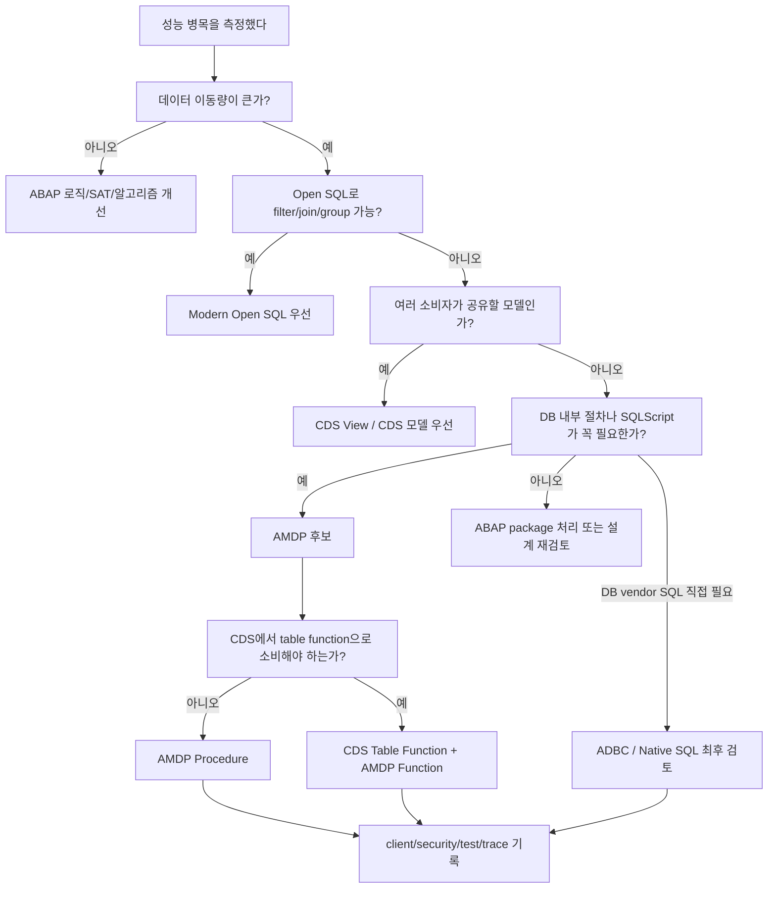
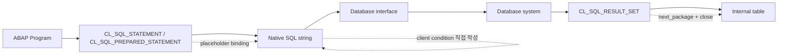

# NEWCH36_OLDCH33_REWRITE - AMDP / ADBC / Pushdown

> 기준 자료: `content/abap/CH33`, `reference/codex_0625_v2/CH33_REWRITE.md`, `reference/codex_0629_v3/00_CONCEPT_GAP_AUDIT.md`, `.project-docs/11_KEYWORD_AUDIT.md`
> 재집필 목표: 성능을 위해 DB 가까이 내려가는 수단을 배우되, 강한 기술을 남용하지 않고 `Open SQL/CDS 우선 -> AMDP 제한 사용 -> ADBC 최후 사용 -> 운영 리스크 문서화` 순서로 판단하게 만든다.
> 신규 보강: 원본 CH33의 5개 레슨에 더해 `CDS Table Function / AMDP Function`을 NEWCH36-L06으로 추가한다. CH33 이후 AMDP 계열을 본격 설명하는 장이 없기 때문에 `BY DATABASE FUNCTION`, `FOR TABLE FUNCTION`, `DEFINE TABLE FUNCTION`의 존재와 경계를 이 장에서 닫는다.

## NEWCH36 전체 강의 지도

CH32에서 학습자는 성능을 느낌으로 고치지 않고 `ST05`, `SAT`, `SQLM/SWLT`로 측정하는 법을 배웠다. 또한 SELECT-in-LOOP 제거, `GROUP BY`, aggregate, package 처리, 병렬 처리 판단을 통해 "DB 왕복과 데이터 이동량이 성능을 크게 좌우한다"는 감각을 얻었다.

CH33의 역할은 그 다음 단계다. 이미 배운 Open SQL과 CDS로 충분한 일은 거기서 끝내고, 그래도 DB 내부 절차 로직이나 HANA SQLScript가 필요할 때 AMDP를 검토한다. 그리고 Open SQL/CDS/AMDP로도 표현하기 어려운 DB 고유 SQL이 불가피할 때만 ADBC/Native SQL을 검토한다.

이 장의 전체 판단 순서는 다음과 같다.



초보자가 가장 조심해야 할 오해는 "DB에 가까울수록 무조건 고급이고 빠르다"는 생각이다. 실제 기준은 반대에 가깝다. 가장 단순하고 플랫폼이 보호해 주는 수단부터 검토하고, 더 강한 수단으로 내려갈수록 개발자가 직접 책임지는 영역이 늘어난다고 봐야 한다.

| 수단 | 먼저 떠올릴 상황 | 플랫폼이 보호해 주는 정도 | 개발자가 직접 책임지는 것 |
| --- | --- | --- | --- |
| Modern Open SQL | filter, join, aggregate, expression으로 충분 | 높음 | SQL 설계, index/row count, 측정 |
| CDS View | 여러 프로그램/RAP/OData/Fiori가 같은 의미 모델을 공유 | 높음 | view 계층, annotation, authorization |
| AMDP Procedure | DB 안에서 여러 단계의 SQLScript 절차가 필요 | 중간 | SQLScript, client, `USING`, 보안, 테스트 |
| CDS Table Function + AMDP Function | CDS 소비자가 필요한 tabular DB function | 중간 | CDS DDL + AMDP function 연결, client-safe |
| ADBC / Native SQL | DB 고유 SQL을 직접 보내야 함 | 낮음 | client, injection, type mapping, 예외, 이식성 |

## 공식문서 수동 확인 근거

Classic ABAP와 표준 문법/API는 `C:\ABAP_DOCU_HTML`에서 직접 확인했다.

| 범위 | 확인 파일 | 이 장에서 반영한 기준 |
| --- | --- | --- |
| AMDP 구현 구문 | `C:\ABAP_DOCU_HTML\abapmethod_by_db_proc.htm` | `METHOD ... BY DATABASE PROCEDURE|FUNCTION FOR HDB LANGUAGE SQLSCRIPT [OPTIONS] [USING]` 구조 |
| AMDP 선언 옵션 | `C:\ABAP_DOCU_HTML\abapmethods_amdp_options.htm` | `[CLASS-]METHODS ... AMDP OPTIONS READ-ONLY`, 읽기 전용 제약, Cloud에서 `READ-ONLY` 필요 |
| AMDP 개요 | `C:\ABAP_DOCU_HTML\abenabap_managed_db_objects_amdp.htm` | AMDP는 database procedure/function을 ABAP class framework로 관리 |
| AMDP와 ABAP SQL 비교 | `C:\ABAP_DOCU_HTML\abenamdp_vs_abap_sql_abexa.htm` | 단순 SQL을 AMDP로 옮기는 것만으로 자동 이점이 생기지 않음 |
| ADBC 개요 | `C:\ABAP_DOCU_HTML\abenadbc.htm` | Native SQL interface용 class-based API, 신규 Native SQL은 ADBC 권장 |
| `CL_SQL_STATEMENT` | `C:\ABAP_DOCU_HTML\abencl_sql_statement.htm` | 단일 SQL statement 실행, transaction control statement 주의 |
| ADBC query/result set | `C:\ABAP_DOCU_HTML\abenadbc_query.htm` | `EXECUTE_QUERY`, `CL_SQL_RESULT_SET`, `SET_PARAM_TABLE`, `NEXT_PACKAGE`, `CLOSE` |
| ADBC 예외 | `C:\ABAP_DOCU_HTML\abencx_sql_exception.htm` | `CX_SQL_EXCEPTION`, SQL code/message 등 운영 로그 기준 |
| Embedded Native SQL | `C:\ABAP_DOCU_HTML\abapexec.htm` | `EXEC SQL ... ENDEXEC`는 지원되나 새 프로그램은 ADBC 중심 |
| Native SQL 접근 위험 | `C:\ABAP_DOCU_HTML\abenabap_managed_db_objects_nsql.htm` | implicit client handling 없음, table buffering/CDS access control/where-used 약함 |
| Client handling | `C:\ABAP_DOCU_HTML\abenabap_sql_client_handling.htm` | ABAP SQL은 implicit client handling, AMDP/Native SQL은 current client 직접 고려 |
| CDS table function | `C:\ABAP_DOCU_HTML\abapclass-methods_for_tabfunc.htm`, `abencds_f1_define_table_function.htm` | `CLASS-METHODS ... FOR TABLE FUNCTION`, `DEFINE TABLE FUNCTION`, `implemented by method` |

ABAP Cloud와 Clean Core 경계는 `C:\ABAP_DOCU_DOWNLOAD\ABAP_DOCU`에서 직접 확인했다.

| 범위 | 확인 파일 | 이 장에서 반영한 기준 |
| --- | --- | --- |
| ABAP Cloud | `abap-docs-main\docs\cloud\md\ABENABAP_CLOUD_GLOSRY.md` | ABAP Cloud는 restricted language version과 released API 기반 |
| Released API | `ABENRELEASED_API_GLOSRY.md` | release contract와 restricted language visibility가 Cloud-ready 판단의 핵심 |
| AMDP client safety | `ABENAMDP_CLIENT_SAFETY.md` | AMDP framework는 implicit client condition을 넣지 않으며 `USING` list와 client-safe object 확인 필요 |
| AMDP SQL injection | `ABENSQL_INJ_AMDP_SCRTY.md` | SQLScript dynamic part와 외부 입력 결합은 개발자 책임 |
| AMDP glossary | `ABENAMDP_GLOSSARY.md`, `ABENAMDP_METHODS.md` | AMDP procedure/function, table function/scalar function 구분 |
| CDS table function | `ABENCDS_F1_DEFINE_TABLE_FUNCTION.md`, `ABAPCLASS-METHODS_FOR_TABFUNC.md` | CDS table function은 AMDP function implementation으로 구현되고 ABAP SQL data source로 사용 |
| Native SQL glossary | `ABENNATIVE_SQL_GLOSRY.md` | Native SQL은 DB-specific SQL이며 ADBC 또는 `EXEC SQL`로 전달 |
| SQLScript glossary | `ABENSQL_SCRIPT_GLOSRY.md` | SQLScript는 HANA procedure/function용 script language |

## R15 / Classic-first 경계

이 장은 Track 2 후반이다. 따라서 아래 선행 지식은 이미 배운 것으로 사용할 수 있다.

| 선행 장 | 이 장에서 사용하는 방식 |
| --- | --- |
| CH18 New Syntax | inline declaration, `NEW`, `REF #( )`, `VALUE #( )`, expression 독해 |
| CH19 Modern ABAP SQL | host variable `@`, aggregate, `GROUP BY`, SQL expression, Open SQL 우선 판단 |
| CH20 OO ABAP | global class, static method, interface, exception class |
| CH22 CDS | CDS View Entity와 재사용 모델 개념 |
| CH23 RAP/ABAP Cloud | Cloud/released API/RAP 우선 경계 |
| CH32 성능 분석 | ST05/SAT/SQLM 측정 후 pushdown 필요성 판단 |

SQLScript 자체를 깊게 가르치는 장은 아니다. 이 장에서 SQLScript는 AMDP 예제를 읽기 위한 최소 문법만 다룬다. HANA Calculation View, PlanViz 심화, optimizer hint 남발, SQLScript 고급 procedure 설계는 별도 실무 심화 범위다.

## NEWCH36-L01 - DB Pushdown 판단 기준

### 왜 필요한가

성능 분석에서 "느리다"는 말은 너무 넓다. DB가 정말 오래 계산해서 느릴 수도 있고, DB는 빨리 결과를 만들었지만 ABAP 서버로 너무 많은 데이터를 가져와서 느릴 수도 있다. CH32에서 ST05를 보면 SQL 시간뿐 아니라 records, execution count, 반복 SQL을 본 이유가 바로 이것이다.

예를 들어 예매 100만 건에서 공연별 총 좌석 수를 구한다고 하자. 모든 예매 row를 ABAP internal table로 가져와서 `LOOP AT lt_booking`으로 합산하면 DB에서 ABAP 서버로 100만 행이 이동한다. 반대로 DB에서 `GROUP BY concert_id`와 `SUM( seats )`를 수행하고 결과 50행만 받으면 전송량과 ABAP memory가 크게 줄어든다.

이것이 Code-to-Data의 출발점이다. 데이터를 코드 쪽으로 끌어오는 것이 아니라, 계산을 데이터가 있는 곳으로 내려보낸다. 그러나 "내려보낸다"가 곧바로 AMDP나 Native SQL을 뜻하지는 않는다. 먼저 Open SQL과 CDS로 충분한지 확인해야 한다.

### 무엇인가

Code Pushdown은 계산 위치를 ABAP application server에서 database 쪽으로 옮기는 설계 방향이다. 목적은 기술 이름을 바꾸는 것이 아니라 데이터 이동량, DB 왕복, ABAP memory 사용량을 줄이는 것이다.

초보자는 다음 순서를 암기보다 판단 기준으로 익혀야 한다.

| 순서 | 수단 | 대표 상황 | 좋은 이유 | 대가 |
| --- | --- | --- | --- | --- |
| 1 | Modern Open SQL | 집계, filter, join, SQL expression | 가장 단순하고 문법 검사/이식성 좋음 | 복잡 절차 로직은 제한 |
| 2 | CDS View | 여러 소비자가 같은 데이터 모델 사용 | 의미, 관계, annotation, RAP/OData 연결 | 모델 설계와 활성화 필요 |
| 3 | AMDP | DB 내부 절차, SQLScript, 중간 결과 조합 | DB 안에서 복잡 계산 수행 | HANA/SQLScript 종속, 테스트 부담 |
| 4 | CDS Table Function | CDS에서 tabular DB function을 data source로 사용 | CDS 계층에서 AMDP function 결과 소비 | client-safe/CDS DDL/AMDP 연결 복잡 |
| 5 | ADBC / Native SQL | DB 고유 SQL 직접 실행 필요 | 플랫폼 기능 직접 사용 | client, injection, 이식성, 예외 책임 큼 |

따라서 질문은 "AMDP를 쓸까?"가 아니다. 질문은 "Open SQL로 충분한가?", "공유 모델이면 CDS가 맞는가?", "정말 SQLScript 절차 로직이 필요한가?", "Native SQL을 직접 보낼 만큼 불가피한가?" 순서로 좁혀야 한다.

### 어떻게 확인하는가

첫 번째 확인은 데이터 이동량이다. ST05에서 읽은 row 수와 실제 업무 결과 row 수를 비교한다. 업무 결과는 50행인데 DB에서 100만 행을 읽어 ABAP으로 넘긴다면 pushdown 후보다.

두 번째 확인은 계산 형태다. `WHERE`, `JOIN`, `GROUP BY`, `SUM`, `COUNT`, `CASE`, SQL expression 정도로 표현되면 Modern Open SQL이 1순위다. CH19 이후라 이 문법은 이미 학습 범위 안에 있다.

세 번째 확인은 재사용성이다. 같은 계산이 리포트, Gateway, RAP projection, Fiori Elements, 배치에서 반복되면 CDS View로 올릴 후보다. CDS는 단순 SELECT 복사본이 아니라 의미 모델을 남기는 방법이다.

네 번째 확인은 절차 로직이다. DB 내부에서 여러 단계의 중간 결과를 만들고, 그 결과를 다시 join하며, SQLScript function/procedure가 필요한 경우 AMDP 후보가 된다. 단순 집계를 AMDP로 감싸는 것은 보통 과하다.

다섯 번째 확인은 DB 고유 기능 여부다. Open SQL/CDS/AMDP로 표현할 수 없는 DB vendor 기능을 직접 호출해야 한다면 ADBC 후보가 될 수 있다. 이때는 "기술적으로 가능하다"와 "운영에 배포해도 된다"를 분리해야 한다.

### 실수와 주의

가장 흔한 실수는 성능 문제가 나오면 AMDP부터 만드는 것이다. AMDP는 Open SQL의 상위 호환이 아니다. 단순 집계, filter, join은 Open SQL이 더 읽기 쉽고 이식성도 좋다.

두 번째 실수는 pushdown을 "ABAP 코드를 DB로 모두 옮기는 것"으로 이해하는 것이다. 검증, 권한, 메시지, 재처리 로그, transaction 경계처럼 업무 통제가 필요한 부분은 ABAP 계층에 남겨야 한다.

세 번째 실수는 측정 없이 판단하는 것이다. pushdown 전후에는 입력 건수, DB에서 읽은 records, ABAP 서버로 넘어온 결과 건수, runtime, memory 변화를 기록해야 한다.

네 번째 실수는 Cloud/Clean Core 경계를 잊는 것이다. ABAP Cloud에서는 restricted language version과 released API가 기준이다. DB 종속 코드를 늘리는 것이 Clean Core가 아니다. RAP/CDS/released API를 우선하고, AMDP/ADBC는 제한 사용 이유가 있어야 한다.

### 체험형 학습 설계

기존 체험물 `CH33-L01-S01`은 "Code Pushdown - 끌어오기 vs 내려보내기" 시뮬레이터로 둔다.

| 요소 | 설계 |
| --- | --- |
| 버튼 | `끌어오기(Data-to-Code)`, `내려보내기(Code-to-Data)`, `Open SQL로 해결`, `CDS 모델로 해결`, `AMDP 검토` |
| 상태 | `Raw rows moved`, `Aggregated in DB`, `Reusable model`, `Procedure logic needed`, `Overengineering warning` |
| 데이터 | `zbooking` 1,000,000행, 공연별 결과 50행, 전송 row 수, 예상 memory |
| 피드백 | "빠른 이유는 AMDP라는 이름이 아니라 이동 row 수가 줄었기 때문입니다" |

학습자는 먼저 `끌어오기`를 눌러 DB에서 ABAP으로 원본 행이 이동하는 모습을 본다. 다음으로 `내려보내기`를 누르면 DB 안에서 집계가 끝나고 결과 행만 이동한다. 마지막으로 상황 카드가 나온다. `단순 공연별 합계`는 Open SQL, `여러 화면에서 공유`는 CDS, `여러 단계 임시 결과`는 AMDP, `DB vendor 함수 직접 호출`은 ADBC로 연결한다.

### 정리

Pushdown은 DB에 가까운 기술을 자랑하는 일이 아니다. 불필요한 데이터 이동을 줄이는 일이다. 먼저 Open SQL과 CDS로 해결하고, SQLScript 절차 로직이 필요할 때 AMDP를 검토한다. Native SQL은 최후의 수단이다.

## NEWCH36-L02 - AMDP 기본 구조

### 왜 필요한가

Open SQL과 CDS로 대부분의 pushdown을 해결할 수 있지만, 실무에는 DB 내부 절차가 필요한 경우가 있다. 예를 들어 여러 단계의 중간 결과를 만들고, 중간 결과별로 다시 집계하고, 특정 HANA SQLScript function을 써야 한다면 모든 데이터를 ABAP으로 끌어오는 구조가 비효율적일 수 있다.

AMDP는 이런 경우에 database procedure/function을 ABAP class method처럼 관리하게 해 준다. ABAP 개발자는 class와 method를 활성화하고 호출하지만, 구현부는 HANA SQLScript로 database에서 실행된다. 그래서 AMDP를 배울 때 첫 목표는 SQLScript 전문가가 되는 것이 아니라 "ABAP 메서드와 DB 실행부가 어디서 갈라지는지"를 읽는 것이다.

### 무엇인가

AMDP는 ABAP Managed Database Procedure의 약어다. 공식 문서 기준으로 AMDP는 stored/database procedure 또는 database function을 class-based framework로 관리하고 호출하는 수단이다. HANA용 AMDP class는 `IF_AMDP_MARKER_HDB` tag interface를 포함하고, 구현부는 `METHOD ... BY DATABASE PROCEDURE FOR HDB LANGUAGE SQLSCRIPT ... USING ...` 형태가 된다.

최소 구조는 다음 네 부분으로 읽는다.

| 코드 조각 | 의미 | 확인 포인트 |
| --- | --- | --- |
| `INTERFACES if_amdp_marker_hdb` | 이 class가 HANA AMDP class임을 표시 | global class, tag interface |
| `AMDP OPTIONS READ-ONLY` | method 선언에서 AMDP 속성 표시 | 읽기 전용 제약, Cloud에서 중요 |
| `BY DATABASE PROCEDURE FOR HDB LANGUAGE SQLSCRIPT` | 구현부가 HANA SQLScript로 DB에서 실행 | ABAP statement가 아님 |
| `USING zbooking` | SQLScript에서 접근하는 ABAP-managed DB object 선언 | dependency, where-used, package check |

예시는 구조를 읽기 위한 교육용이다. 단순 집계라면 실제 실무에서는 먼저 Open SQL을 검토해야 한다.

```abap
CLASS zcl_booking_amdp DEFINITION
  PUBLIC
  FINAL
  CREATE PUBLIC.

  PUBLIC SECTION.
    INTERFACES if_amdp_marker_hdb.

    TYPES:
      BEGIN OF ty_stat,
        mandt         TYPE mandt,
        concert_id    TYPE zconcert-concert_id,
        booking_count TYPE i,
        total_seats   TYPE i,
      END OF ty_stat,
      tt_stat TYPE STANDARD TABLE OF ty_stat WITH EMPTY KEY.

    CLASS-METHODS get_stats
      IMPORTING
        VALUE(iv_client)  TYPE mandt
        VALUE(iv_concert) TYPE zconcert-concert_id
      EXPORTING
        VALUE(et_stats)   TYPE tt_stat
      AMDP OPTIONS READ-ONLY.
ENDCLASS.

CLASS zcl_booking_amdp IMPLEMENTATION.
  METHOD get_stats BY DATABASE PROCEDURE FOR HDB
                   LANGUAGE SQLSCRIPT
                   OPTIONS READ-ONLY
                   USING zbooking.

    et_stats =
      SELECT mandt,
             concert_id,
             COUNT(*) AS booking_count,
             SUM( seats ) AS total_seats
        FROM zbooking
       WHERE mandt = :iv_client
         AND concert_id = :iv_concert
       GROUP BY mandt, concert_id;

  ENDMETHOD.
ENDCLASS.
```

초보자가 특히 주의할 차이는 host variable 표기다. ABAP SQL에서는 `@iv_concert`처럼 `@`를 썼지만, SQLScript 안에서는 입력 파라미터를 `:iv_concert`처럼 콜론으로 참조한다. 또한 AMDP 구현부 안에는 ABAP의 `DATA`, `LOOP`, `READ TABLE`을 그대로 섞을 수 없다. 구현부는 SQLScript다.

`READ-ONLY`는 "무조건 빨라지는 옵션"이 아니다. 공식 문서의 핵심은 database table 읽기만 허용한다는 제약이다. 다른 AMDP를 호출할 때도 읽기 전용으로 표시된 대상만 호출할 수 있다. ABAP Cloud에서는 `READ-ONLY` 지정이 특히 중요하다.

### 어떻게 확인하는가

첫 번째 확인은 class 위치와 tag interface다. AMDP method는 global class 맥락에서 다룬다. HANA AMDP class에는 `IF_AMDP_MARKER_HDB`가 있어야 한다.

두 번째 확인은 선언부와 구현부의 일치다. `IMPORTING`, `EXPORTING`, `RETURNING`, table type이 선언부에 있고 SQLScript는 그 파라미터를 채워야 한다. 출력 table의 컬럼 이름과 type이 어긋나면 activation이나 runtime에서 문제가 생긴다.

세 번째 확인은 `USING` 목록이다. SQLScript에서 접근하는 ABAP-managed table, CDS entity, 다른 AMDP method는 `USING`에 올려야 한다. 공식 문서는 `USING`이 where-used list, package check, 정적 검사와 연결된다고 설명한다.

네 번째 확인은 client 처리다. AMDP는 ABAP SQL처럼 implicit client condition을 자동으로 넣지 않는다. client-dependent table을 직접 읽는다면 현재 client를 입력으로 받고 `WHERE mandt = :iv_client`처럼 제한한다. Cloud/client-safe AMDP는 `USING` list와 client option을 더 엄격히 확인해야 한다.

다섯 번째 확인은 성능 재측정이다. AMDP를 만들었다면 ST05, SAT, SQLM, DB trace, PlanViz 등 프로젝트에서 허용한 도구로 실제 데이터 이동량과 runtime이 줄었는지 확인한다. 단순 SQL을 AMDP로 옮겼는데 수치가 같다면 복잡도만 늘어난 것이다.

### 실수와 주의

가장 흔한 실수는 `USING` 누락이다. SQLScript에서 `zbooking`을 읽는데 `USING zbooking`이 없으면 AMDP framework가 의존성을 알 수 없다.

두 번째 실수는 `READ-ONLY`를 성능 옵션으로만 외우는 것이다. 먼저 기억할 의미는 "쓰기 금지"와 "읽기 전용 AMDP만 호출 가능"이다.

세 번째 실수는 client를 빠뜨리는 것이다. Open SQL에 익숙한 학습자는 현재 client 조건이 자동으로 들어간다고 생각하기 쉽다. AMDP에서는 current client를 직접 고려해야 한다.

네 번째 실수는 classic ABAP debugger 경험을 그대로 기대하는 것이다. AMDP 구현은 DB 쪽 SQLScript로 실행된다. ADT/DB 권한, SQLScript debugging, trace 도구 사용 가능 여부를 확인해야 한다.

다섯 번째 실수는 AMDP 안의 보안 책임을 ABAP 플랫폼이 전부 대신한다고 생각하는 것이다. SQLScript 내부의 dynamic SQL, 외부 입력 결합, 호출 procedure의 보안은 개발자 책임으로 남는다.

### 체험형 학습 설계

기존 체험물 `CH33-L02-S01`은 "AMDP 메서드 해부" 클릭형 위젯으로 둔다.

| 클릭 대상 | 피드백 |
| --- | --- |
| `if_amdp_marker_hdb` | HANA AMDP class임을 표시하는 tag interface |
| `AMDP OPTIONS READ-ONLY` | 선언부의 읽기 전용 속성. 쓰기 혼입을 막는 제약 |
| `BY DATABASE PROCEDURE FOR HDB` | ABAP method 호출처럼 보이지만 DB procedure로 실행 |
| `LANGUAGE SQLSCRIPT` | 구현부 언어가 ABAP이 아니라 SQLScript |
| `USING zbooking` | 사용 DB object를 정적으로 알리는 의존성 목록 |
| `:iv_concert` | SQLScript 안에서 ABAP 입력 파라미터를 참조하는 표기 |

확장 과제로는 오류 카드 4장을 둔다. `USING` 누락, `@iv_concert` 사용, `MANDT` 조건 누락, `READ-ONLY` 메서드 안의 `UPDATE`를 보여 주고 학습자가 activation 오류, client 위험, 쓰기 제약 위반, 표기법 오류로 분류하게 한다.

### 정리

AMDP는 database procedure/function을 ABAP class method 형태로 관리하는 수단이다. HANA AMDP class에는 `IF_AMDP_MARKER_HDB`가 필요하고, 구현부에는 `BY DATABASE PROCEDURE`, `LANGUAGE SQLSCRIPT`, `USING`, 필요한 경우 `OPTIONS READ-ONLY`가 등장한다. AMDP를 쓰기 전에는 Open SQL/CDS로 충분한지 먼저 증명해야 한다.

## NEWCH36-L03 - ADBC Native SQL

### 왜 필요한가

ADBC는 강력하지만 위험한 도구다. Open SQL과 CDS는 ABAP 플랫폼이 문법 검사, client handling, ABAP Dictionary type, CDS access control 같은 보호장치를 상당 부분 제공한다. 하지만 특정 DB vendor 기능을 직접 호출해야 하거나, Native SQL을 그대로 보내야 하는 상황에서는 이 보호장치가 줄어든다.

이때 쓰는 객체지향 API가 ADBC다. 과거의 `EXEC SQL ... ENDEXEC`처럼 Native SQL을 ABAP에서 사용할 수 있지만, 새 프로그램에서는 ADBC가 권장된다. 이 레슨의 목표는 ADBC 코드를 많이 쓰게 만드는 것이 아니라, ADBC가 등장했을 때 어떤 책임이 개발자에게 넘어오는지 읽게 만드는 것이다.

### 무엇인가

ADBC는 ABAP Database Connectivity의 약어이며, Native SQL interface에 접근하는 class-based API다. 대표 객체는 다음과 같다.

| 객체 | 역할 | 학습 포인트 |
| --- | --- | --- |
| `CL_SQL_STATEMENT` | SQL statement 실행 | 단일 SQL, query/update/procedure 호출 |
| `CL_SQL_PREPARED_STATEMENT` | placeholder와 반복 실행에 적합 | 외부 입력 binding, injection 방어 |
| `CL_SQL_RESULT_SET` | query 결과 읽기 | `SET_PARAM_TABLE`, `NEXT_PACKAGE`, `CLOSE` |
| `CL_SQL_CONNECTION` | DB connection과 transaction 관련 처리 | transaction control statement를 문자열로 보내지 않기 |
| `CX_SQL_EXCEPTION` | DB/ADBC 오류 | SQL code/message를 운영 로그로 남김 |

원본 예제처럼 외부 입력이 없는 단순 query는 구조를 읽기 쉽다.

```abap
TYPES:
  BEGIN OF ty_count,
    carrid TYPE sflight-carrid,
    count  TYPE i,
  END OF ty_count,
  tt_count TYPE STANDARD TABLE OF ty_count WITH EMPTY KEY.

DATA lt_result TYPE tt_count.

TRY.
    DATA(lo_sql) = NEW cl_sql_statement( ).

    DATA(lo_result_set) = lo_sql->execute_query(
      `SELECT carrid, COUNT(*) AS count FROM sflight GROUP BY carrid` ).

    lo_result_set->set_param_table( REF #( lt_result ) ).
    lo_result_set->next_package( ).
    lo_result_set->close( ).

  CATCH cx_sql_exception INTO DATA(lx_sql).
    " Persist lx_sql->sql_code and lx_sql->sql_message in the application log.
ENDTRY.
```

하지만 실제 운영에서 외부 입력이 들어가면 문자열 연결은 피해야 한다. 값은 placeholder와 binding으로 넘기고, column name이나 ORDER BY 방향처럼 placeholder로 처리할 수 없는 token은 허용 목록으로 제한한다.

```abap
" Conceptual ADBC pattern: bind values, do not concatenate user input.
DATA(lv_client) = sy-mandt.
DATA(lv_carrid) = CONV s_carr_id( 'LH' ).

TRY.
    DATA(lo_stmt) = NEW cl_sql_prepared_statement(
      `SELECT carrid, connid, fldate
         FROM sflight
        WHERE mandt = ?
          AND carrid = ?` ).

    lo_stmt->set_param( REF #( lv_client ) ).
    lo_stmt->set_param( REF #( lv_carrid ) ).

    DATA(lo_rs) = lo_stmt->execute_query( ).
    lo_rs->set_param_table( REF #( lt_flights ) ).
    lo_rs->next_package( ).
    lo_rs->close( ).

  CATCH cx_sql_exception INTO DATA(lx_adbc).
    " Log SQL code, SQL message, and business context.
ENDTRY.
```

위 예제는 원칙을 보여 주기 위한 패턴이다. 실제 시스템 release별 ADBC method signature와 result type은 ADT F2 도움말과 로컬 ABAP 문서로 확인해야 한다.

### 어떻게 확인하는가

첫 번째 확인은 ADBC가 필요한 이유다. Open SQL, CDS, AMDP로 가능한 일을 ADBC로 직접 보내면 유지보수와 보안 비용만 커진다.

두 번째 확인은 client 조건이다. Native SQL과 ADBC는 implicit client handling을 제공하지 않는다. client-dependent table을 읽는다면 `MANDT` 조건을 명시하고 current client 값을 binding해야 한다.

세 번째 확인은 placeholder와 binding이다. 사용자 입력을 SQL 문자열에 이어 붙이면 SQL injection 위험이 생긴다. operand value는 `?` placeholder와 `set_param` 계열 binding으로 처리한다.

네 번째 확인은 result set 종료다. `CL_SQL_RESULT_SET`으로 결과를 읽은 뒤 `close( )`를 호출하는 습관이 필요하다. 대량 결과는 한 번에 모두 읽지 말고 package 단위로 읽을지 검토한다.

다섯 번째 확인은 예외와 로그다. `CX_SQL_EXCEPTION`은 단순 "DB 오류"가 아니다. SQL code, SQL message, DB object 존재 여부, duplicate key 등 원인 분석 정보를 운영 로그에 남겨야 한다.

### 실수와 주의

가장 위험한 실수는 SQL 문자열 연결이다. `WHERE carrid = '`와 사용자 입력을 이어 붙이면 SQL injection이 가능하다.

두 번째 실수는 client 누락이다. ADBC는 현재 client를 자동으로 붙여 주지 않는다. client 100에서 실행했는데 client 000 데이터까지 읽는 사고는 운영에서 치명적이다.

세 번째 실수는 CDS access control과 table buffering을 기대하는 것이다. Native SQL은 table buffering을 우회하고 CDS access control, association, CDS 의미 계층을 그대로 적용하지 않는다.

네 번째 실수는 새 코드에 `EXEC SQL`을 기본 방식으로 쓰는 것이다. 공식 문서는 static embedded Native SQL을 계속 지원하지만, 새 기능과 개선은 ADBC 중심이며 새 프로그램에서는 ADBC를 권장한다.

다섯 번째 실수는 transaction control statement를 `CL_SQL_STATEMENT` 문자열로 보내는 것이다. `COMMIT`, `ROLLBACK` 같은 transaction control은 `CL_SQL_CONNECTION`과 SAP LUW/DB LUW 경계를 확인해야 한다.

### 체험형 학습 설계

기존 체험물 `CH33-L03-S01`은 ADBC Native SQL 호출 경로 흐름도로 둔다.



추가 카드형 시뮬레이터를 설계한다.

| 카드 | 학습자 판정 | 피드백 |
| --- | --- | --- |
| 문자열 연결로 `WHERE carrid = '...'` 구성 | 위험 | SQL injection 가능 |
| `?` placeholder와 `set_param` 사용 | 적절 | operand value binding |
| `MANDT` 조건 없음 | 위험 | implicit client handling 없음 |
| result set `close( )` 없음 | 주의 | resource 정리 누락 |
| `CATCH cx_sql_exception`에서 메시지 삭제 | 위험 | 운영 원인 추적 불가 |

### 정리

ADBC는 Native SQL을 직접 실행하는 객체지향 API다. 하지만 Open SQL/CDS가 제공하던 보호장치 일부를 벗어난다. client 조건, placeholder/binding, result set close, `CX_SQL_EXCEPTION` 로그, DB 종속성 문서화를 직접 책임질 수 있을 때만 제한적으로 사용한다.

## NEWCH36-L04 - AMDP와 CDS / Open SQL 비교

### 왜 필요한가

이제 학습자는 Open SQL, CDS, AMDP, ADBC라는 네 이름을 모두 안다. 하지만 실무에서 중요한 능력은 이름을 아는 것이 아니라 상황을 보고 가장 단순하고 안전한 수단을 고르는 것이다.

강한 수단은 문제를 해결할 수 있지만 동시에 새로운 문제도 만든다. AMDP는 SQLScript, client, activation, debugging, 테스트 부담을 만든다. ADBC는 injection, client, type mapping, DB 종속성 책임을 만든다. 단순 집계를 AMDP/ADBC로 만들면 기술적으로는 돌아갈 수 있어도 좋은 설계가 아니다.

### 무엇인가

네 수단의 자리는 다음처럼 나눈다.

| 질문 | Open SQL | CDS View | AMDP | ADBC |
| --- | --- | --- | --- | --- |
| 단순 filter/join/group인가 | 1순위 | 공유 모델이면 후보 | 보통 과함 | 보통 부적절 |
| 여러 소비자가 재사용하는가 | 가능 | 1순위 | 일부 계산 보조 | 부적합 |
| SQLScript 절차가 꼭 필요한가 | 부족할 수 있음 | table function과 연결 가능 | 후보 | 보통 과함 |
| DB vendor SQL을 직접 써야 하는가 | 불가 | 불가/제한 | 일부 가능 | 후보 |
| Cloud/Clean Core 친화성 | 높음 | 높음 | 조건부 | 낮음/제한 큼 |
| 리뷰/테스트 난이도 | 낮음 | 중간 | 높음 | 매우 높음 |

이 표는 속도 순위가 아니다. 책임 순위다. 위쪽 수단은 플랫폼이 많이 보호해 주고, 아래쪽 수단은 개발자가 더 많은 것을 직접 책임진다.

### 어떻게 확인하는가

첫 번째 확인은 "Open SQL 한 문장으로 되는가"다. `SELECT FROM ... FIELDS ... WHERE ... GROUP BY ... INTO TABLE @DATA(...)`로 충분하다면 Open SQL이 정답에 가깝다.

두 번째 확인은 "공유 모델인가"다. 같은 join과 계산이 여러 앱에서 반복되면 CDS View가 좋다. CDS는 단순 SQL 저장소가 아니라 의미, annotation, access control, RAP/OData 연결까지 이어지는 모델이다.

세 번째 확인은 "DB 내부 절차가 필요한가"다. 여러 중간 결과, SQLScript-only function, 복잡한 DB-side 절차가 필요하면 AMDP 후보가 된다.

네 번째 확인은 "CDS 소비자가 필요한가"다. 복잡 계산 결과를 CDS entity처럼 `SELECT FROM ztf_...`로 소비하거나 다른 CDS view에서 data source로 써야 한다면 CDS Table Function + AMDP Function 후보가 된다.

다섯 번째 확인은 "DB 고유 기능이 불가피한가"다. Open SQL/CDS/AMDP로 표현하기 어렵고 DB vendor 기능을 직접 써야 한다면 ADBC 후보다. 이 경우 설계 문서에 DB 종속 이유, 대체안, client 처리, injection 방어, 예외 처리, 테스트 범위를 남겨야 한다.

### 실수와 주의

가장 흔한 실수는 "AMDP가 제일 빠르다"라는 서열을 만드는 것이다. AMDP는 빠른 이름이 아니라 다른 실행 위치와 책임을 가진 도구다.

두 번째 실수는 CDS를 단순 view로만 보는 것이다. CDS는 재사용, 의미, annotation, access control, RAP/OData 연결과 함께 판단한다.

세 번째 실수는 ADBC를 AMDP 대체재로 쓰는 것이다. AMDP는 ABAP-managed database procedure/function이고, ADBC는 Native SQL을 직접 보내는 API다. 관리 방식과 검증 책임이 다르다.

네 번째 실수는 운영팀과 리뷰어가 이해할 수 없는 DB 종속 코드를 숨기는 것이다. AMDP/ADBC를 썼다면 왜 Open SQL/CDS가 안 되는지, 어떤 trace로 효과를 확인했는지, 어떤 DB 기능에 종속되는지 기록해야 한다.

### 체험형 학습 설계

기존 체험물 `CH33-L04-S01`은 비교 매트릭스로 둔다.

| 상황 카드 | 추천 | 피드백 |
| --- | --- | --- |
| 공연별 좌석 합계 | Open SQL | `GROUP BY`/`SUM`으로 충분 |
| 예매 요약을 RAP/Fiori와 배치가 함께 사용 | CDS View | 의미 모델과 재사용성 |
| DB 안에서 중간 결과를 여러 번 조합 | AMDP | SQLScript 절차 로직 필요 |
| CDS view에서 tabular DB function 결과를 data source로 사용 | CDS Table Function | AMDP Function과 CDS DDL 연결 |
| HANA 고유 SQL을 직접 실행 | ADBC | 최후 수단, client/security 문서화 |
| Cloud 전환 예정 핵심 로직 | Open SQL/CDS/RAP 우선 | DB 종속 코드는 승인 필요 |

매트릭스는 행 클릭뿐 아니라 `단순 집계`, `공유 모델`, `절차 로직`, `CDS table function`, `DB 고유 기능`, `Cloud 전환` 버튼을 둔다. 버튼을 누르면 추천 수단이 강조되고, 더 강한 수단을 쓰면 왜 과한지 설명한다.

### 정리

Open SQL, CDS, AMDP, ADBC는 강약 순서가 아니라 적합성과 책임의 순서로 본다. Open SQL은 대부분의 집계와 join의 1순위다. CDS는 재사용 모델에 강하다. AMDP는 SQLScript 절차 로직이 DB 안에서 필요할 때 쓰고, ADBC는 DB 고유 Native SQL이 불가피한 최후 수단이다.

## NEWCH36-L05 - 운영 리스크와 DB 종속성

### 왜 필요한가

성능 개선은 개발 서버에서 빨라 보이는 것으로 끝나지 않는다. 운영에서 client가 섞이거나, 권한이 없거나, DB upgrade 후 Native SQL이 깨지거나, 보안 리뷰에서 SQL injection 위험이 발견되면 성능 개선이 아니라 장애 원인이 된다.

AMDP와 ADBC는 빠른 길을 열어 주지만 보호막 일부를 벗어난다. 그래서 이 레슨은 "어떻게 쓰는가"보다 "쓴 뒤 무엇을 책임지는가"를 다룬다.

### 무엇인가

AMDP/ADBC 운영 리스크는 다섯 축으로 나눌 수 있다.

| 리스크 | AMDP | ADBC / Native SQL | 확인 기준 |
| --- | --- | --- | --- |
| DB 종속성 | HANA SQLScript 종속 | DB vendor SQL 직접 종속 | DB 전환/Cloud 전환 영향 기록 |
| Client safety | implicit client handling 없음, client-safe object 필요 | `MANDT` 조건 직접 필요 | current client만 접근하는지 확인 |
| 보안 | dynamic SQLScript injection 위험 | 문자열 SQL injection 위험 | placeholder, validation, code review |
| 플랫폼 보호 | ABAP-managed이나 SQLScript 내용 책임은 개발자 | ABAP SQL 보호장치 약함 | access control, buffering, where-used 영향 |
| 테스트/디버깅 | ADT/DB 도구 필요, ABAP Unit 한계 | DB 오류와 vendor message 처리 필요 | trace, exception log, 대표 데이터 테스트 |

Clean Core 관점에서 중요한 점은 "DB로 내리면 깨끗하다"가 아니라는 것이다. Clean Core는 released API, 안정적 확장 지점, 업그레이드 안정성을 지키자는 방향이다. DB 종속 코드는 오히려 더 엄격한 설명과 승인 근거가 필요하다.

### 어떻게 확인하는가

첫 번째 확인은 사용 이유 문서화다. class 주석이나 설계 문서에 "Open SQL/CDS로 안 되는 이유", "DB 기능에 종속되는 이유", "대상 DB", "fallback 가능성", "측정 결과"를 남긴다.

두 번째 확인은 client-safety다. AMDP는 `USING` list가 client-safe object로 구성되는지, 필요한 client option이 있는지 확인한다. ADBC는 `WHERE mandt = ?`와 binding을 확인한다.

세 번째 확인은 SQL injection 방어다. AMDP SQLScript에서 dynamic `EXEC`나 `APPLY_FILTER` 같은 동적 구성이 외부 입력과 결합하면 검증이 필요하다. ADBC에서는 operand 값은 placeholder로 넘기고, placeholder로 처리할 수 없는 동적 token은 허용 목록으로 제한한다.

네 번째 확인은 운영 관찰성이다. `CX_SQL_EXCEPTION`의 SQL code/message, DB object, 입력 업무 키, 실행 사용자, client, 실행 시간, trace id를 로그로 남긴다.

다섯 번째 확인은 재측정과 회귀 테스트다. 성능 개선 수단이라면 수정 전후 ST05/SAT/SQLM 또는 DB trace 수치를 남긴다. 기능 결과는 Open SQL/CDS 기준 결과와 비교한다.

### 실수와 주의

가장 큰 실수는 "DB에 내려가면 Clean Core가 된다"는 오해다. DB 종속 코드는 Clean Core 검토를 더 필요로 한다.

두 번째 실수는 table buffering과 CDS access control을 잊는 것이다. Native SQL은 table buffer와 CDS access control을 기대한 대로 적용하지 않는다.

세 번째 실수는 동적 SQL을 테스트 없이 배포하는 것이다. AMDP 보안 문서는 AMDP implementation의 내용과 보안이 ABAP test tool로 자동 보장되지 않는다고 설명한다.

네 번째 실수는 오류를 단순 메시지로 삼키는 것이다. ADBC 오류는 운영 로그에 원인 정보를 남겨야 재처리할 수 있다.

다섯 번째 실수는 DB 종속 부분을 업무 코드 여기저기에 흩어 놓는 것이다. AMDP/ADBC는 별도 class나 adapter로 격리하고, 호출부는 가능한 interface 뒤에 숨긴다.

### 체험형 학습 설계

기존 체험물 `CH33-L05-S01`은 적절성 판별 퀴즈로 둔다.

| 문항 | 정답 방향 | 이유 |
| --- | --- | --- |
| Open SQL `GROUP BY`로 충분한 집계를 AMDP로 작성 | 부적절 | 복잡도만 증가 |
| 복잡 SQLScript 절차가 필요하고 측정 근거가 있음 | 조건부 적절 | client/security/test 필요 |
| DB 이전 예정 시스템에서 Native SQL 남발 | 부적절 | 이식성 위험 |
| AMDP/ADBC를 별도 class에 격리하고 사유 기록 | 적절 | 운영 리스크 관리 |
| ADBC에서 문자열 연결로 외부 입력 사용 | 부적절 | SQL injection |
| client-dependent table을 ADBC로 읽으며 `MANDT` 없음 | 부적절 | client 혼입 위험 |

확장 위젯으로 `운영 승인 체크리스트`를 둔다. 학습자가 AMDP 또는 ADBC를 선택하면 아래 항목이 펼쳐진다.

| 체크 항목 | 완료 전 상태 | 완료 후 상태 |
| --- | --- | --- |
| Open SQL/CDS 대안 검토 | `검토 필요` | `대안 부족 근거 있음` |
| client 처리 | `client 위험` | `current client 제한 확인` |
| injection 방어 | `보안 위험` | `placeholder/validation 확인` |
| trace 수치 | `성능 근거 없음` | `before/after 기록` |
| 예외 로그 | `운영 추적 불가` | `SQL code/message 로그` |
| Cloud/released API | `전환 위험` | `프로젝트 기준 확인` |
| DB 종속 사유 | `숨은 종속성` | `문서화 완료` |

### 정리

AMDP와 ADBC는 빠른 길이지만 책임이 커지는 길이다. client, 보안, DB 종속성, debugging, 테스트, 운영 로그를 직접 챙길 수 있을 때만 제한적으로 사용한다. 이 장의 결론은 단순하다. 먼저 Open SQL과 CDS로 해결하고, 강한 수단은 이유와 측정과 운영 통제가 있을 때만 쓴다.

## NEWCH36-L06 - CDS Table Function과 AMDP Function 경계

### 왜 필요한가

원본 CH33은 AMDP procedure와 ADBC를 설명하지만, AMDP function과 CDS table function의 연결은 따로 다루지 않는다. 그러나 공식 문서 기준으로 AMDP method에는 `BY DATABASE PROCEDURE`뿐 아니라 `BY DATABASE FUNCTION`도 있고, CDS table function은 AMDP function implementation으로 구현된다.

이 장 이후에 AMDP 계열을 본격 설명하는 챕터가 없다면, 학습자는 "AMDP는 class method 안에 SQLScript를 쓰는 procedure"까지만 알고 끝날 수 있다. 그러면 CDS에서 tabular DB function 결과를 data source로 쓰는 구조를 만났을 때 길을 잃는다. 따라서 이 레슨은 전체 실습을 깊게 만들지는 않더라도, 이름과 구조와 경계를 반드시 소개한다.

### 무엇인가

AMDP에는 크게 procedure implementation과 function implementation이 있다.

| 구분 | 핵심 구문 | ABAP에서 보는 모습 | 대표 용도 |
| --- | --- | --- | --- |
| AMDP Procedure | `METHOD ... BY DATABASE PROCEDURE` | ABAP method처럼 호출 | procedure 로직, EXPORTING table 채움 |
| AMDP Function | `METHOD ... BY DATABASE FUNCTION` | function으로 DB에 생성 | scalar/table function 구현 |
| CDS Table Function | `DEFINE TABLE FUNCTION ... implemented by method` | ABAP SQL/CDS의 data source | tabular result를 CDS entity처럼 소비 |

CDS table function은 CDS DDL에서 `define table function`으로 선언하고, `implemented by method zcl_xxx=>method`로 AMDP function implementation을 연결한다. class 쪽에서는 `CLASS-METHODS method FOR TABLE FUNCTION cds_tabfunc.`로 선언하고, 구현부는 `METHOD method BY DATABASE FUNCTION FOR HDB LANGUAGE SQLSCRIPT OPTIONS READ-ONLY USING ...` 형태가 된다.

개념 예시는 다음과 같다. 실제 프로젝트에서는 release, Cloud language version, client handling annotation, naming rule, ADT activation 순서를 프로젝트 기준에 맞춰 확인해야 한다.

```cds
@EndUserText.label: 'Concert revenue table function'
@AccessControl.authorizationCheck: #NOT_REQUIRED
define table function ZTF_CONCERT_REVENUE
  with parameters
    p_client    : abap.clnt,
    p_from_date : abap.dats,
    p_to_date   : abap.dats
  returns
  {
    client        : abap.clnt;
    concert_id    : abap.char(10);
    booking_count : abap.int4;
    total_amount  : abap.dec(15,2);
  }
  implemented by method zcl_concert_revenue_tf=>get_revenue;
```

```abap
CLASS zcl_concert_revenue_tf DEFINITION
  PUBLIC
  FINAL
  CREATE PUBLIC.

  PUBLIC SECTION.
    INTERFACES if_amdp_marker_hdb.

    CLASS-METHODS get_revenue
      FOR TABLE FUNCTION ztf_concert_revenue.
ENDCLASS.

CLASS zcl_concert_revenue_tf IMPLEMENTATION.
  METHOD get_revenue BY DATABASE FUNCTION FOR HDB
                     LANGUAGE SQLSCRIPT
                     OPTIONS READ-ONLY
                     USING zbooking.

    RETURN
      SELECT mandt AS client,
             concert_id,
             COUNT(*) AS booking_count,
             SUM( amount ) AS total_amount
        FROM zbooking
       WHERE mandt = :p_client
         AND booking_date BETWEEN :p_from_date AND :p_to_date
       GROUP BY mandt, concert_id;

  ENDMETHOD.
ENDCLASS.
```

그리고 ABAP SQL이나 다른 CDS view에서는 table function을 data source처럼 읽는다.

```abap
SELECT FROM ztf_concert_revenue(
              p_client    = @sy-mandt,
              p_from_date = @lv_from,
              p_to_date   = @lv_to )
       FIELDS concert_id,
              booking_count,
              total_amount
       INTO TABLE @DATA(lt_revenue).
```

핵심은 호출 방식이다. AMDP table function implementation을 일반 ABAP method처럼 직접 호출하는 구조로 이해하면 안 된다. CDS table function이라는 CDS entity를 ABAP SQL data source로 읽는 구조다.

### 어떻게 확인하는가

첫 번째 확인은 CDS table function 정의다. `define table function`에 parameter와 return element가 있고, `implemented by method class=>method`가 연결되어 있는지 본다.

두 번째 확인은 AMDP class 선언이다. class는 `IF_AMDP_MARKER_HDB`를 포함하고, method는 `CLASS-METHODS ... FOR TABLE FUNCTION ...`으로 선언되어야 한다. 이 선언은 public visibility section에 있어야 한다.

세 번째 확인은 implementation이다. method 구현부는 `BY DATABASE FUNCTION FOR HDB LANGUAGE SQLSCRIPT OPTIONS READ-ONLY` 형태이며, DB object는 `USING`에 올려야 한다.

네 번째 확인은 client handling이다. CDS table function은 client handling annotation과 AMDP client-safety가 함께 중요하다. Cloud 문서 기준으로 AMDP framework가 implicit client condition을 자동으로 넣지 않기 때문에, client-safe object와 `USING` list를 확인해야 한다.

다섯 번째 확인은 소비 위치다. CDS table function은 CDS entity처럼 ABAP SQL의 data source로 사용된다. "class method를 호출한다"가 아니라 "CDS table function을 SELECT한다"로 기억한다.

### 실수와 주의

가장 흔한 실수는 AMDP procedure와 table function을 같은 것으로 보는 것이다. procedure는 ABAP method 호출처럼 사용할 수 있지만, CDS table function의 AMDP function implementation은 CDS entity를 통해 소비된다.

두 번째 실수는 `FOR TABLE FUNCTION` 선언을 빼는 것이다. CDS table function을 구현하는 method는 `CLASS-METHODS ... FOR TABLE FUNCTION ...`로 연결되어야 한다.

세 번째 실수는 return 구조를 임의로 바꾸는 것이다. CDS table function의 return element와 AMDP function implementation의 result 구조는 맞아야 한다.

네 번째 실수는 client annotation을 대충 넘기는 것이다. table function은 client-dependent data를 다룰 때 `@ClientHandling` 계열과 AMDP client-safety가 중요하다. 이 장에서는 깊은 실습을 하지 않지만, 운영 코드에서는 반드시 공식 문서와 프로젝트 기준을 확인한다.

다섯 번째 실수는 "CDS table function이면 무조건 CDS view보다 낫다"고 생각하는 것이다. CDS table function은 강한 수단이다. 일반 CDS View Entity로 표현 가능한 모델이면 먼저 CDS View를 사용한다.

### 체험형 학습 설계

신규 체험물은 `CH33-L06-S01 | CDS Table Function 연결 지도 | 520`으로 설계한다.

| 영역 | 설계 |
| --- | --- |
| 좌측 | CDS DDL 카드: `define table function`, parameters, returns, `implemented by method` |
| 중앙 | AMDP class 카드: `if_amdp_marker_hdb`, `FOR TABLE FUNCTION`, `BY DATABASE FUNCTION` |
| 우측 | 소비 카드: `SELECT FROM ztf_...( )`, CDS view data source |
| 버튼 | `DDL 보기`, `Class 연결`, `SQLScript 실행`, `ABAP SQL 소비`, `client check` |
| 상태 | `DDL active`, `AMDP linked`, `Function implemented`, `Consumed by SQL`, `Client warning` |
| 피드백 | "CDS table function은 class method를 직접 호출하는 것이 아니라 CDS entity를 data source로 읽는 구조입니다" |

학습자는 먼저 `DDL 보기`를 눌러 CDS table function의 parameter와 returns를 본다. `Class 연결`을 누르면 `implemented by method`와 `FOR TABLE FUNCTION`이 선으로 연결된다. `SQLScript 실행`은 DB 안에서 result set이 만들어지는 모습을 보여 준다. `ABAP SQL 소비`는 `SELECT FROM ztf_...( )`가 결과를 읽는 구조를 보여 준다. 마지막 `client check`를 누르면 `p_client`, `@ClientHandling`, `USING` list 확인 항목이 나타난다.

### 정리

AMDP procedure만 알면 AMDP의 절반만 본 것이다. AMDP function은 `BY DATABASE FUNCTION`으로 구현되고, CDS table function은 `DEFINE TABLE FUNCTION ... implemented by method`와 `CLASS-METHODS ... FOR TABLE FUNCTION`으로 연결된다. 이 구조는 강력하지만 CDS View보다 복잡하고 client/security/test 책임이 크다. 따라서 일반 CDS View로 충분하면 CDS View를 먼저 쓰고, table function은 DB-side function 결과를 CDS/ABAP SQL data source로 소비해야 할 때만 검토한다.

## NEWCH36 마무리

이 장의 핵심 메시지는 절제다. CH32에서 측정한 병목이 단순 데이터 이동 문제라면 Open SQL `GROUP BY`, aggregate, CDS View로 먼저 해결한다. SQLScript 절차 로직이 DB 안에서 꼭 필요할 때 AMDP를 검토한다. CDS에서 tabular function 결과를 data source로 써야 하면 CDS Table Function과 AMDP Function의 연결을 이해한다. DB 고유 SQL을 직접 보내야 하는 극단적인 경우에만 ADBC/Native SQL을 쓴다.

좋은 CH33 산출물은 코드보다 판단 기록이 중요하다. 어떤 데이터를 얼마나 줄였는가, 왜 더 단순한 수단으로 안 되는가, client와 보안은 어떻게 지켰는가, 오류를 어디에 기록하는가, Cloud/Clean Core 경계에 맞는가가 남아 있어야 한다.

| 최종 질문 | 바람직한 답 |
| --- | --- |
| 단순 집계인가? | Open SQL부터 |
| 여러 소비자가 쓰는 모델인가? | CDS View부터 |
| SQLScript 절차가 꼭 필요한가? | AMDP 후보 |
| CDS에서 function 결과를 data source로 써야 하는가? | CDS Table Function + AMDP Function 후보 |
| DB vendor SQL 직접 실행이 불가피한가? | ADBC 최후 검토 |
| client/security/test 근거가 없는가? | 배포 전 중단 |

다음 NEWCH37은 성능이 아니라 출력물, 양식, PDF, 스풀 운영으로 시선을 옮긴다.
