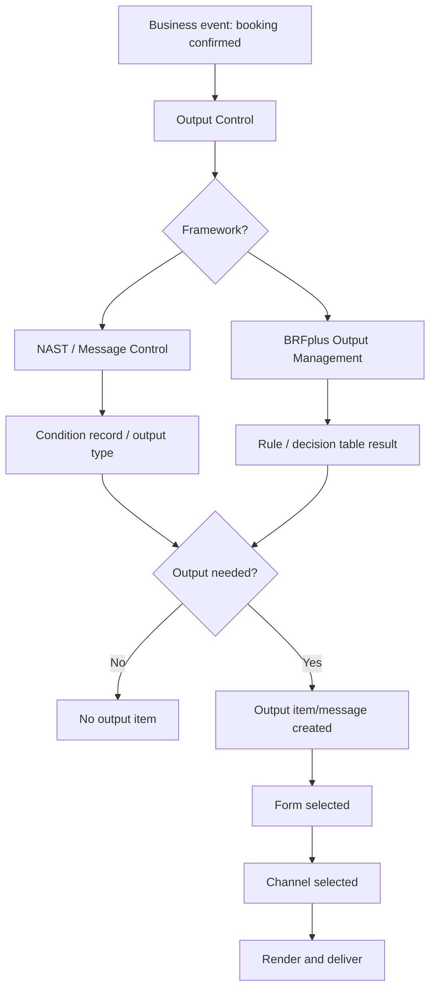
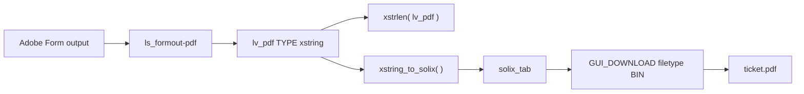
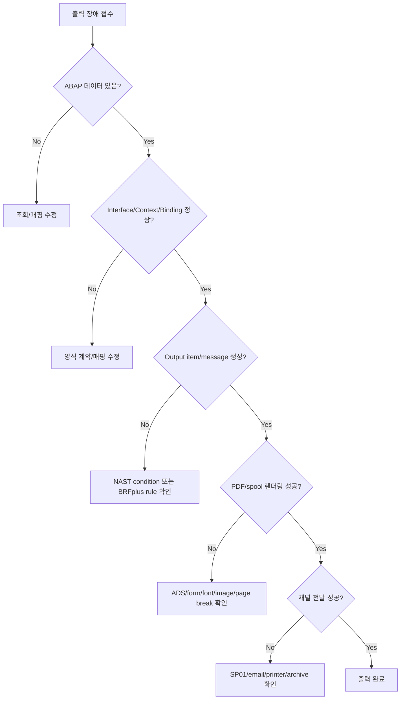

# NEWCH37_OLDCH34_REWRITE - Forms / Output / PDF

> 기준 원본: `content/abap/CH34`
> 보조 참고: `reference/codex_0625_v2/CH34_REWRITE.md`, `reference/codex_0629_v3/00_CONCEPT_GAP_AUDIT.md`
> 재집필 목표: 양식 도구 이름 암기가 아니라, 업무 데이터가 고객에게 보이는 PDF, 인쇄물, 이메일 첨부로 나가기까지의 흐름을 입문자가 추적할 수 있게 만든다.
> 감사 회수: P3 후보였던 `BRF+ rule engine`은 독립 ABAP 문법 장으로 만들지 않고, CH34 Output Control 안에서 BRF+ 기반 Output Management의 역할과 학습 범위를 명확히 회수한다.

## NEWCH37 전체 강의 지도

CH33까지 학습자는 데이터 조회, DB pushdown, 외부 연동, 운영 품질의 큰 흐름을 배웠다. 하지만 실무 시스템은 화면에 데이터를 보여 주는 것으로 끝나지 않는다. 고객에게 보내는 예매 확인서, 송장, 납품서, 구매오더, 라벨, 계약서처럼 "문서 모양"이 중요한 출력물이 있다. 이 출력물은 단순 `WRITE`나 ALV가 아니라 양식 도구와 출력 관리가 함께 맡는다.

이번 장의 관통 예제는 공연 예매 확인서다. 예매 데이터는 ABAP 프로그램이나 업무 문서에서 준비되고, 양식은 그 데이터를 정해진 위치에 배치하며, Output Control은 어떤 조건에서 누구에게 어떤 채널로 보낼지 결정한다. 마지막에는 생성된 PDF byte를 파일, 이메일 첨부, 스풀 추적으로 이어 본다.

| 레슨 | 원본 | 주제 | 학습자가 얻어야 할 판단 |
|---|---|---|---|
| NEWCH37-L01 | CH34-L01 | Smart Forms 기본 구조 | 전통 양식의 Form/Page/Window/Node와 Form Interface를 읽는다 |
| NEWCH37-L02 | CH34-L02 | Adobe Forms 기본 구조 | PDF 중심 양식의 Interface/Context/Layout/ADS를 구분한다 |
| NEWCH37-L03 | CH34-L03 | Output Control 개요 | 양식과 자동 출력 결정은 다른 층이며, NAST와 BRF+ Output Management의 역할이 다름을 안다 |
| NEWCH37-L04 | CH34-L04 | PDF 생성과 다운로드 | PDF는 텍스트가 아니라 `xstring` byte stream이라는 점을 처리한다 |
| NEWCH37-L05 | CH34-L05 | 양식 오류 추적과 변경 대응 | 출력 장애를 데이터, 양식, 결정, 렌더링, 전달 단계로 좁혀 간다 |

### R15 게이팅과 classic-first 경계

CH34는 Track 2 후반 장이다. 따라서 CH18의 modern syntax, CH20의 class/method, CH30의 파일/연동, CH35의 운영 품질 개념을 이미 배운 뒤라는 전제에서 `cl_gui_frontend_services=>gui_download`, `cl_bcs_convert=>xstring_to_solix`, `xstring`, `xstrlen` 같은 표현을 사용할 수 있다. 다만 여기서 새로 다루는 Smart Forms, Adobe Forms, Output Control, BRFplus Output Management, PDF byte handling은 CH34에서 정식 도입한다.

classic-first 기준도 중요하다. 기존 SAP 현장에서는 Smart Forms, SAPscript, NAST 기반 Message Control, SP01 스풀 추적을 여전히 자주 만난다. 새 시스템이나 S/4HANA 표준 영역에서는 Adobe Forms, Output Management, BRFplus 기반 출력 결정, Cloud-ready 출력 서비스가 등장한다. 학습자는 "무조건 새 도구가 정답"이라고 외우면 안 되고, 현재 시스템 release와 업무 영역, 프로젝트 정책을 먼저 확인해야 한다.

ABAP Cloud/Clean Core 경계는 다음처럼 둔다.

| 항목 | classic/on-prem 학습에서의 의미 | Cloud/Clean Core 경계 |
|---|---|---|
| `SMARTFORMS`, `SFP`, `SP01` | SAP GUI 기반 개발/운영 화면에서 양식과 스풀을 확인한다 | Cloud 프로젝트에서는 사용 가능 도구와 released API를 별도로 확인한다 |
| `cl_gui_frontend_services=>gui_download` | SAP GUI dialog에서 사용자의 PC에 파일을 내려받는다 | background, 서버 처리, ABAP Cloud 기본 설계로 두면 안 된다 |
| NAST Message Control | 기존 SD/MM 등에서 output type과 condition record를 추적한다 | S/4HANA 영역별로 Output Management 전환 여부를 확인한다 |
| BRFplus Output Management | 출력 결정을 rule/table 기반으로 이해한다 | CH34는 role과 경계만 다루며 전체 BRF+ authoring은 본 Track 범위 밖이다 |

### 수동 확인한 공식 근거

Classic ABAP keyword 문서에서 직접 확인한 범위는 동적 function module 호출, function module parameter, `CL_GUI_FRONTEND_SERVICES`, byte type, `xstrlen`, spool glossary다. 확인 파일은 `C:\ABAP_DOCU_HTML\abapcall_function_dynamic.htm`, `abapcall_function_parameter.htm`, `abapcall_method_dynamic.htm`, `abenfrontend_services.htm`, `abenbuiltin_types_byte.htm`, `abendescriptive_functions_binary.htm`, `abensap_spool_system_glosry.htm`, `abenspool_request_glosry.htm`, `abenspool_list_glosry.htm`이다.

ABAP Cloud/Clean Core 경계는 `C:\ABAP_DOCU_DOWNLOAD\ABAP_DOCU\abap-docs-main\docs\cloud\md\ABENABAP_CLOUD_GLOSRY.md`, `ABENRELEASED_API_GLOSRY.md`, `ABENCLASSIC_ABAP_GLOSRY.md`에서 확인했다. Smart Forms, Adobe Forms, Output Control, BRFplus 자체는 ABAP keyword 문서의 언어 항목이 아니라 SAP Help 공식 문서로 보충했다.

## NEWCH37-L01 - Smart Forms 기본 구조

### 왜 필요한가

ABAP 초반에 배운 `WRITE`는 결과를 빠르게 화면에 보여 주는 데 좋고, ALV는 표 데이터를 사용자가 정렬하고 필터링하며 보기에 좋다. 하지만 고객에게 보내는 예매 확인서는 다르다. 회사 로고가 있어야 하고, 공연명과 좌석이 정확한 위치에 들어가야 하며, 하단에는 취소 규정과 법적 문구가 들어가야 한다. 화면 결과가 아니라 "문서"가 필요한 것이다.

입문자가 처음 출력물을 만들 때 흔히 하는 실수는 ABAP 코드 안에서 모든 위치, 줄바꿈, 문구를 직접 조립하려는 것이다. 이렇게 만들면 로고 위치가 바뀌거나 법적 문구가 바뀔 때마다 ABAP 로직을 손대야 한다. 계산과 조회는 ABAP 프로그램이 맡고, 레이아웃과 출력 구조는 양식 도구가 맡는 것이 유지보수에 훨씬 안전하다.

Smart Forms는 이런 전통적 출력 양식을 만들기 위한 SAP 도구다. 오래된 시스템이나 기존 프로젝트에는 Smart Forms 자산이 많이 남아 있고, ABAP 개발자는 신규 개발이 아니어도 유지보수에서 반드시 만나게 된다. 그래서 CH34의 첫 레슨은 "Smart Forms를 새 프로젝트 기본값으로 외우기"가 아니라 "기존 양식 구조를 읽고 어디서 문제를 확인하는지 배우기"가 목표다.

### 무엇인가

Smart Forms는 transaction `SMARTFORMS`에서 만드는 전통적 양식 도구다. 하나의 양식은 큰 설계도이고, 그 안에 page, window, node, interface가 계층으로 들어간다.

| 구성 | 쉬운 설명 | 확인 위치 | 초보자가 꼭 구분할 점 |
|---|---|---|---|
| Form | 양식 전체 설계도 | `ZSF_TICKET` 같은 form 이름 | ABAP 프로그램이 호출하려는 논리적 양식 이름 |
| Page | 출력되는 종이/PDF 페이지 | First page, next page | 페이지가 넘어갈 때 어떤 page가 이어지는지 결정 |
| Window | 페이지 안의 출력 영역 | `MAIN`, `HEADER`, `FOOTER` | 본문이 길어지는 영역과 고정 영역을 구분 |
| Node | 실제 출력 요소 | Text, Table, Graphic, Command | 문구, 표, 이미지, page break 처리 |
| Form Interface | ABAP에서 양식으로 넘기는 데이터 계약 | Import/Table parameter | 값이 안 나오면 가장 먼저 확인할 곳 |
| Global Definitions | 양식 내부 보조 타입/변수 | Types, global data, routines | 복잡한 업무 로직을 넣는 장소가 아니다 |

가장 중요한 흐름은 `ABAP 데이터 -> Form Interface -> Window/Node 출력`이다. ABAP 프로그램이 예매 데이터를 Form Interface로 넘기면, Smart Form은 그 데이터를 window 안의 text/table node에 배치한다. 활성화하면 시스템은 `/1BCDWB/SF...` 형태의 생성 function module을 만든다.

이 생성 function module 이름은 시스템마다 달라질 수 있다. 따라서 운영 코드에 `/1BCDWB/SF00000123` 같은 이름을 직접 적으면 안 된다. 공식 SAP Help도 생성 function module 이름은 한 시스템 안에서만 유일하므로, form 이름으로 현재 생성 function module 이름을 조회한 뒤 호출하는 방식을 안내한다.

```abap
DATA lv_fm TYPE rs38l_fnam.

CALL FUNCTION 'SSF_FUNCTION_MODULE_NAME'
  EXPORTING
    formname = 'ZSF_TICKET'
  IMPORTING
    fm_name  = lv_fm
  EXCEPTIONS
    no_form            = 1
    no_function_module = 2
    OTHERS             = 3.

IF sy-subrc <> 0.
  " 교육용 예제: 실제 프로젝트에서는 메시지/로그/예외 정책에 맞춘다.
  RETURN.
ENDIF.

CALL FUNCTION lv_fm
  EXPORTING
    is_booking = ls_booking
  EXCEPTIONS
    formatting_error = 1
    internal_error   = 2
    send_error       = 3
    user_canceled    = 4
    OTHERS           = 5.
```

이 코드는 "Smart Form 객체를 직접 실행한다"기보다 "양식 이름에서 현재 생성 function module 이름을 찾고, 그 function module을 호출한다"는 흐름을 보여 준다. `CALL FUNCTION lv_fm`처럼 호출 대상 이름을 변수에 담아 실행하는 점은 ABAP의 동적 function module 호출 원리와 연결된다.

### 어떻게 확인하는가

첫 번째 확인은 양식 tree다. `SMARTFORMS`에서 `ZSF_TICKET`을 열고 왼쪽 tree를 본다. Form 아래에 `Form Interface`, `Global Definitions`, `Pages and Windows`가 보인다. 이 tree를 읽을 수 있어야 데이터가 안 나오는 문제와 위치가 이상한 문제를 분리할 수 있다.

두 번째 확인은 Form Interface다. 예매 확인서라면 예매번호, 고객명, 공연명, 공연일, 좌석, 결제금액 같은 값이 interface에 있어야 한다. 양식 text node에서 `&IS_BOOKING-CUSTOMER_NAME&` 같은 참조가 보이는데, ABAP 호출에서 `is_booking = ls_booking`을 넘기지 않으면 해당 위치는 비거나 오류가 난다.

세 번째 확인은 MAIN window다. Smart Forms에서 `MAIN` window는 긴 본문이나 table이 page break를 타고 흐르는 핵심 영역이다. 좌석 목록처럼 줄 수가 바뀌는 항목을 header나 footer에 억지로 넣으면 페이지가 넘어갈 때 깨질 수 있다.

네 번째 확인은 활성화와 생성 function module이다. 양식을 저장만 하고 활성화하지 않으면 호출 가능한 생성 산출물이 준비되지 않는다. 활성화 뒤에도 생성 function module 이름을 복사해 고정하지 말고 `SSF_FUNCTION_MODULE_NAME`으로 현재 이름을 조회한다.

### 실수와 주의

가장 흔한 실수는 생성 function module 이름을 하드코딩하는 것이다. 개발 시스템에서 우연히 맞았더라도 품질/운영 시스템으로 이송된 뒤 이름이 다를 수 있다. 안정적인 이름은 form 이름이고, 생성 function module은 시스템 내부 산출물이다.

두 번째 실수는 데이터 준비와 레이아웃 책임을 섞는 것이다. 할인 금액 계산, 좌석 유효성 확인, 취소 가능 여부 판단은 ABAP 업무 로직에서 끝내고, Smart Form에는 이미 출력할 형태로 정리된 데이터를 넘기는 편이 좋다. 양식 안에 복잡한 업무 판단을 많이 넣으면 테스트와 변경 추적이 어려워진다.

세 번째 실수는 빈 값의 원인을 레이아웃에서만 찾는 것이다. PDF나 미리보기에서 고객명이 비어 있으면 먼저 ABAP 디버거에서 `ls_booking-customer_name`이 채워졌는지 본다. 값이 있으면 Form Interface 이름과 node reference를 확인하고, 그다음 window/node 위치를 본다.

네 번째 실수는 Smart Forms를 "지금도 모든 신규 양식의 기본값"으로 이해하는 것이다. Smart Forms는 유지보수와 일부 classic 환경에서 중요하지만, PDF 정교함과 interactive form 요구가 강한 신규 개발에서는 Adobe Forms나 표준 Output Management 정책을 검토하는 경우가 많다.

### 프로세스 플로우와 체험형 학습 설계


기존 체험물 `CH34-L01-S01`은 Smart Forms 구조 tree다. 학습자는 `ZSF_TICKET` root를 펼치고 `Form Interface`, `Global Definitions`, `Pages & Windows`, `FIRST Page`, `MAIN`, `HEADER`, text/table/graphic node를 순서대로 확인한다.

추가 체험 설계는 "데이터가 안 나오는 원인 찾기" 시뮬레이터다.

| 버튼 | 상태 변화 | 학습 피드백 |
|---|---|---|
| `ABAP 값 없음` | `ls_booking`의 고객명 필드가 initial로 표시된다 | 양식 문제가 아니라 프로그램 데이터 준비 문제다 |
| `Interface 이름 불일치` | ABAP은 `is_ticket`을 넘기지만 form은 `is_booking`을 기대한다 | Form Interface 계약과 호출 파라미터 이름을 맞춰야 한다 |
| `Node 위치 오류` | 좌석 table이 `HEADER`에 있어 두 번째 페이지에서 잘린다 | 반복/본문 데이터는 MAIN window에 둬야 한다 |
| `Generated FM 하드코딩` | 개발 시스템 이름과 품질 시스템 이름이 다르게 표시된다 | `SSF_FUNCTION_MODULE_NAME`으로 현재 이름을 조회해야 한다 |

### 정리

Smart Forms는 전통적 SAP 양식 도구다. Form 전체 안에 Page, Window, Node가 있고, ABAP 프로그램은 Form Interface로 데이터를 넘긴다. 활성화하면 생성 function module이 만들어지지만 그 이름은 하드코딩하지 않는다. 다음 레슨에서는 PDF 중심의 Adobe Forms를 Smart Forms와 비교한다.

## NEWCH37-L02 - Adobe Forms 기본 구조

### 왜 필요한가

Smart Forms만으로도 많은 인쇄 양식을 만들 수 있지만, 실무 출력물은 점점 PDF 중심으로 바뀌었다. 고객은 이메일에 첨부된 PDF 확인서를 받고, 법적 양식은 PDF 모양이 정확해야 하며, 어떤 문서는 사용자가 입력 가능한 interactive form을 요구한다. 이런 요구에서는 Adobe Forms가 자주 등장한다.

입문자가 Adobe Forms를 어려워하는 이유는 구조가 세 층으로 나뉘기 때문이다. ABAP에서 넘길 데이터 구조를 정의하는 Interface, 그 데이터를 레이아웃에 연결하는 Context, 실제 PDF 모양을 디자인하는 Layout이 따로 있다. 이 셋을 구분하지 못하면 값이 비었을 때 ABAP 코드를 봐야 할지, context를 봐야 할지, layout binding을 봐야 할지 판단하지 못한다.

또 하나의 현실 조건은 ADS다. Adobe Forms 렌더링에는 Adobe Document Services 구성이 필요하다. 코드가 맞아도 ADS 연결, destination, 권한, 시스템 설정이 안 되어 있으면 PDF가 만들어지지 않는다. 그래서 Adobe Forms는 "ABAP 코드만 맞으면 끝"인 주제가 아니다.

### 무엇인가

Adobe Forms는 transaction `SFP`에서 다루는 PDF 기반 양식 도구다. Smart Forms와 마찬가지로 ABAP에서 데이터를 받아 생성 function module을 호출하지만, 내부 구조는 다음처럼 이해하면 좋다.

| 구성 | 쉬운 설명 | 문제가 생겼을 때 확인할 것 |
|---|---|---|
| Interface | 양식에 들어올 데이터 계약 | 파라미터 이름, 타입, table 구조 |
| Context | Interface 데이터를 layout에 연결할 재료 목록 | 필요한 field를 context에 포함했는가 |
| Layout | Adobe LiveCycle Designer로 만든 PDF 화면 | field binding, subform, page break, font |
| ADS | PDF 렌더링을 수행하는 서비스 | 연결, destination, 권한, trace/log |
| Generated FM | 양식 실행용 function module | `FP_FUNCTION_MODULE_NAME`으로 조회 |

호출 흐름은 보통 `FP_JOB_OPEN -> FP_FUNCTION_MODULE_NAME -> generated function module 호출 -> FP_JOB_CLOSE`로 잡는다. SAP Help의 Adobe Forms 예제도 job open, function module name 조회, generated function module 호출, job close 순서를 보여 준다.

```abap
DATA lv_fm      TYPE funcname.
DATA ls_out     TYPE sfpoutputparams.
DATA ls_doc     TYPE sfpdocparams.
DATA ls_formout TYPE fpformoutput.

ls_out-getpdf   = abap_true.
ls_out-nodialog = abap_true.

CALL FUNCTION 'FP_JOB_OPEN'
  CHANGING
    ie_outputparams = ls_out
  EXCEPTIONS
    cancel      = 1
    usage_error = 2
    system_error = 3
    internal_error = 4
    OTHERS      = 5.

CALL FUNCTION 'FP_FUNCTION_MODULE_NAME'
  EXPORTING
    i_name     = 'ZAF_TICKET'
  IMPORTING
    e_funcname = lv_fm.

CALL FUNCTION lv_fm
  EXPORTING
    /1bcdwb/docparams = ls_doc
    is_booking        = ls_booking
  IMPORTING
    /1bcdwb/formoutput = ls_formout
  EXCEPTIONS
    usage_error    = 1
    system_error   = 2
    internal_error = 3.

CALL FUNCTION 'FP_JOB_CLOSE'.
```

이 코드는 교육용 최소 흐름이다. 실제 시스템에서는 예외 처리, language, country, device, spool, preview, archive, email channel 같은 설정이 더 붙는다. 입문자가 먼저 잡을 것은 "Adobe Form은 job 안에서 생성 function module을 호출하고, 필요하면 결과 구조에서 PDF byte를 받는다"는 큰 흐름이다.

### 어떻게 확인하는가

첫 번째 확인은 `SFP`에서 Interface와 Form 이름을 구분하는 것이다. Interface는 데이터 계약이고, Form은 context/layout을 가진 실제 양식이다. 양식이 열리지만 데이터가 안 나온다면 Interface 파라미터가 맞는지, Context에 해당 field가 포함되었는지, Layout field가 context field에 binding되었는지 순서대로 본다.

두 번째 확인은 ADS 준비 상태다. Adobe Forms는 ADS 렌더링이 필요하다. Interface 값이 정상이고 context/layout도 맞는데 PDF 생성 단계에서 오류가 나면 ABAP 로직보다 ADS 연결, destination, 권한, trace/log를 먼저 확인해야 한다.

세 번째 확인은 `FP_JOB_OPEN`과 `FP_JOB_CLOSE`의 짝이다. 양식 function module 호출은 job open과 close 사이에 있어야 한다. 여러 양식을 한 작업으로 묶을 수도 있지만, 입문 단계에서는 "열고, 생성 function module 이름을 찾고, 호출하고, 닫는다"를 먼저 고정한다.

네 번째 확인은 PDF 반환 여부다. 인쇄 preview만 할 것인지, spool로 보낼 것인지, PDF `xstring`을 받을 것인지에 따라 output parameter가 달라진다. PDF가 필요하다면 `getpdf` 성격의 설정과 `/1bcdwb/formoutput` 결과를 확인한다.

### 실수와 주의

가장 흔한 실수는 Smart Forms와 Adobe Forms를 "옛것/새것" 하나로만 나누는 것이다. 기존 Smart Forms가 안정적으로 운영되고 단순 인쇄 양식이면 유지보수가 더 현실적일 수 있다. 반대로 PDF 품질, interactive form, 정교한 layout, 신규 표준이 중요하면 Adobe Forms가 적합할 수 있다.

두 번째 실수는 Context 연결을 빼먹는 것이다. Interface에 필드를 만들었다고 layout에서 바로 쓸 수 있는 것이 아니다. Context에 포함하고, Layout field가 그 context field에 binding되어야 값이 보인다.

세 번째 실수는 ADS 오류를 ABAP 데이터 오류로 착각하는 것이다. 데이터와 binding이 맞는데도 렌더링 자체가 실패하면 ADS 인프라 문제일 수 있다. 이때 "양식 디자인 문제"와 "렌더링 인프라 문제"를 분리해야 한다.

네 번째 실수는 PDF를 화면 출력처럼 취급하는 것이다. PDF를 파일이나 메일 첨부로 다루려면 결국 byte stream 처리로 넘어간다. 이 부분을 모르면 L04에서 `TEXT` 모드 저장 같은 실수를 하게 된다.

### 프로세스 플로우와 체험형 학습 설계


기존 체험물 `CH34-L02-S01`은 Smart Forms와 Adobe Forms의 compare matrix다. 학습자는 `Smart Forms` 또는 `Adobe Forms` 행을 클릭하고, `PDF/인터랙티브`, `디자이너`, `ADS 필요`, `신규 권장` 열을 비교한다.

추가 시뮬레이터는 `Interface`, `Context`, `Layout`, `ADS` 네 개의 상태 칩으로 구성한다.

| 조작 | 화면 상태 | 피드백 |
|---|---|---|
| `정상 렌더링` | 네 칩이 모두 초록색이고 PDF preview가 보인다 | 데이터 계약, 매핑, 레이아웃, 렌더링이 모두 통과했다 |
| `Context 누락` | Interface는 초록색, Context/Layout은 노란색, PDF field가 비어 있다 | ABAP 값은 있지만 layout에 전달될 재료 목록에 빠졌다 |
| `Binding 오류` | Context는 초록색, Layout field가 빨간색이다 | field가 PDF 위치에 묶이지 않아 출력되지 않는다 |
| `ADS 오류` | 데이터/매핑은 정상인데 렌더링 단계가 빨간색이다 | ABAP 데이터가 아니라 ADS 연결/권한/로그를 봐야 한다 |

### 정리

Adobe Forms는 PDF 중심 양식 도구다. Interface는 데이터 계약, Context는 레이아웃에 넘길 재료, Layout은 실제 PDF 모양, ADS는 렌더링 인프라다. 호출 흐름은 `FP_JOB_OPEN`, 생성 function module 이름 조회, generated function module 호출, `FP_JOB_CLOSE`로 잡는다. 다음 레슨에서는 이 양식이 언제 자동으로 나가는지, 즉 Output Control을 배운다.

## NEWCH37-L03 - Output Control 개요

### 왜 필요한가

양식을 만들었다고 고객에게 자동으로 나가지는 않는다. 예매 확인서 양식이 있어도 시스템은 "어떤 업무 이벤트에서", "누구에게", "어떤 양식으로", "인쇄인지 이메일인지", "즉시 보낼지 배치로 보낼지"를 알아야 한다. 이 결정을 담당하는 영역이 Output Control이다.

예를 들어 예매가 확정되면 VIP 고객에게는 이메일과 PDF 첨부가 나가고, 현장 발권 고객에게는 프린터 출력이 필요하며, 취소된 예매에는 확인서를 보내면 안 된다. 이런 조건을 ABAP 프로그램 안에 무작정 넣으면 문서 종류가 늘어날 때마다 코드가 복잡해지고 운영자가 조건을 바꾸기 어렵다. 출력 결정은 업무 조건과 채널을 분리해 관리하게 해 준다.

이번 장의 감사에서 `BRF+ rule engine`이 P3 후보로 남았던 이유도 여기에 있다. CH26의 OO 고급 설계 장에서 rule engine을 갑자기 가르치기에는 주제가 다르고, CH18 New Syntax처럼 ABAP 문법 장에 넣기에도 성격이 다르다. 반면 CH34-L03은 이미 BRF+ 기반 Output Management를 언급하고 있었다. 따라서 CH34가 BRF+의 정체와 범위를 책임져야 한다.

### 무엇인가

Output Control은 업무 이벤트가 발생했을 때 출력 여부, 출력 양식, 수신자, 채널, 처리 시점을 결정하는 메커니즘이다. 전통 SAP에서는 NAST 기반 Message Control이 많이 쓰였고, S/4HANA에서는 BRFplus 기반 Output Management를 쓰는 영역이 늘었다.

| 관점 | 전통 NAST / Message Control | BRFplus 기반 Output Management |
|---|---|---|
| 핵심 성격 | condition technique 기반 메시지 결정 | business rule framework 기반 출력 결정 |
| 대표 산출물 | output type, condition record, NAST record | output item, output parameter/rule result |
| 결정 방식 | application, output type, access sequence, condition record | business object와 context를 rule/decision table로 평가 |
| 채널 | print, fax, EDI, email 등 classic 채널 | print, email, XML 등 S/4HANA 영역별 channel |
| 확인 포인트 | NACE/업무 문서 메시지 상태, processing routine | Output Management 설정, BRFplus rule/table, output item status |
| 학습 경계 | customizing 상세는 모듈/운영 심화 | 전체 BRF+ authoring은 본 Track 범위 밖 |

BRFplus를 이 장에서 어떻게 이해해야 하는지가 중요하다. BRFplus는 ABAP 문법 키워드가 아니라, 비즈니스 규칙을 정의하고 평가하는 프레임워크다. Output Management에서는 "이 업무 문서와 조건이면 어떤 출력물이 어떤 채널로 나가야 하는가"를 결정하는 데 BRFplus rule이나 decision table이 쓰일 수 있다.

하지만 CH34는 BRFplus Workbench에서 application, function, ruleset, expression, decision table을 처음부터 만드는 전체 authoring 수업이 아니다. 여기서 배우는 것은 다음 네 가지다.

1. BRFplus는 ABAP의 `IF` 문 하나가 아니라 별도 rule framework라는 점.
2. S/4HANA Output Management에서 BRFplus가 출력 결정에 쓰일 수 있다는 점.
3. 출력이 안 될 때 form만 보지 말고 output item/rule/channel도 확인해야 한다는 점.
4. 전체 BRFplus 모델링은 모듈별 출력 설정, rule framework, 운영 정책에 따라 별도 심화로 배워야 한다는 점.

```text
업무 이벤트
  -> Output Control
      -> 조건/규칙 평가
          -> 출력 없음
          -> output item 생성
              -> form 선택
              -> channel 선택
              -> rendering
              -> spool/email/XML 전달
```

### 어떻게 확인하는가

첫 번째 확인은 업무 이벤트다. 예매 확정, 주문 저장, 납품 생성, 송장 발행처럼 출력이 발생할 시점이 명확해야 한다. 이벤트가 없으면 자동 출력도 없다. 수동으로 form preview가 잘 되는데 업무 저장 시 출력이 안 나간다면 form보다 이벤트와 Output Control 진입 여부를 먼저 봐야 한다.

두 번째 확인은 출력 조건이다. 모든 예매가 같은 출력물을 받는지, 고객 유형, 언어, 국가, 결제 상태, 문서 상태에 따라 달라지는지 본다. 조건이 단순하면 classic output type과 condition record가 충분할 수 있고, 조건이 복잡하면 BRFplus decision table이나 Output Management 설정이 필요할 수 있다.

세 번째 확인은 양식과 채널 연결이다. 결정된 output item이 `ZSF_TICKET` Smart Form이나 `ZAF_TICKET` Adobe Form 같은 양식으로 연결되는지, 채널이 print인지 email인지, 수신자 주소나 printer가 있는지 본다. 같은 양식이라도 채널이 다르면 실패 지점이 달라진다.

네 번째 확인은 생성 결과다. NAST 계열이면 업무 문서의 message/output 상태와 NAST record를 본다. BRFplus Output Management 계열이면 output item, processing status, output parameter determination, rule/table result를 본다. 인쇄 채널이면 결국 스풀로 이어질 수 있으므로 `SP01`에서 spool request도 확인한다.

다섯 번째 확인은 프로젝트 기준이다. 한 시스템 안에서도 업무 영역별로 classic Message Control과 S/4HANA Output Management가 공존할 수 있다. 따라서 "S/4HANA니까 무조건 BRFplus" 또는 "기존 시스템이니까 무조건 NAST"라고 단정하면 안 된다. 대상 업무 문서가 어떤 output framework를 쓰는지 먼저 확인한다.

### 실수와 주의

가장 흔한 실수는 양식만 만들고 Output Control을 설정하지 않는 것이다. 개발자는 "양식이 있는데 왜 안 나가지?"라고 묻지만, 시스템 입장에서는 언제 그 양식을 쓸지 결정된 적이 없다.

두 번째 실수는 BRFplus를 ABAP New Syntax나 OO 패턴처럼 취급하는 것이다. BRFplus는 rule framework이며, Output Management에서 특정 출력 결정을 수행하는 데 쓰일 수 있다. ABAP 코드에서 `COND`나 `SWITCH`를 쓰는 것과 같은 차원의 문법 주제가 아니다.

세 번째 실수는 NAST와 BRFplus를 한 시스템에서 무조건 하나만 쓴다고 생각하는 것이다. SAP 시스템은 release, 업무 영역, migration 상태에 따라 전통 Message Control과 S/4HANA Output Management가 함께 존재할 수 있다.

네 번째 실수는 채널을 가볍게 보는 것이다. 이메일은 수신자 주소와 SMTP 설정, 인쇄는 printer와 spool, EDI/XML은 partner/interface 설정이 중요하다. output item이 만들어졌는데 전달이 안 되는 경우는 양식 문제가 아니라 채널 문제일 수 있다.

다섯 번째 실수는 출력 실패를 양식 오류로만 보는 것이다. 출력이 아예 생성되지 않았다면 조건/rule 문제일 수 있다. 출력은 생성됐지만 PDF 렌더링이 실패했다면 ADS/layout 문제일 수 있다. PDF는 만들어졌지만 고객에게 가지 않았다면 email/printer/channel 문제일 수 있다.

### 프로세스 플로우와 체험형 학습 설계



기존 체험물 `CH34-L03-S01`은 Output Control 결정 흐름도다. 본문에서는 이 흐름도를 "원인 위치 찾기" 활동으로 쓴다. 학습자는 먼저 `업무 이벤트`가 발생했는지 보고, 다음으로 `출력 결정`에서 조건/rule이 통과했는지 판단한다. 조건이 통과되면 `양식 선택`과 `채널 선택`을 확인하고, 마지막으로 전달 로그를 본다.

추가 시뮬레이터는 `NAST 모드`와 `BRFplus 모드`를 전환하는 Output Decision Router다.

| 조작 | 상태 | 피드백 |
|---|---|---|
| `NAST 모드` | output type과 condition record가 강조된다 | classic Message Control에서는 조건 레코드와 processing routine을 확인한다 |
| `BRFplus 모드` | rule/decision table과 output item이 강조된다 | BRFplus는 rule framework이며 출력 결정을 평가하는 데 쓰인다 |
| `조건 불충족` | output item이 생성되지 않는다 | form을 고칠 문제가 아니라 조건/rule을 확인해야 한다 |
| `채널 실패` | output item은 초록색, email/printer가 빨간색이다 | 출력 결정은 성공했고 전달 채널에서 실패했다 |
| `BRF+ authoring 보기` | 별도 심화 안내 패널이 열린다 | CH34는 역할과 확인점을 다루며 전체 BRFplus 모델링은 본 Track 밖이다 |

### 정리

Output Control은 양식을 자동으로 내보내는 결정 층이다. 양식은 문서 모양이고, Output Control은 언제, 무엇을, 누구에게, 어떤 채널로 보낼지 정한다. 전통 영역에서는 NAST/Message Control, S/4HANA 영역에서는 BRFplus 기반 Output Management를 확인한다. BRFplus는 ABAP 문법이 아니라 rule framework이며, CH34에서는 출력 결정에서의 역할과 경계만 배운다.

## NEWCH37-L04 - PDF 생성과 다운로드

### 왜 필요한가

Adobe Forms가 PDF를 만들어 주면 끝난 것처럼 보이지만, 개발자는 그 PDF를 어디론가 보내야 한다. 사용자 PC에 저장할 수도 있고, 이메일에 첨부할 수도 있고, DMS나 ArchiveLink 같은 보관소에 넣을 수도 있다. 이때 PDF는 사람이 읽는 글자가 아니라 byte들의 묶음이다.

입문자가 가장 많이 하는 실수는 PDF를 텍스트 파일처럼 다루는 것이다. 화면에서는 PDF 문서처럼 보이지만, ABAP 변수 안에서는 `xstring` byte stream이다. 이 값을 `TEXT` 모드로 저장하거나 문자열 변환을 잘못하면 PDF가 깨진다.

CH34-L04는 "양식 호출"보다 "PDF라는 결과물을 안전하게 운반하는 법"에 초점을 둔다. 여기서 `xstring`, `xstrlen`, `solix_tab`, `BIN` 모드를 정확히 이해하면 이메일 첨부와 보관 처리도 덜 무섭다.

### 무엇인가

PDF byte 처리의 기본 흐름은 다음과 같다.

| 단계 | ABAP 객체 | 의미 |
|---|---|---|
| 1 | `ls_formout-pdf` | Adobe Forms 결과 구조 안의 PDF byte |
| 2 | `lv_pdf TYPE xstring` | 가변 길이 byte string으로 PDF 보관 |
| 3 | `xstrlen( lv_pdf )` | PDF byte 길이 계산 |
| 4 | `solix_tab` | 다운로드나 메일 첨부에 쓰기 좋은 binary table |
| 5 | `filetype = 'BIN'` | 문자 변환 없이 byte 그대로 저장 |

Classic ABAP 문서에서 `xstring`은 byte string type으로 확인된다. `xstrlen( arg )`은 byte-like argument의 byte 수를 반환한다. `CL_GUI_FRONTEND_SERVICES`는 SAP GUI dialog에서 presentation server 파일에 접근하는 class이고, `GUI_DOWNLOAD`는 파일 쓰기에 사용할 수 있다. 즉 PDF 다운로드는 "문자열 저장"이 아니라 "byte string을 binary table로 바꾸어 presentation server에 binary file로 쓰는 작업"이다.

```abap
DATA lv_pdf TYPE xstring.
DATA lt_bin TYPE solix_tab.

lv_pdf = ls_formout-pdf.

IF xstrlen( lv_pdf ) = 0.
  " PDF가 비어 있으면 저장 문제가 아니라 생성/렌더링 문제부터 확인한다.
  RETURN.
ENDIF.

lt_bin = cl_bcs_convert=>xstring_to_solix( lv_pdf ).

cl_gui_frontend_services=>gui_download(
  EXPORTING
    filename     = 'C:\temp\ticket.pdf'
    filetype     = 'BIN'
    bin_filesize = xstrlen( lv_pdf )
  CHANGING
    data_tab     = lt_bin
  EXCEPTIONS
    OTHERS       = 1 ).
```

이 코드는 dialog SAP GUI에서 PC 파일로 내려받는 예다. background job, web request, ABAP Cloud에서는 같은 방식이 맞지 않을 수 있다. 특히 ABAP Cloud는 SAP GUI presentation server 접근을 기본 전제로 하지 않고 released API 기준을 따라야 하므로, Cloud-ready 설계에서는 표준 Output Management, attachment/document service, released API를 확인해야 한다.

### 어떻게 확인하는가

첫 번째 확인은 `lv_pdf`가 비어 있지 않은지다. Adobe Forms 호출 뒤 `ls_formout-pdf`에 값이 없으면 다운로드 문제를 보기 전에 양식 호출, output parameter, ADS 렌더링부터 확인한다. `xstrlen( lv_pdf )`가 0이면 파일을 써도 정상 PDF가 될 수 없다.

두 번째 확인은 binary 변환이다. `xstring`을 그대로 internal table처럼 넘기지 말고, 다운로드나 메일 첨부가 요구하는 binary table 형식으로 변환한다. 예제에서는 `cl_bcs_convert=>xstring_to_solix( )`를 사용한다. 변환 뒤 `lt_bin` line 수가 생겼는지 확인한다.

세 번째 확인은 `filetype = 'BIN'`이다. `ASC`나 text 계열로 저장하면 code page 변환이 끼어들 수 있다. PDF는 byte 순서가 중요하므로 binary mode로 저장해야 한다.

네 번째 확인은 실행 위치다. `CL_GUI_FRONTEND_SERVICES`는 SAP GUI dialog의 presentation server 접근이다. 사용자가 SAP GUI로 실행하는 report에서는 가능하지만, background job이나 서버 측 자동 처리에는 적합하지 않다. 운영 자동 메일은 BCS, 보관은 ArchiveLink/DMS, Cloud는 released API 기반 출력 서비스를 따로 확인한다.

### 실수와 주의

가장 흔한 실수는 PDF를 `string`처럼 다루는 것이다. PDF 안에 텍스트가 보인다고 해서 ABAP 문자열이 아니다. PDF는 binary format이고, `xstring`으로 받아야 byte가 유지된다.

두 번째 실수는 `bin_filesize`를 잘못 계산하는 것이다. 문자 길이를 세는 `strlen`이 아니라 byte 길이를 세는 `xstrlen`을 써야 한다. 한글이나 binary data에서는 문자 길이와 byte 길이가 다를 수 있다.

세 번째 실수는 `GUI_DOWNLOAD`를 서버 저장이나 background 처리에 쓰려는 것이다. 이 class는 presentation server, 즉 사용자의 SAP GUI 쪽 파일 접근이다. background에서 돌아가는 출력이나 서버 보관에는 다른 방식이 필요하다.

네 번째 실수는 PDF 생성 오류와 다운로드 오류를 섞는 것이다. `lv_pdf`가 비어 있으면 생성 문제이고, `lv_pdf`는 있는데 파일이 깨지면 변환/저장 모드 문제일 수 있다. `gui_download`에서 권한이나 경로 오류가 나면 PC 파일 접근 문제다.

### 프로세스 플로우와 체험형 학습 설계



기존 체험물 `CH34-L04-S01`은 code-anatomy 위젯이다. 학습자는 밑줄 친 `/1bcdwb/formoutput`, `ls_formout-pdf`, `xstring_to_solix( )`, `filetype = 'BIN'`을 클릭하고 설명을 확인한다.

추가 시뮬레이터는 `TEXT로 저장`과 `BIN으로 저장` 비교 버튼을 둔다.

| 버튼 | 상태 패널 | 피드백 |
|---|---|---|
| `PDF 비어 있음` | `xstrlen( lv_pdf ) = 0` | 다운로드 코드가 아니라 form output/ADS/output parameter를 확인한다 |
| `TEXT로 저장` | PDF viewer가 열리지 않는 실패 상태 | 문자 변환이 끼어 byte가 깨졌다 |
| `BIN으로 저장` | PDF viewer가 정상으로 열린다 | `xstring`을 `solix_tab`으로 바꾸고 byte 길이를 넘겼다 |
| `Background에서 실행` | frontend service 단계가 빨간색 | dialog PC 다운로드 방식은 background 자동 처리에 맞지 않는다 |

### 정리

PDF는 문자가 아니라 byte stream이다. Adobe Forms 결과의 PDF는 `xstring`으로 받고, `xstrlen`으로 byte 길이를 계산하며, 다운로드나 첨부용 binary table로 변환한 뒤 `BIN` 모드로 저장한다. `GUI_DOWNLOAD`는 SAP GUI presentation server용이므로 background, 서버 보관, ABAP Cloud에서는 다른 released API나 출력 서비스를 확인해야 한다.

## NEWCH37-L05 - 양식 오류 추적과 변경 대응

### 왜 필요한가

양식 개발은 "내 PC에서 PDF가 한 번 열렸다"로 끝나지 않는다. 고객에게 나가는 문서는 운영 사고가 되기 쉽다. 이름이 비어 있거나, 금액이 잘못 찍히거나, 법적 문구가 누락되거나, 프린터에 걸려 출력이 안 되면 업무 부서와 고객이 바로 영향을 받는다.

CH34의 마지막 레슨은 성공 흐름보다 실패 추적을 배운다. 양식 오류는 원인이 여러 층에 숨어 있다. ABAP 데이터가 비어 있을 수도 있고, Form Interface가 맞지 않을 수도 있고, Adobe layout binding이 깨졌을 수도 있고, Output Control 조건이 안 맞을 수도 있고, ADS나 spool에서 실패할 수도 있다.

초보자가 운영에서 성장하려면 "안 나옵니다"를 듣고 바로 코드를 고치는 사람이 아니라, 단계별로 어디까지 성공했는지 확인하는 사람이 되어야 한다.

### 무엇인가

양식 운영 추적은 다섯 단계로 나눠 보면 명확하다.

| 단계 | 질문 | 확인 지점 | 대표 조치 |
|---|---|---|---|
| 1. 데이터 | 출력할 값이 ABAP에 준비됐는가 | 디버거, input structure, internal table | 데이터 조회/매핑 수정 |
| 2. Interface/Context | 양식이 그 값을 받을 수 있는가 | Form Interface, Adobe Context, binding | 파라미터/Context/Layout 수정 |
| 3. 출력 결정 | output item/message가 생성됐는가 | NAST output status, BRFplus output item | 조건/rule/channel/수신자 설정 |
| 4. 렌더링 | PDF나 spool data가 만들어졌는가 | ADS log, form processing error | ADS/양식/권한/폰트 점검 |
| 5. 전달 | 고객에게 실제 전달됐는가 | SP01, printer, email log, archive | 재출력/재전송/운영 조치 |

Classic ABAP glossary 기준으로 SAP spool system은 출력 data stream을 spool list로 저장하거나 printer/ArchiveLink로 보내는 영역이고, spool request는 SAP spool system으로 전달되는 output request다. 그래서 인쇄 문제가 나면 `SP01`에서 spool request와 상태를 보는 것이 기본 확인 지점이 된다.

변경 대응도 같은 원리다. 양식은 코드가 아니라고 가볍게 바꾸면 안 된다. 로고, 문구, 금액 표시, 세금 문구, 바코드 위치는 모두 고객 문서에 직접 드러난다. 변경은 이송요청, 버전 관리, 샘플 출력, 승인 절차를 거쳐야 한다.

### 어떻게 확인하는가

첫 번째 확인은 입력 데이터다. 예매 확인서에 고객명이 비어 있으면 Smart/Adobe layout부터 열기 전에 ABAP에서 `ls_booking-customer_name`이 채워졌는지 본다. 데이터가 비어 있으면 양식은 잘못이 없다.

두 번째 확인은 양식 매핑이다. 데이터는 있는데 PDF에 안 보이면 Form Interface 이름, Adobe Context, Layout binding을 본다. Smart Forms에서는 `&IS_BOOKING-CUSTOMER_NAME&` 참조가 맞는지 확인하고, Adobe Forms에서는 Context field가 Layout field에 binding되었는지 본다.

세 번째 확인은 출력 결정이다. 수동 preview는 되는데 예매 확정 시 자동으로 안 나가면 Output Control 문제일 수 있다. NAST 계열이면 output type/condition/message 상태를 보고, BRFplus Output Management 계열이면 output item, rule result, channel parameter를 본다.

네 번째 확인은 렌더링과 인프라다. Adobe Forms라면 ADS 연결과 렌더링 로그를 본다. Smart Forms나 Adobe Forms 모두 권한, 폰트, 이미지, barcode, page break 문제가 실제 출력에서 드러날 수 있다.

다섯 번째 확인은 스풀과 전달이다. 인쇄 채널이면 `SP01`에서 spool request가 생성됐는지, 상태가 완료인지 오류인지, printer가 올바른지 확인한다. 이메일 채널이면 메일 로그와 첨부 크기, 수신자 주소를 본다. 보관 채널이면 ArchiveLink/DMS 저장 결과를 본다.

### 실수와 주의

가장 위험한 실수는 운영 양식을 직접 수정하는 것이다. "문구 하나만 바꾸면 된다"며 운영에서 바로 고치면 누가 언제 무엇을 바꿨는지 추적하기 어렵다. 양식도 코드처럼 개발, 테스트, 이송, 승인 절차를 거쳐야 한다.

두 번째 실수는 샘플 데이터 하나만 보고 배포하는 것이다. 출력물은 긴 고객명, 한글/영문 혼합, 금액 0원, 여러 좌석, 페이지 넘어감, 로고 누락, 이메일 주소 없음 같은 edge case에서 깨진다. 최소한 정상, 데이터 누락, 긴 텍스트, 다건 table, 재출력 케이스를 테스트해야 한다.

세 번째 실수는 오류 메시지를 남기지 않는 것이다. PDF 생성이나 다운로드가 실패했는데 단순히 "출력 실패"만 보여 주면 운영자가 원인을 좁힐 수 없다. 양식 이름, 업무 문서 번호, output item/spool number, 사용자, 시간, 오류 단계, 원문 메시지를 남긴다.

네 번째 실수는 BRFplus rule 문제를 form layout 문제로 오판하는 것이다. output item이 생성되지 않았다면 form을 고치기 전에 NAST condition 또는 BRFplus rule/table 결과를 확인해야 한다. 반대로 output item은 생성됐고 PDF 렌더링에서 실패했다면 rule이 아니라 ADS/layout 문제일 가능성이 높다.

다섯 번째 실수는 Cloud/Clean Core 경계를 잊는 것이다. ABAP Cloud는 SAP GUI 접근이 없고 released API 중심이다. `GUI_DOWNLOAD`, 전통 GUI transaction, 레거시 출력 customizing을 Cloud-ready 설계의 기본값으로 두면 안 된다. Cloud나 Clean Core 프로젝트에서는 표준 Output Management, extensibility point, released API, side-by-side 문서 서비스 여부를 먼저 확인한다.

### 프로세스 플로우와 체험형 학습 설계



기존 체험물 `CH34-L05-S01`은 judge quiz다. 학습자는 각 상황을 보고 `올바름` 또는 `잘못`을 고른다. 문항은 `SP01/ADS/출력 결정 점검`, `Form Interface 입력 확인`, `운영 직접 수정 금지`, `데이터 구조 변경 후 Interface 방치`, `샘플 테스트 출력`, `이송요청 없는 법적 문구 변경`으로 구성한다.

추가 시뮬레이터는 `출력 장애 티켓` 보드다.

| 버튼 | 상태 카드 예시 | 최종 피드백 |
|---|---|---|
| `데이터` | `ls_booking` 정상, item 2건 | 데이터 준비는 통과했다 |
| `양식 매핑` | Context에 `CUSTOMER_NAME` 없음 | ABAP 코드보다 Adobe Context를 수정해야 한다 |
| `출력 결정` | output item 없음, BRFplus rule 미충족 | 양식 문제가 아니라 rule/condition 문제다 |
| `렌더링` | ADS usage error | output item은 생성됐고 ADS/양식 처리 단계에서 실패했다 |
| `전달` | SP01 spool error 또는 email send failure | PDF 생성 뒤 printer/email 채널을 확인해야 한다 |

변경 대응 실습으로는 `배포 가능` 체크리스트를 둔다. 항목은 `이송요청 생성`, `샘플 데이터 5종 출력`, `긴 텍스트/page break 확인`, `스풀 또는 이메일 로그 확인`, `법무/업무 승인`, `rollback 계획`이다. 모든 항목이 체크되기 전에는 상태를 `검토 필요`로 둔다.

### 정리

양식 운영은 실패 지점을 단계로 나누는 일이다. 데이터가 있는지, 양식 interface와 layout이 맞는지, Output Control이 output item을 만들었는지, ADS나 Smart Form 렌더링이 성공했는지, SP01/이메일/보관 채널에서 실제 전달됐는지 확인한다. 양식 변경은 코드 변경처럼 이송과 테스트와 승인이 필요하다. CH34의 최종 결론은 단순하다. 양식은 예쁘게 그리는 도구가 아니라 고객에게 나가는 업무 문서이므로, 생성보다 추적과 변경 통제가 더 중요하다.

## NEWCH37 마무리

NEWCH37은 ABAP 개발자가 "화면에서 보이는 데이터"를 넘어 "고객에게 전달되는 문서"까지 책임지는 장이다. Smart Forms는 전통 양식 구조를 읽기 위해 필요하고, Adobe Forms는 PDF 중심 양식을 만들기 위해 필요하며, Output Control은 언제 누구에게 어떤 채널로 보낼지 결정한다. PDF는 `xstring` byte stream으로 다루고, `BIN` 모드로 저장하며, 운영에서는 SP01, ADS, output item, 이송, 샘플 테스트를 함께 확인한다.

이번 장에서 회수한 중요한 감사 항목은 BRFplus다. BRFplus는 ABAP 문법이나 OO 패턴이 아니라 business rule framework이며, CH34에서는 Output Management가 출력 결정을 위해 BRFplus rule/table을 사용할 수 있다는 정도와 확인 경계를 배운다. 전체 BRFplus authoring은 모듈별 output 설정과 rule framework 심화로 남긴다.

좋은 출력 개발자는 "PDF가 한 번 열렸다"로 끝내지 않는다. 출력이 안 될 때 어느 단계까지 성공했는가, PDF가 비었는가 깨졌는가, 자동 출력 결정이 있었는가, spool request가 생겼는가, 운영 변경이 이송과 승인으로 남았는가를 확인할 수 있어야 한다.
